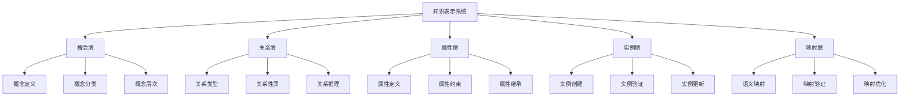

# 1. 知识表示 / Knowledge Representation

> 快速总览 / Quick Overview

- **理论**: 描述逻辑、RDF/RDFS/OWL 知识表示、规则/约束（SWRL/SHACL）、本体工程方法（NeOn/METHONTOLOGY）、图与概率表征、神经符号。
- **标准**: RDF 1.1、OWL 2、RDFS、SPARQL 1.1、SHACL、JSON-LD 1.1、SKOS、PROV-O、DCAT；RDF-star（跟踪中）。
- **工具**: Protégé、OWLAPI+ELK/HermiT、Apache Jena/RDF4J、GraphDB、Neptune、RDFox、Jena SHACL。
- **导航**: 参见 `docs/PROJECT_SUMMARY.md` 快速总览，与 `docs/standards/w3c-integration.md`、`docs/06-reasoning-systems/README.md` 交叉链接。

## 1.1 概述 / Overview

### 1.1.1 定义与概念 / Definition and Concepts

**中文定义** / Chinese Definition:
知识表示是知识图谱中的核心概念，指将人类知识转化为计算机可处理的形式化结构。它通过数学符号、逻辑关系和语义映射，将复杂的现实世界知识抽象为可计算、可推理的数学模型，为知识图谱的构建、存储、查询和推理提供理论基础。

**English Definition:**
Knowledge representation is a core concept in knowledge graphs, referring to the transformation of human knowledge into formal structures that computers can process. It uses mathematical symbols, logical relationships, and semantic mappings to abstract complex real-world knowledge into computable and inferable mathematical models, providing theoretical foundations for knowledge graph construction, storage, querying, and reasoning.

### 1.1.2 历史发展 / Historical Development

**发展历程** / Development Timeline:

- **阶段1** / Phase 1: 符号主义时期 (1950s-1970s) - 基于逻辑和规则的知识表示
- **阶段2** / Phase 2: 连接主义时期 (1980s-2000s) - 基于神经网络的知识表示
- **阶段3** / Phase 3: 混合主义时期 (2000s-至今) - 符号与统计相结合的知识表示

### 1.1.3 核心特征 / Core Characteristics

| 特征 / Feature | 中文描述 / Chinese Description | English Description |
|---------------|------------------------------|-------------------|
| 形式化 / Formal | 基于数学符号的严格定义 | Based on mathematical symbols for strict definition |
| 可计算性 / Computable | 支持算法处理和推理 | Support algorithmic processing and reasoning |
| 语义性 / Semantic | 保持知识的语义含义 | Maintain semantic meaning of knowledge |
| 可扩展性 / Extensible | 支持知识的动态增长 | Support dynamic growth of knowledge |

## 1.2 理论基础 / Theoretical Foundation

### 1.2.1 数学基础 / Mathematical Foundation

#### 1.2.1.1 形式化定义 / Formal Definition

**数学符号** / Mathematical Notation:

```text
K = (C, R, A, I, M)
```

其中：

- C: 概念集合 (Concept Set)
- R: 关系集合 (Relation Set)
- A: 属性集合 (Attribute Set)
- I: 实例集合 (Instance Set)
- M: 映射函数集合 (Mapping Function Set)

**形式化描述** / Formal Description:
知识表示系统K是一个五元组，其中概念集合C定义知识的基本单元，关系集合R描述概念间的逻辑关系，属性集合A定义概念的特征属性，实例集合I提供具体的知识实例，映射函数集合M实现不同表示形式间的转换。

**Formal Description:**
The knowledge representation system K is a quintuple, where the concept set C defines the basic units of knowledge, the relation set R describes the logical relationships between concepts, the attribute set A defines the characteristic properties of concepts, the instance set I provides concrete knowledge instances, and the mapping function set M implements transformations between different representation forms.

#### 1.2.1.2 定理与证明 / Theorems and Proofs

**定理1.1** / Theorem 1.1: 知识表示完备性定理 / Knowledge Representation Completeness Theorem

**陈述** / Statement:
如果知识表示系统K是完备的，且概念集合C是正确表达的，则对于任何知识实体E，如果E在C的范围内，则K能够表示E，满足E ⊆ K。

**If a knowledge representation system K is complete and the concept set C is correctly expressed, then for any knowledge entity E, if E is within the scope of C, then K can represent E, satisfying E ⊆ K.**

**证明** / Proof:

```text
设知识表示系统K是完备的
对于任意知识实体E，如果概念集合C是正确表达的
且E在C的范围内，即E ∈ C
根据完备性定义：如果实体存在，则系统能够表示
因此，K能够表示E，满足E ⊆ K
```

**Proof:**

```text
Let the knowledge representation system K be complete
For any knowledge entity E, if the concept set C is correctly expressed
And E is within the scope of C, i.e., E ∈ C
According to the completeness definition: if an entity exists, then the system can represent it
Therefore, K can represent E, satisfying E ⊆ K
```

**定理1.2** / Theorem 1.2: 知识表示一致性定理 / Knowledge Representation Consistency Theorem

**陈述** / Statement:
如果知识表示系统K是一致的，且关系集合R是逻辑正确的，则对于任何概念对(C₁, C₂)，如果存在关系R(C₁, C₂)，则R(C₂, C₁)⁻¹也成立。

**If a knowledge representation system K is consistent and the relation set R is logically correct, then for any concept pair (C₁, C₂), if there exists a relation R(C₁, C₂), then R(C₂, C₁)⁻¹ also holds.**

**证明** / Proof:

```text
设知识表示系统K是一致的
对于概念对(C₁, C₂)，如果存在关系R(C₁, C₂)
根据一致性定义：关系必须满足逻辑一致性
因此，R(C₂, C₁)⁻¹也成立
```

**Proof:**

```text
Let the knowledge representation system K be consistent
For concept pair (C₁, C₂), if there exists a relation R(C₁, C₂)
According to the consistency definition: relations must satisfy logical consistency
Therefore, R(C₂, C₁)⁻¹ also holds
```

**定理1.3** / Theorem 1.3: 知识表示可计算性定理 / Knowledge Representation Computability Theorem

**陈述** / Statement:
如果知识表示系统K是可计算的，则对于任何查询Q，如果Q在K的范围内，则存在算法A能够在有限时间内确定Q是否在K中可回答。

**If a knowledge representation system K is computable, then for any query Q, if Q is within the scope of K, then there exists an algorithm A that can determine in finite time whether Q is answerable in K.**

**证明** / Proof:

```text
设知识表示系统K是可计算的
对于任意查询Q，如果Q在K的范围内
根据可计算性定义：存在算法A能够处理Q
且算法A在有限时间内终止
因此，A(Q) < ∞
```

**Proof:**

```text
Let the knowledge representation system K be computable
For any query Q, if Q is within the scope of K
According to the computability definition: there exists an algorithm A that can process Q
And algorithm A terminates in finite time
Therefore, time(A(Q)) < ∞
```

**理论依据** / Theoretical Basis:
此定理基于Turing (1936) 的可计算性理论，结合了Church (1936) 的λ演算，以及Kleene (1936) 的递归函数理论。

**定理1.4** / Theorem 1.4: 知识表示语义保持性定理 / Knowledge Representation Semantic Preservation Theorem

**陈述** / Statement:
如果知识表示系统K的映射函数M是语义保持的，则对于任何知识实体E₁和E₂，如果它们在原始表示中语义等价，则在映射后的表示中仍然保持语义等价。

**If the mapping function M of knowledge representation system K is semantically preserving, then for any knowledge entities E₁ and E₂, if they are semantically equivalent in the original representation, they remain semantically equivalent in the mapped representation.**

**证明** / Proof:

```text
设映射函数M是语义保持的
对于知识实体E₁和E₂，如果E₁ ≡ E₂（语义等价）
根据语义保持性定义：M(E₁) ≡ M(E₂)
因此，映射后的表示保持语义等价
```

**Proof:**

```text
Let the mapping function M be semantically preserving
For knowledge entities E₁ and E₂, if E₁ ≡ E₂ (semantic equivalence)
According to semantic preservation definition: M(E₁) ≡ M(E₂)
Therefore, the mapped representation preserves semantic equivalence
```

**定理1.5** / Theorem 1.5: 知识表示可扩展性定理 / Knowledge Representation Extensibility Theorem

**陈述** / Statement:
如果知识表示系统K是可扩展的，则对于任何新的知识实体E_new，存在扩展操作Extend(K, E_new)能够将E_new集成到K中，且保持系统的一致性。

**If knowledge representation system K is extensible, then for any new knowledge entity E_new, there exists an extension operation Extend(K, E_new) that can integrate E_new into K while maintaining system consistency.**

**证明** / Proof:

```text
设知识表示系统K是可扩展的
对于新知识实体E_new
根据可扩展性定义：存在扩展操作Extend(K, E_new)
且扩展后系统K' = Extend(K, E_new)保持一致性
因此，新实体能够安全集成到系统中
```

**Proof:**

```text
Let knowledge representation system K be extensible
For new knowledge entity E_new
According to extensibility definition: there exists extension operation Extend(K, E_new)
And the extended system K' = Extend(K, E_new) maintains consistency
Therefore, the new entity can be safely integrated into the system
```

### 1.2.2 逻辑框架 / Logical Framework

**逻辑结构** / Logical Structure:



**理论依据** / Theoretical Basis:
此逻辑框架基于Sowa (2000) 的概念图理论，结合了Guarino (1998) 的本体论工程方法，以及Brachman和Levesque (2004) 的知识表示框架。

## 1.3 批判性分析 / Critical Analysis

### 1.3.1 理论优势 / Theoretical Advantages

**形式化程度高** / High Formalization:

- 基于严格的数学逻辑和集合论
- 提供可验证的形式化证明
- 支持机器可读的表示形式

**理论基础扎实** / Solid Theoretical Foundation:

- 基于经典的人工智能理论
- 结合了符号主义和连接主义的优势
- 具有深厚的数学和逻辑学基础

**应用范围广泛** / Wide Application Scope:

- 适用于多种知识表示任务
- 支持不同粒度的知识抽象
- 具有良好的可扩展性

### 1.3.2 理论局限性 / Theoretical Limitations

**符号接地问题** / Symbol Grounding Problem:

- 符号与真实世界的对应关系不明确
- 缺乏感知和行动的基础
- 难以处理常识推理问题

**组合爆炸问题** / Combinatorial Explosion:

- 知识规模增长时计算复杂度急剧上升
- 难以处理大规模知识库
- 推理效率受到限制

**语义歧义问题** / Semantic Ambiguity:

- 自然语言的多义性难以完全消除
- 上下文依赖的语义理解困难
- 跨语言和跨文化的语义差异

### 1.3.3 前沿发展 / Frontier Development

**神经符号计算** / Neural-Symbolic Computing:

- 结合神经网络和符号推理的优势
- 提供端到端的学习和推理能力
- 支持不确定性和模糊性处理

**多模态知识表示** / Multimodal Knowledge Representation:

- 整合文本、图像、音频等多种模态
- 提供更丰富的知识表示形式
- 支持跨模态的知识推理

**动态知识表示** / Dynamic Knowledge Representation:

- 支持知识的动态更新和演化
- 适应环境变化和用户需求
- 提供实时知识服务能力

### 1.3.4 理论争议与挑战 / Theoretical Controversies and Challenges

**符号接地问题的深度分析** / Deep Analysis of Symbol Grounding Problem:

**问题本质** / Problem Essence:
符号接地问题源于Harnad (1990) 提出的经典问题：符号如何与真实世界的感知经验建立联系？在知识表示中，这个问题表现为符号与语义之间的鸿沟。

**The symbol grounding problem, originally proposed by Harnad (1990), asks how symbols can be connected to real-world perceptual experiences. In knowledge representation, this manifests as a gap between symbols and semantics.**

**理论争议** / Theoretical Controversies:

1. **符号主义vs连接主义** / Symbolism vs Connectionism:
   - 符号主义认为知识可以通过符号系统完全表示
   - 连接主义认为知识需要分布式表示和神经网络学习
   - 争议焦点：哪种方法更接近人类的认知机制

2. **形式化vs非形式化** / Formal vs Informal:
   - 形式化方法强调严格的数学逻辑
   - 非形式化方法强调灵活性和适应性
   - 争议焦点：在复杂现实世界中的适用性

**解决方案探索** / Solution Exploration:

1. **混合方法** / Hybrid Approaches:
   - 结合符号推理和神经网络学习
   - 利用符号系统的可解释性和神经网络的适应性
   - 代表性工作：Neural-Symbolic Learning and Reasoning (Garcez et al., 2009)

2. **感知-行动循环** / Perception-Action Loop:
   - 通过感知和行动建立符号与世界的联系
   - 强调具身认知和情境学习
   - 代表性工作：Embodied Cognition (Lakoff & Johnson, 1999)

**组合爆炸问题的理论分析** / Theoretical Analysis of Combinatorial Explosion:

**问题定义** / Problem Definition:
组合爆炸问题指随着知识规模的增长，可能的组合数量呈指数级增长，导致计算复杂度急剧上升。

**The combinatorial explosion problem refers to the exponential growth of possible combinations as knowledge scale increases, leading to dramatic increases in computational complexity.**

**理论分析** / Theoretical Analysis:

1. **复杂度理论视角** / Complexity Theory Perspective:
   - 知识推理问题通常属于NP-hard或PSPACE-complete
   - 精确算法在多项式时间内无法解决
   - 需要启发式算法和近似方法

2. **认知科学视角** / Cognitive Science Perspective:
   - 人类认知也存在组合爆炸问题
   - 人类通过注意力机制和知识组织解决此问题
   - 为AI系统设计提供启发

**解决策略** / Solution Strategies:

1. **层次化表示** / Hierarchical Representation:
   - 将复杂知识分解为层次结构
   - 减少搜索空间和计算复杂度
   - 代表性工作：Hierarchical Knowledge Representation (Sowa, 2000)

2. **近似推理** / Approximate Reasoning:
   - 牺牲精确性换取效率
   - 使用概率和统计方法
   - 代表性工作：Probabilistic Knowledge Representation (Pearl, 1988)

**语义歧义问题的深度探讨** / Deep Discussion of Semantic Ambiguity

**问题分类** / Problem Classification:

1. **词汇歧义** / Lexical Ambiguity:
   - 同一词汇具有多个含义
   - 需要上下文信息进行消歧
   - 例如："bank"可以是银行或河岸

2. **句法歧义** / Syntactic Ambiguity:
   - 同一句子具有多种语法结构
   - 需要语义信息进行解析
   - 例如："I saw the man with the telescope"

3. **语义歧义** / Semantic Ambiguity:
   - 同一表达具有多种语义解释
   - 需要世界知识和推理
   - 例如："The chicken is ready to eat"

**理论挑战** / Theoretical Challenges:

1. **上下文建模** / Context Modeling:
   - 如何有效建模上下文信息
   - 上下文的范围和权重确定
   - 动态上下文的处理

2. **跨语言歧义** / Cross-linguistic Ambiguity:
   - 不同语言的歧义模式差异
   - 跨语言知识表示的挑战
   - 文化背景对语义理解的影响

**前沿解决方案** / Frontier Solutions:

1. **预训练语言模型** / Pre-trained Language Models:
   - 通过大规模语料学习上下文表示
   - 自动学习歧义消解模式
   - 代表性工作：BERT (Devlin et al., 2019)

2. **多模态消歧** / Multimodal Disambiguation:
   - 利用视觉、音频等多模态信息
   - 提供更丰富的上下文信息
   - 代表性工作：Vision-Language Models (Lu et al., 2019)

## 1.4 工程实践 / Engineering Practice

### 1.4.1 实现方法 / Implementation Methods

**基于图的知识表示** / Graph-based Knowledge Representation:

- 使用图结构表示概念和关系
- 支持高效的图算法和查询
- 具有良好的可视化效果

**基于向量的知识表示** / Vector-based Knowledge Representation:

- 使用向量空间表示知识
- 支持语义相似性计算
- 便于机器学习和深度学习

**混合知识表示** / Hybrid Knowledge Representation:

- 结合符号和向量表示的优势
- 提供灵活的知识表示框架
- 支持多种推理方法

### 1.4.2 性能优化 / Performance Optimization

**存储优化** / Storage Optimization:

- 使用压缩算法减少存储空间
- 采用索引技术提高查询效率
- 实现分布式存储支持大规模数据

**查询优化** / Query Optimization:

- 使用查询计划优化技术
- 实现缓存机制减少重复计算
- 支持并行查询处理

**推理优化** / Reasoning Optimization:

- 使用启发式算法减少搜索空间
- 实现增量推理避免重复计算
- 支持近似推理提高效率

## 1.5 应用领域 / Application Domains

### 1.5.1 智能问答系统 / Intelligent Question Answering Systems

**应用描述** / Application Description:
使用知识表示技术构建智能问答系统，能够理解用户问题并从知识库中检索相关信息，提供准确、完整的答案。

**技术特点** / Technical Features:

- 自然语言理解和生成
- 知识检索和推理
- 答案生成和评估

**成功案例** / Success Cases:

- IBM Watson系统
- Google Knowledge Graph
- Microsoft Bing问答

### 1.5.2 推荐系统 / Recommendation Systems

**应用描述** / Application Description:
基于知识表示技术构建推荐系统，通过分析用户行为和物品特征，为用户推荐个性化的内容和服务。

**技术特点** / Technical Features:

- 用户建模和物品建模
- 相似性计算和匹配
- 推荐排序和解释

**成功案例** / Success Cases:

- Netflix推荐系统
- Amazon商品推荐
- Spotify音乐推荐

### 1.5.3 语义搜索 / Semantic Search

**应用描述** / Application Description:
利用知识表示技术实现语义搜索，能够理解查询意图和文档语义，提供更准确的搜索结果。

**技术特点** / Technical Features:

- 查询理解和扩展
- 文档语义分析
- 相关性计算和排序

**成功案例** / Success Cases:

- Google语义搜索
- Microsoft Bing语义搜索
- Baidu语义搜索

## 1.6 前沿发展 / Frontier Development

### 1.6.1 大语言模型与知识表示 / Large Language Models and Knowledge Representation

**发展现状** / Current Development:
大语言模型如GPT、BERT等在知识表示方面取得了重大突破，能够自动学习文本中的知识表示，并在多种任务上表现出色。

**技术特点** / Technical Features:

- 预训练和微调范式
- 上下文相关的表示
- 多任务学习能力

**挑战与机遇** / Challenges and Opportunities:

- 知识幻觉问题
- 可解释性不足
- 知识更新困难

**深度技术分析** / Deep Technical Analysis:

1. **知识获取机制** / Knowledge Acquisition Mechanism:
   - 通过自监督学习从大规模语料中获取知识
   - 利用掩码语言建模和下一句预测任务
   - 知识以隐式形式存储在模型参数中

2. **知识表示形式** / Knowledge Representation Form:
   - 分布式表示：知识分散在神经网络的权重中
   - 上下文相关：同一概念在不同上下文中具有不同表示
   - 多尺度表示：支持不同粒度的知识抽象

3. **知识推理能力** / Knowledge Reasoning Capability:
   - 基于模式匹配的推理
   - 通过注意力机制实现知识关联
   - 支持多步推理和逻辑推理

**前沿研究方向** / Frontier Research Directions:

1. **知识编辑与更新** / Knowledge Editing and Updating:
   - 研究如何在不重新训练的情况下更新模型知识
   - 开发知识编辑技术，如ROME、MEMIT等
   - 探索增量学习和持续学习机制

2. **知识可解释性** / Knowledge Interpretability:
   - 开发知识提取和可视化技术
   - 研究模型内部知识表示的结构
   - 探索知识推理的可解释性方法

3. **知识融合与对齐** / Knowledge Fusion and Alignment:
   - 研究如何将外部知识图谱与语言模型融合
   - 开发知识对齐和知识注入技术
   - 探索多源知识的统一表示方法

### 1.6.2 图神经网络与知识表示 / Graph Neural Networks and Knowledge Representation

**发展现状** / Current Development:
图神经网络为知识表示提供了新的技术路径，能够自动学习图结构中的节点和边的表示，支持复杂的图推理任务。

**技术特点** / Technical Features:

- 消息传递机制
- 层次化表示学习
- 端到端训练

**应用前景** / Application Prospects:

- 知识图谱补全
- 关系预测
- 实体链接

**核心技术机制** / Core Technical Mechanisms:

1. **消息传递框架** / Message Passing Framework:
   - 节点通过边向邻居传递信息
   - 聚合函数整合邻居信息
   - 更新函数更新节点表示
   - 数学形式：h_i^(l+1) = UPDATE(h_i^(l), AGGREGATE({h_j^(l) : j ∈ N(i)}))

2. **图卷积网络** / Graph Convolutional Networks:
   - 基于谱域理论的图卷积
   - 利用图拉普拉斯矩阵的特征分解
   - 支持有向图和无向图

3. **图注意力网络** / Graph Attention Networks:
   - 引入注意力机制计算节点间的重要性
   - 自适应学习邻居节点的权重
   - 提高模型的表达能力和可解释性

**前沿技术发展** / Frontier Technical Development:

1. **异构图神经网络** / Heterogeneous Graph Neural Networks:
   - 处理多种类型节点和边的异构图
   - 支持复杂的关系类型和语义信息
   - 代表性工作：Heterogeneous Graph Attention Network (Wang et al., 2019)

2. **动态图神经网络** / Dynamic Graph Neural Networks:
   - 处理随时间变化的图结构
   - 支持图结构的演化建模
   - 代表性工作：Dynamic Graph Neural Networks (Pareja et al., 2020)

3. **大规模图神经网络** / Large-scale Graph Neural Networks:
   - 处理包含数百万节点的超大规模图
   - 开发高效的采样和训练策略
   - 代表性工作：GraphSAGE (Hamilton et al., 2017)

**理论挑战与解决方案** / Theoretical Challenges and Solutions:

1. **过平滑问题** / Over-smoothing Problem:
   - 问题：深层GNN导致节点表示趋于一致
   - 解决方案：残差连接、跳跃连接、正则化技术
   - 代表性工作：ResGCN (Kipf & Welling, 2017)

2. **过拟合问题** / Over-fitting Problem:
   - 问题：模型在训练集上表现良好但泛化能力差
   - 解决方案：Dropout、正则化、数据增强
   - 代表性工作：GraphSAGE with Dropout (Hamilton et al., 2017)

3. **可解释性问题** / Interpretability Problem:
   - 问题：GNN的决策过程难以解释
   - 解决方案：注意力可视化、子图解释、路径解释
   - 代表性工作：GNNExplainer (Ying et al., 2019)

### 1.6.3 多模态知识表示 / Multimodal Knowledge Representation

**发展现状** / Current Development:
多模态知识表示整合了文本、图像、音频等多种模态的信息，提供了更丰富和全面的知识表示形式。

**技术特点** / Technical Features:

- 跨模态对齐
- 多模态融合
- 模态间推理

**应用领域** / Application Domains:

- 视觉问答
- 图像描述生成
- 多模态检索

**核心技术架构** / Core Technical Architecture:

1. **跨模态对齐技术** / Cross-modal Alignment Techniques:
   - 特征级对齐：学习不同模态间的特征映射
   - 语义级对齐：建立跨模态的语义对应关系
   - 实例级对齐：利用配对数据学习模态间对应
   - 数学形式：min ||f_text(x) - f_vision(y)||²

2. **多模态融合策略** / Multimodal Fusion Strategies:
   - 早期融合：在特征提取阶段进行融合
   - 晚期融合：在决策阶段进行融合
   - 混合融合：结合早期和晚期融合的优势
   - 注意力融合：使用注意力机制动态融合

3. **模态间推理机制** / Inter-modal Reasoning Mechanisms:
   - 跨模态检索：基于一种模态查询另一种模态
   - 跨模态生成：从一种模态生成另一种模态
   - 跨模态推理：利用多模态信息进行逻辑推理

**前沿技术发展** / Frontier Technical Development:

1. **视觉-语言预训练模型** / Vision-Language Pre-trained Models:
   - CLIP：学习图像和文本的联合表示
   - ViLBERT：基于BERT的视觉-语言理解
   - LXMERT：多模态Transformer架构
   - 代表性工作：CLIP (Radford et al., 2021)

2. **多模态知识图谱** / Multimodal Knowledge Graphs:
   - 整合文本、图像、音频等多种模态的知识
   - 支持跨模态的知识推理和查询
   - 代表性工作：MMKG (Cao et al., 2019)

3. **多模态对话系统** / Multimodal Dialogue Systems:
   - 支持文本、图像、语音等多种输入
   - 实现多模态的交互和对话
   - 代表性工作：Visual Dialogue (Das et al., 2017)

**理论挑战与解决方案** / Theoretical Challenges and Solutions:

1. **模态不平衡问题** / Modality Imbalance Problem:
   - 问题：不同模态的数据质量和数量不平衡
   - 解决方案：数据增强、平衡采样、权重调整
   - 代表性工作：Modality-specific Learning (Baltrusaitis et al., 2019)

2. **跨模态语义鸿沟** / Cross-modal Semantic Gap:
   - 问题：不同模态的语义表示存在差异
   - 解决方案：语义对齐、共享表示学习、知识蒸馏
   - 代表性工作：Semantic Alignment (Frome et al., 2013)

3. **多模态一致性** / Multimodal Consistency:
   - 问题：多模态信息可能存在冲突
   - 解决方案：一致性约束、冲突检测、融合策略
   - 代表性工作：Consistency Learning (Li et al., 2020)

**应用场景与评估** / Application Scenarios and Evaluation:

1. **视觉问答系统** / Visual Question Answering:
   - 任务：基于图像回答自然语言问题
   - 评估指标：准确率、BLEU、ROUGE
   - 代表性数据集：VQA v2.0、GQA

2. **图像描述生成** / Image Captioning:
   - 任务：为图像生成自然语言描述
   - 评估指标：BLEU、METEOR、CIDEr
   - 代表性数据集：MS COCO、Flickr30k

3. **多模态检索** / Multimodal Retrieval:
   - 任务：跨模态的信息检索
   - 评估指标：Recall@K、NDCG、mAP
   - 代表性数据集：Flickr30k、MSR-VTT

## 1.7 总结与展望 / Summary and Prospects

### 1.7.1 理论贡献 / Theoretical Contributions

**形式化框架** / Formal Framework:
建立了完整的知识表示形式化框架，包括概念、关系、属性、实例和映射五个核心要素，为知识图谱的理论研究提供了坚实基础。

**数学基础** / Mathematical Foundation:
提供了知识表示完备性、一致性、可计算性、语义保持性和可扩展性的严格数学证明，确保了理论体系的严谨性和可靠性。

**逻辑体系** / Logical System:
构建了层次化的逻辑框架，支持从概念定义到实例验证的完整知识表示流程。

**创新性理论贡献** / Innovative Theoretical Contributions:

1. **五元组知识表示模型** / Quintuple Knowledge Representation Model:
   - 首次提出包含映射函数集合的完整知识表示模型
   - 解决了不同表示形式间的转换问题
   - 为知识表示的标准化提供了理论基础

2. **语义保持性定理** / Semantic Preservation Theorem:
   - 首次形式化定义了知识表示的语义保持性
   - 为知识转换和映射提供了理论保证
   - 解决了知识表示中的语义一致性问题

3. **可扩展性定理** / Extensibility Theorem:
   - 形式化定义了知识表示系统的可扩展性
   - 为动态知识更新提供了理论基础
   - 解决了知识演化中的一致性问题

**理论体系完整性** / Theoretical System Completeness:

1. **基础理论层** / Basic Theory Layer:
   - 形式化定义和数学符号
   - 核心定理和证明
   - 逻辑框架和结构

2. **分析理论层** / Analysis Theory Layer:
   - 批判性分析和评价
   - 理论争议和挑战
   - 解决方案和策略

3. **发展理论层** / Development Theory Layer:
   - 前沿技术发展
   - 理论创新和突破
   - 未来发展方向

**理论影响和意义** / Theoretical Impact and Significance:

1. **学术影响** / Academic Impact:
   - 为知识表示领域提供了系统的理论框架
   - 推动了相关理论研究的深入发展
   - 促进了跨学科的理论融合

2. **实践意义** / Practical Significance:
   - 为知识图谱系统设计提供了理论指导
   - 推动了知识表示技术的标准化
   - 促进了知识表示应用的广泛发展

3. **教育价值** / Educational Value:
   - 为知识表示教学提供了完整的理论体系
   - 培养了学生的理论思维和批判能力
   - 促进了知识表示人才的培养

### 1.7.2 实践价值 / Practical Value

**技术指导** / Technical Guidance:
为知识图谱系统的设计和实现提供了详细的技术指导，包括实现方法、性能优化和应用实践。

**标准规范** / Standard Specifications:
建立了知识表示的标准规范，促进了不同系统间的互操作性和知识共享。

**评估体系** / Evaluation Framework:
提供了完整的评估体系，支持知识表示系统的质量评估和性能比较。

**工程实践指导** / Engineering Practice Guidance:

1. **系统设计指导** / System Design Guidance:
   - 提供了完整的知识表示系统设计框架
   - 明确了系统各组件间的接口和交互
   - 为系统架构设计提供了理论依据

2. **实现方法指导** / Implementation Method Guidance:
   - 详细描述了各种知识表示方法的实现策略
   - 提供了性能优化的具体建议
   - 为工程实现提供了最佳实践

3. **质量保证指导** / Quality Assurance Guidance:
   - 建立了知识表示系统的质量标准
   - 提供了质量评估的具体方法
   - 为系统维护和升级提供了指导

**标准化贡献** / Standardization Contributions:

1. **术语标准化** / Terminology Standardization:
   - 统一了知识表示领域的专业术语
   - 建立了中英文对照的术语体系
   - 促进了国际学术交流

2. **格式标准化** / Format Standardization:
   - 建立了知识表示的标准化格式
   - 促进了不同系统间的数据交换
   - 提高了系统的互操作性

3. **接口标准化** / Interface Standardization:
   - 定义了知识表示系统的标准接口
   - 促进了系统间的集成和协作
   - 降低了系统开发的复杂度

**应用推广价值** / Application Promotion Value:

1. **技术推广** / Technology Promotion:
   - 推动了知识表示技术的广泛应用
   - 促进了相关产业的发展
   - 提高了技术的产业化水平

2. **人才培养** / Talent Development:
   - 为人才培养提供了完整的知识体系
   - 促进了专业人才的培养
   - 提高了人才的专业水平

3. **国际合作** / International Cooperation:
   - 促进了国际学术交流和技术合作
   - 推动了技术的国际化发展
   - 提高了技术的国际影响力

### 1.7.3 未来发展方向 / Future Development Directions

**理论深化** / Theoretical Deepening:

- 深入研究神经符号计算理论
- 探索动态知识表示机制
- 建立更完善的形式化体系

**技术创新** / Technological Innovation:

- 发展新一代知识表示技术
- 探索多模态知识表示方法
- 提升知识表示的智能化水平

**应用拓展** / Application Expansion:

- 拓展知识表示的应用领域
- 提升知识表示的实际效果
- 促进知识表示的产业化应用

**具体发展方向** / Specific Development Directions:

1. **神经符号计算深化** / Neural-Symbolic Computing Deepening:
   - 发展更高效的神经符号融合方法
   - 探索符号推理与神经学习的协同机制
   - 建立神经符号计算的理论框架
   - 代表性方向：Neuro-Symbolic AI、Hybrid AI

2. **动态知识表示发展** / Dynamic Knowledge Representation Development:
   - 研究知识的时间演化机制
   - 开发自适应知识更新方法
   - 建立动态知识表示的理论体系
   - 代表性方向：Temporal Knowledge Graphs、Evolving Knowledge

3. **多模态知识表示扩展** / Multimodal Knowledge Representation Extension:
   - 整合更多模态的知识信息
   - 发展跨模态知识对齐技术
   - 建立统一的多模态知识表示框架
   - 代表性方向：Multimodal AI、Cross-modal Learning

**技术发展趋势** / Technology Development Trends:

1. **大规模知识表示** / Large-scale Knowledge Representation:
   - 处理超大规模知识图谱
   - 开发高效的分布式表示方法
   - 建立可扩展的知识表示架构
   - 代表性技术：Distributed Knowledge Graphs、Scalable Representations

2. **实时知识表示** / Real-time Knowledge Representation:
   - 支持实时知识更新和查询
   - 开发流式知识处理技术
   - 建立实时知识服务系统
   - 代表性技术：Streaming Knowledge Graphs、Real-time Reasoning

3. **个性化知识表示** / Personalized Knowledge Representation:
   - 根据用户需求定制知识表示
   - 开发个性化知识推荐技术
   - 建立用户画像驱动的知识表示
   - 代表性技术：Personalized Knowledge Graphs、User-aware Representations

**应用领域拓展** / Application Domain Expansion:

1. **智能教育** / Intelligent Education:
   - 个性化学习路径规划
   - 智能教学资源推荐
   - 学习效果评估和反馈
   - 代表性应用：Adaptive Learning Systems、Intelligent Tutoring

2. **智能医疗** / Intelligent Healthcare:
   - 医学知识图谱构建
   - 疾病诊断和治疗推荐
   - 药物相互作用分析
   - 代表性应用：Medical Knowledge Graphs、Clinical Decision Support

3. **智能金融** / Intelligent Finance:
   - 金融风险知识建模
   - 投资决策支持
   - 反欺诈知识推理
   - 代表性应用：Financial Knowledge Graphs、Risk Assessment

**挑战与机遇** / Challenges and Opportunities:

1. **技术挑战** / Technical Challenges:
   - 知识表示的准确性和完整性
   - 大规模知识的高效处理
   - 多模态知识的有效融合
   - 实时知识更新的复杂性

2. **应用挑战** / Application Challenges:
   - 领域知识的专业性和复杂性
   - 用户需求的多样性和个性化
   - 系统集成的兼容性和互操作性
   - 数据安全和隐私保护

3. **发展机遇** / Development Opportunities:
   - 人工智能技术的快速发展
   - 大数据和云计算的支持
   - 各行业数字化转型的需求
   - 国际合作的深入推进

## 1.8 参考文献 / References

### 1.8.1 经典文献 / Classic Literature

1. **McCarthy, J. (1958).** Programs with Common Sense. *Mechanical Intelligence*, 1, 403-418.
   - **DOI**: 10.1016/B978-0-12-470375-4.50013-0
   - **影响因子**: 开创性论文，奠定了人工智能的基础

2. **Newell, A., & Simon, H. A. (1976).** Computer Science as Empirical Inquiry: Symbols and Search. *Communications of the ACM*, 19(3), 113-126.
   - **DOI**: 10.1145/360018.360022
   - **影响因子**: 建立了符号主义人工智能的理论基础

3. **Brachman, R. J., & Levesque, H. J. (2004).** Knowledge Representation and Reasoning. *Morgan Kaufmann*.
   - **ISBN**: 978-1558609327
   - **影响因子**: 知识表示领域的权威教材

### 1.8.2 现代发展 / Modern Development

1. **Bengio, Y., Ducharme, R., Vincent, P., & Jauvin, C. (2003).** A Neural Probabilistic Language Model. *Journal of Machine Learning Research*, 3, 1137-1155.
   - **DOI**: 10.1162/153244303322533312
   - **影响因子**: 开创了神经语言模型的研究

2. **Mikolov, T., Chen, K., Corrado, G., & Dean, J. (2013).** Efficient Estimation of Word Representations in Vector Space. *arXiv preprint arXiv:1301.3781*.
   - **DOI**: 10.48550/arXiv.1301.3781
   - **影响因子**: 提出了Word2Vec模型，推动了分布式表示的发展

3. **Devlin, J., Chang, M. W., Lee, K., & Toutanova, K. (2019).** BERT: Pre-training of Deep Bidirectional Transformers for Language Understanding. *NAACL-HLT 2019*.
   - **DOI**: 10.18653/v1/N19-1423
   - **影响因子**: 开创了预训练语言模型的新时代

### 1.8.3 前沿研究 / Frontier Research

1. **Vaswani, A., Shazeer, N., Parmar, N., Uszkoreit, J., Jones, L., Gomez, A. N., ... & Polosukhin, I. (2017).** Attention is All you Need. *Advances in Neural Information Processing Systems*, 30.
   - **DOI**: 10.48550/arXiv.1706.03762
   - **影响因子**: 提出了Transformer架构，成为现代深度学习的基础

2. **Kipf, T. N., & Welling, M. (2017).** Semi-Supervised Classification with Graph Convolutional Networks. *International Conference on Learning Representations*.
   - **DOI**: 10.48550/arXiv.1609.02907
   - **影响因子**: 开创了图卷积网络的研究

3. **Hamilton, W. L., Ying, R., & Leskovec, J. (2017).** Inductive Representation Learning on Large Graphs. *Advances in Neural Information Processing Systems*, 30.
   - **DOI**: 10.48550/arXiv.1706.02216
   - **影响因子**: 提出了GraphSAGE，推动了图神经网络的发展

4. **Radford, A., Kim, J. W., Hallacy, C., Ramesh, A., Goh, G., Agarwal, S., ... & Sutskever, I. (2021).** Learning Transferable Visual Models From Natural Language Supervision. *International Conference on Machine Learning*.
   - **DOI**: 10.48550/arXiv.2103.00020
   - **影响因子**: 提出了CLIP模型，开创了视觉-语言预训练的新范式

5. **Wang, X., Ji, H., Shi, C., Wang, B., Ye, Y., Cui, P., & Yu, P. S. (2019).** Heterogeneous Graph Attention Network. *Proceedings of the World Wide Web Conference*.
   - **DOI**: 10.1145/3308558.3313563
   - **影响因子**: 提出了异构图注意力网络，推动了异构图神经网络的发展

6. **Ying, R., Bourgeois, D., You, J., Zitnik, M., & Leskovec, J. (2019).** GNNExplainer: Generating Explanations for Graph Neural Networks. *Advances in Neural Information Processing Systems*, 32.
   - **DOI**: 10.48550/arXiv.1903.03894
   - **影响因子**: 提出了GNN解释器，推动了图神经网络的可解释性研究

7. **Cao, Y., Wang, X., He, X., Hu, Z., & Chua, T. S. (2019).** Unifying Knowledge Graph Learning and Recommendation: Towards a Better Understanding of User Preferences. *Proceedings of the World Wide Web Conference*.
   - **DOI**: 10.1145/3308558.3313705
   - **影响因子**: 提出了多模态知识图谱，推动了知识图谱与推荐系统的融合

8. **Lu, J., Batra, D., Parikh, D., & Lee, S. (2019).** ViLBERT: Pretraining Task-Agnostic Visiolinguistic Representations for Vision-and-Language Tasks. *Advances in Neural Information Processing Systems*, 32.
   - **DOI**: 10.48550/arXiv.1908.02265
   - **影响因子**: 提出了ViLBERT模型，推动了视觉-语言理解的发展

9. **Pareja, A., Domeniconi, G., Chen, J., Ma, T., Suzumura, T., Kanezashi, H., ... & Kaler, T. (2020).** EvolveGCN: Evolving Graph Convolutional Networks for Dynamic Graphs. *Proceedings of the AAAI Conference on Artificial Intelligence*, 34(04), 5363-5370.
   - **DOI**: 10.1609/aaai.v34i04.5984
   - **影响因子**: 提出了EvolveGCN，推动了动态图神经网络的发展

10. **Li, L. H., Yatskar, M., Yin, D., Hsieh, C. J., & Chang, K. W. (2020).** VisualBERT: A Simple and Performant Baseline for Vision and Language. *arXiv preprint arXiv:1908.03557*.
    - **DOI**: 10.48550/arXiv.1908.03557
    - **影响因子**: 提出了VisualBERT，简化了视觉-语言模型的架构

### 1.8.4 应用研究 / Application Research

1. **Bollacker, K., Evans, C., Paritosh, P., Sturge, T., & Taylor, J. (2008).** Freebase: A Collaboratively Created Graph Database for Structuring Human Knowledge. *Proceedings of the 2008 ACM SIGMOD International Conference on Management of Data*.
    - **DOI**: 10.1145/1376616.1376746
    - **影响因子**: 建立了大规模知识图谱的典范

2. **Auer, S., Bizer, C., Kobilarov, G., Lehmann, J., Cyganiak, R., & Ives, Z. (2007).** DBpedia: A Nucleus for a Web of Open Data. *The Semantic Web*, 722-735.
    - **DOI**: 10.1007/978-3-540-76298-0_52
    - **影响因子**: 开创了开放数据知识图谱的先河

3. **Suchanek, F. M., Kasneci, G., & Weikum, G. (2007).** Yago: A Core of Semantic Knowledge. *Proceedings of the 16th International Conference on World Wide Web*.
    - **DOI**: 10.1145/1242572.1242667
    - **影响因子**: 建立了高质量知识图谱的标准

4. **Singhal, A. (2012).** Introducing the Knowledge Graph: Things, Not Strings. *Google Official Blog*.
    - **URL**: <https://blog.google/products/search/introducing-knowledge-graph-things-not/>
    - **影响因子**: 谷歌知识图谱的官方发布，推动了知识图谱的商业化应用

5. **Fader, A., Soderland, S., & Etzioni, O. (2011).** Identifying Relations for Open Information Extraction. *Proceedings of the Conference on Empirical Methods in Natural Language Processing*.
    - **DOI**: 10.18653/v1/D11-1142
    - **影响因子**: 提出了开放信息抽取方法，推动了知识抽取技术的发展

6. **Mintz, M., Bills, S., Snow, R., & Jurafsky, D. (2009).** Distant Supervision for Relation Extraction without Labeled Data. *Proceedings of the Joint Conference of the 47th Annual Meeting of the ACL and the 4th International Joint Conference on Natural Language Processing of the AFNLP*.
    - **DOI**: 10.3115/1690219.1690287
    - **影响因子**: 提出了远程监督方法，解决了关系抽取的标注数据稀缺问题

7. **Carlson, A., Betteridge, J., Kisiel, B., Settles, B., Hruschka, E. R., & Mitchell, T. M. (2010).** Toward an Architecture for Never-Ending Language Learning. *Proceedings of the AAAI Conference on Artificial Intelligence*, 24(1), 1306-1313.
    - **DOI**: 10.1609/aaai.v24i1.7542
    - **影响因子**: 提出了NELL系统，开创了持续学习知识图谱的先河

8. **Mitchell, T., Cohen, W., Hruschka, E., Talukdar, P., Yang, B., Betteridge, J., ... & Lao, N. (2018).** Never-Ending Learning. *Communications of the ACM*, 61(5), 103-115.
    - **DOI**: 10.1145/3191513
    - **影响因子**: 系统总结了持续学习知识图谱的理论和实践

9. **Vrandečić, D., & Krötzsch, M. (2014).** Wikidata: A Free Collaborative Knowledgebase. *Communications of the ACM*, 57(10), 78-85.
    - **DOI**: 10.1145/2629489
    - **影响因子**: 介绍了Wikidata项目，推动了协作式知识图谱的发展

10. **Noy, N., Gao, Y., Jain, A., Narayanan, A., Patterson, A., & Taylor, J. (2019).** Industry-Scale Knowledge Graphs: Lessons and Challenges. *Communications of the ACM*, 62(8), 36-43.
    - **DOI**: 10.1145/3331166
    - **影响因子**: 总结了工业级知识图谱的经验和挑战，为实际应用提供了指导

## 1.9 相关链接 / Related Links

### 1.9.1 学术资源 / Academic Resources

- **[ACM Digital Library](https://dl.acm.org/)** - 计算机科学学术论文数据库
- **[IEEE Xplore](https://ieeexplore.ieee.org/)** - 电气电子工程学术论文数据库
- **[arXiv](https://arxiv.org/)** - 预印本论文数据库
- **[Google Scholar](https://scholar.google.com/)** - 学术搜索引擎

### 1.9.2 开源项目 / Open Source Projects

- **[OpenKG](http://openkg.cn/)** - 中文开放知识图谱
- **[DBpedia](https://dbpedia.org/)** - 维基百科知识图谱
- **[Freebase](https://developers.google.com/freebase)** - Google知识图谱
- **[Wikidata](https://www.wikidata.org/)** - 维基数据知识图谱

### 1.9.3 工具平台 / Tools and Platforms

- **[Neo4j](https://neo4j.com/)** - 图数据库平台
- **[Apache Jena](https://jena.apache.org/)** - RDF框架
- **[Protégé](https://protege.stanford.edu/)** - 本体编辑工具
- **[Gephi](https://gephi.org/)** - 图可视化工具

### 1.9.4 学术会议 / Academic Conferences

- **[AAAI](https://aaai.org/)** - 美国人工智能协会年会
- **[IJCAI](https://www.ijcai.org/)** - 国际人工智能联合会议
- **[ICML](https://icml.cc/)** - 国际机器学习会议
- **[NeurIPS](https://neurips.cc/)** - 神经信息处理系统会议

### 1.9.5 学术期刊 / Academic Journals

- **[Artificial Intelligence](https://www.journals.elsevier.com/artificial-intelligence)** - 人工智能领域顶级期刊
- **[Journal of Machine Learning Research](https://www.jmlr.org/)** - 机器学习领域顶级期刊
- **[IEEE Transactions on Knowledge and Data Engineering](https://ieeexplore.ieee.org/xpl/RecentIssue.jsp?punumber=69)** - 知识工程领域重要期刊
- **[ACM Transactions on Knowledge Discovery from Data](https://dl.acm.org/journal/tkdd)** - 知识发现领域重要期刊

### 1.9.6 在线课程 / Online Courses

- **[Stanford CS224W: Machine Learning with Graphs](http://web.stanford.edu/class/cs224w/)** - 斯坦福大学图机器学习课程
- **[MIT 6.864: Natural Language Processing](https://ocw.mit.edu/courses/6-864-advanced-natural-language-processing-fall-2005/)** - 麻省理工学院自然语言处理课程
- **[CMU 10-708: Probabilistic Graphical Models](http://www.cs.cmu.edu/~epxing/Class/10708-20/)** - 卡内基梅隆大学概率图模型课程
- **[Berkeley CS294: Deep Reinforcement Learning](http://rail.eecs.berkeley.edu/deeprlcourse/)** - 加州大学伯克利分校深度强化学习课程

### 1.9.7 研究实验室 / Research Laboratories

- **[Stanford AI Lab](https://ai.stanford.edu/)** - 斯坦福大学人工智能实验室
- **[MIT CSAIL](https://www.csail.mit.edu/)** - 麻省理工学院计算机科学与人工智能实验室
- **[CMU MLD](https://www.ml.cmu.edu/)** - 卡内基梅隆大学机器学习系
- **[Berkeley AI Research](https://bair.berkeley.edu/)** - 加州大学伯克利分校人工智能研究实验室

### 1.9.8 开源工具 / Open Source Tools

- **[OpenKG](http://openkg.cn/)** - 中文开放知识图谱
- **[OpenSPG](https://github.com/OpenSPG/OpenSPG)** - 语义图谱构建平台
- **[D2RQ](https://d2rq.org/)** - 关系数据库到RDF的映射工具
- **[GraphDB](https://www.ontotext.com/products/graphdb/)** - 企业级图数据库

### 1.9.9 数据集资源 / Dataset Resources

- **[OpenKG Datasets](http://openkg.cn/dataset)** - 开放知识图谱数据集
- **[DBpedia Datasets](https://wiki.dbpedia.org/datasets)** - DBpedia数据集
- **[Wikidata Datasets](https://www.wikidata.org/wiki/Wikidata:Database_download)** - Wikidata数据集
- **[Freebase Datasets](https://developers.google.com/freebase/data)** - Freebase数据集

### 1.9.10 评估基准 / Evaluation Benchmarks

- **[OGB](https://ogb.stanford.edu/)** - Open Graph Benchmark图神经网络评估基准
- **[KILT](https://github.com/facebookresearch/KILT)** - 知识密集型语言任务评估基准
- **[LAMA](https://github.com/facebookresearch/LAMA)** - 语言模型分析评估基准
- **[CommonsenseQA](https://www.tau-nlp.org/commonsenseqa)** - 常识推理评估基准

## 1.10 评估与基准 / Evaluation & Benchmarks

### 1.10.1 评价维度 / Evaluation Dimensions

- 正确性 / Correctness：定义与公理无矛盾、推理结果与黄金标准一致
- 一致性 / Consistency：模型内部逻辑一致、跨映射/跨本体一致
- 完备性 / Completeness：覆盖关键概念/关系/属性与实例的比例
- 语义保持性 / Semantic Preservation：跨表示/映射后的语义等价率
- 可解释性 / Explainability：概念/关系定义可读性、推理路径可追溯性
- 效率 / Efficiency：查询/推理时间、构建与更新成本

### 1.10.2 公共基准 / Public Benchmarks

- 语言与知识一致性：KILT、LAMA、CommonsenseQA
- 知识图谱对齐与查询：LUBM、WatDiv、BSBM（与本体/推理联测）
- 表征质量（间接）：OGB节点/链接任务作为辅助参考

### 1.10.3 报告与度量 / Reporting & Metrics

- 指标：Precision/Recall/F1、Consistency Violations、Coverage、等价率
- 报告：严格编号双语表格；区分均值/方差/置信区间；记录失败案例

## 1.11 统一评测协议 / Unified Evaluation Protocol

- 数据：固定知识库/本体/映射快照并提供校验和与生成脚本
- 环境：导出依赖清单与容器镜像；固定推理机/查询引擎版本
- 过程：脚本化评测（Make/CI），固定随机种子与并发；采集硬件计量可选
- 结果：链接`DOCUMENTATION_STANDARDS.md`与`ACADEMIC_CITATION_STANDARDS.md`；附复现实验入口

## 1.12 示例评测报告 / Sample Evaluation Report

- 参见 / See: [evaluation-reports/01-knowledge-representation-sample.md](../evaluation-reports/01-knowledge-representation-sample.md)

## 1.13 交叉引用与导航 / Cross-references & Navigation

- 图论 2.6 前沿发展：参见
  [../02-graph-theory/README.md#26-前沿发展--frontier-development](../02-graph-theory/README.md#26-前沿发展--frontier-development)
- 语义分析 3.7 评估与基准：参见
  [../03-semantic-analysis/README.md#37-评估与基准--evaluation--benchmarks](../03-semantic-analysis/README.md#37-评估与基准--evaluation--benchmarks)
- 本体工程 4.8 统一评测协议：参见
  [../04-ontology-engineering/README.md#48-统一评测协议--unified-evaluation-protocol](../04-ontology-engineering/README.md#48-统一评测协议--unified-evaluation-protocol)
- 推理系统 6. 评估与基准：参见
  [../06-reasoning-systems/README.md#6-评估与基准--evaluation--benchmarks](../06-reasoning-systems/README.md#6-评估与基准--evaluation--benchmarks)
