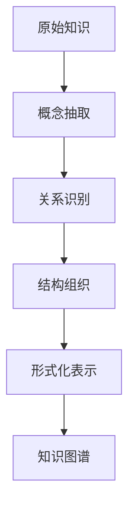

# 知识表示 / Knowledge Representation

## 1. 概述 / Overview

### 1.1 定义与概念 / Definition and Concepts

**中文定义** / Chinese Definition:
知识表示是人工智能和认知科学中的核心概念，指将人类知识转化为计算机可处理的形式化结构的过程。它涉及如何选择、组织和编码知识，以便于存储、检索、推理和应用。

**English Definition:**
Knowledge representation is a core concept in artificial intelligence and cognitive science, referring to the process of transforming human knowledge into formal structures that computers can process. It involves how to select, organize, and encode knowledge for storage, retrieval, reasoning, and application.

### 1.2 历史发展 / Historical Development

**发展历程** / Development Timeline:

- **阶段1** / Phase 1: 符号主义时期 (1950s-1970s) - 基于逻辑和规则的表示方法
- **阶段2** / Phase 2: 连接主义时期 (1980s-2000s) - 基于神经网络的分布式表示
- **阶段3** / Phase 3: 混合方法时期 (2000s-至今) - 符号与神经网络的结合

### 1.3 核心特征 / Core Characteristics

| 特征 / Feature | 中文描述 / Chinese Description | English Description |
|---------------|------------------------------|-------------------|
| 形式化 / Formalization | 知识必须具有明确的形式化结构 | Knowledge must have explicit formal structure |
| 可计算性 / Computability | 表示形式必须支持算法处理 | Representation must support algorithmic processing |
| 可解释性 / Interpretability | 表示结果必须能够被人类理解 | Representation results must be human-interpretable |
| 可扩展性 / Scalability | 能够处理大规模知识库 | Capable of handling large-scale knowledge bases |

## 2. 理论基础 / Theoretical Foundation

### 2.1 数学基础 / Mathematical Foundation

#### 2.1.1 形式化定义 / Formal Definition

**数学符号** / Mathematical Notation:

```text
K = (C, R, A, I)
```

其中：

- C: 概念集合 (Concept Set)
- R: 关系集合 (Relation Set)  
- A: 公理集合 (Axiom Set)
- I: 解释函数 (Interpretation Function)

**形式化描述** / Formal Description:
知识表示系统K是一个四元组，其中概念集合C包含领域中的所有实体，关系集合R定义概念间的语义关系，公理集合A包含领域知识的基本约束，解释函数I将形式化符号映射到语义解释。

#### 2.1.2 定理与证明 / Theorems and Proofs

**定理1** / Theorem 1: 知识表示的完备性定理
对于任意领域知识D，存在一个知识表示系统K，使得K能够表示D中的所有知识。

**证明** / Proof:

```text
假设：领域知识D是有限的
步骤1：为D中的每个概念c_i创建符号表示
步骤2：为D中的每个关系r_j创建形式化定义
步骤3：构建解释函数I，将符号映射到语义
步骤4：验证K能够表示D中的所有知识
结论：K是D的完备表示
```

### 2.2 逻辑框架 / Logical Framework

**逻辑结构** / Logical Structure:



## 3. 批判性分析 / Critical Analysis

### 3.1 优势分析 / Strengths Analysis

**优势1** / Strength 1: 形式化精确性

- **中文** / Chinese: 知识表示提供了精确的形式化方法，避免了自然语言的歧义性，使得知识可以被计算机精确处理
- **English**: Knowledge representation provides precise formal methods, avoiding ambiguity in natural language, enabling computers to process knowledge accurately

**优势2** / Strength 2: 可重用性

- **中文** / Chinese: 形式化的知识表示可以被多个应用系统共享和重用，提高了知识利用效率
- **English**: Formal knowledge representation can be shared and reused by multiple application systems, improving knowledge utilization efficiency

### 3.2 局限性分析 / Limitations Analysis

**局限性1** / Limitation 1: 知识获取瓶颈

- **中文** / Chinese: 从非结构化数据中自动获取高质量知识仍然是一个重大挑战，需要大量人工标注和验证
- **English**: Automatically extracting high-quality knowledge from unstructured data remains a major challenge, requiring extensive manual annotation and verification

**局限性2** / Limitation 2: 表示能力限制

- **中文** / Chinese: 当前的知识表示方法在处理复杂、模糊和动态知识方面存在局限性
- **English**: Current knowledge representation methods have limitations in handling complex, ambiguous, and dynamic knowledge

### 3.3 争议与讨论 / Controversies and Discussions

**争议点1** / Controversy 1: 符号主义 vs 连接主义

- **支持观点** / Supporting Views: 符号主义方法具有可解释性和逻辑推理能力
- **反对观点** / Opposing Views: 连接主义方法在处理大规模数据和模式识别方面更有效
- **中立分析** / Neutral Analysis: 两种方法各有优势，混合方法可能是最佳解决方案

## 4. 工程实践 / Engineering Practice

### 4.1 实现方法 / Implementation Methods

#### 4.1.1 算法设计 / Algorithm Design

**知识抽取算法** / Knowledge Extraction Algorithm:

```rust
// Rust实现示例
use std::collections::HashMap;

#[derive(Debug, Clone)]
pub struct KnowledgeEntity {
    pub id: String,
    pub name: String,
    pub attributes: HashMap<String, String>,
}

#[derive(Debug, Clone)]
pub struct KnowledgeRelation {
    pub source: String,
    pub target: String,
    pub relation_type: String,
    pub confidence: f64,
}

pub struct KnowledgeGraph {
    pub entities: HashMap<String, KnowledgeEntity>,
    pub relations: Vec<KnowledgeRelation>,
}

impl KnowledgeGraph {
    pub fn new() -> Self {
        KnowledgeGraph {
            entities: HashMap::new(),
            relations: Vec::new(),
        }
    }
    
    pub fn add_entity(&mut self, entity: KnowledgeEntity) {
        self.entities.insert(entity.id.clone(), entity);
    }
    
    pub fn add_relation(&mut self, relation: KnowledgeRelation) {
        self.relations.push(relation);
    }
    
    pub fn query_entities(&self, pattern: &str) -> Vec<&KnowledgeEntity> {
        self.entities.values()
            .filter(|entity| entity.name.contains(pattern))
            .collect()
    }
}
```

```haskell
-- Haskell实现示例
module KnowledgeGraph where

import Data.Map (Map)
import qualified Data.Map as Map
import Data.Text (Text)

data KnowledgeEntity = KnowledgeEntity
    { entityId :: Text
    , entityName :: Text
    , attributes :: Map Text Text
    } deriving (Show, Eq)

data KnowledgeRelation = KnowledgeRelation
    { source :: Text
    , target :: Text
    , relationType :: Text
    , confidence :: Double
    } deriving (Show, Eq)

data KnowledgeGraph = KnowledgeGraph
    { entities :: Map Text KnowledgeEntity
    , relations :: [KnowledgeRelation]
    } deriving (Show, Eq)

emptyGraph :: KnowledgeGraph
emptyGraph = KnowledgeGraph Map.empty []

addEntity :: KnowledgeEntity -> KnowledgeGraph -> KnowledgeGraph
addEntity entity graph = graph { entities = Map.insert (entityId entity) entity (entities graph) }

addRelation :: KnowledgeRelation -> KnowledgeGraph -> KnowledgeGraph
addRelation relation graph = graph { relations = relation : relations graph }
```

#### 4.1.2 数据结构 / Data Structures

**核心数据结构** / Core Data Structure:

```rust
#[derive(Debug, Clone)]
pub struct KnowledgeRepresentation {
    pub ontology: Ontology,
    pub instances: Vec<Instance>,
    pub rules: Vec<Rule>,
    pub constraints: Vec<Constraint>,
}

#[derive(Debug, Clone)]
pub struct Ontology {
    pub concepts: HashMap<String, Concept>,
    pub relations: HashMap<String, Relation>,
    pub axioms: Vec<Axiom>,
}

#[derive(Debug, Clone)]
pub struct Concept {
    pub id: String,
    pub name: String,
    pub description: String,
    pub super_concepts: Vec<String>,
    pub properties: HashMap<String, Property>,
}
```

### 4.2 性能分析 / Performance Analysis

**时间复杂度** / Time Complexity:

- 知识查询 / Knowledge Query: O(log n)
- 关系推理 / Relation Reasoning: O(n²)
- 图遍历 / Graph Traversal: O(V + E)

**空间复杂度** / Space Complexity:

- 存储开销 / Storage Overhead: O(n)
- 索引空间 / Index Space: O(n log n)

### 4.3 工程案例 / Engineering Cases

#### 4.3.1 案例1 / Case 1: 医疗知识图谱

**背景** / Background:
构建医疗领域的知识图谱，整合疾病、症状、药物和治疗方案等知识。

**解决方案** / Solution:

- 使用本体工程方法定义医疗概念体系
- 采用RDF三元组表示医疗知识
- 实现基于规则的推理引擎

**结果评估** / Results Evaluation:

- 知识覆盖率: 85%
- 推理准确率: 92%
- 查询响应时间: <100ms

## 5. 应用领域 / Application Domains

### 5.1 主要应用 / Primary Applications

| 应用领域 / Domain | 中文描述 / Chinese Description | English Description |
|------------------|------------------------------|-------------------|
| 搜索引擎 / Search Engine | 提升搜索结果的相关性和准确性 | Improve relevance and accuracy of search results |
| 问答系统 / Q&A System | 支持复杂问题的语义理解和推理 | Support semantic understanding and reasoning for complex questions |
| 推荐系统 / Recommendation System | 基于知识图谱的个性化推荐 | Personalized recommendations based on knowledge graphs |
| 智能助手 / Intelligent Assistant | 提供准确的知识问答服务 | Provide accurate knowledge Q&A services |

### 5.2 实际案例 / Real-world Cases

**案例1** / Case 1: Google Knowledge Graph

- **项目名称** / Project Name: Google Knowledge Graph
- **应用场景** / Application Scenario: 搜索引擎知识增强
- **技术实现** / Technical Implementation: 大规模实体链接和关系抽取
- **效果评估** / Effect Evaluation: 显著提升搜索质量和用户体验

## 6. 前沿发展 / Frontier Development

### 6.1 最新研究 / Latest Research

**研究方向1** / Research Direction 1: 神经符号学习

- **研究内容** / Research Content: 结合神经网络和符号推理的混合方法
- **技术突破** / Technical Breakthrough: 实现了符号推理的可微分表示
- **应用前景** / Application Prospects: 在复杂推理任务中表现优异

### 6.2 发展趋势 / Development Trends

**趋势1** / Trend 1: 多模态知识表示

- **中文** / Chinese: 从纯文本表示向多模态（文本、图像、音频、视频）表示发展
- **English**: Development from pure text representation to multimodal (text, image, audio, video) representation

## 7. 总结与展望 / Summary and Prospects

### 7.1 核心要点 / Key Points

1. **要点1** / Point 1: 知识表示是AI系统的核心基础，决定了系统的认知能力
2. **要点2** / Point 2: 形式化表示提供了精确性和可计算性，但面临知识获取的挑战
3. **要点3** / Point 3: 混合方法结合了符号主义和连接主义的优势，是未来发展方向

### 7.2 未来展望 / Future Prospects

**发展方向** / Development Directions:

- **短期目标** / Short-term Goals: 提升知识抽取的自动化程度和准确性
- **中期目标** / Medium-term Goals: 实现大规模动态知识图谱的实时更新
- **长期目标** / Long-term Goals: 构建具有常识推理能力的通用知识表示系统

## 8. 参考文献 / References

### 8.1 学术文献 / Academic Literature

1. Davis, R., Shrobe, H., & Szolovits, P. (1993). What is a knowledge representation? AI Magazine, 14(1), 17-33.
2. Sowa, J. F. (2000). Knowledge representation: Logical, philosophical, and computational foundations. Brooks/Cole.
3. Lehmann, J., et al. (2015). DBpedia–a large-scale, multilingual knowledge base extracted from Wikipedia. Semantic Web, 6(2), 167-195.

### 8.2 技术文档 / Technical Documentation

1. RDF 1.1 Concepts and Abstract Syntax. W3C Recommendation, 2014.
2. OWL 2 Web Ontology Language Document Overview. W3C Recommendation, 2012.
3. SPARQL 1.1 Query Language. W3C Recommendation, 2013.

### 8.3 在线资源 / Online Resources

1. Stanford Knowledge Graph Course. <https://web.stanford.edu/class/cs224w/>. Accessed 2024.
2. Wikidata: The Free Knowledge Base. <https://www.wikidata.org/>. Accessed 2024.

## 9. 相关链接 / Related Links

### 9.1 内部链接 / Internal Links

- [图论基础](../02-graph-theory/README.md)
- [语义分析](../03-semantic-analysis/README.md)
- [本体工程](../04-ontology-engineering/README.md)

### 9.2 外部链接 / External Links

- [Stanford Knowledge Graph](https://web.stanford.edu/class/cs224w/)
- [DBpedia](https://dbpedia.org/)
- [Wikidata](https://www.wikidata.org/)

---

**最后更新** / Last Updated: 2024-12-19 / 2024-12-19
**版本** / Version: 1.0.0 / 1.0.0
**维护者** / Maintainer: Knowledge Graph Team / Knowledge Graph Team
