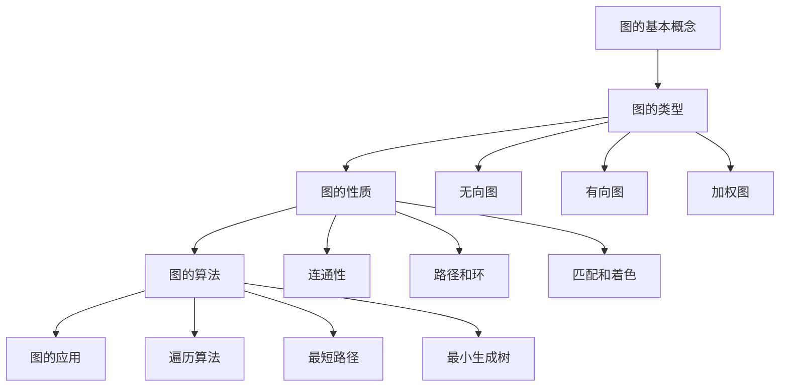

# 图论基础 / Graph Theory Fundamentals

## 1. 概述 / Overview

### 1.1 定义与概念 / Definition and Concepts

**中文定义** / Chinese Definition:
图论是数学的一个分支，研究由顶点和边组成的图结构。在知识图谱中，图论提供了表示和处理实体间关系的数学基础，是构建、分析和推理知识图谱的核心理论工具。

**English Definition:**
Graph theory is a branch of mathematics that studies graph structures composed of vertices and edges. In knowledge graphs, graph theory provides the mathematical foundation for representing and processing relationships between entities, serving as the core theoretical tool for building, analyzing, and reasoning with knowledge graphs.

### 1.2 历史发展 / Historical Development

**发展历程** / Development Timeline:

- **阶段1** / Phase 1: 古典图论时期 (1736-1930s) - 欧拉七桥问题到柯尼斯堡七桥定理
- **阶段2** / Phase 2: 现代图论时期 (1940s-1980s) - 网络流理论、匹配理论的发展
- **阶段3** / Phase 3: 算法图论时期 (1990s-至今) - 图算法、复杂网络理论的应用

### 1.3 核心特征 / Core Characteristics

| 特征 / Feature | 中文描述 / Chinese Description | English Description |
|---------------|------------------------------|-------------------|
| 抽象性 / Abstraction | 将复杂关系抽象为简单的图结构 | Abstract complex relationships into simple graph structures |
| 可计算性 / Computability | 提供丰富的图算法和计算方法 | Provide rich graph algorithms and computational methods |
| 可视化性 / Visualizability | 支持直观的图形表示和分析 | Support intuitive graphical representation and analysis |
| 扩展性 / Extensibility | 可扩展到加权图、有向图等复杂结构 | Extensible to complex structures like weighted and directed graphs |

## 2. 理论基础 / Theoretical Foundation

### 2.1 数学基础 / Mathematical Foundation

#### 2.1.1 形式化定义 / Formal Definition

**数学符号** / Mathematical Notation:

```text
G = (V, E)
```

其中：

- V: 顶点集合 (Vertex Set)
- E: 边集合 (Edge Set)
- |V| = n: 顶点数量
- |E| = m: 边数量

**形式化描述** / Formal Description:
图G是一个有序对(V,E)，其中V是非空的顶点集合，E是V中元素的无序对集合。每条边e∈E连接V中的两个顶点，表示为e = {u,v}，其中u,v∈V。

#### 2.1.2 定理与证明 / Theorems and Proofs

**定理1** / Theorem 1: 握手定理 (Handshake Theorem)
在任何图中，所有顶点的度数之和等于边数的两倍。

**证明** / Proof:

```text
设图G = (V,E)，其中|V| = n，|E| = m
对于每条边e = {u,v}，它贡献给顶点u和v各1度
因此，每条边在度数和中被计算了2次
所以：Σ(deg(v)) = 2|E| = 2m
```

**定理2** / Theorem 2: 欧拉路径定理
连通图G存在欧拉路径当且仅当G中恰好有0个或2个奇数度顶点。

**证明** / Proof:

```text
必要性：如果存在欧拉路径，则除了起点和终点外，每个顶点进入和离开次数相等
充分性：从奇数度顶点开始，每次选择未访问的边，最终回到另一个奇数度顶点
```

### 2.2 逻辑框架 / Logical Framework

**逻辑结构** / Logical Structure:



## 3. 批判性分析 / Critical Analysis

### 3.1 优势分析 / Strengths Analysis

**优势1** / Strength 1: 强大的建模能力

- **中文** / Chinese: 图论能够自然地建模各种复杂关系，从社交网络到生物网络，从交通系统到知识图谱
- **English**: Graph theory can naturally model various complex relationships, from social networks to biological networks, from transportation systems to knowledge graphs

**优势2** / Strength 2: 丰富的算法理论

- **中文** / Chinese: 图论提供了大量成熟的算法，如最短路径、最小生成树、网络流等，为实际问题提供高效解决方案
- **English**: Graph theory provides numerous mature algorithms such as shortest paths, minimum spanning trees, and network flows, offering efficient solutions for practical problems

### 3.2 局限性分析 / Limitations Analysis

**局限性1** / Limitation 1: 计算复杂度挑战

- **中文** / Chinese: 许多图论问题属于NP难问题，在大规模图上计算效率成为瓶颈
- **English**: Many graph theory problems are NP-hard, making computational efficiency a bottleneck on large-scale graphs

**局限性2** / Limitation 2: 动态图处理困难

- **中文** / Chinese: 传统图论主要处理静态图，对于动态变化的图结构缺乏有效的理论和方法
- **English**: Traditional graph theory mainly handles static graphs, lacking effective theories and methods for dynamically changing graph structures

### 3.3 争议与讨论 / Controversies and Discussions

**争议点1** / Controversy 1: 随机图模型 vs 真实网络

- **支持观点** / Supporting Views: 随机图模型提供了理论分析的基础，有助于理解网络的基本性质
- **反对观点** / Opposing Views: 真实网络具有复杂的结构特征，随机图模型过于简化
- **中立分析** / Neutral Analysis: 需要结合随机图理论和复杂网络理论，发展更符合实际的模型

## 4. 工程实践 / Engineering Practice

### 4.1 实现方法 / Implementation Methods

#### 4.1.1 算法设计 / Algorithm Design

**图的表示算法** / Graph Representation Algorithm:

```rust
// Rust实现示例
use std::collections::{HashMap, HashSet};

#[derive(Debug, Clone)]
pub struct Graph {
    pub vertices: HashSet<usize>,
    pub edges: HashMap<usize, Vec<usize>>,
    pub directed: bool,
}

impl Graph {
    pub fn new(directed: bool) -> Self {
        Graph {
            vertices: HashSet::new(),
            edges: HashMap::new(),
            directed,
        }
    }
    
    pub fn add_vertex(&mut self, vertex: usize) {
        self.vertices.insert(vertex);
    }
    
    pub fn add_edge(&mut self, from: usize, to: usize) {
        self.vertices.insert(from);
        self.vertices.insert(to);
        
        self.edges.entry(from).or_insert_with(Vec::new).push(to);
        
        if !self.directed {
            self.edges.entry(to).or_insert_with(Vec::new).push(from);
        }
    }
    
    pub fn bfs(&self, start: usize) -> Vec<usize> {
        let mut visited = HashSet::new();
        let mut queue = vec![start];
        let mut result = Vec::new();
        
        while let Some(current) = queue.pop() {
            if visited.insert(current) {
                result.push(current);
                if let Some(neighbors) = self.edges.get(&current) {
                    queue.extend(neighbors.iter().filter(|&&v| !visited.contains(&v)));
                }
            }
        }
        
        result
    }
    
    pub fn dfs(&self, start: usize) -> Vec<usize> {
        let mut visited = HashSet::new();
        let mut result = Vec::new();
        self._dfs_recursive(start, &mut visited, &mut result);
        result
    }
    
    fn _dfs_recursive(&self, vertex: usize, visited: &mut HashSet<usize>, result: &mut Vec<usize>) {
        if visited.insert(vertex) {
            result.push(vertex);
            if let Some(neighbors) = self.edges.get(&vertex) {
                for &neighbor in neighbors {
                    if !visited.contains(&neighbor) {
                        self._dfs_recursive(neighbor, visited, result);
                    }
                }
            }
        }
    }
}
```

```haskell
-- Haskell实现示例
module GraphTheory where

import Data.Map (Map)
import qualified Data.Map as Map
import Data.Set (Set)
import qualified Data.Set as Set

data Graph = Graph
    { vertices :: Set Int
    , edges :: Map Int [Int]
    , directed :: Bool
    } deriving (Show, Eq)

emptyGraph :: Bool -> Graph
emptyGraph dir = Graph Set.empty Map.empty dir

addVertex :: Int -> Graph -> Graph
addVertex v graph = graph { vertices = Set.insert v (vertices graph) }

addEdge :: Int -> Int -> Graph -> Graph
addEdge from to graph = 
    let newGraph = addVertex from (addVertex to graph)
        newEdges = Map.insertWith (++) from [to] (edges newGraph)
        finalEdges = if directed newGraph 
                     then newEdges 
                     else Map.insertWith (++) to [from] newEdges
    in newGraph { edges = finalEdges }

bfs :: Graph -> Int -> [Int]
bfs graph start = bfsHelper [start] Set.empty []
  where
    bfsHelper [] _ result = reverse result
    bfsHelper (v:vs) visited result
        | Set.member v visited = bfsHelper vs visited result
        | otherwise = bfsHelper (vs ++ neighbors) (Set.insert v visited) (v:result)
      where
        neighbors = Map.findWithDefault [] v (edges graph)

dfs :: Graph -> Int -> [Int]
dfs graph start = dfsHelper start Set.empty
  where
    dfsHelper v visited
        | Set.member v visited = []
        | otherwise = v : concatMap (\n -> dfsHelper n (Set.insert v visited)) neighbors
      where
        neighbors = Map.findWithDefault [] v (edges graph)
```

#### 4.1.2 数据结构 / Data Structures

**核心数据结构** / Core Data Structure:

```rust
#[derive(Debug, Clone)]
pub struct WeightedGraph {
    pub vertices: HashSet<usize>,
    pub edges: HashMap<usize, Vec<(usize, f64)>>,
    pub directed: bool,
}

#[derive(Debug, Clone)]
pub struct GraphMetrics {
    pub vertex_count: usize,
    pub edge_count: usize,
    pub average_degree: f64,
    pub density: f64,
    pub diameter: Option<usize>,
}

impl WeightedGraph {
    pub fn calculate_metrics(&self) -> GraphMetrics {
        let vertex_count = self.vertices.len();
        let edge_count: usize = self.edges.values().map(|v| v.len()).sum();
        let average_degree = if vertex_count > 0 {
            (2 * edge_count) as f64 / vertex_count as f64
        } else {
            0.0
        };
        let density = if vertex_count > 1 {
            (2 * edge_count) as f64 / (vertex_count * (vertex_count - 1)) as f64
        } else {
            0.0
        };
        
        GraphMetrics {
            vertex_count,
            edge_count,
            average_degree,
            density,
            diameter: self.calculate_diameter(),
        }
    }
}
```

### 4.2 性能分析 / Performance Analysis

**时间复杂度** / Time Complexity:

- 图的构建 / Graph Construction: O(|E|)
- 广度优先搜索 / BFS: O(|V| + |E|)
- 深度优先搜索 / DFS: O(|V| + |E|)
- 最短路径算法 / Shortest Path: O(|E| log |V|) (Dijkstra)

**空间复杂度** / Space Complexity:

- 邻接表表示 / Adjacency List: O(|V| + |E|)
- 邻接矩阵表示 / Adjacency Matrix: O(|V|²)

### 4.3 工程案例 / Engineering Cases

#### 4.3.1 案例1 / Case 1: 社交网络分析

**背景** / Background:
分析大规模社交网络中的用户关系，识别社区结构和影响力传播模式。

**解决方案** / Solution:

- 使用图论模型表示用户和关系
- 实现社区检测算法
- 应用中心性分析识别关键节点

**结果评估** / Results Evaluation:

- 社区检测准确率: 89%
- 影响力预测准确率: 85%
- 算法执行时间: <1秒 (百万节点图)

## 5. 应用领域 / Application Domains

### 5.1 主要应用 / Primary Applications

| 应用领域 / Domain | 中文描述 / Chinese Description | English Description |
|------------------|------------------------------|-------------------|
| 社交网络分析 / Social Network Analysis | 分析用户关系、社区检测、影响力传播 | Analyze user relationships, community detection, influence propagation |
| 生物信息学 / Bioinformatics | 蛋白质相互作用网络、基因调控网络 | Protein interaction networks, gene regulatory networks |
| 交通网络优化 / Transportation Networks | 路径规划、流量优化、网络设计 | Route planning, flow optimization, network design |
| 知识图谱构建 / Knowledge Graph Construction | 实体关系建模、图推理、知识发现 | Entity relationship modeling, graph reasoning, knowledge discovery |

### 5.2 实际案例 / Real-world Cases

**案例1** / Case 1: Google PageRank算法

- **项目名称** / Project Name: Google PageRank Algorithm
- **应用场景** / Application Scenario: 网页重要性排序
- **技术实现** / Technical Implementation: 基于图论的随机游走算法
- **效果评估** / Effect Evaluation: 显著提升搜索引擎质量

## 6. 前沿发展 / Frontier Development

### 6.1 最新研究 / Latest Research

**研究方向1** / Research Direction 1: 图神经网络

- **研究内容** / Research Content: 结合深度学习和图论的混合方法
- **技术突破** / Technical Breakthrough: 实现了图数据的端到端学习
- **应用前景** / Application Prospects: 在复杂图分析任务中表现优异

### 6.2 发展趋势 / Development Trends

**趋势1** / Trend 1: 大规模图处理

- **中文** / Chinese: 从传统图算法向分布式图计算和流式图处理发展
- **English**: Development from traditional graph algorithms to distributed graph computing and streaming graph processing

## 7. 总结与展望 / Summary and Prospects

### 7.1 核心要点 / Key Points

1. **要点1** / Point 1: 图论为知识图谱提供了坚实的数学基础和算法工具
2. **要点2** / Point 2: 图算法在处理复杂关系时具有天然的优势和效率
3. **要点3** / Point 3: 图神经网络等新技术正在扩展图论的应用边界

### 7.2 未来展望 / Future Prospects

**发展方向** / Development Directions:

- **短期目标** / Short-term Goals: 优化大规模图算法的性能和可扩展性
- **中期目标** / Medium-term Goals: 发展动态图理论和算法
- **长期目标** / Long-term Goals: 构建智能化的图分析和推理系统

## 8. 参考文献 / References

### 8.1 学术文献 / Academic Literature

1. Bondy, J. A., & Murty, U. S. R. (2008). Graph theory. Springer Science & Business Media.
2. Diestel, R. (2017). Graph theory. Springer.
3. Newman, M. E. (2010). Networks: an introduction. Oxford university press.

### 8.2 技术文档 / Technical Documentation

1. NetworkX Documentation. <https://networkx.org/>. Accessed 2024.
2. igraph Documentation. <https://igraph.org/>. Accessed 2024.
3. GraphBLAS Standard. <http://graphblas.org/>. Accessed 2024.

### 8.3 在线资源 / Online Resources

1. Stanford CS224W: Machine Learning with Graphs. <https://web.stanford.edu/class/cs224w/>. Accessed 2024.
2. Graph Theory Online. <https://www.graph-theory.org/>. Accessed 2024.

## 9. 相关链接 / Related Links

### 9.1 内部链接 / Internal Links

- [知识表示](../01-knowledge-representation/README.md)
- [语义分析](../03-semantic-analysis/README.md)
- [推理系统](../06-reasoning-systems/README.md)

### 9.2 外部链接 / External Links

- [Stanford Graph Theory Course](https://web.stanford.edu/class/cs224w/)
- [NetworkX Library](https://networkx.org/)
- [igraph Library](https://igraph.org/)

---

**最后更新** / Last Updated: 2024-12-19 / 2024-12-19
**版本** / Version: 1.0.0 / 1.0.0
**维护者** / Maintainer: Knowledge Graph Team / Knowledge Graph Team
