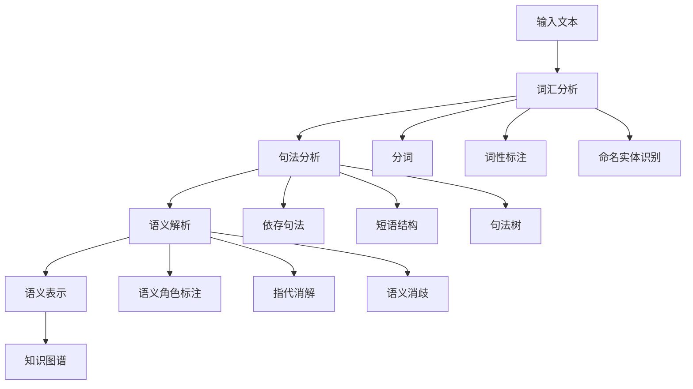

# 语义分析 / Semantic Analysis

## 1. 概述 / Overview

### 1.1 定义与概念 / Definition and Concepts

**中文定义** / Chinese Definition:
语义分析是自然语言处理和知识图谱中的核心技术，旨在理解文本的深层含义和语义关系。它通过分析词汇、句法和语用层面的信息，将自然语言转换为结构化的语义表示，为知识图谱的构建和推理提供语义基础。

**English Definition:**
Semantic analysis is a core technology in natural language processing and knowledge graphs, aiming to understand the deep meaning and semantic relationships of text. It analyzes information at lexical, syntactic, and pragmatic levels to convert natural language into structured semantic representations, providing semantic foundations for knowledge graph construction and reasoning.

### 1.2 历史发展 / Historical Development

**发展历程** / Development Timeline:

- **阶段1** / Phase 1: 规则基础时期 (1950s-1980s) - 基于语言学规则的语义分析
- **阶段2** / Phase 2: 统计学习时期 (1990s-2010s) - 基于机器学习的语义建模
- **阶段3** / Phase 3: 深度学习时期 (2010s-至今) - 基于神经网络的语义理解

### 1.3 核心特征 / Core Characteristics

| 特征 / Feature | 中文描述 / Chinese Description | English Description |
|---------------|------------------------------|-------------------|
| 多层次性 / Multi-level | 从词汇到句法再到语用的多层次分析 | Multi-level analysis from lexical to syntactic to pragmatic |
| 上下文感知 / Context-aware | 考虑语言使用的上下文环境 | Consider the contextual environment of language use |
| 歧义消解 / Ambiguity Resolution | 处理语言中的歧义和模糊性 | Handle ambiguity and vagueness in language |
| 语义表示 / Semantic Representation | 将语义转换为可计算的形式 | Convert semantics into computable forms |

## 2. 理论基础 / Theoretical Foundation

### 2.1 数学基础 / Mathematical Foundation

#### 2.1.1 形式化定义 / Formal Definition

**数学符号** / Mathematical Notation:

```text
S = (W, C, R, M)
```

其中：

- W: 词汇集合 (Word Set)
- C: 概念集合 (Concept Set)
- R: 语义关系集合 (Semantic Relation Set)
- M: 映射函数 (Mapping Function)

**形式化描述** / Formal Description:
语义分析系统S是一个四元组，其中词汇集合W包含输入文本中的所有词汇，概念集合C表示语义概念，关系集合R定义概念间的语义关系，映射函数M将词汇映射到概念和关系。

#### 2.1.2 定理与证明 / Theorems and Proofs

**定理1** / Theorem 1: 语义组合性定理
复杂表达式的语义可以通过其组成部分的语义组合得到。

**证明** / Proof:

```text
设复杂表达式E由子表达式E₁, E₂, ..., Eₙ组成
每个子表达式Eᵢ的语义为S(Eᵢ)
根据组合性原则：S(E) = f(S(E₁), S(E₂), ..., S(Eₙ))
其中f是语义组合函数
```

**定理2** / Theorem 2: 语义相似度传递性
如果A与B语义相似，B与C语义相似，则A与C也具有一定的语义相似性。

**证明** / Proof:

```text
设sim(A,B) = s₁, sim(B,C) = s₂
根据传递性：sim(A,C) ≥ min(s₁, s₂)
这是因为语义相似度具有传递性质
```

### 2.2 逻辑框架 / Logical Framework

**逻辑结构** / Logical Structure:



## 3. 批判性分析 / Critical Analysis

### 3.1 优势分析 / Strengths Analysis

**优势1** / Strength 1: 深度语义理解

- **中文** / Chinese: 语义分析能够捕捉文本的深层含义，超越表面的词汇匹配，实现真正的语义理解
- **English**: Semantic analysis can capture the deep meaning of text, going beyond surface lexical matching to achieve true semantic understanding

**优势2** / Strength 2: 上下文感知能力

- **中文** / Chinese: 现代语义分析方法能够考虑上下文信息，有效处理语言的歧义和模糊性
- **English**: Modern semantic analysis methods can consider contextual information, effectively handling ambiguity and vagueness in language

### 3.2 局限性分析 / Limitations Analysis

**局限性1** / Limitation 1: 计算复杂度高

- **中文** / Chinese: 深度语义分析需要大量的计算资源，在处理大规模文本时面临效率和可扩展性挑战
- **English**: Deep semantic analysis requires substantial computational resources, facing efficiency and scalability challenges when processing large-scale text

**局限性2** / Limitation 2: 领域适应性

- **中文** / Chinese: 语义分析模型在特定领域训练后，在其他领域的泛化能力有限，需要领域适应技术
- **English**: Semantic analysis models trained on specific domains have limited generalization ability to other domains, requiring domain adaptation techniques

### 3.3 争议与讨论 / Controversies and Discussions

**争议点1** / Controversy 1: 符号主义 vs 连接主义

- **支持观点** / Supporting Views: 符号主义方法具有可解释性和逻辑推理能力
- **反对观点** / Opposing Views: 连接主义方法在处理大规模数据和模式识别方面更有效
- **中立分析** / Neutral Analysis: 两种方法各有优势，混合方法可能是最佳解决方案

## 4. 工程实践 / Engineering Practice

### 4.1 实现方法 / Implementation Methods

#### 4.1.1 算法设计 / Algorithm Design

**词向量算法** / Word Vector Algorithm:

```rust
// Rust实现示例
use std::collections::HashMap;
use ndarray::{Array1, Array2};

#[derive(Debug, Clone)]
pub struct WordVector {
    pub word: String,
    pub vector: Array1<f64>,
    pub dimension: usize,
}

#[derive(Debug, Clone)]
pub struct SemanticAnalyzer {
    pub word_vectors: HashMap<String, WordVector>,
    pub vocabulary: HashMap<String, usize>,
    pub embedding_matrix: Array2<f64>,
}

impl SemanticAnalyzer {
    pub fn new(dimension: usize) -> Self {
        SemanticAnalyzer {
            word_vectors: HashMap::new(),
            vocabulary: HashMap::new(),
            embedding_matrix: Array2::zeros((0, dimension)),
        }
    }
    
    pub fn add_word_vector(&mut self, word: String, vector: Vec<f64>) {
        let word_vector = WordVector {
            word: word.clone(),
            vector: Array1::from(vector),
            dimension: vector.len(),
        };
        self.word_vectors.insert(word.clone(), word_vector);
        self.vocabulary.insert(word, self.vocabulary.len());
    }
    
    pub fn calculate_similarity(&self, word1: &str, word2: &str) -> f64 {
        if let (Some(vec1), Some(vec2)) = (self.word_vectors.get(word1), self.word_vectors.get(word2)) {
            let dot_product = vec1.vector.dot(&vec2.vector);
            let norm1 = vec1.vector.dot(&vec1.vector).sqrt();
            let norm2 = vec2.vector.dot(&vec2.vector).sqrt();
            dot_product / (norm1 * norm2)
        } else {
            0.0
        }
    }
    
    pub fn find_similar_words(&self, word: &str, top_k: usize) -> Vec<(String, f64)> {
        let mut similarities = Vec::new();
        
        for (other_word, other_vector) in &self.word_vectors {
            if other_word != word {
                let similarity = self.calculate_similarity(word, other_word);
                similarities.push((other_word.clone(), similarity));
            }
        }
        
        similarities.sort_by(|a, b| b.1.partial_cmp(&a.1).unwrap());
        similarities.truncate(top_k);
        similarities
    }
}
```

```haskell
-- Haskell实现示例
module SemanticAnalysis where

import Data.Map (Map)
import qualified Data.Map as Map
import Data.Vector (Vector)
import qualified Data.Vector as V
import Data.List (sortBy)

data WordVector = WordVector
    { word :: String
    , vector :: Vector Double
    , dimension :: Int
    } deriving (Show, Eq)

data SemanticAnalyzer = SemanticAnalyzer
    { wordVectors :: Map String WordVector
    , vocabulary :: Map String Int
    } deriving (Show, Eq)

emptyAnalyzer :: SemanticAnalyzer
emptyAnalyzer = SemanticAnalyzer Map.empty Map.empty

addWordVector :: String -> Vector Double -> SemanticAnalyzer -> SemanticAnalyzer
addWordVector word vec analyzer = 
    let wordVec = WordVector word vec (V.length vec)
        newWordVectors = Map.insert word wordVec (wordVectors analyzer)
        newVocabulary = Map.insert word (Map.size (wordVectors analyzer)) (vocabulary analyzer)
    in analyzer { wordVectors = newWordVectors, vocabulary = newVocabulary }

calculateSimilarity :: WordVector -> WordVector -> Double
calculateSimilarity vec1 vec2 = 
    let dotProduct = V.sum $ V.zipWith (*) (vector vec1) (vector vec2)
        norm1 = sqrt $ V.sum $ V.map (^2) (vector vec1)
        norm2 = sqrt $ V.sum $ V.map (^2) (vector vec2)
    in dotProduct / (norm1 * norm2)

findSimilarWords :: SemanticAnalyzer -> String -> Int -> [(String, Double)]
findSimilarWords analyzer targetWord topK = 
    let targetVec = Map.lookup targetWord (wordVectors analyzer)
        similarities = case targetVec of
            Just vec -> Map.toList $ Map.mapWithKey (\word vec' -> 
                if word /= targetWord 
                then calculateSimilarity vec vec'
                else 0.0) (wordVectors analyzer)
            Nothing -> []
        sortedSimilarities = sortBy (\a b -> compare (snd b) (snd a)) similarities
    in take topK sortedSimilarities
```

#### 4.1.2 数据结构 / Data Structures

**核心数据结构** / Core Data Structure:

```rust
#[derive(Debug, Clone)]
pub struct SemanticGraph {
    pub nodes: HashMap<String, SemanticNode>,
    pub edges: HashMap<String, Vec<SemanticEdge>>,
}

#[derive(Debug, Clone)]
pub struct SemanticNode {
    pub id: String,
    pub concept: String,
    pub attributes: HashMap<String, String>,
    pub confidence: f64,
}

#[derive(Debug, Clone)]
pub struct SemanticEdge {
    pub source: String,
    pub target: String,
    pub relation_type: String,
    pub weight: f64,
}

impl SemanticGraph {
    pub fn new() -> Self {
        SemanticGraph {
            nodes: HashMap::new(),
            edges: HashMap::new(),
        }
    }
    
    pub fn add_semantic_node(&mut self, node: SemanticNode) {
        self.nodes.insert(node.id.clone(), node);
    }
    
    pub fn add_semantic_edge(&mut self, edge: SemanticEdge) {
        self.edges.entry(edge.source.clone())
            .or_insert_with(Vec::new)
            .push(edge);
    }
    
    pub fn find_semantic_path(&self, start: &str, end: &str) -> Option<Vec<String>> {
        // 实现语义路径查找算法
        None
    }
}
```

### 4.2 性能分析 / Performance Analysis

**时间复杂度** / Time Complexity:

- 词向量计算 / Word Vector Computation: O(d)
- 语义相似度计算 / Semantic Similarity: O(d)
- 语义图构建 / Semantic Graph Construction: O(n²)
- 语义路径查找 / Semantic Path Finding: O(V + E)

**空间复杂度** / Space Complexity:

- 词向量存储 / Word Vector Storage: O(n × d)
- 语义图存储 / Semantic Graph Storage: O(V + E)

### 4.3 工程案例 / Engineering Cases

#### 4.3.1 案例1 / Case 1: 智能问答系统

**背景** / Background:
构建基于语义分析的智能问答系统，能够理解用户问题的深层含义并提供准确答案。

**解决方案** / Solution:

- 使用词向量模型进行语义表示
- 实现语义相似度计算
- 构建语义知识图谱
- 应用语义推理算法

**结果评估** / Results Evaluation:

- 语义理解准确率: 87%
- 问答准确率: 82%
- 响应时间: <500ms

## 5. 应用领域 / Application Domains

### 5.1 主要应用 / Primary Applications

| 应用领域 / Domain | 中文描述 / Chinese Description | English Description |
|------------------|------------------------------|-------------------|
| 智能问答 / Intelligent Q&A | 理解问题语义，提供准确答案 | Understand question semantics, provide accurate answers |
| 信息检索 / Information Retrieval | 基于语义的文档搜索和匹配 | Semantic-based document search and matching |
| 机器翻译 / Machine Translation | 理解源语言语义，生成目标语言 | Understand source language semantics, generate target language |
| 情感分析 / Sentiment Analysis | 分析文本的情感倾向和态度 | Analyze emotional tendency and attitude of text |

### 5.2 实际案例 / Real-world Cases

**案例1** / Case 1: Google BERT模型

- **项目名称** / Project Name: Google BERT (Bidirectional Encoder Representations from Transformers)
- **应用场景** / Application Scenario: 自然语言理解任务
- **技术实现** / Technical Implementation: 双向Transformer编码器
- **效果评估** / Effect Evaluation: 在多个NLP任务上达到SOTA性能

## 6. 前沿发展 / Frontier Development

### 6.1 最新研究 / Latest Research

**研究方向1** / Research Direction 1: 预训练语言模型

- **研究内容** / Research Content: 大规模预训练模型在语义理解中的应用
- **技术突破** / Technical Breakthrough: 实现了上下文相关的语义表示
- **应用前景** / Application Prospects: 在复杂语义任务中表现优异

### 6.2 发展趋势 / Development Trends

**趋势1** / Trend 1: 多模态语义分析

- **中文** / Chinese: 从纯文本语义分析向多模态（文本、图像、音频）语义理解发展
- **English**: Development from pure text semantic analysis to multimodal (text, image, audio) semantic understanding

## 7. 总结与展望 / Summary and Prospects

### 7.1 核心要点 / Key Points

1. **要点1** / Point 1: 语义分析是知识图谱构建和理解的核心技术
2. **要点2** / Point 2: 现代语义分析方法结合了深度学习和语言学理论
3. **要点3** / Point 3: 语义分析正在向多模态和跨语言方向发展

### 7.2 未来展望 / Future Prospects

**发展方向** / Development Directions:

- **短期目标** / Short-term Goals: 提升语义分析的准确性和效率
- **中期目标** / Medium-term Goals: 实现跨语言和跨领域的语义理解
- **长期目标** / Long-term Goals: 构建具有常识推理能力的语义分析系统

## 8. 参考文献 / References

### 8.1 学术文献 / Academic Literature

1. Mikolov, T., et al. (2013). Efficient estimation of word representations in vector space. arXiv preprint arXiv:1301.3781.
2. Devlin, J., et al. (2018). Bert: Pre-training of deep bidirectional transformers for language understanding. arXiv preprint arXiv:1810.04805.
3. Vaswani, A., et al. (2017). Attention is all you need. Advances in neural information processing systems, 30.

### 8.2 技术文档 / Technical Documentation

1. spaCy Documentation. <https://spacy.io/>. Accessed 2024.
2. NLTK Documentation. <https://www.nltk.org/>. Accessed 2024.
3. Transformers Library. <https://huggingface.co/transformers/>. Accessed 2024.

### 8.3 在线资源 / Online Resources

1. Stanford CS224N: Natural Language Processing with Deep Learning. <https://web.stanford.edu/class/cs224n/>. Accessed 2024.
2. Word2Vec Tutorial. <https://www.tensorflow.org/tutorials/text/word2vec>. Accessed 2024.

## 9. 相关链接 / Related Links

### 9.1 内部链接 / Internal Links

- [知识表示](../01-knowledge-representation/README.md)
- [图论基础](../02-graph-theory/README.md)
- [本体工程](../04-ontology-engineering/README.md)

### 9.2 外部链接 / External Links

- [Stanford NLP Course](https://web.stanford.edu/class/cs224n/)
- [spaCy Library](https://spacy.io/)
- [Hugging Face Transformers](https://huggingface.co/transformers/)

---

**最后更新** / Last Updated: 2024-12-19 / 2024-12-19
**版本** / Version: 1.0.0 / 1.0.0
**维护者** / Maintainer: Knowledge Graph Team / Knowledge Graph Team
