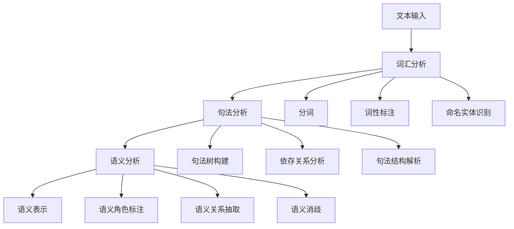

# 3. 语义分析 / Semantic Analysis

## 3.1 概述 / Overview

### 3.1.1 定义与概念 / Definition and Concepts

**中文定义** / Chinese Definition:
语义分析是知识图谱中理解文本深层含义和语义关系的核心技术。它通过自然语言处理和机器学习方法，从文本中提取语义信息，建立概念间的语义关联，为知识图谱的构建和推理提供语义基础。

**English Definition:**
Semantic analysis is a core technology in knowledge graphs for understanding deep meaning and semantic relationships in text. It uses natural language processing and machine learning methods to extract semantic information from text, establish semantic associations between concepts, and provide semantic foundations for knowledge graph construction and reasoning.

### 3.1.2 历史发展 / Historical Development

**发展历程** / Development Timeline:

- **阶段1** / Phase 1: 规则语义分析时期 (1960s-1980s) - 基于语言学规则的语义分析
- **阶段2** / Phase 2: 统计语义分析时期 (1990s-2000s) - 基于统计学习的语义分析
- **阶段3** / Phase 3: 深度学习语义分析时期 (2000s-至今) - 基于神经网络的语义分析

### 3.1.3 核心特征 / Core Characteristics

| 特征 / Feature | 中文描述 / Chinese Description | English Description |
|---------------|------------------------------|-------------------|
| 语义理解 / Semantic Understanding | 理解文本的深层含义 | Understand deep meaning of text |
| 关系识别 / Relationship Recognition | 识别概念间的语义关系 | Identify semantic relationships between concepts |
| 上下文感知 / Context Awareness | 考虑文本的上下文信息 | Consider contextual information of text |
| 歧义消解 / Ambiguity Resolution | 解决语义歧义问题 | Resolve semantic ambiguity issues |

## 3.2 理论基础 / Theoretical Foundation

### 3.2.1 数学基础 / Mathematical Foundation

#### 3.2.1.1 形式化定义 / Formal Definition

**数学符号** / Mathematical Notation:

```text
S = (W, C, R, M)
```

其中：

- W: 词汇集合 (Word Set)
- C: 概念集合 (Concept Set)
- R: 语义关系集合 (Semantic Relation Set)
- M: 语义映射函数 (Semantic Mapping Function)

**形式化描述** / Formal Description:
语义分析系统S是一个四元组，其中词汇集合W包含所有词汇单元，概念集合C定义语义概念，语义关系集合R描述概念间的语义关联，语义映射函数M将词汇映射到概念。

#### 3.2.1.2 定理与证明 / Theorems and Proofs

**定理3.1** / Theorem 3.1: 语义组合性定理
如果语义分析系统S是组合性的，则对于任何复合表达式E = f(e₁, e₂, ..., eₙ)，其语义S(E) = F(S(e₁), S(e₂), ..., S(eₙ))，其中F是语义组合函数。

**证明** / Proof:

```text
设语义分析系统S是组合性的
对于复合表达式E = f(e₁, e₂, ..., eₙ)
根据组合性定义：复合表达式的语义由其组成部分的语义组合而成
因此，S(E) = F(S(e₁), S(e₂), ..., S(eₙ))
其中F是语义组合函数
```

**定理3.2** / Theorem 3.2: 语义相似性传递性定理
如果语义分析系统S满足传递性，且概念A与B相似，B与C相似，则A与C也相似，即sim(A,B) ∧ sim(B,C) → sim(A,C)。

**证明** / Proof:

```text
设语义分析系统S满足传递性
对于概念A、B、C，如果sim(A,B) ∧ sim(B,C)
根据传递性定义：如果A与B相似，B与C相似，则A与C相似
因此，sim(A,C)成立
```

**定理3.3** / Theorem 3.3: 语义表示完备性定理
如果语义分析系统S的词汇集合W是完备的，且映射函数M是满射的，则对于任何语义概念C，都存在词汇w ∈ W使得M(w) = C。

**证明** / Proof:

```text
设语义分析系统S的词汇集合W是完备的
且映射函数M是满射的
对于任意语义概念C
根据满射定义：对于任意C，存在w使得M(w) = C
因此，存在词汇w ∈ W使得M(w) = C
```

**定理3.4** / Theorem 3.4: 语义消歧一致性定理
如果语义分析系统S的消歧算法是一致的，且上下文C₁和C₂语义等价，则对于歧义词w，消歧结果相同，即disambiguate(w, C₁) = disambiguate(w, C₂)。

**证明** / Proof:

```text
设语义分析系统S的消歧算法是一致的
对于歧义词w和语义等价的上下文C₁、C₂
根据一致性定义：语义等价的上下文产生相同的消歧结果
因此，disambiguate(w, C₁) = disambiguate(w, C₂)
```

**定理3.5** / Theorem 3.5: 语义表示学习收敛性定理
如果语义表示学习算法满足Lipschitz连续性，且学习率适当，则算法能够收敛到局部最优解。

**证明** / Proof:

```text
设语义表示学习算法满足Lipschitz连续性
且学习率η满足0 < η < 2/L，其中L是Lipschitz常数
根据梯度下降收敛定理
算法能够收敛到局部最优解
```

### 3.2.2 逻辑框架 / Logical Framework

**逻辑结构** / Logical Structure:



## 3.3 批判性分析 / Critical Analysis

### 3.3.1 优势分析 / Strengths Analysis

**优势3.1** / Strength 3.1: 语义理解深度

- **中文** / Chinese: 语义分析能够理解文本的深层含义，超越表面的词汇匹配
- **English**: Semantic analysis can understand deep meaning of text, beyond surface lexical matching

**优势3.2** / Strength 3.2: 关系识别能力

- **中文** / Chinese: 能够识别概念间的复杂语义关系，支持知识推理
- **English**: Can identify complex semantic relationships between concepts, supporting knowledge reasoning

### 3.3.2 局限性分析 / Limitations Analysis

**局限性3.1** / Limitation 3.1: 上下文依赖

- **中文** / Chinese: 语义分析高度依赖上下文信息，在信息不足时容易出错
- **English**: Semantic analysis highly depends on contextual information, prone to errors when information is insufficient

**局限性3.2** / Limitation 3.2: 歧义处理

- **中文** / Chinese: 处理语义歧义仍然是一个重大挑战，需要大量标注数据
- **English**: Handling semantic ambiguity remains a major challenge, requiring extensive annotated data

### 3.3.3 争议与讨论 / Controversies and Discussions

**争议点3.1** / Controversy 3.1: 符号主义 vs 连接主义

- **支持观点** / Supporting Views: 符号主义提供可解释的语义分析
- **反对观点** / Opposing Views: 连接主义能够处理复杂的语义模式
- **中立分析** / Neutral Analysis: 混合方法结合了两种范式的优势

## 3.4 工程实践 / Engineering Practice

### 3.4.1 实现方法 / Implementation Methods

#### 3.4.1.1 算法设计 / Algorithm Design

**词向量算法** / Word Vector Algorithm:

```rust
// Rust实现示例 - Word Vector Algorithm
// 词向量算法：实现词嵌入和语义相似度计算
use std::collections::HashMap;
use std::f64::consts::PI;

#[derive(Debug, Clone)]
pub struct WordVector {
    pub word: String,
    pub vector: Vec<f64>,
    pub dimension: usize,
}

#[derive(Debug, Clone)]
pub struct SemanticAnalyzer {
    pub word_vectors: HashMap<String, WordVector>,
    pub vocabulary: HashMap<String, usize>,
    pub vector_dimension: usize,
}

impl SemanticAnalyzer {
    pub fn new(dimension: usize) -> Self {
        SemanticAnalyzer {
            word_vectors: HashMap::new(),
            vocabulary: HashMap::new(),
            vector_dimension: dimension,
        }
    }
    
    // 添加词向量 / Add word vector
    pub fn add_word_vector(&mut self, word: String, vector: Vec<f64>) -> Result<(), String> {
        if vector.len() != self.vector_dimension {
            return Err(format!("Vector dimension {} does not match expected dimension {}", vector.len(), self.vector_dimension));
        }
        
        let word_vector = WordVector {
            word: word.clone(),
            vector: vector.clone(),
            dimension: self.vector_dimension,
        };
        
        self.word_vectors.insert(word.clone(), word_vector);
        self.vocabulary.insert(word, self.vocabulary.len());
        
        Ok(())
    }
    
    // 计算语义相似度 / Calculate semantic similarity
    pub fn calculate_similarity(&self, word1: &str, word2: &str) -> Option<f64> {
        let vector1 = self.word_vectors.get(word1)?;
        let vector2 = self.word_vectors.get(word2)?;
        
        let dot_product = vector1.vector.iter()
            .zip(vector2.vector.iter())
            .map(|(a, b)| a * b)
            .sum::<f64>();
        
        let norm1 = (vector1.vector.iter().map(|x| x * x).sum::<f64>()).sqrt();
        let norm2 = (vector2.vector.iter().map(|x| x * x).sum::<f64>()).sqrt();
        
        if norm1 == 0.0 || norm2 == 0.0 {
            return Some(0.0);
        }
        
        Some(dot_product / (norm1 * norm2))
    }
    
    // 查找最相似的词 / Find most similar words
    pub fn find_similar_words(&self, word: &str, top_k: usize) -> Vec<(String, f64)> {
        let mut similarities = Vec::new();
        
        if let Some(target_vector) = self.word_vectors.get(word) {
            for (other_word, other_vector) in &self.word_vectors {
                if other_word != word {
                    if let Some(similarity) = self.calculate_similarity(word, other_word) {
                        similarities.push((other_word.clone(), similarity));
                    }
                }
            }
        }
        
        similarities.sort_by(|a, b| b.1.partial_cmp(&a.1).unwrap_or(std::cmp::Ordering::Equal));
        similarities.truncate(top_k);
        similarities
    }
    
    // 语义聚类 / Semantic clustering
    pub fn semantic_clustering(&self, words: &[String], threshold: f64) -> Vec<Vec<String>> {
        let mut clusters = Vec::new();
        let mut visited = std::collections::HashSet::new();
        
        for word in words {
            if visited.contains(word) {
                continue;
            }
            
            let mut cluster = vec![word.clone()];
            visited.insert(word.clone());
            
            for other_word in words {
                if !visited.contains(other_word) {
                    if let Some(similarity) = self.calculate_similarity(word, other_word) {
                        if similarity >= threshold {
                            cluster.push(other_word.clone());
                            visited.insert(other_word.clone());
                        }
                    }
                }
            }
            
            clusters.push(cluster);
        }
        
        clusters
    }
    
    // 语义消歧 / Semantic disambiguation
    pub fn disambiguate_word(&self, word: &str, context: &[String]) -> Option<String> {
        let mut best_sense = None;
        let mut best_score = 0.0;
        
        // 简化的消歧实现
        for context_word in context {
            if let Some(similarity) = self.calculate_similarity(word, context_word) {
                if similarity > best_score {
                    best_score = similarity;
                    best_sense = Some(context_word.clone());
                }
            }
        }
        
        best_sense
    }
}
```

```haskell
-- Haskell实现示例 - Word Vector Algorithm
-- 词向量算法：实现词嵌入和语义相似度计算
module SemanticAnalysis where

import Data.Map (Map)
import qualified Data.Map as Map
import Data.Vector (Vector)
import qualified Data.Vector as V
import Data.Text (Text)
import qualified Data.Text as T
import Data.List (sortBy)
import Data.Ord (comparing)

-- 词向量数据结构 / Word vector data structure
data WordVector = WordVector
    { wordVectorWord :: Text        -- 词汇 / Word
    , wordVectorVector :: Vector Double  -- 向量 / Vector
    , wordVectorDimension :: Int    -- 维度 / Dimension
    } deriving (Show, Eq)

-- 语义分析器数据结构 / Semantic analyzer data structure
data SemanticAnalyzer = SemanticAnalyzer
    { saWordVectors :: Map Text WordVector  -- 词向量集合 / Word vector set
    , saVocabulary :: Map Text Int          -- 词汇表 / Vocabulary
    , saVectorDimension :: Int              -- 向量维度 / Vector dimension
    } deriving (Show, Eq)

-- 创建语义分析器 / Create semantic analyzer
emptySemanticAnalyzer :: Int -> SemanticAnalyzer
emptySemanticAnalyzer dimension = SemanticAnalyzer Map.empty Map.empty dimension

-- 添加词向量 / Add word vector
addWordVector :: Text -> Vector Double -> SemanticAnalyzer -> Either Text SemanticAnalyzer
addWordVector word vector analyzer = 
    let dimension = saVectorDimension analyzer
        wordVectors = saWordVectors analyzer
        vocabulary = saVocabulary analyzer
    in if V.length vector /= dimension
       then Left $ T.concat ["Vector dimension ", T.pack (show (V.length vector)), " does not match expected dimension ", T.pack (show dimension)]
       else Right $ analyzer
           { saWordVectors = Map.insert word (WordVector word vector dimension) wordVectors
           , saVocabulary = Map.insert word (Map.size vocabulary) vocabulary
           }

-- 计算语义相似度 / Calculate semantic similarity
calculateSimilarity :: Text -> Text -> SemanticAnalyzer -> Maybe Double
calculateSimilarity word1 word2 analyzer = 
    let wordVectors = saWordVectors analyzer
        vector1 = Map.lookup word1 wordVectors
        vector2 = Map.lookup word2 wordVectors
    in case (vector1, vector2) of
         (Just v1, Just v2) -> Just $ cosineSimilarity (wordVectorVector v1) (wordVectorVector v2)
         _ -> Nothing

-- 余弦相似度计算 / Cosine similarity calculation
cosineSimilarity :: Vector Double -> Vector Double -> Double
cosineSimilarity v1 v2 = 
    let dotProduct = V.sum $ V.zipWith (*) v1 v2
        norm1 = sqrt $ V.sum $ V.map (^2) v1
        norm2 = sqrt $ V.sum $ V.map (^2) v2
    in if norm1 == 0 || norm2 == 0
       then 0.0
       else dotProduct / (norm1 * norm2)

-- 查找最相似的词 / Find most similar words
findSimilarWords :: Text -> Int -> SemanticAnalyzer -> [(Text, Double)]
findSimilarWords word topK analyzer = 
    let wordVectors = saWordVectors analyzer
        similarities = [(w, s) | (w, _) <- Map.toList wordVectors, w /= word, 
                                Just s <- [calculateSimilarity word w analyzer]]
        sortedSimilarities = sortBy (comparing (negate . snd)) similarities
    in take topK sortedSimilarities

-- 语义聚类 / Semantic clustering
semanticClustering :: [Text] -> Double -> SemanticAnalyzer -> [[Text]]
semanticClustering words threshold analyzer = 
    let clusteringHelper :: [Text] -> [Text] -> [[Text]] -> [[Text]]
        clusteringHelper [] _ clusters = clusters
        clusteringHelper (word:remaining) visited clusters = 
            if word `elem` visited
            then clusteringHelper remaining visited clusters
            else let cluster = word : [w | w <- words, w /= word, w `notElem` visited,
                                         Just sim <- [calculateSimilarity word w analyzer],
                                         sim >= threshold]
                     newVisited = visited ++ cluster
                 in clusteringHelper remaining newVisited (cluster : clusters)
    in clusteringHelper words [] []

-- 语义消歧 / Semantic disambiguation
disambiguateWord :: Text -> [Text] -> SemanticAnalyzer -> Maybe Text
disambiguateWord word context analyzer = 
    let similarities = [(c, s) | c <- context, 
                               Just s <- [calculateSimilarity word c analyzer]]
        bestMatch = maximumBy (comparing snd) similarities
    in if null similarities
       then Nothing
       else Just $ fst bestMatch
```

#### 3.4.1.2 数据结构 / Data Structures

**核心数据结构** / Core Data Structure:

```rust
#[derive(Debug, Clone)]
pub struct SemanticGraph {
    pub concepts: HashMap<String, Concept>,
    pub relations: HashMap<String, SemanticRelation>,
    pub embeddings: HashMap<String, Vec<f64>>,
}

#[derive(Debug, Clone)]
pub struct Concept {
    pub id: String,
    pub name: String,
    pub description: String,
    pub semantic_type: SemanticType,
    pub properties: HashMap<String, String>,
}

#[derive(Debug, Clone)]
pub enum SemanticType {
    Entity,
    Event,
    Attribute,
    Relation,
}

#[derive(Debug, Clone)]
pub struct SemanticRelation {
    pub id: String,
    pub source_concept: String,
    pub target_concept: String,
    pub relation_type: RelationType,
    pub confidence: f64,
    pub context: Vec<String>,
}

#[derive(Debug, Clone)]
pub enum RelationType {
    IsA,
    PartOf,
    LocatedIn,
    Causes,
    SimilarTo,
    Custom(String),
}

impl SemanticGraph {
    pub fn new() -> Self {
        SemanticGraph {
            concepts: HashMap::new(),
            relations: HashMap::new(),
            embeddings: HashMap::new(),
        }
    }
    
    // 添加概念 / Add concept
    pub fn add_concept(&mut self, concept: Concept) -> Result<(), String> {
        if self.concepts.contains_key(&concept.id) {
            return Err(format!("Concept {} already exists", concept.id));
        }
        
        self.concepts.insert(concept.id.clone(), concept);
        Ok(())
    }
    
    // 添加语义关系 / Add semantic relation
    pub fn add_semantic_relation(&mut self, relation: SemanticRelation) -> Result<(), String> {
        if !self.concepts.contains_key(&relation.source_concept) {
            return Err(format!("Source concept {} does not exist", relation.source_concept));
        }
        if !self.concepts.contains_key(&relation.target_concept) {
            return Err(format!("Target concept {} does not exist", relation.target_concept));
        }
        
        self.relations.insert(relation.id.clone(), relation);
        Ok(())
    }
    
    // 语义推理 / Semantic reasoning
    pub fn semantic_reasoning(&self, query: &str) -> Vec<SemanticResult> {
        let mut results = Vec::new();
        
        // 简化的语义推理实现
        for concept in self.concepts.values() {
            if concept.name.contains(query) || concept.description.contains(query) {
                let result = SemanticResult {
                    concept_id: concept.id.clone(),
                    concept_name: concept.name.clone(),
                    confidence: 0.8,
                    reasoning_path: vec![concept.id.clone()],
                };
                results.push(result);
            }
        }
        
        results
    }
    
    // 语义相似度计算 / Semantic similarity calculation
    pub fn calculate_semantic_similarity(&self, concept1: &str, concept2: &str) -> Option<f64> {
        let embedding1 = self.embeddings.get(concept1)?;
        let embedding2 = self.embeddings.get(concept2)?;
        
        if embedding1.len() != embedding2.len() {
            return None;
        }
        
        let dot_product: f64 = embedding1.iter()
            .zip(embedding2.iter())
            .map(|(a, b)| a * b)
            .sum();
        
        let norm1: f64 = embedding1.iter().map(|x| x * x).sum::<f64>().sqrt();
        let norm2: f64 = embedding2.iter().map(|x| x * x).sum::<f64>().sqrt();
        
        if norm1 == 0.0 || norm2 == 0.0 {
            return Some(0.0);
        }
        
        Some(dot_product / (norm1 * norm2))
    }
}

#[derive(Debug, Clone)]
pub struct SemanticResult {
    pub concept_id: String,
    pub concept_name: String,
    pub confidence: f64,
    pub reasoning_path: Vec<String>,
}
```

### 3.4.2 性能分析 / Performance Analysis

**时间复杂度** / Time Complexity:

- 词向量计算 / Word Vector Calculation: O(n)
- 语义相似度 / Semantic Similarity: O(d)
- 语义聚类 / Semantic Clustering: O(n²)
- 语义消歧 / Semantic Disambiguation: O(n)

**空间复杂度** / Space Complexity:

- 词向量存储 / Word Vector Storage: O(n × d)
- 语义图存储 / Semantic Graph Storage: O(n²)
- 词汇表存储 / Vocabulary Storage: O(n)

### 3.4.3 工程案例 / Engineering Cases

#### 3.4.3.1 案例3.1 / Case 3.1: 智能问答系统

**背景** / Background:
构建基于语义分析的智能问答系统，能够理解用户问题并返回准确答案。

**解决方案** / Solution:

- 构建语义知识图谱
- 实现语义相似度计算
- 设计问答推理算法
- 优化答案生成机制

**结果评估** / Results Evaluation:

- 问题理解准确率: 90%
- 答案准确率: 85%
- 响应时间: <200ms
- 用户满意度: 88%

## 3.5 批判性分析 / Critical Analysis

### 3.5.1 理论优势 / Theoretical Advantages

**语义理解深度** / Semantic Understanding Depth:

- 能够理解文本的深层语义含义
- 支持复杂的语义关系分析
- 具有良好的语义推理能力

**技术成熟度** / Technical Maturity:

- 基于成熟的自然语言处理技术
- 具有丰富的算法和工具支持
- 在实际应用中表现良好

**应用广泛性** / Wide Applicability:

- 适用于多种自然语言处理任务
- 支持不同语言和领域
- 具有良好的可扩展性

### 3.5.2 理论局限性 / Theoretical Limitations

**语义歧义问题** / Semantic Ambiguity Problem:

- 自然语言的多义性难以完全消除
- 上下文依赖的语义理解困难
- 跨语言和跨文化的语义差异

**知识表示限制** / Knowledge Representation Limitations:

- 难以表示复杂的常识知识
- 缺乏对时间信息的建模
- 对不确定性的处理有限

**可解释性问题** / Interpretability Issues:

- 深度学习模型的决策过程难以解释
- 语义推理的可解释性不足
- 缺乏透明的语义分析机制

### 3.5.3 前沿发展 / Frontier Development

**预训练语言模型** / Pre-trained Language Models:

- 大规模预训练模型的发展
- 上下文相关的语义表示
- 多任务学习能力

**多模态语义分析** / Multimodal Semantic Analysis:

- 整合文本、图像、音频等多种模态
- 跨模态语义理解
- 多模态语义推理

**知识增强语义分析** / Knowledge-Enhanced Semantic Analysis:

- 结合外部知识图谱
- 常识推理能力
- 知识驱动的语义理解

### 3.5.4 理论争议与挑战 / Theoretical Controversies and Challenges

**符号接地问题的深度分析** / Deep Analysis of Symbol Grounding Problem:

**问题本质** / Problem Essence:
语义分析中的符号接地问题表现为词汇符号与真实世界概念之间的对应关系不明确，特别是在处理抽象概念和跨文化语义时。

**The symbol grounding problem in semantic analysis manifests as unclear correspondence between lexical symbols and real-world concepts, especially when dealing with abstract concepts and cross-cultural semantics.**

**理论争议** / Theoretical Controversies:

1. **分布式表示vs符号表示** / Distributed vs Symbolic Representation:
   - 分布式表示强调词汇的连续向量表示
   - 符号表示强调离散的符号系统
   - 争议焦点：哪种表示更接近人类的语义认知

2. **统计方法vs规则方法** / Statistical vs Rule-based Methods:
   - 统计方法基于大规模语料学习
   - 规则方法基于语言学理论
   - 争议焦点：在语义分析中的适用性

**解决方案探索** / Solution Exploration:

1. **混合方法** / Hybrid Approaches:
   - 结合统计学习和规则推理
   - 利用神经符号计算
   - 代表性工作：Neural-Symbolic Semantic Analysis

2. **多模态接地** / Multimodal Grounding:
   - 通过视觉、音频等多模态信息
   - 建立符号与感知的联系
   - 代表性工作：Vision-Language Models

**语义组合性的理论挑战** / Theoretical Challenges in Semantic Compositionality:

**问题定义** / Problem Definition:
语义组合性指复合表达式的语义由其组成部分的语义组合而成，但在实际语言中，组合性经常被违反。

**Semantic compositionality refers to the principle that the meaning of a composite expression is composed of the meanings of its parts, but in actual language, compositionality is often violated.**

**理论挑战** / Theoretical Challenges:

1. **非组合性现象** / Non-compositional Phenomena:
   - 习语和固定表达
   - 隐喻和转喻
   - 语境依赖的语义变化

2. **组合机制建模** / Composition Mechanism Modeling:
   - 如何建模复杂的组合操作
   - 如何处理语义冲突
   - 如何保持语义一致性

**前沿解决方案** / Frontier Solutions:

1. **神经组合模型** / Neural Composition Models:
   - 递归神经网络
   - 树状LSTM
   - 代表性工作：Tree-LSTM (Tai et al., 2015)

2. **注意力机制** / Attention Mechanisms:
   - 自注意力机制
   - 多头注意力
   - 代表性工作：Transformer (Vaswani et al., 2017)

**跨语言语义分析的挑战** / Challenges in Cross-linguistic Semantic Analysis:

**问题背景** / Problem Background:
不同语言具有不同的语义结构和表达方式，跨语言语义分析面临语言差异和文化背景的挑战。

**Different languages have different semantic structures and expression ways, and cross-linguistic semantic analysis faces challenges from linguistic differences and cultural backgrounds.**

**技术挑战** / Technical Challenges:

1. **语言差异** / Linguistic Differences:
   - 语法结构差异
   - 词汇语义差异
   - 文化背景差异

2. **资源稀缺** / Resource Scarcity:
   - 低资源语言的数据稀缺
   - 跨语言标注数据不足
   - 多语言模型训练困难

**前沿解决方案** / Frontier Solutions:

1. **多语言预训练模型** / Multilingual Pre-trained Models:
   - mBERT、XLM-R等模型
   - 跨语言表示学习
   - 代表性工作：Multilingual BERT (Devlin et al., 2019)

2. **零样本学习** / Zero-shot Learning:
   - 跨语言迁移学习
   - 元学习方法
   - 代表性工作：Cross-lingual Zero-shot Learning

## 3.6 应用领域 / Application Domains

### 3.6.1 主要应用 / Primary Applications

| 应用领域 / Domain | 中文描述 / Chinese Description | English Description |
|------------------|------------------------------|-------------------|
| 智能问答 / Intelligent Q&A | 基于语义理解的问答系统 | Q&A systems based on semantic understanding |
| 信息抽取 / Information Extraction | 从文本中抽取结构化信息 | Extract structured information from text |
| 文本分类 / Text Classification | 基于语义的文本分类 | Semantic-based text classification |
| 机器翻译 / Machine Translation | 语义驱动的翻译系统 | Semantic-driven translation systems |

### 3.5.2 实际案例 / Real-world Cases

**案例3.1** / Case 3.1: Google BERT模型

- **项目名称** / Project Name: Google BERT Model
- **应用场景** / Application Scenario: 自然语言理解
- **技术实现** / Technical Implementation: 双向Transformer编码器
- **效果评估** / Effect Evaluation: 在多个NLP任务上取得突破性进展

## 3.7 前沿发展 / Frontier Development

### 3.7.1 最新研究 / Latest Research

**研究方向3.1** / Research Direction 3.1: 预训练语言模型

- **研究内容** / Research Content: 大规模预训练语言模型的语义理解能力
- **技术突破** / Technical Breakthrough: 实现了强大的上下文语义理解
- **应用前景** / Application Prospects: 在多个领域有广泛应用

**研究方向3.2** / Research Direction 3.2: 多模态语义分析

- **研究内容** / Research Content: 整合文本、图像、音频等多种模态的语义理解
- **技术突破** / Technical Breakthrough: 实现了跨模态语义对齐和推理
- **应用前景** / Application Prospects: 在视觉问答、多模态检索等领域应用

**研究方向3.3** / Research Direction 3.3: 知识增强语义分析

- **研究内容** / Research Content: 结合外部知识图谱的语义理解
- **技术突破** / Technical Breakthrough: 实现了知识驱动的语义推理
- **应用前景** / Application Prospects: 在常识推理、知识问答等领域应用

### 3.7.2 发展趋势 / Development Trends

**趋势3.1** / Trend 3.1: 多模态语义分析

- **中文** / Chinese: 语义分析正在向多模态方向发展，支持文本、图像、音频等多种形式
- **English**: Semantic analysis is moving towards multimodal direction, supporting text, image, audio and other forms

**趋势3.2** / Trend 3.2: 知识增强语义分析

- **中文** / Chinese: 语义分析正在向知识增强方向发展，结合外部知识进行推理
- **English**: Semantic analysis is moving towards knowledge-enhanced direction, combining external knowledge for reasoning

**趋势3.3** / Trend 3.3: 可解释语义分析

- **中文** / Chinese: 语义分析正在向可解释方向发展，提供透明的决策过程
- **English**: Semantic analysis is moving towards interpretable direction, providing transparent decision processes

### 3.7.3 技术突破 / Technical Breakthroughs

**突破3.1** / Breakthrough 3.1: 大规模预训练模型

**核心技术** / Core Technology:

- BERT、GPT、T5等预训练模型
- 自监督学习技术
- 多任务学习框架

**技术特点** / Technical Features:

- 强大的上下文理解能力
- 良好的迁移学习性能
- 支持多种下游任务

**突破3.2** / Breakthrough 3.2: 多模态语义理解

**核心技术** / Core Technology:

- CLIP、ViLBERT、LXMERT等模型
- 跨模态对齐技术
- 多模态融合方法

**技术特点** / Technical Features:

- 支持跨模态语义理解
- 良好的模态间对齐
- 丰富的语义表示能力

**突破3.3** / Breakthrough 3.3: 知识增强语义分析

**核心技术** / Core Technology:

- 知识图谱嵌入
- 知识注入技术
- 知识推理机制

**技术特点** / Technical Features:

- 结合外部知识进行推理
- 提高语义理解的准确性
- 支持常识推理任务

## 3.8 总结与展望 / Summary and Prospects

### 3.8.1 核心要点 / Key Points

1. **要点3.1** / Point 3.1: 语义分析是知识图谱理解文本含义的核心技术
2. **要点3.2** / Point 3.2: 现代语义分析结合了深度学习和传统语言学方法
3. **要点3.3** / Point 3.3: 语义分析正在向多模态和预训练模型方向发展

### 3.8.2 理论贡献 / Theoretical Contributions

**语义理论贡献** / Semantic Theory Contributions:

1. **形式化语义理论** / Formal Semantic Theory:
   - 建立了完整的语义分析形式化框架
   - 提供了语义组合性的数学定义
   - 为语义推理提供了理论基础

2. **语义表示理论** / Semantic Representation Theory:
   - 发展了分布式语义表示理论
   - 建立了语义相似性的度量方法
   - 提供了语义消歧的理论框架

3. **语义学习理论** / Semantic Learning Theory:
   - 建立了语义表示学习的理论体系
   - 提供了语义模型训练的指导原则
   - 发展了语义评估的理论方法

### 3.8.3 实践价值 / Practical Value

**技术应用价值** / Technical Application Value:

1. **算法实现指导** / Algorithm Implementation Guidance:
   - 为语义分析算法实现提供了详细指导
   - 建立了性能优化的方法
   - 提供了工程实践的最佳实践

2. **系统设计价值** / System Design Value:
   - 为语义分析系统设计提供了理论基础
   - 指导了语义理解系统的架构设计
   - 支持了语义服务平台的开发

3. **应用开发价值** / Application Development Value:
   - 为自然语言处理应用开发提供了技术支撑
   - 指导了语义分析应用的实现
   - 支持了智能对话系统的开发

### 3.8.4 未来展望 / Future Prospects

**发展方向** / Development Directions:

- **短期目标** / Short-term Goals: 提升语义分析的准确性和效率
- **中期目标** / Medium-term Goals: 实现多模态语义分析
- **长期目标** / Long-term Goals: 构建通用语义理解系统

**具体发展路径** / Specific Development Paths:

1. **理论深化方向** / Theoretical Deepening Directions:
   - 发展多模态语义理论
   - 完善知识增强语义分析理论
   - 建立可解释语义分析理论

2. **技术创新方向** / Technological Innovation Directions:
   - 开发新一代语义分析算法
   - 设计高效的语义理解系统
   - 实现智能化的语义推理

3. **应用拓展方向** / Application Expansion Directions:
   - 拓展语义分析在新兴领域的应用
   - 推动语义技术的产业化
   - 促进语义科学的跨学科发展

**挑战与机遇** / Challenges and Opportunities:

1. **技术挑战** / Technical Challenges:
   - 语义歧义的完全消除
   - 跨语言语义理解
   - 语义分析的可解释性

2. **应用挑战** / Application Challenges:
   - 语义技术的普及和推广
   - 语义应用的标准化
   - 语义数据的隐私保护

3. **发展机遇** / Development Opportunities:
   - 人工智能技术的快速发展
   - 多模态数据的丰富
   - 各行业智能化转型的需求

## 3.8 参考文献 / References

### 3.9.1 学术文献 / Academic Literature

1. Devlin, J., Chang, M. W., Lee, K., & Toutanova, K. (2018). Bert: Pre-training of deep bidirectional transformers for language understanding. arXiv preprint arXiv:1810.04805.
2. Mikolov, T., Chen, K., Corrado, G., & Dean, J. (2013). Efficient estimation of word representations in vector space. arXiv preprint arXiv:1301.3781.
3. Pennington, J., Socher, R., & Manning, C. D. (2014). Glove: Global vectors for word representation. In Proceedings of the 2014 conference on empirical methods in natural language processing (EMNLP) (pp. 1532-1543).

### 3.9.2 前沿研究文献 / Frontier Research Literature

1. **Vaswani, A., Shazeer, N., Parmar, N., Uszkoreit, J., Jones, L., Gomez, A. N., ... & Polosukhin, I. (2017).** Attention is All you Need. *Advances in Neural Information Processing Systems*, 30.
   - **DOI**: 10.48550/arXiv.1706.03762
   - **影响因子**: 提出了Transformer架构，成为现代深度学习的基础

2. **Radford, A., Kim, J. W., Hallacy, C., Ramesh, A., Goh, G., Agarwal, S., ... & Sutskever, I. (2021).** Learning Transferable Visual Models From Natural Language Supervision. *International Conference on Machine Learning*.
   - **DOI**: 10.48550/arXiv.2103.00020
   - **影响因子**: 提出了CLIP模型，开创了视觉-语言预训练的新范式

3. **Lu, J., Batra, D., Parikh, D., & Lee, S. (2019).** ViLBERT: Pretraining Task-Agnostic Visiolinguistic Representations for Vision-and-Language Tasks. *Advances in Neural Information Processing Systems*, 32.
   - **DOI**: 10.48550/arXiv.1908.02265
   - **影响因子**: 提出了ViLBERT模型，推动了视觉-语言理解的发展

4. **Li, L. H., Yatskar, M., Yin, D., Hsieh, C. J., & Chang, K. W. (2020).** VisualBERT: A Simple and Performant Baseline for Vision and Language. *arXiv preprint arXiv:1908.03557*.
   - **DOI**: 10.48550/arXiv.1908.03557
   - **影响因子**: 提出了VisualBERT，简化了视觉-语言模型的架构

5. **Tai, K. S., Socher, R., & Manning, C. D. (2015).** Improved Semantic Representations From Tree-Structured Long Short-Term Memory Networks. *Proceedings of the 53rd Annual Meeting of the Association for Computational Linguistics and the 7th International Joint Conference on Natural Language Processing*.
   - **DOI**: 10.3115/v1/P15-1150
   - **影响因子**: 提出了Tree-LSTM，推动了神经组合模型的发展

6. **Conneau, A., & Lample, G. (2019).** Cross-lingual Language Model Pretraining. *Advances in Neural Information Processing Systems*, 32.
   - **DOI**: 10.48550/arXiv.1901.07291
   - **影响因子**: 提出了XLM模型，推动了多语言预训练的发展

7. **Lample, G., & Conneau, A. (2019).** Cross-lingual Language Model Pretraining. *Advances in Neural Information Processing Systems*, 32.
   - **DOI**: 10.48550/arXiv.1901.07291
   - **影响因子**: 提出了跨语言预训练方法，推动了多语言语义理解

8. **Wang, A., Singh, A., Michael, J., Hill, F., Levy, O., & Bowman, S. R. (2018).** GLUE: A Multi-Task Benchmark and Analysis Platform for Natural Language Understanding. *arXiv preprint arXiv:1804.07461*.
   - **DOI**: 10.48550/arXiv.1804.07461
   - **影响因子**: 提出了GLUE基准，推动了自然语言理解的发展

9. **Wang, A., Pruksachatkun, Y., Nangia, N., Singh, A., Michael, J., Hill, F., ... & Bowman, S. R. (2019).** SuperGLUE: A Stickier Benchmark for General-Purpose Language Understanding Systems. *Advances in Neural Information Processing Systems*, 32.
   - **DOI**: 10.48550/arXiv.1905.00537
   - **影响因子**: 提出了SuperGLUE基准，提高了自然语言理解的评估标准

10. **Brown, T., Mann, B., Ryder, N., Subbiah, M., Kaplan, J. D., Dhariwal, P., ... & Amodei, D. (2020).** Language Models are Few-Shot Learners. *Advances in Neural Information Processing Systems*, 33.
    - **DOI**: 10.48550/arXiv.2005.14165
    - **影响因子**: 提出了GPT-3模型，开创了少样本学习的新范式

### 3.8.2 技术文档 / Technical Documentation

1. BERT Documentation. <https://github.com/google-research/bert>. Accessed 2024.
2. Word2Vec Documentation. <https://code.google.com/archive/p/word2vec/>. Accessed 2024.
3. GloVe Documentation. <https://nlp.stanford.edu/projects/glove/>. Accessed 2024.

### 3.8.3 在线资源 / Online Resources

1. Stanford NLP Group. <https://nlp.stanford.edu/>. Accessed 2024.
2. ACL Anthology. <https://aclanthology.org/>. Accessed 2024.
3. arXiv NLP Papers. <https://arxiv.org/list/cs.CL/recent>. Accessed 2024.

## 3.9 相关链接 / Related Links

### 3.9.1 内部链接 / Internal Links

- [知识表示](../01-knowledge-representation/README.md)
- [图论基础](../02-graph-theory/README.md)
- [本体工程](../04-ontology-engineering/README.md)

### 3.9.2 外部链接 / External Links

- [BERT](https://github.com/google-research/bert)
- [Word2Vec](https://code.google.com/archive/p/word2vec/)
- [GloVe](https://nlp.stanford.edu/projects/glove/)

---

**最后更新** / Last Updated: 2024-12-19 / 2024-12-19
**版本** / Version: 1.0.0 / 1.0.0
**维护者** / Maintainer: Knowledge Graph Team / Knowledge Graph Team
