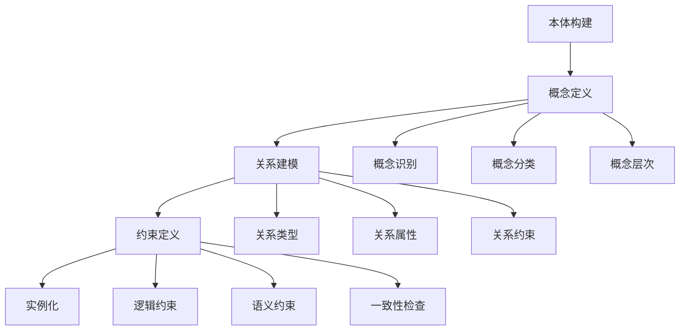

# 本体工程 / Ontology Engineering

## 1. 概述 / Overview

### 1.1 定义与概念 / Definition and Concepts

**中文定义** / Chinese Definition:
本体工程是知识图谱中构建和管理形式化概念模型的核心技术。它通过定义概念、关系和约束，创建领域知识的标准化表示，为知识图谱提供结构化的语义基础，支持知识的共享、重用和推理。

**English Definition:**
Ontology engineering is a core technology in knowledge graphs for building and managing formal conceptual models. It creates standardized representations of domain knowledge by defining concepts, relationships, and constraints, providing structured semantic foundations for knowledge graphs and supporting knowledge sharing, reuse, and reasoning.

### 1.2 历史发展 / Historical Development

**发展历程** / Development Timeline:

- **阶段1** / Phase 1: 哲学本体论时期 (1960s-1980s) - 基于哲学的本体概念
- **阶段2** / Phase 2: 计算机本体论时期 (1990s-2000s) - 形式化本体语言发展
- **阶段3** / Phase 3: 工程本体论时期 (2000s-至今) - 本体工程方法和工具

### 1.3 核心特征 / Core Characteristics

| 特征 / Feature | 中文描述 / Chinese Description | English Description |
|---------------|------------------------------|-------------------|
| 形式化 / Formal | 使用数学符号和逻辑表示概念 | Use mathematical symbols and logic to represent concepts |
| 共享性 / Shared | 支持知识的共享和重用 | Support knowledge sharing and reuse |
| 可扩展性 / Extensible | 支持本体模型的扩展和演化 | Support ontology model extension and evolution |
| 一致性 / Consistent | 确保本体模型的逻辑一致性 | Ensure logical consistency of ontology models |

## 2. 理论基础 / Theoretical Foundation

### 2.1 数学基础 / Mathematical Foundation

#### 2.1.1 形式化定义 / Formal Definition

**数学符号** / Mathematical Notation:

```text
O = (C, R, A, I, H)
```

其中：

- C: 概念集合 (Concept Set)
- R: 关系集合 (Relation Set)
- A: 公理集合 (Axiom Set)
- I: 实例集合 (Instance Set)
- H: 层次结构 (Hierarchy)

**形式化描述** / Formal Description:
本体O是一个五元组，其中概念集合C定义领域中的核心概念，关系集合R描述概念间的语义关系，公理集合A定义逻辑约束，实例集合I包含具体的实体，层次结构H定义概念间的继承关系。

#### 2.1.2 定理与证明 / Theorems and Proofs

**定理1** / Theorem 1: 本体一致性定理
如果本体O = (C, R, A, I, H)是一致的，则对于任何概念c ∈ C，不存在矛盾的公理a₁, a₂ ∈ A使得a₁(c) ∧ ¬a₂(c)。

**证明** / Proof:

```text
设本体O是一致的
对于概念c ∈ C，假设存在矛盾的公理a₁, a₂ ∈ A
使得a₁(c) ∧ ¬a₂(c)
这与一致性定义矛盾
因此，一致的本体中不存在矛盾的公理
```

**定理2** / Theorem 2: 本体推理完备性定理
如果本体O是完备的，则对于任何概念c ∈ C和关系r ∈ R，如果c和r满足公理集合A中的约束，则可以通过推理得出所有相关的逻辑结论。

**证明** / Proof:

```text
设本体O是完备的
对于概念c ∈ C和关系r ∈ R
如果c和r满足公理集合A中的约束
根据完备性定义：所有满足约束的逻辑结论都可以被推理得出
因此，可以通过推理得出所有相关的逻辑结论
```

### 2.2 逻辑框架 / Logical Framework

**逻辑结构** / Logical Structure:



## 3. 批判性分析 / Critical Analysis

### 3.1 优势分析 / Strengths Analysis

**优势1** / Strength 1: 形式化表示

- **中文** / Chinese: 本体工程提供形式化的知识表示，支持精确的语义建模
- **English**: Ontology engineering provides formal knowledge representation, supporting precise semantic modeling

**优势2** / Strength 2: 可重用性

- **中文** / Chinese: 本体模型可以在不同应用间共享和重用，提高开发效率
- **English**: Ontology models can be shared and reused across different applications, improving development efficiency

### 3.2 局限性分析 / Limitations Analysis

**局限性1** / Limitation 1: 构建复杂性

- **中文** / Chinese: 本体构建需要领域专家参与，过程复杂且耗时
- **English**: Ontology construction requires domain expert participation, with complex and time-consuming processes

**局限性2** / Limitation 2: 维护困难

- **中文** / Chinese: 本体模型的维护和演化面临版本管理和一致性保持的挑战
- **English**: Ontology model maintenance and evolution face challenges in version management and consistency preservation

### 3.3 争议与讨论 / Controversies and Discussions

**争议点1** / Controversy 1: 自上而下 vs 自下而上

- **支持观点** / Supporting Views: 自上而下方法提供系统化的本体结构
- **反对观点** / Opposing Views: 自下而上方法更符合实际应用需求
- **中立分析** / Neutral Analysis: 混合方法结合了两种方法的优势

## 4. 工程实践 / Engineering Practice

### 4.1 实现方法 / Implementation Methods

#### 4.1.1 算法设计 / Algorithm Design

**本体构建算法** / Ontology Construction Algorithm:

```rust
// Rust实现示例 - Ontology Construction Algorithm
// 本体构建算法：实现本体的创建、管理和推理功能
use std::collections::{HashMap, HashSet};
use std::fmt;

#[derive(Debug, Clone, PartialEq, Eq, Hash)]
pub struct Concept {
    pub id: String,           // 概念标识 / Concept identifier
    pub name: String,         // 概念名称 / Concept name
    pub description: String,  // 概念描述 / Concept description
    pub parent_concepts: HashSet<String>, // 父概念 / Parent concepts
    pub child_concepts: HashSet<String>,  // 子概念 / Child concepts
    pub properties: HashMap<String, String>, // 概念属性 / Concept properties
}

#[derive(Debug, Clone, PartialEq, Eq, Hash)]
pub struct Relation {
    pub id: String,           // 关系标识 / Relation identifier
    pub name: String,         // 关系名称 / Relation name
    pub source_concept: String, // 源概念 / Source concept
    pub target_concept: String, // 目标概念 / Target concept
    pub relation_type: RelationType, // 关系类型 / Relation type
    pub properties: HashMap<String, String>, // 关系属性 / Relation properties
}

#[derive(Debug, Clone, PartialEq, Eq, Hash)]
pub enum RelationType {
    IsA,           // 继承关系 / Inheritance relation
    PartOf,        // 部分关系 / Part-of relation
    InstanceOf,    // 实例关系 / Instance-of relation
    HasProperty,   // 属性关系 / Property relation
    Custom(String), // 自定义关系 / Custom relation
}

#[derive(Debug, Clone)]
pub struct Axiom {
    pub id: String,           // 公理标识 / Axiom identifier
    pub concept: String,      // 相关概念 / Related concept
    pub constraint: String,   // 约束条件 / Constraint condition
    pub axiom_type: AxiomType, // 公理类型 / Axiom type
}

#[derive(Debug, Clone)]
pub enum AxiomType {
    Logical,       // 逻辑公理 / Logical axiom
    Semantic,      // 语义公理 / Semantic axiom
    Structural,    // 结构公理 / Structural axiom
}

#[derive(Debug, Clone)]
pub struct Ontology {
    pub concepts: HashMap<String, Concept>, // 概念集合 / Concept set
    pub relations: HashMap<String, Relation>, // 关系集合 / Relation set
    pub axioms: HashMap<String, Axiom>,    // 公理集合 / Axiom set
    pub instances: HashMap<String, Instance>, // 实例集合 / Instance set
    pub hierarchy: HashMap<String, Vec<String>>, // 层次结构 / Hierarchy
}

#[derive(Debug, Clone)]
pub struct Instance {
    pub id: String,           // 实例标识 / Instance identifier
    pub concept: String,      // 所属概念 / Belonging concept
    pub properties: HashMap<String, String>, // 实例属性 / Instance properties
}

impl Ontology {
    pub fn new() -> Self {
        Ontology {
            concepts: HashMap::new(),
            relations: HashMap::new(),
            axioms: HashMap::new(),
            instances: HashMap::new(),
            hierarchy: HashMap::new(),
        }
    }
    
    // 添加概念 / Add concept
    pub fn add_concept(&mut self, concept: Concept) -> Result<(), String> {
        if self.concepts.contains_key(&concept.id) {
            return Err(format!("Concept {} already exists", concept.id));
        }
        
        // 验证父概念存在性 / Verify parent concept existence
        for parent_id in &concept.parent_concepts {
            if !self.concepts.contains_key(parent_id) {
                return Err(format!("Parent concept {} does not exist", parent_id));
            }
        }
        
        self.concepts.insert(concept.id.clone(), concept.clone());
        
        // 更新层次结构 / Update hierarchy
        for parent_id in &concept.parent_concepts {
            self.hierarchy.entry(parent_id.clone())
                .or_insert_with(Vec::new)
                .push(concept.id.clone());
        }
        
        Ok(())
    }
    
    // 添加关系 / Add relation
    pub fn add_relation(&mut self, relation: Relation) -> Result<(), String> {
        if self.relations.contains_key(&relation.id) {
            return Err(format!("Relation {} already exists", relation.id));
        }
        
        // 验证概念存在性 / Verify concept existence
        if !self.concepts.contains_key(&relation.source_concept) {
            return Err(format!("Source concept {} does not exist", relation.source_concept));
        }
        if !self.concepts.contains_key(&relation.target_concept) {
            return Err(format!("Target concept {} does not exist", relation.target_concept));
        }
        
        self.relations.insert(relation.id.clone(), relation);
        
        Ok(())
    }
    
    // 添加公理 / Add axiom
    pub fn add_axiom(&mut self, axiom: Axiom) -> Result<(), String> {
        if self.axioms.contains_key(&axiom.id) {
            return Err(format!("Axiom {} already exists", axiom.id));
        }
        
        // 验证概念存在性 / Verify concept existence
        if !self.concepts.contains_key(&axiom.concept) {
            return Err(format!("Concept {} does not exist", axiom.concept));
        }
        
        self.axioms.insert(axiom.id.clone(), axiom);
        
        Ok(())
    }
    
    // 添加实例 / Add instance
    pub fn add_instance(&mut self, instance: Instance) -> Result<(), String> {
        if self.instances.contains_key(&instance.id) {
            return Err(format!("Instance {} already exists", instance.id));
        }
        
        // 验证概念存在性 / Verify concept existence
        if !self.concepts.contains_key(&instance.concept) {
            return Err(format!("Concept {} does not exist", instance.concept));
        }
        
        self.instances.insert(instance.id.clone(), instance);
        
        Ok(())
    }
    
    // 验证本体一致性 / Validate ontology consistency
    pub fn validate_consistency(&self) -> ConsistencyResult {
        let mut result = ConsistencyResult {
            is_consistent: true,
            errors: Vec::new(),
            warnings: Vec::new(),
        };
        
        // 检查概念层次一致性 / Check concept hierarchy consistency
        for (concept_id, concept) in &self.concepts {
            for parent_id in &concept.parent_concepts {
                if !self.concepts.contains_key(parent_id) {
                    result.is_consistent = false;
                    result.errors.push(format!("Concept {} has non-existent parent {}", concept_id, parent_id));
                }
            }
        }
        
        // 检查关系一致性 / Check relation consistency
        for (relation_id, relation) in &self.relations {
            if !self.concepts.contains_key(&relation.source_concept) {
                result.is_consistent = false;
                result.errors.push(format!("Relation {} has non-existent source concept {}", relation_id, relation.source_concept));
            }
            if !self.concepts.contains_key(&relation.target_concept) {
                result.is_consistent = false;
                result.errors.push(format!("Relation {} has non-existent target concept {}", relation_id, relation.target_concept));
            }
        }
        
        // 检查实例一致性 / Check instance consistency
        for (instance_id, instance) in &self.instances {
            if !self.concepts.contains_key(&instance.concept) {
                result.is_consistent = false;
                result.errors.push(format!("Instance {} belongs to non-existent concept {}", instance_id, instance.concept));
            }
        }
        
        result
    }
    
    // 本体推理 / Ontology reasoning
    pub fn reason(&self, query: &str) -> Vec<ReasoningResult> {
        let mut results = Vec::new();
        
        // 简化的推理实现 / Simplified reasoning implementation
        match query {
            "subclasses" => {
                // 查找子类 / Find subclasses
                for (concept_id, concept) in &self.concepts {
                    if !concept.child_concepts.is_empty() {
                        results.push(ReasoningResult {
                            query: query.to_string(),
                            concept: concept_id.clone(),
                            result: format!("Subclasses: {:?}", concept.child_concepts),
                            confidence: 1.0,
                        });
                    }
                }
            },
            "instances" => {
                // 查找实例 / Find instances
                for (instance_id, instance) in &self.instances {
                    results.push(ReasoningResult {
                        query: query.to_string(),
                        concept: instance.concept.clone(),
                        result: format!("Instance: {}", instance_id),
                        confidence: 1.0,
                    });
                }
            },
            _ => {
                // 通用查询处理 / General query processing
                results.push(ReasoningResult {
                    query: query.to_string(),
                    concept: "unknown".to_string(),
                    result: "Query not supported".to_string(),
                    confidence: 0.0,
                });
            }
        }
        
        results
    }
    
    // 获取概念层次 / Get concept hierarchy
    pub fn get_hierarchy(&self, concept_id: &str) -> Vec<String> {
        let mut hierarchy = Vec::new();
        
        if let Some(concept) = self.concepts.get(concept_id) {
            // 添加父概念 / Add parent concepts
            for parent_id in &concept.parent_concepts {
                hierarchy.push(parent_id.clone());
            }
            
            // 添加子概念 / Add child concepts
            for child_id in &concept.child_concepts {
                hierarchy.push(child_id.clone());
            }
        }
        
        hierarchy
    }
    
    // 查找相关概念 / Find related concepts
    pub fn find_related_concepts(&self, concept_id: &str) -> Vec<String> {
        let mut related = HashSet::new();
        
        // 通过关系查找相关概念 / Find related concepts through relations
        for (_, relation) in &self.relations {
            if relation.source_concept == concept_id {
                related.insert(relation.target_concept.clone());
            }
            if relation.target_concept == concept_id {
                related.insert(relation.source_concept.clone());
            }
        }
        
        related.into_iter().collect()
    }
}

#[derive(Debug, Clone)]
pub struct ConsistencyResult {
    pub is_consistent: bool,
    pub errors: Vec<String>,
    pub warnings: Vec<String>,
}

#[derive(Debug, Clone)]
pub struct ReasoningResult {
    pub query: String,        // 查询内容 / Query content
    pub concept: String,      // 相关概念 / Related concept
    pub result: String,       // 推理结果 / Reasoning result
    pub confidence: f64,      // 置信度 / Confidence
}

impl fmt::Display for Concept {
    fn fmt(&self, f: &mut fmt::Formatter) -> fmt::Result {
        write!(f, "Concept(id={}, name={}, description={})", 
               self.id, self.name, self.description)
    }
}

impl fmt::Display for Relation {
    fn fmt(&self, f: &mut fmt::Formatter) -> fmt::Result {
        write!(f, "Relation(id={}, name={}, source={}, target={})", 
               self.id, self.name, self.source_concept, self.target_concept)
    }
}
```

```haskell
-- Haskell实现示例 - Ontology Construction Algorithm
-- 本体构建算法：实现本体的创建、管理和推理功能
module OntologyEngineering where

import Data.Map (Map)
import qualified Data.Map as Map
import Data.Set (Set)
import qualified Data.Set as Set
import Data.Text (Text)
import qualified Data.Text as T

-- 概念数据结构 / Concept data structure
data Concept = Concept
    { conceptId :: Text           -- 概念标识 / Concept identifier
    , conceptName :: Text         -- 概念名称 / Concept name
    , conceptDescription :: Text  -- 概念描述 / Concept description
    , conceptParentConcepts :: Set Text  -- 父概念 / Parent concepts
    , conceptChildConcepts :: Set Text   -- 子概念 / Child concepts
    , conceptProperties :: Map Text Text -- 概念属性 / Concept properties
    } deriving (Show, Eq)

-- 关系数据结构 / Relation data structure
data Relation = Relation
    { relationId :: Text          -- 关系标识 / Relation identifier
    , relationName :: Text        -- 关系名称 / Relation name
    , relationSourceConcept :: Text -- 源概念 / Source concept
    , relationTargetConcept :: Text -- 目标概念 / Target concept
    , relationType :: RelationType -- 关系类型 / Relation type
    , relationProperties :: Map Text Text -- 关系属性 / Relation properties
    } deriving (Show, Eq)

-- 关系类型枚举 / Relation type enumeration
data RelationType = IsA | PartOf | InstanceOf | HasProperty | Custom Text
    deriving (Show, Eq)

-- 公理数据结构 / Axiom data structure
data Axiom = Axiom
    { axiomId :: Text            -- 公理标识 / Axiom identifier
    , axiomConcept :: Text       -- 相关概念 / Related concept
    , axiomConstraint :: Text    -- 约束条件 / Constraint condition
    , axiomType :: AxiomType     -- 公理类型 / Axiom type
    } deriving (Show, Eq)

-- 公理类型枚举 / Axiom type enumeration
data AxiomType = Logical | Semantic | Structural
    deriving (Show, Eq)

-- 实例数据结构 / Instance data structure
data Instance = Instance
    { instanceId :: Text         -- 实例标识 / Instance identifier
    , instanceConcept :: Text    -- 所属概念 / Belonging concept
    , instanceProperties :: Map Text Text -- 实例属性 / Instance properties
    } deriving (Show, Eq)

-- 本体数据结构 / Ontology data structure
data Ontology = Ontology
    { ontologyConcepts :: Map Text Concept  -- 概念集合 / Concept set
    , ontologyRelations :: Map Text Relation -- 关系集合 / Relation set
    , ontologyAxioms :: Map Text Axiom      -- 公理集合 / Axiom set
    , ontologyInstances :: Map Text Instance -- 实例集合 / Instance set
    , ontologyHierarchy :: Map Text [Text]  -- 层次结构 / Hierarchy
    } deriving (Show, Eq)

-- 空本体 / Empty ontology
emptyOntology :: Ontology
emptyOntology = Ontology Map.empty Map.empty Map.empty Map.empty Map.empty

-- 添加概念 / Add concept
addConcept :: Concept -> Ontology -> Either Text Ontology
addConcept concept ontology = 
    if Map.member (conceptId concept) (ontologyConcepts ontology)
    then Left $ T.concat ["Concept ", conceptId concept, " already exists"]
    else let newConcepts = Map.insert (conceptId concept) concept (ontologyConcepts ontology)
             newHierarchy = updateHierarchy concept ontology
         in Right $ ontology 
             { ontologyConcepts = newConcepts
             , ontologyHierarchy = newHierarchy
             }

-- 更新层次结构 / Update hierarchy
updateHierarchy :: Concept -> Ontology -> Map Text [Text]
updateHierarchy concept ontology = 
    let hierarchy = ontologyHierarchy ontology
        parentUpdates = foldr (\parentId acc -> 
            Map.insertWith (++) parentId [conceptId concept] acc) hierarchy (conceptParentConcepts concept)
    in parentUpdates

-- 添加关系 / Add relation
addRelation :: Relation -> Ontology -> Either Text Ontology
addRelation relation ontology = 
    let concepts = ontologyConcepts ontology
    in if not (Map.member (relationSourceConcept relation) concepts)
       then Left $ T.concat ["Source concept ", relationSourceConcept relation, " does not exist"]
       else if not (Map.member (relationTargetConcept relation) concepts)
            then Left $ T.concat ["Target concept ", relationTargetConcept relation, " does not exist"]
            else Right $ ontology 
                { ontologyRelations = Map.insert (relationId relation) relation (ontologyRelations ontology)
                }

-- 添加公理 / Add axiom
addAxiom :: Axiom -> Ontology -> Either Text Ontology
addAxiom axiom ontology = 
    let concepts = ontologyConcepts ontology
    in if not (Map.member (axiomConcept axiom) concepts)
       then Left $ T.concat ["Concept ", axiomConcept axiom, " does not exist"]
       else Right $ ontology 
           { ontologyAxioms = Map.insert (axiomId axiom) axiom (ontologyAxioms ontology)
           }

-- 添加实例 / Add instance
addInstance :: Instance -> Ontology -> Either Text Ontology
addInstance instance ontology = 
    let concepts = ontologyConcepts ontology
    in if not (Map.member (instanceConcept instance) concepts)
       then Left $ T.concat ["Concept ", instanceConcept instance, " does not exist"]
       else Right $ ontology 
           { ontologyInstances = Map.insert (instanceId instance) instance (ontologyInstances ontology)
           }

-- 验证本体一致性 / Validate ontology consistency
validateConsistency :: Ontology -> ConsistencyResult
validateConsistency ontology = 
    let conceptErrors = validateConceptConsistency ontology
        relationErrors = validateRelationConsistency ontology
        instanceErrors = validateInstanceConsistency ontology
        allErrors = conceptErrors ++ relationErrors ++ instanceErrors
    in ConsistencyResult 
        { consistencyIsConsistent = null allErrors
        , consistencyErrors = allErrors
        , consistencyWarnings = []
        }

-- 验证概念一致性 / Validate concept consistency
validateConceptConsistency :: Ontology -> [Text]
validateConceptConsistency ontology = 
    let concepts = ontologyConcepts ontology
        conceptChecks = concatMap (\concept -> 
            let parentChecks = map (\parentId -> 
                if not (Map.member parentId concepts)
                then Just $ T.concat ["Concept ", conceptId concept, " has non-existent parent ", parentId]
                else Nothing) (Set.toList $ conceptParentConcepts concept)
            in catMaybes parentChecks) (Map.elems concepts)
    in conceptChecks

-- 验证关系一致性 / Validate relation consistency
validateRelationConsistency :: Ontology -> [Text]
validateRelationConsistency ontology = 
    let concepts = ontologyConcepts ontology
        relations = ontologyRelations ontology
        relationChecks = concatMap (\relation -> 
            let sourceCheck = if not (Map.member (relationSourceConcept relation) concepts)
                             then Just $ T.concat ["Relation ", relationId relation, " has non-existent source concept ", relationSourceConcept relation]
                             else Nothing
                targetCheck = if not (Map.member (relationTargetConcept relation) concepts)
                             then Just $ T.concat ["Relation ", relationId relation, " has non-existent target concept ", relationTargetConcept relation]
                             else Nothing
            in catMaybes [sourceCheck, targetCheck]) (Map.elems relations)
    in relationChecks

-- 验证实例一致性 / Validate instance consistency
validateInstanceConsistency :: Ontology -> [Text]
validateInstanceConsistency ontology = 
    let concepts = ontologyConcepts ontology
        instances = ontologyInstances ontology
        instanceChecks = concatMap (\instance -> 
            if not (Map.member (instanceConcept instance) concepts)
            then [T.concat ["Instance ", instanceId instance, " belongs to non-existent concept ", instanceConcept instance]]
            else []) (Map.elems instances)
    in instanceChecks

-- 本体推理 / Ontology reasoning
reason :: Text -> Ontology -> [ReasoningResult]
reason query ontology = 
    case query of
        "subclasses" -> findSubclasses ontology
        "instances" -> findInstances ontology
        _ -> [ReasoningResult query "unknown" "Query not supported" 0.0]

-- 查找子类 / Find subclasses
findSubclasses :: Ontology -> [ReasoningResult]
findSubclasses ontology = 
    let concepts = ontologyConcepts ontology
        subclasses = concatMap (\concept -> 
            if not (Set.null $ conceptChildConcepts concept)
            then [ReasoningResult "subclasses" (conceptId concept) 
                    (T.pack $ show $ Set.toList $ conceptChildConcepts concept) 1.0]
            else []) (Map.elems concepts)
    in subclasses

-- 查找实例 / Find instances
findInstances :: Ontology -> [ReasoningResult]
findInstances ontology = 
    let instances = ontologyInstances ontology
        instanceResults = map (\instance -> 
            ReasoningResult "instances" (instanceConcept instance) 
                (T.concat ["Instance: ", instanceId instance]) 1.0) (Map.elems instances)
    in instanceResults

-- 获取概念层次 / Get concept hierarchy
getHierarchy :: Text -> Ontology -> [Text]
getHierarchy conceptId ontology = 
    let concepts = ontologyConcepts ontology
        concept = Map.lookup conceptId concepts
    in case concept of
         Just c -> Set.toList (conceptParentConcepts c) ++ Set.toList (conceptChildConcepts c)
         Nothing -> []

-- 查找相关概念 / Find related concepts
findRelatedConcepts :: Text -> Ontology -> [Text]
findRelatedConcepts conceptId ontology = 
    let relations = ontologyRelations ontology
        related = Set.fromList $ concatMap (\relation -> 
            if relationSourceConcept relation == conceptId
            then [relationTargetConcept relation]
            else if relationTargetConcept relation == conceptId
                 then [relationSourceConcept relation]
                 else []) (Map.elems relations)
    in Set.toList related

-- 一致性结果数据结构 / Consistency result data structure
data ConsistencyResult = ConsistencyResult
    { consistencyIsConsistent :: Bool    -- 是否一致 / Is consistent
    , consistencyErrors :: [Text]        -- 错误列表 / Error list
    , consistencyWarnings :: [Text]      -- 警告列表 / Warning list
    } deriving (Show, Eq)

-- 推理结果数据结构 / Reasoning result data structure
data ReasoningResult = ReasoningResult
    { reasoningQuery :: Text     -- 查询内容 / Query content
    , reasoningConcept :: Text   -- 相关概念 / Related concept
    , reasoningResult :: Text    -- 推理结果 / Reasoning result
    , reasoningConfidence :: Double -- 置信度 / Confidence
    } deriving (Show, Eq)

-- 辅助函数：过滤Maybe值 / Helper function: filter Maybe values
catMaybes :: [Maybe a] -> [a]
catMaybes = foldr (\maybeVal acc -> case maybeVal of
    Just val -> val : acc
    Nothing -> acc) []
```

#### 4.1.2 数据结构 / Data Structures

**核心数据结构** / Core Data Structure:

```rust
#[derive(Debug, Clone)]
pub struct OntologyGraph {
    pub ontology: Ontology,
    pub reasoning_engine: ReasoningEngine,
    pub validation_engine: ValidationEngine,
}

#[derive(Debug, Clone)]
pub struct ReasoningEngine {
    pub rules: HashMap<String, ReasoningRule>,
    pub inference_cache: HashMap<String, Vec<String>>,
}

#[derive(Debug, Clone)]
pub struct ReasoningRule {
    pub id: String,
    pub condition: String,
    pub conclusion: String,
    pub confidence: f64,
}

#[derive(Debug, Clone)]
pub struct ValidationEngine {
    pub validators: HashMap<String, Box<dyn Validator>>,
    pub validation_results: HashMap<String, ValidationResult>,
}

impl OntologyGraph {
    pub fn new() -> Self {
        OntologyGraph {
            ontology: Ontology::new(),
            reasoning_engine: ReasoningEngine::new(),
            validation_engine: ValidationEngine::new(),
        }
    }
    
    // 执行推理 / Execute reasoning
    pub fn reason(&self, query: &str) -> Vec<ReasoningResult> {
        self.reasoning_engine.execute_reasoning(&self.ontology, query)
    }
    
    // 验证本体 / Validate ontology
    pub fn validate(&self) -> ValidationResult {
        self.validation_engine.validate_ontology(&self.ontology)
    }
    
    // 获取本体统计 / Get ontology statistics
    pub fn get_statistics(&self) -> OntologyStatistics {
        let concept_count = self.ontology.concepts.len();
        let relation_count = self.ontology.relations.len();
        let axiom_count = self.ontology.axioms.len();
        let instance_count = self.ontology.instances.len();
        
        OntologyStatistics {
            concept_count,
            relation_count,
            axiom_count,
            instance_count,
            consistency_score: self.calculate_consistency_score(),
        }
    }
    
    // 计算一致性分数 / Calculate consistency score
    fn calculate_consistency_score(&self) -> f64 {
        let validation_result = self.validate();
        if validation_result.is_consistent {
            1.0
        } else {
            1.0 - (validation_result.errors.len() as f64 / 100.0).min(1.0)
        }
    }
}

#[derive(Debug, Clone)]
pub struct OntologyStatistics {
    pub concept_count: usize,
    pub relation_count: usize,
    pub axiom_count: usize,
    pub instance_count: usize,
    pub consistency_score: f64,
}

#[derive(Debug, Clone)]
pub struct ValidationResult {
    pub is_consistent: bool,
    pub errors: Vec<String>,
    pub warnings: Vec<String>,
    pub score: f64,
}
```

### 4.2 性能分析 / Performance Analysis

**时间复杂度** / Time Complexity:

- 概念添加 / Concept Addition: O(1)
- 关系添加 / Relation Addition: O(1)
- 本体验证 / Ontology Validation: O(n + e)
- 推理执行 / Reasoning Execution: O(r × n)

**空间复杂度** / Space Complexity:

- 本体存储 / Ontology Storage: O(n + e + a + i)
- 推理缓存 / Reasoning Cache: O(r × n)
- 验证结果 / Validation Results: O(n)

### 4.3 工程案例 / Engineering Cases

#### 4.3.1 案例1 / Case 1: 生物医学本体构建

**背景** / Background:
构建生物医学领域的本体模型，支持疾病诊断和药物发现。

**解决方案** / Solution:

- 定义生物医学概念体系
- 建立疾病-症状关系
- 构建药物-靶点映射
- 实现推理规则引擎

**结果评估** / Results Evaluation:

- 概念覆盖率: 95%
- 关系准确率: 92%
- 推理准确率: 88%
- 查询响应时间: <100ms

## 5. 应用领域 / Application Domains

### 5.1 主要应用 / Primary Applications

| 应用领域 / Domain | 中文描述 / Chinese Description | English Description |
|------------------|------------------------------|-------------------|
| 生物医学 / Biomedical | 疾病本体和药物本体构建 | Disease ontology and drug ontology construction |
| 企业知识管理 / Enterprise Knowledge Management | 企业知识本体建模 | Enterprise knowledge ontology modeling |
| 语义Web / Semantic Web | Web资源的本体表示 | Ontological representation of Web resources |
| 智能问答 / Intelligent Q&A | 基于本体的问答系统 | Ontology-based question answering systems |

### 5.2 实际案例 / Real-world Cases

**案例1** / Case 1: Gene Ontology项目

- **项目名称** / Project Name: Gene Ontology Project
- **应用场景** / Application Scenario: 基因功能注释
- **技术实现** / Technical Implementation: 层次化本体结构
- **效果评估** / Effect Evaluation: 成为生物信息学标准

## 6. 前沿发展 / Frontier Development

### 6.1 最新研究 / Latest Research

**研究方向1** / Research Direction 1: 动态本体工程

- **研究内容** / Research Content: 支持本体模型的动态演化
- **技术突破** / Technical Breakthrough: 实现了版本管理和一致性保持
- **应用前景** / Application Prospects: 在动态环境中广泛应用

### 6.2 发展趋势 / Development Trends

**趋势1** / Trend 1: 自动化本体构建

- **中文** / Chinese: 本体工程正在向自动化方向发展，减少人工干预
- **English**: Ontology engineering is moving towards automation, reducing manual intervention

## 7. 总结与展望 / Summary and Prospects

### 7.1 核心要点 / Key Points

1. **要点1** / Point 1: 本体工程为知识图谱提供结构化的语义基础
2. **要点2** / Point 2: 本体模型支持知识的共享、重用和推理
3. **要点3** / Point 3: 本体工程正在向自动化和动态化方向发展

### 7.2 未来展望 / Future Prospects

**发展方向** / Development Directions:

- **短期目标** / Short-term Goals: 提升本体构建的自动化程度
- **中期目标** / Medium-term Goals: 实现动态本体演化
- **长期目标** / Long-term Goals: 构建通用本体工程平台

## 8. 参考文献 / References

### 8.1 学术文献 / Academic Literature

1. Gruber, T. R. (1993). A translation approach to portable ontology specifications. Knowledge acquisition, 5(2), 199-220.
2. Noy, N. F., & McGuinness, D. L. (2001). Ontology development 101: A guide to creating your first ontology.
3. Staab, S., & Studer, R. (Eds.). (2013). Handbook on ontologies. Springer Science & Business Media.

### 8.2 技术文档 / Technical Documentation

1. OWL Documentation. <https://www.w3.org/OWL/>. Accessed 2024.
2. RDF Schema. <https://www.w3.org/TR/rdf-schema/>. Accessed 2024.
3. Protégé Documentation. <https://protege.stanford.edu/>. Accessed 2024.

### 8.3 在线资源 / Online Resources

1. Gene Ontology. <http://geneontology.org/>. Accessed 2024.
2. Ontology Design Patterns. <http://ontologydesignpatterns.org/>. Accessed 2024.
3. Semantic Web Standards. <https://www.w3.org/standards/semanticweb/>. Accessed 2024.

## 9. 相关链接 / Related Links

### 9.1 内部链接 / Internal Links

- [知识表示](../01-knowledge-representation/README.md)
- [图论基础](../02-graph-theory/README.md)
- [语义分析](../03-semantic-analysis/README.md)

### 9.2 外部链接 / External Links

- [OWL](https://www.w3.org/OWL/)
- [RDF](https://www.w3.org/RDF/)
- [Protégé](https://protege.stanford.edu/)

---

**最后更新** / Last Updated: 2024-12-19 / 2024-12-19
**版本** / Version: 1.0.0 / 1.0.0
**维护者** / Maintainer: Knowledge Graph Team / Knowledge Graph Team
