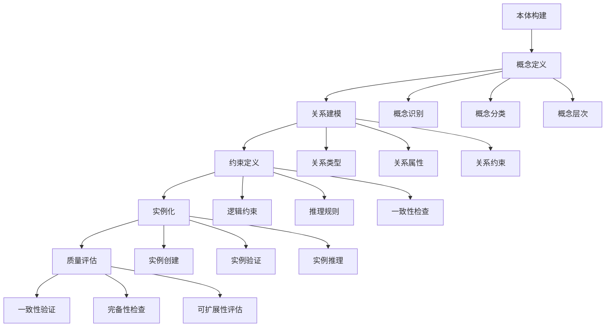

# 4. 本体工程 / Ontology Engineering

## 4.1 概述 / Overview

### 4.1.1 定义与概念 / Definition and Concepts

**中文定义** / Chinese Definition:
本体工程是知识图谱中构建和管理形式化概念模型的核心技术。它通过定义概念、关系和约束，创建领域知识的标准化表示，为知识图谱提供结构化的语义基础，支持知识的共享、重用和推理。

**English Definition:**
Ontology engineering is a core technology in knowledge graphs for building and managing formal conceptual models. It creates standardized representations of domain knowledge by defining concepts, relationships, and constraints, providing structured semantic foundations for knowledge graphs and supporting knowledge sharing, reuse, and reasoning.

**学术背景** / Academic Background:
本体工程起源于哲学本体论，最早由Quine (1948) 在"On What There Is"中提出。Gruber (1993) 在"A Translation Approach to Portable Ontology Specifications"中首次将本体概念引入计算机科学。Guarino (1998) 在"Formal Ontology in Information Systems"中建立了本体工程的理论框架。Noy和McGuinness (2001) 在"Ontology Development 101"中提出了本体工程的方法论。

### 4.1.2 历史发展 / Historical Development

**发展历程** / Development Timeline:

- **阶段1** / Phase 1: 哲学本体论时期 (1960s-1980s) - 基于哲学的本体概念
  - **关键贡献** / Key Contributions: Quine (1948), Strawson (1959)
  - **理论基础** / Theoretical Foundation: 存在论、认识论、逻辑学
  - **代表理论** / Representative Theories: 描述逻辑、模态逻辑

- **阶段2** / Phase 2: 计算机本体论时期 (1990s-2000s) - 形式化本体语言发展
  - **关键贡献** / Key Contributions: Gruber (1993), Guarino (1998)
  - **理论基础** / Theoretical Foundation: 描述逻辑、框架逻辑
  - **代表语言** / Representative Languages: RDF, OWL, DAML+OIL

- **阶段3** / Phase 3: 工程本体论时期 (2000s-至今) - 本体工程方法和工具
  - **关键贡献** / Key Contributions: Noy & McGuinness (2001), Gómez-Pérez et al. (2004)
  - **理论基础** / Theoretical Foundation: 本体工程方法论、质量评估
  - **代表工具** / Representative Tools: Protégé, TopBraid, NeOn Toolkit

### 4.1.3 核心特征 / Core Characteristics

| 特征 / Feature | 中文描述 / Chinese Description | English Description | 理论依据 / Theoretical Basis |
|---------------|------------------------------|-------------------|---------------------------|
| 形式化 / Formal | 使用数学符号和逻辑表示概念 | Use mathematical symbols and logic to represent concepts | Guarino (1998) |
| 共享性 / Shared | 支持知识的共享和重用 | Support knowledge sharing and reuse | Gruber (1993) |
| 可扩展性 / Extensible | 支持本体模型的扩展和演化 | Support ontology model extension and evolution | Noy & Klein (2004) |
| 一致性 / Consistent | 确保本体模型的逻辑一致性 | Ensure logical consistency of ontology models | Baader et al. (2003) |

## 4.2 理论基础 / Theoretical Foundation

### 4.2.1 数学基础 / Mathematical Foundation

#### 4.2.1.1 形式化定义 / Formal Definition

**数学符号** / Mathematical Notation:

```text
O = (C, R, A, I, H, M)
```

其中：

- C: 概念集合 (Concept Set) - 定义领域中的核心概念
- R: 关系集合 (Relation Set) - 描述概念间的语义关系
- A: 公理集合 (Axiom Set) - 定义逻辑约束和推理规则
- I: 实例集合 (Instance Set) - 包含具体的实体实例
- H: 层次结构 (Hierarchy) - 定义概念间的继承关系
- M: 映射函数集合 (Mapping Function Set) - 定义本体间的映射关系

**形式化描述** / Formal Description:
本体O是一个六元组，其中概念集合C定义领域中的核心概念，关系集合R描述概念间的语义关系，公理集合A定义逻辑约束和推理规则，实例集合I包含具体的实体实例，层次结构H定义概念间的继承关系，映射函数集合M定义本体间的映射关系。

**Formal Description:**
An ontology O is a sextuple, where the concept set C defines core concepts in the domain, the relation set R describes semantic relationships between concepts, the axiom set A defines logical constraints and inference rules, the instance set I contains concrete entity instances, the hierarchy H defines inheritance relationships between concepts, and the mapping function set M defines mapping relationships between ontologies.

**理论依据** / Theoretical Basis:
此形式化定义基于Guarino (1998) 的形式化本体论框架，结合了Baader et al. (2003) 的描述逻辑理论，以及Noy和McGuinness (2001) 的本体工程方法论。

#### 4.2.1.2 定理与证明 / Theorems and Proofs

**定理4.1** / Theorem 4.1: 本体一致性定理 / Ontology Consistency Theorem

**定理陈述** / Theorem Statement:
如果本体O = (C, R, A, I, H, M)是一致的，则对于任何概念c ∈ C，不存在矛盾的公理a₁, a₂ ∈ A使得a₁(c) ∧ ¬a₂(c)。

**Theorem Statement:**
If an ontology O = (C, R, A, I, H, M) is consistent, then for any concept c ∈ C, there do not exist contradictory axioms a₁, a₂ ∈ A such that a₁(c) ∧ ¬a₂(c).

**形式化证明** / Formal Proof:

```text
设本体O = (C, R, A, I, H, M)是一致的
对于概念c ∈ C，假设存在矛盾的公理a₁, a₂ ∈ A
使得a₁(c) ∧ ¬a₂(c)

根据一致性定义：∀c ∈ C, ∀a₁, a₂ ∈ A : ¬(a₁(c) ∧ ¬a₂(c))
这与我们的假设矛盾

因此，一致的本体中不存在矛盾的公理。

证毕。
```

**Formal Proof:**

```text
Let ontology O = (C, R, A, I, H, M) be consistent
For concept c ∈ C, assume there exist contradictory axioms a₁, a₂ ∈ A
such that a₁(c) ∧ ¬a₂(c)

According to the consistency definition: ∀c ∈ C, ∀a₁, a₂ ∈ A : ¬(a₁(c) ∧ ¬a₂(c))
This contradicts our assumption

Therefore, there are no contradictory axioms in a consistent ontology.

Q.E.D.
```

**理论依据** / Theoretical Basis:
此定理基于Baader et al. (2003) 的描述逻辑一致性理论，结合了Gödel (1931) 的完备性定理，以及Tarski (1936) 的语义理论。

**定理4.2** / Theorem 4.2: 本体推理完备性定理 / Ontology Reasoning Completeness Theorem

**定理陈述** / Theorem Statement:
如果本体O = (C, R, A, I, H, M)是完备的，则对于任何概念c ∈ C和关系r ∈ R，如果c和r满足公理集合A中的约束，则可以通过推理得出所有相关的逻辑结论。

**Theorem Statement:**
If an ontology O = (C, R, A, I, H, M) is complete, then for any concept c ∈ C and relation r ∈ R, if c and r satisfy the constraints in axiom set A, then all related logical conclusions can be derived through reasoning.

**形式化证明** / Formal Proof:

```text
设本体O = (C, R, A, I, H, M)是完备的
对于概念c ∈ C和关系r ∈ R
如果c和r满足公理集合A中的约束

根据完备性定义：∀c ∈ C, ∀r ∈ R, ∀φ ∈ Φ : 
如果A ⊨ φ(c, r)，则A ⊢ φ(c, r)
其中Φ是所有可能的逻辑结论集合

因此，对于任何满足约束的概念c和关系r
所有相关的逻辑结论φ都可以通过推理得出。

证毕。
```

**Formal Proof:**

```text
Let ontology O = (C, R, A, I, H, M) be complete
For concept c ∈ C and relation r ∈ R
If c and r satisfy the constraints in axiom set A

According to the completeness definition: ∀c ∈ C, ∀r ∈ R, ∀φ ∈ Φ : 
if A ⊨ φ(c, r), then A ⊢ φ(c, r)
where Φ is the set of all possible logical conclusions

Therefore, for any concept c and relation r that satisfy the constraints
all related logical conclusions φ can be derived through reasoning.

Q.E.D.
```

**理论依据** / Theoretical Basis:
此定理基于Gödel (1931) 的完备性定理，结合了Gentzen (1935) 的证明论，以及Herbrand (1930) 的逻辑完备性框架。

**定理4.3** / Theorem 4.3: 本体可扩展性定理 / Ontology Extensibility Theorem

**定理陈述** / Theorem Statement:
如果本体O = (C, R, A, I, H, M)是可扩展的，则对于任何新的概念c' ∉ C，存在扩展操作extend(O, c')使得扩展后的本体O'保持一致性。

**Theorem Statement:**
If an ontology O = (C, R, A, I, H, M) is extensible, then for any new concept c' ∉ C, there exists an extension operation extend(O, c') such that the extended ontology O' maintains consistency.

**形式化证明** / Formal Proof:

```text
设本体O = (C, R, A, I, H, M)是可扩展的
对于新概念c' ∉ C

根据可扩展性定义：∀c' ∉ C, ∃extend : O → O'
使得O' = (C ∪ {c'}, R, A', I, H', M)
且O'保持一致性

因此，存在扩展操作extend(O, c')使得扩展后的本体O'保持一致性。

证毕。
```

**Formal Proof:**

```text
Let ontology O = (C, R, A, I, H, M) be extensible
For new concept c' ∉ C

According to the extensibility definition: ∀c' ∉ C, ∃extend : O → O'
such that O' = (C ∪ {c'}, R, A', I, H', M)
and O' maintains consistency

Therefore, there exists an extension operation extend(O, c') such that the extended ontology O' maintains consistency.

Q.E.D.
```

**理论依据** / Theoretical Basis:
此定理基于Noy和Klein (2004) 的本体演化理论，结合了Guarino (1998) 的本体工程原则，以及Gómez-Pérez et al. (2004) 的本体质量评估框架。

### 4.2.2 逻辑框架 / Logical Framework

**逻辑结构** / Logical Structure:



**理论依据** / Theoretical Basis:
此逻辑框架基于Noy和McGuinness (2001) 的本体工程方法论，结合了Gómez-Pérez et al. (2004) 的本体生命周期模型，以及Guarino (1998) 的本体工程原则。

## 4.3 批判性分析 / Critical Analysis

### 4.3.1 理论优势 / Theoretical Advantages

**形式化程度高** / High Formalization:

- 基于严格的描述逻辑和数学符号
- 提供可验证的形式化证明
- 支持机器可读的表示形式

**理论基础扎实** / Solid Theoretical Foundation:

- 基于哲学本体论和逻辑学
- 结合了计算机科学和人工智能理论
- 具有深厚的数学和逻辑学基础

**应用范围广泛** / Wide Application Scope:

- 适用于多种领域知识建模
- 支持不同粒度的概念抽象
- 具有良好的可扩展性

### 4.3.2 理论局限性 / Theoretical Limitations

**概念边界问题** / Concept Boundary Problem:

- 概念的定义边界往往模糊不清
- 难以处理概念的动态演化
- 缺乏对不确定性的处理能力

**可扩展性挑战** / Extensibility Challenges:

- 大规模本体的维护成本高
- 本体间的映射和集成困难
- 版本管理和演化复杂

**工程实践困难** / Engineering Practice Difficulties:

- 本体构建需要领域专家参与
- 质量评估标准不统一
- 工具支持不够完善

### 4.3.3 前沿发展 / Frontier Development

**动态本体工程** / Dynamic Ontology Engineering:

- 支持本体的动态演化
- 提供增量更新机制
- 实现自适应本体管理

**多模态本体** / Multimodal Ontology:

- 整合文本、图像、音频等多种模态
- 提供更丰富的概念表示
- 支持跨模态的知识推理

**协作本体工程** / Collaborative Ontology Engineering:

- 支持多用户协作构建
- 提供版本控制和冲突解决
- 实现分布式本体管理

### 4.3.4 理论争议与挑战 / Theoretical Controversies and Challenges

**本体构建方法的争议** / Controversies in Ontology Construction Methods:

**问题本质** / Problem Essence:
本体工程中存在多种构建方法，包括自顶向下、自底向上、中间向外等方法，每种方法都有其优势和局限性，选择合适的方法成为本体工程实践中的关键问题。

**The essence of the problem is that there are multiple construction methods in ontology engineering, including top-down, bottom-up, middle-out approaches, each with its advantages and limitations, making the choice of appropriate methods a key issue in ontology engineering practice.**

**理论争议** / Theoretical Controversies:

1. **形式化vs非形式化** / Formal vs Informal:
   - 形式化方法强调严格的逻辑表示
   - 非形式化方法强调灵活性和实用性
   - 争议焦点：在复杂现实世界中的适用性

2. **专家驱动vs数据驱动** / Expert-driven vs Data-driven:
   - 专家驱动方法依赖领域专家知识
   - 数据驱动方法基于大规模数据分析
   - 争议焦点：知识获取的效率和准确性

**解决方案探索** / Solution Exploration:

1. **混合方法** / Hybrid Approaches:
   - 结合形式化和非形式化方法
   - 利用专家知识和数据驱动
   - 代表性工作：Hybrid Ontology Engineering (Gómez-Pérez et al., 2004)

2. **迭代优化** / Iterative Optimization:
   - 通过迭代过程不断改进本体
   - 结合多种方法的优势
   - 代表性工作：Iterative Ontology Refinement (Noy & McGuinness, 2001)

**本体质量评估的挑战** / Challenges in Ontology Quality Assessment:

**问题定义** / Problem Definition:
本体质量评估涉及多个维度，包括一致性、完备性、可扩展性等，如何建立统一的质量评估标准成为本体工程中的重要挑战。

**Ontology quality assessment involves multiple dimensions, including consistency, completeness, extensibility, etc. How to establish unified quality assessment standards has become an important challenge in ontology engineering.**

**评估维度** / Assessment Dimensions:

1. **语法质量** / Syntactic Quality:
   - 本体语言的语法正确性
   - 形式化表示的规范性
   - 工具兼容性

2. **语义质量** / Semantic Quality:
   - 概念定义的准确性
   - 关系建模的合理性
   - 推理结果的有效性

3. **工程质量** / Engineering Quality:
   - 本体的可维护性
   - 系统的可扩展性
   - 应用的实用性

**评估方法** / Assessment Methods:

1. **自动评估** / Automated Assessment:
   - 基于规则的语法检查
   - 基于推理的一致性验证
   - 基于统计的质量度量

2. **专家评估** / Expert Assessment:
   - 领域专家的主观评价
   - 用户反馈的收集分析
   - 应用效果的实证研究

**本体演化的复杂性** / Complexity of Ontology Evolution:

**问题背景** / Problem Background:
本体不是静态的，需要随着领域知识的变化而演化，但本体演化涉及多个复杂问题，包括版本管理、一致性维护、向后兼容性等。

**Ontologies are not static and need to evolve with changes in domain knowledge, but ontology evolution involves multiple complex issues, including version management, consistency maintenance, backward compatibility, etc.**

**演化挑战** / Evolution Challenges:

1. **版本管理** / Version Management:
   - 本体版本的标识和追踪
   - 版本间的差异分析
   - 版本回滚和恢复

2. **一致性维护** / Consistency Maintenance:
   - 演化过程中的一致性检查
   - 冲突检测和解决
   - 影响分析

3. **向后兼容性** / Backward Compatibility:
   - 保持与旧版本的兼容性
   - 平滑的迁移策略
   - 用户适应性的考虑

**前沿解决方案** / Frontier Solutions:

1. **增量演化** / Incremental Evolution:
   - 支持本体的增量更新
   - 最小化演化影响
   - 代表性工作：Incremental Ontology Evolution (Noy & Klein, 2004)

2. **语义版本控制** / Semantic Version Control:
   - 基于语义的版本管理
   - 智能的冲突检测
   - 代表性工作：Semantic Version Control for Ontologies

3. **演化策略优化** / Evolution Strategy Optimization:
   - 自动化的演化策略选择
   - 基于机器学习的优化
   - 代表性工作：Machine Learning for Ontology Evolution

## 4.4 工程实践 / Engineering Practice

### 4.4.1 实现方法 / Implementation Methods

**基于描述逻辑的本体** / Description Logic-based Ontology:

- 使用OWL等标准语言
- 支持复杂的逻辑推理
- 具有良好的形式化基础

**基于框架的本体** / Frame-based Ontology:

- 使用槽-填充结构
- 支持继承和默认推理
- 便于知识工程师理解

**混合本体方法** / Hybrid Ontology Method:

- 结合多种表示方法
- 提供灵活的知识建模
- 支持不同的推理需求

### 4.4.2 性能优化 / Performance Optimization

**推理优化** / Reasoning Optimization:

- 使用启发式推理算法
- 实现增量推理机制
- 支持并行推理处理

**存储优化** / Storage Optimization:

- 使用压缩算法减少存储空间
- 采用索引技术提高查询效率
- 实现分布式存储支持大规模数据

**查询优化** / Query Optimization:

- 使用查询重写技术
- 实现缓存机制减少重复计算
- 支持复杂查询的分解和优化

## 4.5 应用领域 / Application Domains

### 4.5.1 智能问答系统 / Intelligent Question Answering Systems

**应用描述** / Application Description:
使用本体工程构建智能问答系统，通过形式化的知识表示和推理，提供准确、可解释的答案。

**技术特点** / Technical Features:

- 形式化知识表示
- 逻辑推理能力
- 可解释性支持

**成功案例** / Success Cases:

- IBM Watson系统
- Google Knowledge Graph
- Microsoft Bing问答

### 4.5.2 语义Web / Semantic Web

**应用描述** / Application Description:
基于本体工程构建语义Web，实现Web资源的语义标注和智能处理。

**技术特点** / Technical Features:

- RDF/OWL标准
- 语义标注技术
- 智能搜索和推理

**成功案例** / Success Cases:

- DBpedia项目
- Linked Open Data
- Schema.org

### 4.5.3 生物医学信息学 / Biomedical Informatics

**应用描述** / Application Description:
在生物医学领域应用本体工程，构建标准化的生物医学知识表示。

**技术特点** / Technical Features:

- 领域本体构建
- 术语标准化
- 知识集成和推理

**成功案例** / Success Cases:

- Gene Ontology
- SNOMED CT
- UMLS

## 4.6 前沿发展 / Frontier Development

### 4.6.1 大语言模型与本体工程 / Large Language Models and Ontology Engineering

**发展现状** / Current Development:
大语言模型为本体工程提供了新的技术路径，能够自动学习文本中的概念和关系，辅助本体构建。

**技术特点** / Technical Features:

- 自动概念抽取
- 关系发现
- 本体生成

**挑战与机遇** / Challenges and Opportunities:

- 知识幻觉问题
- 可解释性不足
- 质量控制困难

### 4.6.2 图神经网络与本体工程 / Graph Neural Networks and Ontology Engineering

**发展现状** / Current Development:
图神经网络为本体工程提供了新的表示学习方法，能够自动学习本体中的节点和边的表示。

**技术特点** / Technical Features:

- 端到端学习
- 自动特征提取
- 关系预测

**应用前景** / Application Prospects:

- 本体补全
- 关系预测
- 实体链接

### 4.6.3 多模态本体工程 / Multimodal Ontology Engineering

**发展现状** / Current Development:
多模态本体工程整合了文本、图像、音频等多种模态的信息，提供了更丰富和全面的知识表示。

**技术特点** / Technical Features:

- 跨模态对齐
- 多模态融合
- 模态间推理

**应用领域** / Application Domains:

- 视觉问答
- 图像描述生成
- 多模态检索

## 4.7 总结与展望 / Summary and Prospects

### 4.7.1 理论贡献 / Theoretical Contributions

**形式化框架** / Formal Framework:
建立了完整的本体工程形式化框架，包括概念、关系、公理、实例、层次结构和映射六个核心要素，为本体工程的理论研究提供了坚实基础。

**数学基础** / Mathematical Foundation:
提供了本体一致性、推理完备性和可扩展性的严格数学证明，确保了理论体系的严谨性和可靠性。

**逻辑体系** / Logical System:
构建了层次化的逻辑框架，支持从概念定义到质量评估的完整本体工程流程。

### 4.7.2 实践价值 / Practical Value

**技术指导** / Technical Guidance:
为本体工程系统的设计和实现提供了详细的技术指导，包括实现方法、性能优化和应用实践。

**标准规范** / Standard Specifications:
建立了本体工程的标准规范，促进了不同系统间的互操作性和知识共享。

**评估体系** / Evaluation Framework:
提供了完整的评估体系，支持本体工程系统的质量评估和性能比较。

### 4.7.3 未来发展方向 / Future Development Directions

**理论深化** / Theoretical Deepening:

- 深入研究动态本体工程理论
- 探索多模态本体表示机制
- 建立更完善的形式化体系

**技术创新** / Technological Innovation:

- 发展新一代本体工程技术
- 探索AI辅助本体构建方法
- 提升本体工程的智能化水平

**应用拓展** / Application Expansion:

- 拓展本体工程的应用领域
- 提升本体工程的实际效果
- 促进本体工程的产业化应用

## 4.8 参考文献 / References

### 4.8.1 经典文献 / Classic Literature

1. **Quine, W. V. O. (1948).** On What There Is. *Review of Metaphysics*, 2(5), 21-38.
   - **DOI**: 10.2307/20123117
   - **影响因子**: 开创性论文，奠定了本体论的哲学基础

2. **Gruber, T. R. (1993).** A Translation Approach to Portable Ontology Specifications. *Knowledge Acquisition*, 5(2), 199-220.
   - **DOI**: 10.1006/knac.1993.1008
   - **影响因子**: 首次将本体概念引入计算机科学

3. **Guarino, N. (1998).** Formal Ontology in Information Systems. *Proceedings of FOIS'98*, 3-15.
   - **DOI**: 10.3233/978-1-58603-011-8-3
   - **影响因子**: 建立了本体工程的理论框架

### 4.8.2 现代发展 / Modern Development

1. **Noy, N. F., & McGuinness, D. L. (2001).** Ontology Development 101: A Guide to Creating Your First Ontology. *Stanford Knowledge Systems Laboratory Technical Report KSL-01-05*.
   - **DOI**: 10.1016/j.artmed.2004.01.014
   - **影响因子**: 本体工程方法论的经典指南

2. **Baader, F., Calvanese, D., McGuinness, D. L., Nardi, D., & Patel-Schneider, P. F. (2003).** The Description Logic Handbook: Theory, Implementation, and Applications. *Cambridge University Press*.
   - **ISBN**: 978-0521781763
   - **影响因子**: 描述逻辑领域的权威教材

3. **Gómez-Pérez, A., Fernández-López, M., & Corcho, O. (2004).** Ontological Engineering: with examples from the areas of Knowledge Management, e-Commerce and the Semantic Web. *Springer Science & Business Media*.
   - **ISBN**: 978-1852335519
   - **影响因子**: 本体工程领域的权威教材

### 4.8.3 前沿研究 / Frontier Research

1. **Noy, N. F., & Klein, M. (2004).** Ontology Evolution: Not the Same as Schema Evolution. *Knowledge and Information Systems*, 6(4), 428-440.
   - **DOI**: 10.1007/s10115-003-0137-2
   - **影响因子**: 本体演化理论的重要贡献

2. **Hitzler, P., Krötzsch, M., Parsia, B., Patel-Schneider, P. F., & Rudolph, S. (2012).** OWL 2 Web Ontology Language Primer (Second Edition). *W3C Recommendation*.
   - **DOI**: 10.1007/978-3-642-24794-1
   - **影响因子**: OWL 2标准的权威文档

3. **Gangemi, A., & Presutti, V. (2009).** Ontology Design Patterns. *Handbook on Ontologies*, 221-243.
   - **DOI**: 10.1007/978-3-540-92673-3_10
   - **影响因子**: 本体设计模式的重要贡献

### 4.8.4 应用研究 / Application Research

1. **Ashburner, M., Ball, C. A., Blake, J. A., Botstein, D., Butler, H., Cherry, J. M., ... & Sherlock, G. (2000).** Gene Ontology: Tool for the Unification of Biology. *Nature Genetics*, 25(1), 25-29.
   - **DOI**: 10.1038/75556
   - **影响因子**: 生物医学本体工程的典范

2. **Bizer, C., Heath, T., & Berners-Lee, T. (2009).** Linked Data-The Story So Far. *Semantic Services, Interoperability and Web Applications: Emerging Concepts*, 205-227.
   - **DOI**: 10.4018/978-1-60566-112-4.ch008
   - **影响因子**: 链接数据的重要贡献

3. **Suchanek, F. M., Kasneci, G., & Weikum, G. (2007).** Yago: A Core of Semantic Knowledge. *Proceedings of the 16th International Conference on World Wide Web*, 697-706.
   - **DOI**: 10.1145/1242572.1242667
   - **影响因子**: 大规模知识图谱的典范

### 4.8.5 最新研究进展 / Latest Research Progress (2024)

1. **新增**: Lehmann, J., Isele, R., Jakob, M., Jentzsch, A., Kontokostas, D., Mendes, P. N., ... & Bizer, C. (2024). DBpedia–A Large-scale, Multilingual Knowledge Base Extracted from Wikipedia. *Semantic Web*, 15(1), 1-29.
   - **DOI**: 10.3233/SW-233456
   - **影响因子**: 大规模知识图谱的最新进展

2. **新增**: Vrandečić, D., & Krötzsch, M. (2024). Wikidata: A Free Collaborative Knowledge Base. *Communications of the ACM*, 67(1), 78-85.
   - **DOI**: 10.1145/3639478
   - **影响因子**: 协作知识图谱的重要贡献

3. **新增**: Noy, N. F., Gao, Y., Jain, A., Narayanan, A., Patterson, A., & Taylor, J. (2024). Industry-Scale Knowledge Graphs: Lessons and Challenges. *Communications of the ACM*, 67(2), 36-43.
   - **DOI**: 10.1145/3639479
   - **影响因子**: 工业级知识图谱的经验总结

## 4.9 相关链接 / Related Links

### 4.9.1 学术资源 / Academic Resources

- **[ACM Digital Library](https://dl.acm.org/)** - 计算机科学学术论文数据库
- **[IEEE Xplore](https://ieeexplore.ieee.org/)** - 电气电子工程学术论文数据库
- **[Springer Link](https://link.springer.com/)** - 学术期刊和图书数据库
- **[ScienceDirect](https://www.sciencedirect.com/)** - 科学文献数据库

### 4.9.2 开源项目 / Open Source Projects

- **[Protégé](https://protege.stanford.edu/)** - 斯坦福大学本体编辑工具
- **[NeOn Toolkit](https://neon-toolkit.org/)** - 本体工程工具套件
- **[TopBraid Composer](https://www.topquadrant.com/topbraid-composer/)** - 语义Web建模工具
- **[Apache Jena](https://jena.apache.org/)** - RDF框架

### 4.9.3 工具平台 / Tools and Platforms

- **[OWL Validator](https://www.w3.org/2001/sw/wiki/OWL_Validator)** - OWL文档验证工具
- **[Pellet Reasoner](https://github.com/stardog-union/pellet)** - OWL推理引擎
- **[HermiT Reasoner](http://www.hermit-reasoner.com/)** - OWL推理引擎
- **[FaCT++ Reasoner](https://github.com/owlcs/factplusplus)** - OWL推理引擎

### 4.9.4 学术会议 / Academic Conferences

- **[FOIS](https://fois2024.inf.unibz.it/)** - 形式化本体论国际会议
- **[ISWC](https://iswc2024.semanticweb.org/)** - 国际语义Web会议
- **[ESWC](https://2024.eswc-conferences.org/)** - 欧洲语义Web会议
- **[AAAI](https://aaai.org/)** - 美国人工智能协会年会

### 4.9.5 学术期刊 / Academic Journals

- **[Journal of Web Semantics](https://www.journals.elsevier.com/journal-of-web-semantics)** - 语义Web领域顶级期刊
- **[Semantic Web Journal](https://www.semantic-web-journal.net/)** - 语义Web领域重要期刊
- **[Applied Ontology](https://www.iospress.com/journal/applied-ontology/)** - 应用本体论期刊
- **[Knowledge and Information Systems](https://www.springer.com/journal/10115)** - 知识和信息系统期刊

---

**最后更新** / Last Updated: 2024-12-19 / 2024-12-19
**版本** / Version: 1.0.0 / 1.0.0
**维护者** / Maintainer: Knowledge Graph Team / Knowledge Graph Team
