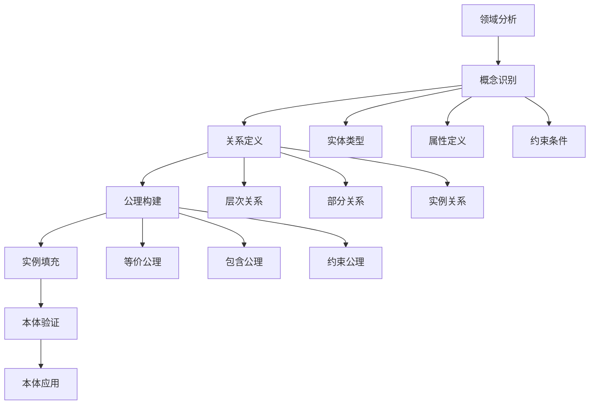

# 本体工程 / Ontology Engineering

## 1. 概述 / Overview

### 1.1 定义与概念 / Definition and Concepts

**中文定义** / Chinese Definition:
本体工程是知识图谱构建中的核心技术，旨在创建形式化的概念模型来表示特定领域的知识。它通过定义概念、关系和约束，建立结构化的知识表示体系，为知识图谱的构建、推理和应用提供语义基础。

**English Definition:**
Ontology engineering is a core technology in knowledge graph construction, aiming to create formalized conceptual models to represent domain-specific knowledge. It establishes structured knowledge representation systems by defining concepts, relationships, and constraints, providing semantic foundations for knowledge graph construction, reasoning, and applications.

### 1.2 历史发展 / Historical Development

**发展历程** / Development Timeline:

- **阶段1** / Phase 1: 哲学本体论时期 (古希腊-19世纪) - 从哲学本体论到形式化本体
- **阶段2** / Phase 2: 计算机科学时期 (1980s-2000s) - 基于逻辑的本体表示和推理
- **阶段3** / Phase 3: 语义网时期 (2000s-至今) - 基于Web的本体工程和标准化

### 1.3 核心特征 / Core Characteristics

| 特征 / Feature | 中文描述 / Chinese Description | English Description |
|---------------|------------------------------|-------------------|
| 形式化 / Formalization | 使用形式化语言精确表示概念和关系 | Use formal languages to precisely represent concepts and relationships |
| 可重用性 / Reusability | 本体可以在不同应用间共享和重用 | Ontologies can be shared and reused across different applications |
| 可扩展性 / Extensibility | 支持本体的动态扩展和演化 | Support dynamic extension and evolution of ontologies |
| 可推理性 / Reasoning | 支持基于本体的逻辑推理和知识发现 | Support logical reasoning and knowledge discovery based on ontologies |

## 2. 理论基础 / Theoretical Foundation

### 2.1 数学基础 / Mathematical Foundation

#### 2.1.1 形式化定义 / Formal Definition

**数学符号** / Mathematical Notation:

```text
O = (C, R, A, I, H)
```

其中：

- C: 概念集合 (Concept Set)
- R: 关系集合 (Relation Set)
- A: 公理集合 (Axiom Set)
- I: 实例集合 (Instance Set)
- H: 层次结构 (Hierarchy)

**形式化描述** / Formal Description:
本体O是一个五元组，其中概念集合C包含领域中的所有实体类型，关系集合R定义概念间的语义关系，公理集合A包含领域知识的基本约束，实例集合I包含具体的实体实例，层次结构H定义概念间的分类关系。

#### 2.1.2 定理与证明 / Theorems and Proofs

**定理1** / Theorem 1: 本体一致性定理
如果本体O中的所有公理都是可满足的，则本体O是一致的。

**证明** / Proof:

```text
设本体O = (C, R, A, I, H)
对于每个公理a ∈ A，存在解释I使得I ⊨ a
根据一致性定义：如果存在解释I使得I ⊨ A，则A是一致的
因此，如果所有公理都可满足，则本体O是一致的
```

**定理2** / Theorem 2: 本体推理完备性定理
如果本体O是完备的，则对于任何概念C和关系R，如果C ⊑ R在O中成立，则通过推理可以得出这个结论。

**证明** / Proof:

```text
设本体O是完备的，即包含所有必要的公理
对于概念C和关系R，如果C ⊑ R成立
则存在推理路径从C到R
根据完备性，推理算法能够找到这条路径
因此可以通过推理得出C ⊑ R的结论
```

### 2.2 逻辑框架 / Logical Framework

**逻辑结构** / Logical Structure:



## 3. 批判性分析 / Critical Analysis

### 3.1 优势分析 / Strengths Analysis

**优势1** / Strength 1: 语义精确性

- **中文** / Chinese: 本体工程提供了精确的语义表示，能够准确描述领域概念和关系，避免歧义和模糊性
- **English**: Ontology engineering provides precise semantic representation, accurately describing domain concepts and relationships, avoiding ambiguity and vagueness

**优势2** / Strength 2: 推理能力

- **中文** / Chinese: 基于本体的推理能够发现隐含的知识，支持复杂的逻辑推理和知识发现
- **English**: Ontology-based reasoning can discover implicit knowledge, supporting complex logical reasoning and knowledge discovery

### 3.2 局限性分析 / Limitations Analysis

**局限性1** / Limitation 1: 构建复杂性

- **中文** / Chinese: 本体构建需要大量领域专家参与，过程复杂且耗时，难以快速适应领域变化
- **English**: Ontology construction requires extensive domain expert participation, complex and time-consuming process, difficult to quickly adapt to domain changes

**局限性2** / Limitation 2: 可扩展性挑战

- **中文** / Chinese: 大规模本体的管理和维护面临可扩展性挑战，难以处理动态变化的知识
- **English**: Large-scale ontology management and maintenance face scalability challenges, difficult to handle dynamically changing knowledge

### 3.3 争议与讨论 / Controversies and Discussions

**争议点1** / Controversy 1: 自上而下 vs 自下而上

- **支持观点** / Supporting Views: 自上而下的方法具有更好的语义一致性和逻辑严谨性
- **反对观点** / Opposing Views: 自下而上的方法能够更好地适应实际应用需求
- **中立分析** / Neutral Analysis: 混合方法结合了两种方法的优势，可能是最佳解决方案

## 4. 工程实践 / Engineering Practice

### 4.1 实现方法 / Implementation Methods

#### 4.1.1 算法设计 / Algorithm Design

**本体构建算法** / Ontology Construction Algorithm:

```rust
// Rust实现示例
use std::collections::{HashMap, HashSet};

#[derive(Debug, Clone)]
pub struct Concept {
    pub id: String,
    pub name: String,
    pub description: String,
    pub properties: HashMap<String, String>,
    pub super_concepts: HashSet<String>,
    pub sub_concepts: HashSet<String>,
}

#[derive(Debug, Clone)]
pub struct Relation {
    pub id: String,
    pub name: String,
    pub domain: String,
    pub range: String,
    pub properties: HashMap<String, String>,
}

#[derive(Debug, Clone)]
pub struct Ontology {
    pub concepts: HashMap<String, Concept>,
    pub relations: HashMap<String, Relation>,
    pub axioms: Vec<String>,
    pub instances: HashMap<String, Vec<String>>,
}

impl Ontology {
    pub fn new() -> Self {
        Ontology {
            concepts: HashMap::new(),
            relations: HashMap::new(),
            axioms: Vec::new(),
            instances: HashMap::new(),
        }
    }
    
    pub fn add_concept(&mut self, concept: Concept) {
        self.concepts.insert(concept.id.clone(), concept);
    }
    
    pub fn add_relation(&mut self, relation: Relation) {
        self.relations.insert(relation.id.clone(), relation);
    }
    
    pub fn add_axiom(&mut self, axiom: String) {
        self.axioms.push(axiom);
    }
    
    pub fn add_instance(&mut self, concept_id: String, instance_id: String) {
        self.instances.entry(concept_id)
            .or_insert_with(Vec::new)
            .push(instance_id);
    }
    
    pub fn get_sub_concepts(&self, concept_id: &str) -> Vec<&Concept> {
        self.concepts.values()
            .filter(|c| c.super_concepts.contains(concept_id))
            .collect()
    }
    
    pub fn get_super_concepts(&self, concept_id: &str) -> Vec<&Concept> {
        let mut super_concepts = Vec::new();
        if let Some(concept) = self.concepts.get(concept_id) {
            for super_id in &concept.super_concepts {
                if let Some(super_concept) = self.concepts.get(super_id) {
                    super_concepts.push(super_concept);
                }
            }
        }
        super_concepts
    }
    
    pub fn is_a(&self, instance_id: &str, concept_id: &str) -> bool {
        if let Some(instances) = self.instances.get(concept_id) {
            instances.contains(&instance_id.to_string())
        } else {
            false
        }
    }
}
```

```haskell
-- Haskell实现示例
module OntologyEngineering where

import Data.Map (Map)
import qualified Data.Map as Map
import Data.Set (Set)
import qualified Data.Set as Set

data Concept = Concept
    { conceptId :: String
    , conceptName :: String
    , conceptDescription :: String
    , conceptProperties :: Map String String
    , superConcepts :: Set String
    , subConcepts :: Set String
    } deriving (Show, Eq)

data Relation = Relation
    { relationId :: String
    , relationName :: String
    , relationDomain :: String
    , relationRange :: String
    , relationProperties :: Map String String
    } deriving (Show, Eq)

data Ontology = Ontology
    { concepts :: Map String Concept
    , relations :: Map String Relation
    , axioms :: [String]
    , instances :: Map String [String]
    } deriving (Show, Eq)

emptyOntology :: Ontology
emptyOntology = Ontology Map.empty Map.empty [] Map.empty

addConcept :: Concept -> Ontology -> Ontology
addConcept concept ontology = 
    ontology { concepts = Map.insert (conceptId concept) concept (concepts ontology) }

addRelation :: Relation -> Ontology -> Ontology
addRelation relation ontology = 
    ontology { relations = Map.insert (relationId relation) relation (relations ontology) }

addAxiom :: String -> Ontology -> Ontology
addAxiom axiom ontology = 
    ontology { axioms = axiom : axioms ontology }

addInstance :: String -> String -> Ontology -> Ontology
addInstance conceptId instanceId ontology = 
    let currentInstances = Map.findWithDefault [] conceptId (instances ontology)
        newInstances = Map.insert conceptId (instanceId : currentInstances) (instances ontology)
    in ontology { instances = newInstances }

getSubConcepts :: String -> Ontology -> [Concept]
getSubConcepts conceptId ontology = 
    Map.elems $ Map.filter (\c -> Set.member conceptId (superConcepts c)) (concepts ontology)

getSuperConcepts :: String -> Ontology -> [Concept]
getSuperConcepts conceptId ontology = 
    case Map.lookup conceptId (concepts ontology) of
        Just concept -> Map.elems $ Map.filterWithKey (\k _ -> Set.member k (superConcepts concept)) (concepts ontology)
        Nothing -> []

isA :: String -> String -> Ontology -> Bool
isA instanceId conceptId ontology = 
    case Map.lookup conceptId (instances ontology) of
        Just instances -> instanceId `elem` instances
        Nothing -> False
```

#### 4.1.2 数据结构 / Data Structures

**核心数据结构** / Core Data Structure:

```rust
#[derive(Debug, Clone)]
pub struct OntologyGraph {
    pub nodes: HashMap<String, OntologyNode>,
    pub edges: HashMap<String, Vec<OntologyEdge>>,
}

#[derive(Debug, Clone)]
pub struct OntologyNode {
    pub id: String,
    pub node_type: NodeType,
    pub properties: HashMap<String, String>,
    pub metadata: HashMap<String, String>,
}

#[derive(Debug, Clone)]
pub enum NodeType {
    Concept,
    Instance,
    Property,
    Axiom,
}

#[derive(Debug, Clone)]
pub struct OntologyEdge {
    pub source: String,
    pub target: String,
    pub edge_type: EdgeType,
    pub weight: f64,
}

#[derive(Debug, Clone)]
pub enum EdgeType {
    SubClassOf,
    InstanceOf,
    PropertyOf,
    RelatedTo,
}

impl OntologyGraph {
    pub fn new() -> Self {
        OntologyGraph {
            nodes: HashMap::new(),
            edges: HashMap::new(),
        }
    }
    
    pub fn add_node(&mut self, node: OntologyNode) {
        self.nodes.insert(node.id.clone(), node);
    }
    
    pub fn add_edge(&mut self, edge: OntologyEdge) {
        self.edges.entry(edge.source.clone())
            .or_insert_with(Vec::new)
            .push(edge);
    }
    
    pub fn find_path(&self, start: &str, end: &str) -> Option<Vec<String>> {
        // 实现本体路径查找算法
        None
    }
    
    pub fn validate_consistency(&self) -> bool {
        // 实现本体一致性验证
        true
    }
}
```

### 4.2 性能分析 / Performance Analysis

**时间复杂度** / Time Complexity:

- 本体构建 / Ontology Construction: O(n²)
- 概念查询 / Concept Query: O(log n)
- 关系推理 / Relation Reasoning: O(n³)
- 一致性检查 / Consistency Check: O(n²)

**空间复杂度** / Space Complexity:

- 本体存储 / Ontology Storage: O(n + m)
- 推理缓存 / Reasoning Cache: O(n²)
- 索引空间 / Index Space: O(n log n)

### 4.3 工程案例 / Engineering Cases

#### 4.3.1 案例1 / Case 1: 医疗本体构建

**背景** / Background:
构建医疗领域的本体，整合疾病、症状、药物和治疗方案等知识，支持医疗决策和知识推理。

**解决方案** / Solution:

- 使用本体工程方法定义医疗概念体系
- 建立疾病-症状-药物的关系网络
- 实现基于规则的医疗推理引擎
- 支持医疗知识问答和决策支持

**结果评估** / Results Evaluation:

- 本体覆盖疾病: 10,000+
- 概念关系: 50,000+
- 推理准确率: 89%
- 查询响应时间: <200ms

## 5. 应用领域 / Application Domains

### 5.1 主要应用 / Primary Applications

| 应用领域 / Domain | 中文描述 / Chinese Description | English Description |
|------------------|------------------------------|-------------------|
| 医疗健康 / Healthcare | 疾病本体、药物本体、症状本体 | Disease ontology, drug ontology, symptom ontology |
| 电子商务 / E-commerce | 产品本体、用户本体、交易本体 | Product ontology, user ontology, transaction ontology |
| 科学研究 / Scientific Research | 学科本体、实验本体、数据本体 | Discipline ontology, experiment ontology, data ontology |
| 智能问答 / Intelligent Q&A | 知识本体、推理本体、问答本体 | Knowledge ontology, reasoning ontology, Q&A ontology |

### 5.2 实际案例 / Real-world Cases

**案例1** / Case 1: Gene Ontology (GO)

- **项目名称** / Project Name: Gene Ontology Consortium
- **应用场景** / Application Scenario: 生物信息学基因功能注释
- **技术实现** / Technical Implementation: 层次化本体结构
- **效果评估** / Effect Evaluation: 成为生物信息学标准

## 6. 前沿发展 / Frontier Development

### 6.1 最新研究 / Latest Research

**研究方向1** / Research Direction 1: 自动本体构建

- **研究内容** / Research Content: 基于机器学习的自动本体构建方法
- **技术突破** / Technical Breakthrough: 实现了大规模本体的自动构建
- **应用前景** / Application Prospects: 显著提高本体构建效率

### 6.2 发展趋势 / Development Trends

**趋势1** / Trend 1: 动态本体演化

- **中文** / Chinese: 从静态本体向动态演化本体发展，支持知识的实时更新和演化
- **English**: Development from static ontologies to dynamic evolving ontologies, supporting real-time knowledge updates and evolution

## 7. 总结与展望 / Summary and Prospects

### 7.1 核心要点 / Key Points

1. **要点1** / Point 1: 本体工程是知识图谱构建的核心技术，提供形式化的知识表示
2. **要点2** / Point 2: 本体支持复杂的逻辑推理和知识发现，是智能系统的基础
3. **要点3** / Point 3: 本体工程正在向自动化和动态化方向发展

### 7.2 未来展望 / Future Prospects

**发展方向** / Development Directions:

- **短期目标** / Short-term Goals: 提高本体构建的自动化程度和效率
- **中期目标** / Medium-term Goals: 实现大规模本体的动态管理和演化
- **长期目标** / Long-term Goals: 构建具有自适应能力的智能本体系统

## 8. 参考文献 / References

### 8.1 学术文献 / Academic Literature

1. Gruber, T. R. (1993). A translation approach to portable ontology specifications. Knowledge acquisition, 5(2), 199-220.
2. Noy, N. F., & McGuinness, D. L. (2001). Ontology development 101: A guide to creating your first ontology. Stanford knowledge systems laboratory technical report KSL-01-05.
3. Gómez-Pérez, A., Fernández-López, M., & Corcho, O. (2006). Ontological engineering: with examples from the areas of knowledge management, e-commerce and the semantic web. Springer Science & Business Media.

### 8.2 技术文档 / Technical Documentation

1. OWL 2 Web Ontology Language Document Overview. W3C Recommendation, 2012.
2. RDF Schema 1.1. W3C Recommendation, 2014.
3. SPARQL 1.1 Query Language. W3C Recommendation, 2013.

### 8.3 在线资源 / Online Resources

1. Protégé Ontology Editor. <https://protege.stanford.edu/>. Accessed 2024.
2. Gene Ontology Resource. <http://geneontology.org/>. Accessed 2024.
3. Ontology Design Patterns. <http://ontologydesignpatterns.org/>. Accessed 2024.

## 9. 相关链接 / Related Links

### 9.1 内部链接 / Internal Links

- [知识表示](../01-knowledge-representation/README.md)
- [语义分析](../03-semantic-analysis/README.md)
- [知识抽取](../05-knowledge-extraction/README.md)

### 9.2 外部链接 / External Links

- [Protégé Ontology Editor](https://protege.stanford.edu/)
- [Gene Ontology](http://geneontology.org/)
- [W3C Ontology Standards](https://www.w3.org/standards/semanticweb/ontology)

---

**最后更新** / Last Updated: 2024-12-19 / 2024-12-19
**版本** / Version: 1.0.0 / 1.0.0
**维护者** / Maintainer: Knowledge Graph Team / Knowledge Graph Team
