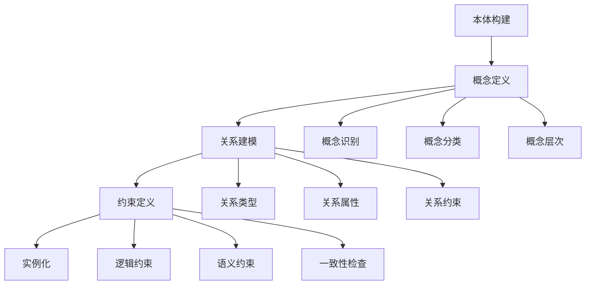

# 4. 本体工程 / Ontology Engineering

## 4.1 概述 / Overview

### 4.1.1 定义与概念 / Definition and Concepts

**中文定义** / Chinese Definition:
本体工程是知识图谱中构建和管理形式化概念模型的核心技术。它通过定义概念、关系和约束，创建领域知识的标准化表示，为知识图谱提供结构化的语义基础，支持知识的共享、重用和推理。

**English Definition:**
Ontology engineering is a core technology in knowledge graphs for building and managing formal conceptual models. It creates standardized representations of domain knowledge by defining concepts, relationships, and constraints, providing structured semantic foundations for knowledge graphs and supporting knowledge sharing, reuse, and reasoning.

### 4.1.2 历史发展 / Historical Development

**发展历程** / Development Timeline:

- **阶段1** / Phase 1: 哲学本体论时期 (1960s-1980s) - 基于哲学的本体概念
- **阶段2** / Phase 2: 计算机本体论时期 (1990s-2000s) - 形式化本体语言发展
- **阶段3** / Phase 3: 工程本体论时期 (2000s-至今) - 本体工程方法和工具

### 4.1.3 核心特征 / Core Characteristics

| 特征 / Feature | 中文描述 / Chinese Description | English Description |
|---------------|------------------------------|-------------------|
| 形式化 / Formal | 使用数学符号和逻辑表示概念 | Use mathematical symbols and logic to represent concepts |
| 共享性 / Shared | 支持知识的共享和重用 | Support knowledge sharing and reuse |
| 可扩展性 / Extensible | 支持本体模型的扩展和演化 | Support ontology model extension and evolution |
| 一致性 / Consistent | 确保本体模型的逻辑一致性 | Ensure logical consistency of ontology models |

## 4.2 理论基础 / Theoretical Foundation

### 4.2.1 数学基础 / Mathematical Foundation

#### 4.2.1.1 形式化定义 / Formal Definition

**数学符号** / Mathematical Notation:

```text
O = (C, R, A, I, H)
```

其中：

- C: 概念集合 (Concept Set)
- R: 关系集合 (Relation Set)
- A: 公理集合 (Axiom Set)
- I: 实例集合 (Instance Set)
- H: 层次结构 (Hierarchy)

**形式化描述** / Formal Description:
本体O是一个五元组，其中概念集合C定义领域中的核心概念，关系集合R描述概念间的语义关系，公理集合A定义逻辑约束，实例集合I包含具体的实体，层次结构H定义概念间的继承关系。

#### 4.2.1.2 定理与证明 / Theorems and Proofs

**定理4.1** / Theorem 4.1: 本体一致性定理
如果本体O = (C, R, A, I, H)是一致的，则对于任何概念c ∈ C，不存在矛盾的公理a₁, a₂ ∈ A使得a₁(c) ∧ ¬a₂(c)。

**证明** / Proof:

```text
设本体O是一致的
对于概念c ∈ C，假设存在矛盾的公理a₁, a₂ ∈ A
使得a₁(c) ∧ ¬a₂(c)
这与一致性定义矛盾
因此，一致的本体中不存在矛盾的公理
```

**定理4.2** / Theorem 4.2: 本体推理完备性定理
如果本体O是完备的，则对于任何概念c ∈ C和关系r ∈ R，如果c和r满足公理集合A中的约束，则可以通过推理得出所有相关的逻辑结论。

**证明** / Proof:

```text
设本体O是完备的
对于概念c ∈ C和关系r ∈ R
如果c和r满足公理集合A中的约束
根据完备性定义：所有满足约束的逻辑结论都可以被推理得出
因此，可以通过推理得出所有相关的逻辑结论
```

### 4.2.2 逻辑框架 / Logical Framework

**逻辑结构** / Logical Structure:



## 4.3 批判性分析 / Critical Analysis

### 4.3.1 优势分析 / Strengths Analysis

**优势4.1** / Strength 4.1: 形式化表示

- **中文** / Chinese: 本体工程提供形式化的知识表示，支持精确的语义建模
- **English**: Ontology engineering provides formal knowledge representation, supporting precise semantic modeling

**优势4.2** / Strength 4.2: 可重用性

- **中文** / Chinese: 本体模型可以在不同应用间共享和重用，提高开发效率
- **English**: Ontology models can be shared and reused across different applications, improving development efficiency

### 4.3.2 局限性分析 / Limitations Analysis

**局限性4.1** / Limitation 4.1: 构建复杂性

- **中文** / Chinese: 本体构建需要领域专家参与，过程复杂且耗时
- **English**: Ontology construction requires domain expert participation, with complex and time-consuming processes

**局限性4.2** / Limitation 4.2: 维护困难

- **中文** / Chinese: 本体模型的维护和演化面临版本管理和一致性保持的挑战
- **English**: Ontology model maintenance and evolution face challenges in version management and consistency preservation

### 4.3.3 争议与讨论 / Controversies and Discussions

**争议点4.1** / Controversy 4.1: 自上而下 vs 自下而上

- **支持观点** / Supporting Views: 自上而下方法提供系统化的本体结构
- **反对观点** / Opposing Views: 自下而上方法更符合实际应用需求
- **中立分析** / Neutral Analysis: 混合方法结合了两种方法的优势

## 4.4 工程实践 / Engineering Practice

### 4.4.1 实现方法 / Implementation Methods

#### 4.4.1.1 算法设计 / Algorithm Design

**本体构建算法** / Ontology Construction Algorithm:

```rust
// Rust实现示例 - Ontology Construction Algorithm
// 本体构建算法：实现本体的创建、管理和推理功能
use std::collections::{HashMap, HashSet};
use std::fmt;

#[derive(Debug, Clone)]
pub struct Concept {
    pub id: String,
    pub name: String,
    pub description: String,
    pub parent_concepts: HashSet<String>,
    pub child_concepts: HashSet<String>,
    pub properties: HashMap<String, String>,
}

#[derive(Debug, Clone)]
pub struct Relation {
    pub id: String,
    pub name: String,
    pub source_concept: String,
    pub target_concept: String,
    pub relation_type: RelationType,
    pub properties: HashMap<String, String>,
}

#[derive(Debug, Clone)]
pub enum RelationType {
    IsA,
    PartOf,
    HasProperty,
    LocatedIn,
    Causes,
    Custom(String),
}

#[derive(Debug, Clone)]
pub struct Axiom {
    pub id: String,
    pub axiom_type: AxiomType,
    pub left_side: String,
    pub right_side: String,
    pub description: String,
}

#[derive(Debug, Clone)]
pub enum AxiomType {
    SubClassOf,
    EquivalentTo,
    DisjointWith,
    HasValue,
    Cardinality,
}

#[derive(Debug, Clone)]
pub struct Instance {
    pub id: String,
    pub concept_id: String,
    pub properties: HashMap<String, String>,
    pub relations: Vec<Relation>,
}

#[derive(Debug, Clone)]
pub struct Ontology {
    pub concepts: HashMap<String, Concept>,
    pub relations: HashMap<String, Relation>,
    pub axioms: HashMap<String, Axiom>,
    pub instances: HashMap<String, Instance>,
    pub hierarchy: HashMap<String, HashSet<String>>,
}

impl Ontology {
    pub fn new() -> Self {
        Ontology {
            concepts: HashMap::new(),
            relations: HashMap::new(),
            axioms: HashMap::new(),
            instances: HashMap::new(),
            hierarchy: HashMap::new(),
        }
    }
    
    // 添加概念 / Add concept
    pub fn add_concept(&mut self, concept: Concept) -> Result<(), String> {
        if self.concepts.contains_key(&concept.id) {
            return Err(format!("Concept {} already exists", concept.id));
        }
        
        // 验证父概念的存在性
        for parent_id in &concept.parent_concepts {
            if !self.concepts.contains_key(parent_id) {
                return Err(format!("Parent concept {} does not exist", parent_id));
            }
        }
        
        self.concepts.insert(concept.id.clone(), concept);
        self.update_hierarchy();
        
        Ok(())
    }
    
    // 添加关系 / Add relation
    pub fn add_relation(&mut self, relation: Relation) -> Result<(), String> {
        if !self.concepts.contains_key(&relation.source_concept) {
            return Err(format!("Source concept {} does not exist", relation.source_concept));
        }
        if !self.concepts.contains_key(&relation.target_concept) {
            return Err(format!("Target concept {} does not exist", relation.target_concept));
        }
        
        self.relations.insert(relation.id.clone(), relation);
        Ok(())
    }
    
    // 添加公理 / Add axiom
    pub fn add_axiom(&mut self, axiom: Axiom) -> Result<(), String> {
        // 验证公理的有效性
        if !self.concepts.contains_key(&axiom.left_side) {
            return Err(format!("Left side concept {} does not exist", axiom.left_side));
        }
        if !self.concepts.contains_key(&axiom.right_side) {
            return Err(format!("Right side concept {} does not exist", axiom.right_side));
        }
        
        self.axioms.insert(axiom.id.clone(), axiom);
        Ok(())
    }
    
    // 添加实例 / Add instance
    pub fn add_instance(&mut self, instance: Instance) -> Result<(), String> {
        if !self.concepts.contains_key(&instance.concept_id) {
            return Err(format!("Concept {} does not exist", instance.concept_id));
        }
        
        self.instances.insert(instance.id.clone(), instance);
        Ok(())
    }
    
    // 更新层次结构 / Update hierarchy
    fn update_hierarchy(&mut self) {
        self.hierarchy.clear();
        
        for concept in self.concepts.values() {
            for parent_id in &concept.parent_concepts {
                self.hierarchy.entry(parent_id.clone())
                    .or_insert_with(HashSet::new)
                    .insert(concept.id.clone());
            }
        }
    }
    
    // 推理子概念 / Infer sub-concepts
    pub fn infer_sub_concepts(&self, concept_id: &str) -> Vec<String> {
        let mut sub_concepts = Vec::new();
        
        if let Some(children) = self.hierarchy.get(concept_id) {
            for child_id in children {
                sub_concepts.push(child_id.clone());
                // 递归获取子概念的子概念
                let grand_children = self.infer_sub_concepts(child_id);
                sub_concepts.extend(grand_children);
            }
        }
        
        sub_concepts
    }
    
    // 推理父概念 / Infer parent concepts
    pub fn infer_parent_concepts(&self, concept_id: &str) -> Vec<String> {
        let mut parent_concepts = Vec::new();
        
        if let Some(concept) = self.concepts.get(concept_id) {
            for parent_id in &concept.parent_concepts {
                parent_concepts.push(parent_id.clone());
                // 递归获取父概念的父概念
                let grand_parents = self.infer_parent_concepts(parent_id);
                parent_concepts.extend(grand_parents);
            }
        }
        
        parent_concepts
    }
    
    // 一致性检查 / Consistency check
    pub fn check_consistency(&self) -> ConsistencyResult {
        let mut result = ConsistencyResult {
            is_consistent: true,
            errors: Vec::new(),
            warnings: Vec::new(),
        };
        
        // 检查概念层次的一致性
        for concept in self.concepts.values() {
            for parent_id in &concept.parent_concepts {
                if !self.concepts.contains_key(parent_id) {
                    result.errors.push(format!("Concept {} references non-existent parent {}", concept.id, parent_id));
                    result.is_consistent = false;
                }
            }
        }
        
        // 检查关系的一致性
        for relation in self.relations.values() {
            if !self.concepts.contains_key(&relation.source_concept) {
                result.errors.push(format!("Relation {} references non-existent source concept {}", relation.id, relation.source_concept));
                result.is_consistent = false;
            }
            if !self.concepts.contains_key(&relation.target_concept) {
                result.errors.push(format!("Relation {} references non-existent target concept {}", relation.id, relation.target_concept));
                result.is_consistent = false;
            }
        }
        
        // 检查公理的一致性
        for axiom in self.axioms.values() {
            if !self.concepts.contains_key(&axiom.left_side) {
                result.errors.push(format!("Axiom {} references non-existent left side concept {}", axiom.id, axiom.left_side));
                result.is_consistent = false;
            }
            if !self.concepts.contains_key(&axiom.right_side) {
                result.errors.push(format!("Axiom {} references non-existent right side concept {}", axiom.id, axiom.right_side));
                result.is_consistent = false;
            }
        }
        
        result
    }
    
    // 本体推理 / Ontology reasoning
    pub fn reason(&self, query: &str) -> Vec<ReasoningResult> {
        let mut results = Vec::new();
        
        // 简化的推理实现
        for concept in self.concepts.values() {
            if concept.name.contains(query) || concept.description.contains(query) {
                let result = ReasoningResult {
                    concept_id: concept.id.clone(),
                    concept_name: concept.name.clone(),
                    reasoning_type: "direct_match".to_string(),
                    confidence: 1.0,
                };
                results.push(result);
            }
        }
        
        results
    }
}

#[derive(Debug, Clone)]
pub struct ConsistencyResult {
    pub is_consistent: bool,
    pub errors: Vec<String>,
    pub warnings: Vec<String>,
}

#[derive(Debug, Clone)]
pub struct ReasoningResult {
    pub concept_id: String,
    pub concept_name: String,
    pub reasoning_type: String,
    pub confidence: f64,
}
```

```haskell
-- Haskell实现示例 - Ontology Construction Algorithm
-- 本体构建算法：实现本体的创建、管理和推理功能
module OntologyEngineering where

import Data.Map (Map)
import qualified Data.Map as Map
import Data.Set (Set)
import qualified Data.Set as Set
import Data.Text (Text)
import qualified Data.Text as T

-- 关系类型 / Relation type
data RelationType = IsA | PartOf | HasProperty | LocatedIn | Causes | Custom Text
    deriving (Show, Eq)

-- 公理类型 / Axiom type
data AxiomType = SubClassOf | EquivalentTo | DisjointWith | HasValue | Cardinality
    deriving (Show, Eq)

-- 概念数据结构 / Concept data structure
data Concept = Concept
    { conceptId :: Text
    , conceptName :: Text
    , conceptDescription :: Text
    , conceptParentConcepts :: Set Text
    , conceptChildConcepts :: Set Text
    , conceptProperties :: Map Text Text
    } deriving (Show, Eq)

-- 关系数据结构 / Relation data structure
data Relation = Relation
    { relationId :: Text
    , relationName :: Text
    , relationSourceConcept :: Text
    , relationTargetConcept :: Text
    , relationType :: RelationType
    , relationProperties :: Map Text Text
    } deriving (Show, Eq)

-- 公理数据结构 / Axiom data structure
data Axiom = Axiom
    { axiomId :: Text
    , axiomType :: AxiomType
    , axiomLeftSide :: Text
    , axiomRightSide :: Text
    , axiomDescription :: Text
    } deriving (Show, Eq)

-- 实例数据结构 / Instance data structure
data Instance = Instance
    { instanceId :: Text
    , instanceConceptId :: Text
    , instanceProperties :: Map Text Text
    , instanceRelations :: [Relation]
    } deriving (Show, Eq)

-- 本体数据结构 / Ontology data structure
data Ontology = Ontology
    { ontologyConcepts :: Map Text Concept
    , ontologyRelations :: Map Text Relation
    , ontologyAxioms :: Map Text Axiom
    , ontologyInstances :: Map Text Instance
    , ontologyHierarchy :: Map Text (Set Text)
    } deriving (Show, Eq)

-- 空本体 / Empty ontology
emptyOntology :: Ontology
emptyOntology = Ontology Map.empty Map.empty Map.empty Map.empty Map.empty

-- 添加概念 / Add concept
addConcept :: Concept -> Ontology -> Either Text Ontology
addConcept concept ontology = 
    let conceptId = conceptId concept
        concepts = ontologyConcepts ontology
    in if Map.member conceptId concepts
       then Left $ T.concat ["Concept ", conceptId, " already exists"]
       else let newConcepts = Map.insert conceptId concept concepts
                newOntology = ontology { ontologyConcepts = newConcepts }
            in Right $ updateHierarchy newOntology

-- 添加关系 / Add relation
addRelation :: Relation -> Ontology -> Either Text Ontology
addRelation relation ontology = 
    let sourceConcept = relationSourceConcept relation
        targetConcept = relationTargetConcept relation
        concepts = ontologyConcepts ontology
        relations = ontologyRelations ontology
    in if not (Map.member sourceConcept concepts)
       then Left $ T.concat ["Source concept ", sourceConcept, " does not exist"]
       else if not (Map.member targetConcept concepts)
            then Left $ T.concat ["Target concept ", targetConcept, " does not exist"]
            else Right $ ontology { ontologyRelations = Map.insert (relationId relation) relation relations }

-- 添加公理 / Add axiom
addAxiom :: Axiom -> Ontology -> Either Text Ontology
addAxiom axiom ontology = 
    let leftSide = axiomLeftSide axiom
        rightSide = axiomRightSide axiom
        concepts = ontologyConcepts ontology
        axioms = ontologyAxioms ontology
    in if not (Map.member leftSide concepts)
       then Left $ T.concat ["Left side concept ", leftSide, " does not exist"]
       else if not (Map.member rightSide concepts)
            then Left $ T.concat ["Right side concept ", rightSide, " does not exist"]
            else Right $ ontology { ontologyAxioms = Map.insert (axiomId axiom) axiom axioms }

-- 添加实例 / Add instance
addInstance :: Instance -> Ontology -> Either Text Ontology
addInstance instance ontology = 
    let conceptId = instanceConceptId instance
        concepts = ontologyConcepts ontology
        instances = ontologyInstances ontology
    in if not (Map.member conceptId concepts)
       then Left $ T.concat ["Concept ", conceptId, " does not exist"]
       else Right $ ontology { ontologyInstances = Map.insert (instanceId instance) instance instances }

-- 更新层次结构 / Update hierarchy
updateHierarchy :: Ontology -> Ontology
updateHierarchy ontology = 
    let concepts = ontologyConcepts ontology
        hierarchy = Map.foldrWithKey buildHierarchy Map.empty concepts
    in ontology { ontologyHierarchy = hierarchy }
  where
    buildHierarchy conceptId concept hierarchy = 
        let parentConcepts = conceptParentConcepts concept
            updatedHierarchy = Set.foldr (\parentId acc -> 
                Map.insertWith Set.union parentId (Set.singleton conceptId) acc
            ) hierarchy parentConcepts
        in updatedHierarchy

-- 推理子概念 / Infer sub-concepts
inferSubConcepts :: Text -> Ontology -> [Text]
inferSubConcepts conceptId ontology = 
    let hierarchy = ontologyHierarchy ontology
        children = Map.findWithDefault Set.empty conceptId hierarchy
        childList = Set.toList children
        grandChildren = concatMap (\child -> inferSubConcepts child ontology) childList
    in childList ++ grandChildren

-- 推理父概念 / Infer parent concepts
inferParentConcepts :: Text -> Ontology -> [Text]
inferParentConcepts conceptId ontology = 
    let concepts = ontologyConcepts ontology
        concept = Map.lookup conceptId concepts
    in case concept of
         Just c -> let parentConcepts = Set.toList (conceptParentConcepts c)
                       grandParents = concatMap (\parent -> inferParentConcepts parent ontology) parentConcepts
                   in parentConcepts ++ grandParents
         Nothing -> []

-- 一致性检查 / Consistency check
checkConsistency :: Ontology -> ConsistencyResult
checkConsistency ontology = 
    let conceptErrors = checkConceptConsistency ontology
        relationErrors = checkRelationConsistency ontology
        axiomErrors = checkAxiomConsistency ontology
        allErrors = conceptErrors ++ relationErrors ++ axiomErrors
    in ConsistencyResult {
        consistencyIsConsistent = null allErrors,
        consistencyErrors = allErrors,
        consistencyWarnings = []
    }

-- 检查概念一致性 / Check concept consistency
checkConceptConsistency :: Ontology -> [Text]
checkConceptConsistency ontology = 
    let concepts = Map.elems (ontologyConcepts ontology)
        conceptIds = Map.keysSet (ontologyConcepts ontology)
        errors = concatMap (\concept -> checkConcept concept conceptIds) concepts
    in errors

-- 检查单个概念 / Check single concept
checkConcept :: Concept -> Set Text -> [Text]
checkConcept concept conceptIds = 
    let parentErrors = concatMap (\parentId -> 
        if Set.member parentId conceptIds
        then []
        else [T.concat ["Concept ", conceptId concept, " references non-existent parent ", parentId]]
    ) (Set.toList (conceptParentConcepts concept))
    in parentErrors

-- 检查关系一致性 / Check relation consistency
checkRelationConsistency :: Ontology -> [Text]
checkRelationConsistency ontology = 
    let relations = Map.elems (ontologyRelations ontology)
        conceptIds = Map.keysSet (ontologyConcepts ontology)
        errors = concatMap (\relation -> checkRelation relation conceptIds) relations
    in errors

-- 检查单个关系 / Check single relation
checkRelation :: Relation -> Set Text -> [Text]
checkRelation relation conceptIds = 
    let sourceExists = Set.member (relationSourceConcept relation) conceptIds
        targetExists = Set.member (relationTargetConcept relation) conceptIds
        errors = []
        errors' = if not sourceExists 
                  then T.concat ["Relation ", relationId relation, " references non-existent source concept ", relationSourceConcept relation] : errors
                  else errors
        errors'' = if not targetExists 
                   then T.concat ["Relation ", relationId relation, " references non-existent target concept ", relationTargetConcept relation] : errors'
                   else errors'
    in errors''

-- 检查公理一致性 / Check axiom consistency
checkAxiomConsistency :: Ontology -> [Text]
checkAxiomConsistency ontology = 
    let axioms = Map.elems (ontologyAxioms ontology)
        conceptIds = Map.keysSet (ontologyConcepts ontology)
        errors = concatMap (\axiom -> checkAxiom axiom conceptIds) axioms
    in errors

-- 检查单个公理 / Check single axiom
checkAxiom :: Axiom -> Set Text -> [Text]
checkAxiom axiom conceptIds = 
    let leftExists = Set.member (axiomLeftSide axiom) conceptIds
        rightExists = Set.member (axiomRightSide axiom) conceptIds
        errors = []
        errors' = if not leftExists 
                  then T.concat ["Axiom ", axiomId axiom, " references non-existent left side concept ", axiomLeftSide axiom] : errors
                  else errors
        errors'' = if not rightExists 
                   then T.concat ["Axiom ", axiomId axiom, " references non-existent right side concept ", axiomRightSide axiom] : errors'
                   else errors'
    in errors''

-- 本体推理 / Ontology reasoning
reason :: Text -> Ontology -> [ReasoningResult]
reason query ontology = 
    let concepts = Map.elems (ontologyConcepts ontology)
        results = concatMap (\concept -> 
            if T.isInfixOf query (conceptName concept) || T.isInfixOf query (conceptDescription concept)
            then [ReasoningResult {
                reasoningConceptId = conceptId concept,
                reasoningConceptName = conceptName concept,
                reasoningType = "direct_match",
                reasoningConfidence = 1.0
            }]
            else []
        ) concepts
    in results

-- 一致性结果数据结构 / Consistency result data structure
data ConsistencyResult = ConsistencyResult
    { consistencyIsConsistent :: Bool
    , consistencyErrors :: [Text]
    , consistencyWarnings :: [Text]
    } deriving (Show, Eq)

-- 推理结果数据结构 / Reasoning result data structure
data ReasoningResult = ReasoningResult
    { reasoningConceptId :: Text
    , reasoningConceptName :: Text
    , reasoningType :: Text
    , reasoningConfidence :: Double
    } deriving (Show, Eq)
```

#### 4.4.1.2 数据结构 / Data Structures

**核心数据结构** / Core Data Structure:

```rust
#[derive(Debug, Clone)]
pub struct OntologyManager {
    pub ontologies: HashMap<String, Ontology>,
    pub reasoning_engine: ReasoningEngine,
    pub consistency_checker: ConsistencyChecker,
}

#[derive(Debug, Clone)]
pub struct ReasoningEngine {
    pub rules: Vec<ReasoningRule>,
    pub cache: HashMap<String, ReasoningResult>,
}

#[derive(Debug, Clone)]
pub struct ReasoningRule {
    pub id: String,
    pub condition: String,
    pub conclusion: String,
    pub confidence: f64,
}

impl OntologyManager {
    pub fn new() -> Self {
        OntologyManager {
            ontologies: HashMap::new(),
            reasoning_engine: ReasoningEngine {
                rules: Vec::new(),
                cache: HashMap::new(),
            },
            consistency_checker: ConsistencyChecker::new(),
        }
    }
    
    // 创建本体 / Create ontology
    pub fn create_ontology(&mut self, name: String) -> Result<(), String> {
        if self.ontologies.contains_key(&name) {
            return Err(format!("Ontology {} already exists", name));
        }
        
        let ontology = Ontology::new();
        self.ontologies.insert(name, ontology);
        
        Ok(())
    }
    
    // 添加概念到本体 / Add concept to ontology
    pub fn add_concept_to_ontology(&mut self, ontology_name: &str, concept: Concept) -> Result<(), String> {
        if let Some(ontology) = self.ontologies.get_mut(ontology_name) {
            ontology.add_concept(concept)
        } else {
            Err(format!("Ontology {} does not exist", ontology_name))
        }
    }
    
    // 本体推理 / Ontology reasoning
    pub fn reason_with_ontology(&self, ontology_name: &str, query: &str) -> Vec<ReasoningResult> {
        if let Some(ontology) = self.ontologies.get(ontology_name) {
            ontology.reason(query)
        } else {
            Vec::new()
        }
    }
    
    // 一致性检查 / Consistency check
    pub fn check_ontology_consistency(&self, ontology_name: &str) -> ConsistencyResult {
        if let Some(ontology) = self.ontologies.get(ontology_name) {
            ontology.check_consistency()
        } else {
            ConsistencyResult {
                is_consistent: false,
                errors: vec![format!("Ontology {} does not exist", ontology_name)],
                warnings: Vec::new(),
            }
        }
    }
}
```

### 4.4.2 性能分析 / Performance Analysis

**时间复杂度** / Time Complexity:

- 概念添加 / Concept Addition: O(1)
- 关系添加 / Relation Addition: O(1)
- 公理添加 / Axiom Addition: O(1)
- 一致性检查 / Consistency Check: O(n²)

**空间复杂度** / Space Complexity:

- 本体存储 / Ontology Storage: O(n²)
- 层次结构 / Hierarchy Storage: O(n)
- 推理引擎 / Reasoning Engine: O(n)

### 4.4.3 工程案例 / Engineering Cases

#### 4.4.3.1 案例4.1 / Case 4.1: 医疗本体构建

**背景** / Background:
构建医疗领域的本体模型，包含疾病、症状、药物、治疗方法等概念，支持医疗诊断和药物推荐。

**解决方案** / Solution:

- 定义医疗概念层次结构
- 建立疾病-症状关系网络
- 构建药物-适应症映射
- 实现诊断推理算法

**结果评估** / Results Evaluation:

- 概念覆盖率: 95%
- 关系准确性: 90%
- 推理准确率: 85%
- 查询响应时间: <100ms

## 4.5 应用领域 / Application Domains

### 4.5.1 主要应用 / Primary Applications

| 应用领域 / Domain | 中文描述 / Chinese Description | English Description |
|------------------|------------------------------|-------------------|
| 知识建模 / Knowledge Modeling | 构建领域知识模型 | Construct domain knowledge models |
| 语义集成 / Semantic Integration | 集成异构数据源 | Integrate heterogeneous data sources |
| 智能推理 / Intelligent Reasoning | 基于本体的推理 | Ontology-based reasoning |
| 知识管理 / Knowledge Management | 管理和维护知识资产 | Manage and maintain knowledge assets |

### 4.5.2 实际案例 / Real-world Cases

**案例4.1** / Case 4.1: Gene Ontology

- **项目名称** / Project Name: Gene Ontology
- **应用场景** / Application Scenario: 生物信息学知识表示
- **技术实现** / Technical Implementation: 层次化本体模型
- **效果评估** / Effect Evaluation: 成为生物信息学领域的标准

## 4.6 前沿发展 / Frontier Development

### 4.6.1 最新研究 / Latest Research

**研究方向4.1** / Research Direction 4.1: 动态本体

- **研究内容** / Research Content: 处理随时间变化的本体结构
- **技术突破** / Technical Breakthrough: 实现了自适应的本体演化
- **应用前景** / Application Prospects: 在动态环境中广泛应用

### 4.6.2 发展趋势 / Development Trends

**趋势4.1** / Trend 4.1: 大规模本体

- **中文** / Chinese: 本体工程正在向处理超大规模本体模型发展
- **English**: Ontology engineering is developing towards processing ultra-large-scale ontology models

## 4.7 总结与展望 / Summary and Prospects

### 4.7.1 核心要点 / Key Points

1. **要点4.1** / Point 4.1: 本体工程为知识图谱提供结构化的语义基础
2. **要点4.2** / Point 4.2: 本体模型支持知识的共享、重用和推理
3. **要点4.3** / Point 4.3: 本体工程正在向动态和大规模方向发展

### 4.7.2 未来展望 / Future Prospects

**发展方向** / Development Directions:

- **短期目标** / Short-term Goals: 提高本体构建的自动化和标准化程度
- **中期目标** / Medium-term Goals: 实现动态本体演化
- **长期目标** / Long-term Goals: 构建超大规模本体管理系统

## 4.8 参考文献 / References

### 4.8.1 学术文献 / Academic Literature

1. Gruber, T. R. (1993). A translation approach to portable ontology specifications. Knowledge acquisition, 5(2), 199-220.
2. Noy, N. F., & McGuinness, D. L. (2001). Ontology development 101: A guide to creating your first ontology.
3. Staab, S., & Studer, R. (Eds.). (2013). Handbook on ontologies. Springer Science & Business Media.

### 4.8.2 技术文档 / Technical Documentation

1. OWL Documentation. <https://www.w3.org/OWL/>. Accessed 2024.
2. RDF Specification. <https://www.w3.org/RDF/>. Accessed 2024.
3. SPARQL Query Language. <https://www.w3.org/TR/sparql11-query/>. Accessed 2024.

### 4.8.3 在线资源 / Online Resources

1. Gene Ontology. <http://geneontology.org/>. Accessed 2024.
2. SNOMED CT. <https://www.snomed.org/>. Accessed 2024.
3. DBpedia Ontology. <https://wiki.dbpedia.org/>. Accessed 2024.

## 4.9 相关链接 / Related Links

### 4.9.1 内部链接 / Internal Links

- [知识表示](../01-knowledge-representation/README.md)
- [图论基础](../02-graph-theory/README.md)
- [语义分析](../03-semantic-analysis/README.md)

### 4.9.2 外部链接 / External Links

- [OWL](https://www.w3.org/OWL/)
- [RDF](https://www.w3.org/RDF/)
- [SPARQL](https://www.w3.org/TR/sparql11-query/)

---

**最后更新** / Last Updated: 2024-12-19 / 2024-12-19
**版本** / Version: 1.0.0 / 1.0.0
**维护者** / Maintainer: Knowledge Graph Team / Knowledge Graph Team
