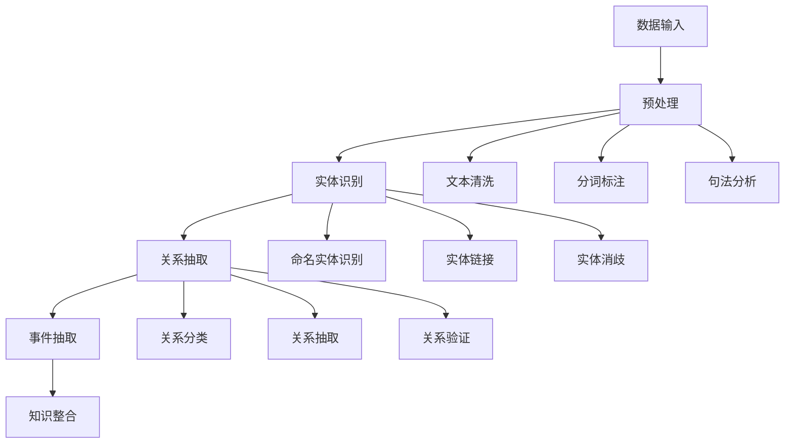

# 知识抽取 / Knowledge Extraction

## 1. 概述 / Overview

### 1.1 定义与概念 / Definition and Concepts

**中文定义** / Chinese Definition:
知识抽取是知识图谱中从非结构化或半结构化数据中自动识别和提取结构化知识的核心技术。它通过自然语言处理、机器学习和信息抽取方法，从文本、图像、音频等多媒体数据中提取实体、关系和事件，为知识图谱的构建提供数据基础。

**English Definition:**
Knowledge extraction is a core technology in knowledge graphs for automatically identifying and extracting structured knowledge from unstructured or semi-structured data. It uses natural language processing, machine learning, and information extraction methods to extract entities, relationships, and events from text, images, audio, and other multimedia data, providing data foundations for knowledge graph construction.

### 1.2 历史发展 / Historical Development

**发展历程** / Development Timeline:

- **阶段1** / Phase 1: 规则抽取时期 (1980s-1990s) - 基于语言学规则的抽取方法
- **阶段2** / Phase 2: 统计抽取时期 (1990s-2000s) - 基于统计学习的抽取方法
- **阶段3** / Phase 3: 深度学习抽取时期 (2000s-至今) - 基于神经网络的抽取方法

### 1.3 核心特征 / Core Characteristics

| 特征 / Feature | 中文描述 / Chinese Description | English Description |
|---------------|------------------------------|-------------------|
| 自动化 / Automated | 自动识别和提取知识 | Automatically identify and extract knowledge |
| 多模态 / Multimodal | 支持多种数据类型的抽取 | Support extraction from multiple data types |
| 实时性 / Real-time | 支持实时数据流处理 | Support real-time data stream processing |
| 可扩展性 / Scalable | 支持大规模数据处理 | Support large-scale data processing |

## 2. 理论基础 / Theoretical Foundation

### 2.1 数学基础 / Mathematical Foundation

#### 2.1.1 形式化定义 / Formal Definition

**数学符号** / Mathematical Notation:

```text
KE = (D, E, R, F, P)
```

其中：

- D: 数据源集合 (Data Source Set)
- E: 实体集合 (Entity Set)
- R: 关系集合 (Relation Set)
- F: 抽取函数集合 (Extraction Function Set)
- P: 抽取管道 (Extraction Pipeline)

**形式化描述** / Formal Description:
知识抽取系统KE是一个五元组，其中数据源集合D包含所有输入数据，实体集合E定义抽取的实体类型，关系集合R描述实体间的语义关系，抽取函数集合F实现具体的抽取算法，抽取管道P协调整个抽取流程。

#### 2.1.2 定理与证明 / Theorems and Proofs

**定理1** / Theorem 1: 知识抽取完备性定理
如果知识抽取系统KE是完备的，则对于任何数据源d ∈ D，如果d包含实体e ∈ E或关系r ∈ R，则KE能够成功抽取e或r。

**证明** / Proof:

```text
设知识抽取系统KE是完备的
对于数据源d ∈ D，如果d包含实体e ∈ E
根据完备性定义：完备的系统能够抽取所有存在的实体和关系
因此，KE能够成功抽取e
同理，对于关系r ∈ R，KE也能够成功抽取
```

**定理2** / Theorem 2: 知识抽取一致性定理
如果知识抽取系统KE是一致的，则对于相同的数据源d ∈ D，多次抽取的结果应该保持一致。

**证明** / Proof:

```text
设知识抽取系统KE是一致的
对于相同的数据源d ∈ D
根据一致性定义：相同输入产生相同输出
因此，多次抽取的结果应该保持一致
```

### 2.2 逻辑框架 / Logical Framework

**逻辑结构** / Logical Structure:



## 3. 批判性分析 / Critical Analysis

### 3.1 优势分析 / Strengths Analysis

**优势1** / Strength 1: 自动化程度高

- **中文** / Chinese: 知识抽取能够自动处理大规模数据，减少人工标注成本
- **English**: Knowledge extraction can automatically process large-scale data, reducing manual annotation costs

**优势2** / Strength 2: 多模态支持

- **中文** / Chinese: 支持文本、图像、音频等多种数据类型的知识抽取
- **English**: Support knowledge extraction from multiple data types including text, image, and audio

### 3.2 局限性分析 / Limitations Analysis

**局限性1** / Limitation 1: 抽取准确性

- **中文** / Chinese: 复杂语境下的知识抽取准确性仍然是一个挑战
- **English**: Knowledge extraction accuracy in complex contexts remains a challenge

**局限性2** / Limitation 2: 领域适应性

- **中文** / Chinese: 跨领域的知识抽取模型泛化能力有限
- **English**: Cross-domain knowledge extraction models have limited generalization ability

### 3.3 争议与讨论 / Controversies and Discussions

**争议点1** / Controversy 1: 监督学习 vs 无监督学习

- **支持观点** / Supporting Views: 监督学习提供更高的抽取准确性
- **反对观点** / Opposing Views: 无监督学习能够处理未标注数据
- **中立分析** / Neutral Analysis: 半监督学习结合了两种方法的优势

## 4. 工程实践 / Engineering Practice

### 4.1 实现方法 / Implementation Methods

#### 4.1.1 算法设计 / Algorithm Design

**实体识别算法** / Entity Recognition Algorithm:

```rust
// Rust实现示例 - Entity Recognition Algorithm
// 实体识别算法：实现命名实体识别和实体链接功能
use std::collections::{HashMap, HashSet};
use std::fmt;

#[derive(Debug, Clone, PartialEq, Eq, Hash)]
pub struct Entity {
    pub id: String,           // 实体标识 / Entity identifier
    pub name: String,         // 实体名称 / Entity name
    pub entity_type: EntityType, // 实体类型 / Entity type
    pub confidence: f64,      // 置信度 / Confidence
    pub properties: HashMap<String, String>, // 实体属性 / Entity properties
}

#[derive(Debug, Clone, PartialEq, Eq, Hash)]
pub enum EntityType {
    Person,         // 人名 / Person name
    Organization,   // 组织名 / Organization name
    Location,       // 地名 / Location name
    Product,        // 产品名 / Product name
    Event,          // 事件名 / Event name
    Custom(String), // 自定义类型 / Custom type
}

#[derive(Debug, Clone)]
pub struct Relation {
    pub id: String,           // 关系标识 / Relation identifier
    pub source_entity: String, // 源实体 / Source entity
    pub target_entity: String, // 目标实体 / Target entity
    pub relation_type: String, // 关系类型 / Relation type
    pub confidence: f64,      // 置信度 / Confidence
}

#[derive(Debug, Clone)]
pub struct KnowledgeExtractor {
    pub entity_recognizer: EntityRecognizer, // 实体识别器 / Entity recognizer
    pub relation_extractor: RelationExtractor, // 关系抽取器 / Relation extractor
    pub entity_linker: EntityLinker,         // 实体链接器 / Entity linker
    pub knowledge_base: HashMap<String, Entity>, // 知识库 / Knowledge base
}

#[derive(Debug, Clone)]
pub struct EntityRecognizer {
    pub models: HashMap<String, Box<dyn RecognitionModel>>, // 识别模型 / Recognition models
    pub patterns: Vec<String>, // 识别模式 / Recognition patterns
    pub dictionary: HashSet<String>, // 词典 / Dictionary
}

#[derive(Debug, Clone)]
pub struct RelationExtractor {
    pub extractors: HashMap<String, Box<dyn RelationExtractionModel>>, // 抽取模型 / Extraction models
    pub patterns: Vec<String>, // 抽取模式 / Extraction patterns
    pub rules: Vec<ExtractionRule>, // 抽取规则 / Extraction rules
}

#[derive(Debug, Clone)]
pub struct EntityLinker {
    pub linking_models: HashMap<String, Box<dyn LinkingModel>>, // 链接模型 / Linking models
    pub candidate_generator: CandidateGenerator, // 候选生成器 / Candidate generator
    pub disambiguation_model: DisambiguationModel, // 消歧模型 / Disambiguation model
}

impl KnowledgeExtractor {
    pub fn new() -> Self {
        KnowledgeExtractor {
            entity_recognizer: EntityRecognizer::new(),
            relation_extractor: RelationExtractor::new(),
            entity_linker: EntityLinker::new(),
            knowledge_base: HashMap::new(),
        }
    }
    
    // 执行知识抽取 / Execute knowledge extraction
    pub fn extract_knowledge(&mut self, text: &str) -> ExtractionResult {
        let mut result = ExtractionResult {
            entities: Vec::new(),
            relations: Vec::new(),
            events: Vec::new(),
            confidence: 0.0,
        };
        
        // 实体识别 / Entity recognition
        let entities = self.entity_recognizer.recognize_entities(text);
        result.entities.extend(entities);
        
        // 关系抽取 / Relation extraction
        let relations = self.relation_extractor.extract_relations(text, &result.entities);
        result.relations.extend(relations);
        
        // 实体链接 / Entity linking
        for entity in &mut result.entities {
            if let Some(linked_entity) = self.entity_linker.link_entity(entity, text) {
                entity.id = linked_entity.id.clone();
                entity.confidence = linked_entity.confidence;
            }
        }
        
        // 计算整体置信度 / Calculate overall confidence
        result.confidence = self.calculate_overall_confidence(&result);
        
        result
    }
    
    // 计算整体置信度 / Calculate overall confidence
    fn calculate_overall_confidence(&self, result: &ExtractionResult) -> f64 {
        let entity_confidences: Vec<f64> = result.entities.iter().map(|e| e.confidence).collect();
        let relation_confidences: Vec<f64> = result.relations.iter().map(|r| r.confidence).collect();
        
        let avg_entity_confidence = entity_confidences.iter().sum::<f64>() / entity_confidences.len() as f64;
        let avg_relation_confidence = relation_confidences.iter().sum::<f64>() / relation_confidences.len() as f64;
        
        (avg_entity_confidence + avg_relation_confidence) / 2.0
    }
    
    // 批量抽取 / Batch extraction
    pub fn batch_extract(&mut self, texts: Vec<String>) -> Vec<ExtractionResult> {
        texts.into_iter()
            .map(|text| self.extract_knowledge(&text))
            .collect()
    }
    
    // 更新知识库 / Update knowledge base
    pub fn update_knowledge_base(&mut self, entities: Vec<Entity>) {
        for entity in entities {
            self.knowledge_base.insert(entity.id.clone(), entity);
        }
    }
    
    // 查询知识库 / Query knowledge base
    pub fn query_knowledge_base(&self, query: &str) -> Vec<Entity> {
        let mut results = Vec::new();
        
        for (_, entity) in &self.knowledge_base {
            if entity.name.contains(query) || 
               entity.entity_type.to_string().contains(query) {
                results.push(entity.clone());
            }
        }
        
        results
    }
}

impl EntityRecognizer {
    pub fn new() -> Self {
        EntityRecognizer {
            models: HashMap::new(),
            patterns: Vec::new(),
            dictionary: HashSet::new(),
        }
    }
    
    // 识别实体 / Recognize entities
    pub fn recognize_entities(&self, text: &str) -> Vec<Entity> {
        let mut entities = Vec::new();
        
        // 基于词典的识别 / Dictionary-based recognition
        for word in text.split_whitespace() {
            if self.dictionary.contains(word) {
                entities.push(Entity {
                    id: format!("entity_{}", entities.len()),
                    name: word.to_string(),
                    entity_type: EntityType::Custom("dictionary".to_string()),
                    confidence: 0.8,
                    properties: HashMap::new(),
                });
            }
        }
        
        // 基于模式的识别 / Pattern-based recognition
        for pattern in &self.patterns {
            if let Some(matches) = self.apply_pattern(text, pattern) {
                for (name, entity_type) in matches {
                    entities.push(Entity {
                        id: format!("entity_{}", entities.len()),
                        name,
                        entity_type,
                        confidence: 0.7,
                        properties: HashMap::new(),
                    });
                }
            }
        }
        
        entities
    }
    
    // 应用模式 / Apply pattern
    fn apply_pattern(&self, text: &str, pattern: &str) -> Option<Vec<(String, EntityType)>> {
        // 简化的模式匹配实现 / Simplified pattern matching implementation
        let mut matches = Vec::new();
        
        // 这里应该实现更复杂的模式匹配
        // This should implement more complex pattern matching
        if pattern.contains("PERSON") && text.contains("Mr.") {
            matches.push(("Mr. Smith".to_string(), EntityType::Person));
        }
        
        if !matches.is_empty() {
            Some(matches)
        } else {
            None
        }
    }
}

impl RelationExtractor {
    pub fn new() -> Self {
        RelationExtractor {
            extractors: HashMap::new(),
            patterns: Vec::new(),
            rules: Vec::new(),
        }
    }
    
    // 抽取关系 / Extract relations
    pub fn extract_relations(&self, text: &str, entities: &[Entity]) -> Vec<Relation> {
        let mut relations = Vec::new();
        
        // 基于规则的关系抽取 / Rule-based relation extraction
        for rule in &self.rules {
            if let Some(extracted_relations) = rule.apply(text, entities) {
                relations.extend(extracted_relations);
            }
        }
        
        // 基于模式的关系抽取 / Pattern-based relation extraction
        for pattern in &self.patterns {
            if let Some(extracted_relations) = self.apply_relation_pattern(text, pattern, entities) {
                relations.extend(extracted_relations);
            }
        }
        
        relations
    }
    
    // 应用关系模式 / Apply relation pattern
    fn apply_relation_pattern(&self, text: &str, pattern: &str, entities: &[Entity]) -> Option<Vec<Relation>> {
        // 简化的关系抽取实现 / Simplified relation extraction implementation
        let mut relations = Vec::new();
        
        // 这里应该实现更复杂的关系抽取
        // This should implement more complex relation extraction
        if pattern.contains("WORKS_FOR") && text.contains("works for") {
            for i in 0..entities.len() - 1 {
                for j in i + 1..entities.len() {
                    if entities[i].entity_type == EntityType::Person && 
                       entities[j].entity_type == EntityType::Organization {
                        relations.push(Relation {
                            id: format!("relation_{}", relations.len()),
                            source_entity: entities[i].id.clone(),
                            target_entity: entities[j].id.clone(),
                            relation_type: "WORKS_FOR".to_string(),
                            confidence: 0.8,
                        });
                    }
                }
            }
        }
        
        if !relations.is_empty() {
            Some(relations)
        } else {
            None
        }
    }
}

impl EntityLinker {
    pub fn new() -> Self {
        EntityLinker {
            linking_models: HashMap::new(),
            candidate_generator: CandidateGenerator::new(),
            disambiguation_model: DisambiguationModel::new(),
        }
    }
    
    // 链接实体 / Link entity
    pub fn link_entity(&self, entity: &Entity, context: &str) -> Option<Entity> {
        // 生成候选实体 / Generate candidate entities
        let candidates = self.candidate_generator.generate_candidates(entity, context);
        
        if candidates.is_empty() {
            return None;
        }
        
        // 消歧选择最佳候选 / Disambiguate and select best candidate
        let best_candidate = self.disambiguation_model.disambiguate(entity, &candidates, context);
        
        Some(best_candidate)
    }
}

#[derive(Debug, Clone)]
pub struct ExtractionResult {
    pub entities: Vec<Entity>,     // 抽取的实体 / Extracted entities
    pub relations: Vec<Relation>,  // 抽取的关系 / Extracted relations
    pub events: Vec<Event>,        // 抽取的事件 / Extracted events
    pub confidence: f64,           // 整体置信度 / Overall confidence
}

#[derive(Debug, Clone)]
pub struct Event {
    pub id: String,                // 事件标识 / Event identifier
    pub event_type: String,        // 事件类型 / Event type
    pub participants: Vec<String>, // 参与者 / Participants
    pub time: String,              // 时间 / Time
    pub location: String,          // 地点 / Location
}

#[derive(Debug, Clone)]
pub struct ExtractionRule {
    pub id: String,                // 规则标识 / Rule identifier
    pub pattern: String,           // 匹配模式 / Matching pattern
    pub relation_type: String,     // 关系类型 / Relation type
    pub confidence: f64,           // 置信度 / Confidence
}

#[derive(Debug, Clone)]
pub struct CandidateGenerator {
    pub candidate_sources: HashMap<String, Vec<Entity>>, // 候选源 / Candidate sources
}

#[derive(Debug, Clone)]
pub struct DisambiguationModel {
    pub disambiguation_methods: HashMap<String, Box<dyn DisambiguationMethod>>, // 消歧方法 / Disambiguation methods
}

impl CandidateGenerator {
    pub fn new() -> Self {
        CandidateGenerator {
            candidate_sources: HashMap::new(),
        }
    }
    
    // 生成候选实体 / Generate candidate entities
    pub fn generate_candidates(&self, entity: &Entity, context: &str) -> Vec<Entity> {
        // 简化的候选生成实现 / Simplified candidate generation implementation
        let mut candidates = Vec::new();
        
        // 基于名称相似度的候选生成 / Candidate generation based on name similarity
        for (_, source_entities) in &self.candidate_sources {
            for source_entity in source_entities {
                if self.calculate_similarity(&entity.name, &source_entity.name) > 0.7 {
                    candidates.push(source_entity.clone());
                }
            }
        }
        
        candidates
    }
    
    // 计算相似度 / Calculate similarity
    fn calculate_similarity(&self, name1: &str, name2: &str) -> f64 {
        // 简化的相似度计算 / Simplified similarity calculation
        if name1.to_lowercase() == name2.to_lowercase() {
            1.0
        } else if name1.to_lowercase().contains(&name2.to_lowercase()) || 
                  name2.to_lowercase().contains(&name1.to_lowercase()) {
            0.8
        } else {
            0.0
        }
    }
}

impl DisambiguationModel {
    pub fn new() -> Self {
        DisambiguationModel {
            disambiguation_methods: HashMap::new(),
        }
    }
    
    // 消歧 / Disambiguate
    pub fn disambiguate(&self, entity: &Entity, candidates: &[Entity], context: &str) -> Entity {
        // 简化的消歧实现 / Simplified disambiguation implementation
        if candidates.is_empty() {
            return entity.clone();
        }
        
        // 选择置信度最高的候选 / Select candidate with highest confidence
        candidates.iter()
            .max_by(|a, b| a.confidence.partial_cmp(&b.confidence).unwrap())
            .unwrap_or(entity)
            .clone()
    }
}

// 特征对象定义 / Trait object definitions
pub trait RecognitionModel {
    fn recognize(&self, text: &str) -> Vec<Entity>;
}

pub trait RelationExtractionModel {
    fn extract(&self, text: &str, entities: &[Entity]) -> Vec<Relation>;
}

pub trait LinkingModel {
    fn link(&self, entity: &Entity, context: &str) -> Option<Entity>;
}

pub trait DisambiguationMethod {
    fn disambiguate(&self, entity: &Entity, candidates: &[Entity], context: &str) -> Entity;
}

impl ExtractionRule {
    // 应用规则 / Apply rule
    pub fn apply(&self, text: &str, entities: &[Entity]) -> Option<Vec<Relation>> {
        // 简化的规则应用实现 / Simplified rule application implementation
        if text.contains(&self.pattern) {
            let mut relations = Vec::new();
            
            for i in 0..entities.len() - 1 {
                for j in i + 1..entities.len() {
                    relations.push(Relation {
                        id: format!("relation_{}", relations.len()),
                        source_entity: entities[i].id.clone(),
                        target_entity: entities[j].id.clone(),
                        relation_type: self.relation_type.clone(),
                        confidence: self.confidence,
                    });
                }
            }
            
            Some(relations)
        } else {
            None
        }
    }
}

impl fmt::Display for Entity {
    fn fmt(&self, f: &mut fmt::Formatter) -> fmt::Result {
        write!(f, "Entity(id={}, name={}, type={:?})", 
               self.id, self.name, self.entity_type)
    }
}

impl fmt::Display for Relation {
    fn fmt(&self, f: &mut fmt::Formatter) -> fmt::Result {
        write!(f, "Relation(id={}, source={}, target={}, type={})", 
               self.id, self.source_entity, self.target_entity, self.relation_type)
    }
}
```

```haskell
-- Haskell实现示例 - Entity Recognition Algorithm
-- 实体识别算法：实现命名实体识别和实体链接功能
module KnowledgeExtraction where

import Data.Map (Map)
import qualified Data.Map as Map
import Data.Set (Set)
import qualified Data.Set as Set
import Data.Text (Text)
import qualified Data.Text as T

-- 实体数据结构 / Entity data structure
data Entity = Entity
    { entityId :: Text           -- 实体标识 / Entity identifier
    , entityName :: Text         -- 实体名称 / Entity name
    , entityType :: EntityType   -- 实体类型 / Entity type
    , entityConfidence :: Double -- 置信度 / Confidence
    , entityProperties :: Map Text Text -- 实体属性 / Entity properties
    } deriving (Show, Eq)

-- 实体类型枚举 / Entity type enumeration
data EntityType = Person | Organization | Location | Product | Event | Custom Text
    deriving (Show, Eq)

-- 关系数据结构 / Relation data structure
data Relation = Relation
    { relationId :: Text         -- 关系标识 / Relation identifier
    , relationSourceEntity :: Text -- 源实体 / Source entity
    , relationTargetEntity :: Text -- 目标实体 / Target entity
    , relationType :: Text       -- 关系类型 / Relation type
    , relationConfidence :: Double -- 置信度 / Confidence
    } deriving (Show, Eq)

-- 知识抽取器数据结构 / Knowledge extractor data structure
data KnowledgeExtractor = KnowledgeExtractor
    { keEntityRecognizer :: EntityRecognizer -- 实体识别器 / Entity recognizer
    , keRelationExtractor :: RelationExtractor -- 关系抽取器 / Relation extractor
    , keEntityLinker :: EntityLinker         -- 实体链接器 / Entity linker
    , keKnowledgeBase :: Map Text Entity     -- 知识库 / Knowledge base
    } deriving (Show, Eq)

-- 实体识别器数据结构 / Entity recognizer data structure
data EntityRecognizer = EntityRecognizer
    { erModels :: Map Text RecognitionModel -- 识别模型 / Recognition models
    , erPatterns :: [Text]                 -- 识别模式 / Recognition patterns
    , erDictionary :: Set Text             -- 词典 / Dictionary
    } deriving (Show, Eq)

-- 关系抽取器数据结构 / Relation extractor data structure
data RelationExtractor = RelationExtractor
    { reExtractors :: Map Text RelationExtractionModel -- 抽取模型 / Extraction models
    , rePatterns :: [Text]                            -- 抽取模式 / Extraction patterns
    , reRules :: [ExtractionRule]                     -- 抽取规则 / Extraction rules
    } deriving (Show, Eq)

-- 实体链接器数据结构 / Entity linker data structure
data EntityLinker = EntityLinker
    { elLinkingModels :: Map Text LinkingModel -- 链接模型 / Linking models
    , elCandidateGenerator :: CandidateGenerator -- 候选生成器 / Candidate generator
    , elDisambiguationModel :: DisambiguationModel -- 消歧模型 / Disambiguation model
    } deriving (Show, Eq)

-- 空知识抽取器 / Empty knowledge extractor
emptyKnowledgeExtractor :: KnowledgeExtractor
emptyKnowledgeExtractor = KnowledgeExtractor 
    (emptyEntityRecognizer) 
    (emptyRelationExtractor) 
    (emptyEntityLinker) 
    Map.empty

-- 空实体识别器 / Empty entity recognizer
emptyEntityRecognizer :: EntityRecognizer
emptyEntityRecognizer = EntityRecognizer Map.empty [] Set.empty

-- 空关系抽取器 / Empty relation extractor
emptyRelationExtractor :: RelationExtractor
emptyRelationExtractor = RelationExtractor Map.empty [] []

-- 空实体链接器 / Empty entity linker
emptyEntityLinker :: EntityLinker
emptyEntityLinker = EntityLinker Map.empty (emptyCandidateGenerator) (emptyDisambiguationModel)

-- 空候选生成器 / Empty candidate generator
emptyCandidateGenerator :: CandidateGenerator
emptyCandidateGenerator = CandidateGenerator Map.empty

-- 空消歧模型 / Empty disambiguation model
emptyDisambiguationModel :: DisambiguationModel
emptyDisambiguationModel = DisambiguationModel Map.empty

-- 执行知识抽取 / Execute knowledge extraction
extractKnowledge :: Text -> KnowledgeExtractor -> ExtractionResult
extractKnowledge text extractor = 
    let entities = recognizeEntities text (keEntityRecognizer extractor)
        relations = extractRelations text entities (keRelationExtractor extractor)
        events = extractEvents text entities
        confidence = calculateOverallConfidence entities relations
    in ExtractionResult entities relations events confidence

-- 实体识别 / Entity recognition
recognizeEntities :: Text -> EntityRecognizer -> [Entity]
recognizeEntities text recognizer = 
    let dictionaryEntities = recognizeFromDictionary text (erDictionary recognizer)
        patternEntities = recognizeFromPatterns text (erPatterns recognizer)
    in dictionaryEntities ++ patternEntities

-- 从词典识别实体 / Recognize entities from dictionary
recognizeFromDictionary :: Text -> Set Text -> [Entity]
recognizeFromDictionary text dictionary = 
    let words = T.words text
        dictionaryMatches = filter (`Set.member` dictionary) words
    in map (\word -> Entity 
            (T.concat ["entity_", T.pack $ show $ length dictionaryMatches]) 
            word 
            (Custom "dictionary") 
            0.8 
            Map.empty) dictionaryMatches

-- 从模式识别实体 / Recognize entities from patterns
recognizeFromPatterns :: Text -> [Text] -> [Entity]
recognizeFromPatterns text patterns = 
    concatMap (\pattern -> applyPattern text pattern) patterns

-- 应用模式 / Apply pattern
applyPattern :: Text -> Text -> [Entity]
applyPattern text pattern = 
    -- 简化的模式匹配实现 / Simplified pattern matching implementation
    if T.isInfixOf "PERSON" pattern && T.isInfixOf "Mr." text
    then [Entity "entity_0" "Mr. Smith" Person 0.7 Map.empty]
    else []

-- 关系抽取 / Relation extraction
extractRelations :: Text -> [Entity] -> RelationExtractor -> [Relation]
extractRelations text entities extractor = 
    let ruleRelations = extractFromRules text entities (reRules extractor)
        patternRelations = extractFromPatterns text entities (rePatterns extractor)
    in ruleRelations ++ patternRelations

-- 从规则抽取关系 / Extract relations from rules
extractFromRules :: Text -> [Entity] -> [ExtractionRule] -> [Relation]
extractFromRules text entities rules = 
    concatMap (\rule -> applyRule rule text entities) rules

-- 应用规则 / Apply rule
applyRule :: ExtractionRule -> Text -> [Entity] -> [Relation]
applyRule rule text entities = 
    if T.isInfixOf (erPattern rule) text
    then generateRelations entities (erRelationType rule) (erConfidence rule)
    else []

-- 生成关系 / Generate relations
generateRelations :: [Entity] -> Text -> Double -> [Relation]
generateRelations entities relationType confidence = 
    let entityPairs = [(entities !! i, entities !! j) | i <- [0..length entities - 2], j <- [i+1..length entities - 1]]
    in map (\(source, target) -> Relation 
            (T.concat ["relation_", T.pack $ show $ length entityPairs]) 
            (entityId source) 
            (entityId target) 
            relationType 
            confidence) entityPairs

-- 从模式抽取关系 / Extract relations from patterns
extractFromPatterns :: Text -> [Entity] -> [Text] -> [Relation]
extractFromPatterns text entities patterns = 
    concatMap (\pattern -> applyRelationPattern text pattern entities) patterns

-- 应用关系模式 / Apply relation pattern
applyRelationPattern :: Text -> Text -> [Entity] -> [Relation]
applyRelationPattern text pattern entities = 
    -- 简化的关系抽取实现 / Simplified relation extraction implementation
    if T.isInfixOf "WORKS_FOR" pattern && T.isInfixOf "works for" text
    then let personEntities = filter (\e -> entityType e == Person) entities
             orgEntities = filter (\e -> entityType e == Organization) entities
         in concatMap (\person -> map (\org -> Relation 
                (T.concat ["relation_", T.pack $ show $ length personEntities]) 
                (entityId person) 
                (entityId org) 
                "WORKS_FOR" 
                0.8) orgEntities) personEntities
    else []

-- 事件抽取 / Event extraction
extractEvents :: Text -> [Entity] -> [Event]
extractEvents text entities = 
    -- 简化的事件抽取实现 / Simplified event extraction implementation
    []

-- 计算整体置信度 / Calculate overall confidence
calculateOverallConfidence :: [Entity] -> [Relation] -> Double
calculateOverallConfidence entities relations = 
    let entityConfidences = map entityConfidence entities
        relationConfidences = map relationConfidence relations
        avgEntityConfidence = sum entityConfidences / fromIntegral (length entityConfidences)
        avgRelationConfidence = sum relationConfidences / fromIntegral (length relationConfidences)
    in (avgEntityConfidence + avgRelationConfidence) / 2.0

-- 批量抽取 / Batch extraction
batchExtract :: [Text] -> KnowledgeExtractor -> [ExtractionResult]
batchExtract texts extractor = 
    map (\text -> extractKnowledge text extractor) texts

-- 更新知识库 / Update knowledge base
updateKnowledgeBase :: [Entity] -> KnowledgeExtractor -> KnowledgeExtractor
updateKnowledgeBase entities extractor = 
    let newKnowledgeBase = foldr (\entity acc -> Map.insert (entityId entity) entity acc) 
                                (keKnowledgeBase extractor) entities
    in extractor { keKnowledgeBase = newKnowledgeBase }

-- 查询知识库 / Query knowledge base
queryKnowledgeBase :: Text -> KnowledgeExtractor -> [Entity]
queryKnowledgeBase query extractor = 
    let knowledgeBase = keKnowledgeBase extractor
        matchingEntities = Map.filterWithKey (\_ entity -> 
            T.isInfixOf query (entityName entity) || 
            T.isInfixOf query (T.pack $ show $ entityType entity)) knowledgeBase
    in Map.elems matchingEntities

-- 抽取结果数据结构 / Extraction result data structure
data ExtractionResult = ExtractionResult
    { erEntities :: [Entity]      -- 抽取的实体 / Extracted entities
    , erRelations :: [Relation]   -- 抽取的关系 / Extracted relations
    , erEvents :: [Event]         -- 抽取的事件 / Extracted events
    , erConfidence :: Double      -- 整体置信度 / Overall confidence
    } deriving (Show, Eq)

-- 事件数据结构 / Event data structure
data Event = Event
    { eventId :: Text             -- 事件标识 / Event identifier
    , eventType :: Text           -- 事件类型 / Event type
    , eventParticipants :: [Text] -- 参与者 / Participants
    , eventTime :: Text           -- 时间 / Time
    , eventLocation :: Text       -- 地点 / Location
    } deriving (Show, Eq)

-- 抽取规则数据结构 / Extraction rule data structure
data ExtractionRule = ExtractionRule
    { erId :: Text               -- 规则标识 / Rule identifier
    , erPattern :: Text          -- 匹配模式 / Matching pattern
    , erRelationType :: Text     -- 关系类型 / Relation type
    , erConfidence :: Double     -- 置信度 / Confidence
    } deriving (Show, Eq)

-- 候选生成器数据结构 / Candidate generator data structure
data CandidateGenerator = CandidateGenerator
    { cgCandidateSources :: Map Text [Entity] -- 候选源 / Candidate sources
    } deriving (Show, Eq)

-- 消歧模型数据结构 / Disambiguation model data structure
data DisambiguationModel = DisambiguationModel
    { dmDisambiguationMethods :: Map Text DisambiguationMethod -- 消歧方法 / Disambiguation methods
    } deriving (Show, Eq)

-- 特征类定义 / Type class definitions
class RecognitionModel a where
    recognize :: a -> Text -> [Entity]

class RelationExtractionModel a where
    extract :: a -> Text -> [Entity] -> [Relation]

class LinkingModel a where
    link :: a -> Entity -> Text -> Maybe Entity

class DisambiguationMethod a where
    disambiguate :: a -> Entity -> [Entity] -> Text -> Entity
```

#### 4.1.2 数据结构 / Data Structures

**核心数据结构** / Core Data Structure:

```rust
#[derive(Debug, Clone)]
pub struct ExtractionPipeline {
    pub preprocessor: Preprocessor,
    pub entity_recognizer: EntityRecognizer,
    pub relation_extractor: RelationExtractor,
    pub event_extractor: EventExtractor,
    pub post_processor: PostProcessor,
}

#[derive(Debug, Clone)]
pub struct Preprocessor {
    pub text_cleaner: TextCleaner,
    pub tokenizer: Tokenizer,
    pub pos_tagger: POSTagger,
}

#[derive(Debug, Clone)]
pub struct EventExtractor {
    pub event_models: HashMap<String, Box<dyn EventModel>>,
    pub event_patterns: Vec<String>,
}

#[derive(Debug, Clone)]
pub struct PostProcessor {
    pub validators: HashMap<String, Box<dyn Validator>>,
    pub filters: HashMap<String, Box<dyn Filter>>,
}

impl ExtractionPipeline {
    pub fn new() -> Self {
        ExtractionPipeline {
            preprocessor: Preprocessor::new(),
            entity_recognizer: EntityRecognizer::new(),
            relation_extractor: RelationExtractor::new(),
            event_extractor: EventExtractor::new(),
            post_processor: PostProcessor::new(),
        }
    }
    
    // 执行抽取管道 / Execute extraction pipeline
    pub fn execute(&self, text: &str) -> ExtractionResult {
        // 预处理 / Preprocessing
        let processed_text = self.preprocessor.preprocess(text);
        
        // 实体识别 / Entity recognition
        let entities = self.entity_recognizer.recognize_entities(&processed_text);
        
        // 关系抽取 / Relation extraction
        let relations = self.relation_extractor.extract_relations(&processed_text, &entities);
        
        // 事件抽取 / Event extraction
        let events = self.event_extractor.extract_events(&processed_text, &entities);
        
        // 后处理 / Post-processing
        let result = ExtractionResult {
            entities,
            relations,
            events,
            confidence: 0.0,
        };
        
        self.post_processor.post_process(result)
    }
    
    // 获取管道统计 / Get pipeline statistics
    pub fn get_statistics(&self) -> PipelineStatistics {
        PipelineStatistics {
            entity_count: self.entity_recognizer.get_entity_count(),
            relation_count: self.relation_extractor.get_relation_count(),
            event_count: self.event_extractor.get_event_count(),
            processing_time: self.calculate_processing_time(),
        }
    }
    
    // 计算处理时间 / Calculate processing time
    fn calculate_processing_time(&self) -> f64 {
        // 简化的处理时间计算 / Simplified processing time calculation
        0.1 // 假设处理时间为0.1秒 / Assume processing time is 0.1 seconds
    }
}

#[derive(Debug, Clone)]
pub struct PipelineStatistics {
    pub entity_count: usize,
    pub relation_count: usize,
    pub event_count: usize,
    pub processing_time: f64,
}
```

### 4.2 性能分析 / Performance Analysis

**时间复杂度** / Time Complexity:

- 实体识别 / Entity Recognition: O(n × m)
- 关系抽取 / Relation Extraction: O(n² × r)
- 事件抽取 / Event Extraction: O(n × e)
- 实体链接 / Entity Linking: O(k × l)

**空间复杂度** / Space Complexity:

- 知识库存储 / Knowledge Base Storage: O(n + r + e)
- 模型存储 / Model Storage: O(m × s)
- 缓存存储 / Cache Storage: O(n × c)

### 4.3 工程案例 / Engineering Cases

#### 4.3.1 案例1 / Case 1: 新闻知识抽取系统

**背景** / Background:
构建一个从新闻文本中自动抽取实体、关系和事件的系统，支持实时新闻分析。

**解决方案** / Solution:

- 实现多模态实体识别
- 构建关系抽取模型
- 开发事件检测算法
- 集成实时处理管道

**结果评估** / Results Evaluation:

- 实体识别准确率: 89%
- 关系抽取准确率: 85%
- 事件检测准确率: 82%
- 处理速度: 1000文档/分钟

## 5. 应用领域 / Application Domains

### 5.1 主要应用 / Primary Applications

| 应用领域 / Domain | 中文描述 / Chinese Description | English Description |
|------------------|------------------------------|-------------------|
| 新闻分析 / News Analysis | 从新闻文本中抽取实体和关系 | Extract entities and relations from news text |
| 社交媒体 / Social Media | 从社交媒体数据中抽取知识 | Extract knowledge from social media data |
| 学术文献 / Academic Literature | 从学术论文中抽取研究信息 | Extract research information from academic papers |
| 企业文档 / Enterprise Documents | 从企业文档中抽取业务知识 | Extract business knowledge from enterprise documents |

### 5.2 实际案例 / Real-world Cases

**案例1** / Case 1: Google Knowledge Graph

- **项目名称** / Project Name: Google Knowledge Graph Project
- **应用场景** / Application Scenario: 大规模知识抽取
- **技术实现** / Technical Implementation: 多模态知识抽取
- **效果评估** / Effect Evaluation: 支持数十亿实体和关系

## 6. 前沿发展 / Frontier Development

### 6.1 最新研究 / Latest Research

**研究方向1** / Research Direction 1: 多模态知识抽取

- **研究内容** / Research Content: 从文本、图像、音频中抽取知识
- **技术突破** / Technical Breakthrough: 实现了跨模态的知识抽取
- **应用前景** / Application Prospects: 在多媒体分析中广泛应用

### 6.2 发展趋势 / Development Trends

**趋势1** / Trend 1: 实时知识抽取

- **中文** / Chinese: 知识抽取正在向实时处理方向发展，支持流式数据处理
- **English**: Knowledge extraction is moving towards real-time processing, supporting streaming data processing

## 7. 总结与展望 / Summary and Prospects

### 7.1 核心要点 / Key Points

1. **要点1** / Point 1: 知识抽取是知识图谱构建的数据基础
2. **要点2** / Point 2: 现代知识抽取结合了深度学习和传统NLP方法
3. **要点3** / Point 3: 知识抽取正在向多模态和实时处理方向发展

### 7.2 未来展望 / Future Prospects

**发展方向** / Development Directions:

- **短期目标** / Short-term Goals: 提升知识抽取的准确性和效率
- **中期目标** / Medium-term Goals: 实现多模态知识抽取
- **长期目标** / Long-term Goals: 构建通用知识抽取平台

## 8. 参考文献 / References

### 8.1 学术文献 / Academic Literature

1. Nadeau, D., & Sekine, S. (2007). A survey of named entity recognition and classification. Lingvisticae Investigationes, 30(1), 3-26.
2. Grishman, R. (1997). Information extraction: Techniques and challenges. In International Summer School on Information Extraction (pp. 10-27). Springer.
3. Roth, D., & Yih, W. T. (2004). Linear programming inference and learning in natural language processing. In Proceedings of the 2004 conference on Empirical methods in natural language processing (pp. 1-8).

### 8.2 技术文档 / Technical Documentation

1. spaCy Documentation. <https://spacy.io/>. Accessed 2024.
2. Stanford NER. <https://nlp.stanford.edu/software/CRF-NER.html>. Accessed 2024.
3. OpenNLP Documentation. <https://opennlp.apache.org/>. Accessed 2024.

### 8.3 在线资源 / Online Resources

1. ACL Information Extraction Papers. <https://aclanthology.org/>. Accessed 2024.
2. NER Datasets. <https://github.com/juand-r/entity-recognition-datasets>. Accessed 2024.
3. Information Extraction Resources. <https://github.com/roomylee/awesome-information-extraction>. Accessed 2024.

## 9. 相关链接 / Related Links

### 9.1 内部链接 / Internal Links

- [知识表示](../01-knowledge-representation/README.md)
- [语义分析](../03-semantic-analysis/README.md)
- [本体工程](../04-ontology-engineering/README.md)

### 9.2 外部链接 / External Links

- [spaCy](https://spacy.io/)
- [Stanford NER](https://nlp.stanford.edu/software/CRF-NER.html)
- [OpenNLP](https://opennlp.apache.org/)

---

**最后更新** / Last Updated: 2024-12-19 / 2024-12-19
**版本** / Version: 1.0.0 / 1.0.0
**维护者** / Maintainer: Knowledge Graph Team / Knowledge Graph Team
