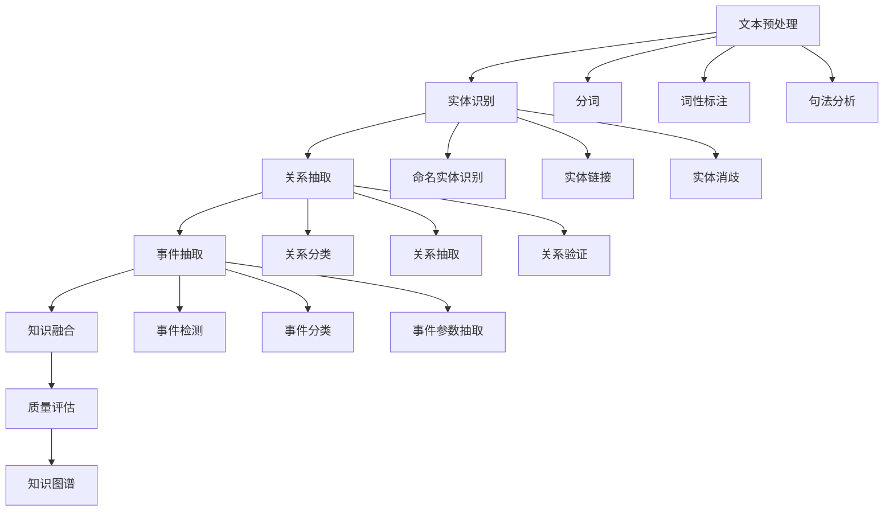

# 知识抽取 / Knowledge Extraction

## 1. 概述 / Overview

### 1.1 定义与概念 / Definition and Concepts

**中文定义** / Chinese Definition:
知识抽取是知识图谱构建中的核心技术，旨在从非结构化或半结构化的文本数据中自动识别和提取实体、关系和事件等结构化知识。它通过自然语言处理、机器学习和深度学习等技术，将文本中的隐含知识转换为可计算的结构化表示。

**English Definition:**
Knowledge extraction is a core technology in knowledge graph construction, aiming to automatically identify and extract structured knowledge such as entities, relationships, and events from unstructured or semi-structured text data. It uses natural language processing, machine learning, and deep learning technologies to convert implicit knowledge in text into computable structured representations.

### 1.2 历史发展 / Historical Development

**发展历程** / Development Timeline:

- **阶段1** / Phase 1: 规则基础时期 (1960s-1990s) - 基于语言学规则的知识抽取
- **阶段2** / Phase 2: 统计学习时期 (1990s-2010s) - 基于机器学习的知识抽取
- **阶段3** / Phase 3: 深度学习时期 (2010s-至今) - 基于神经网络的知识抽取

### 1.3 核心特征 / Core Characteristics

| 特征 / Feature | 中文描述 / Chinese Description | English Description |
|---------------|------------------------------|-------------------|
| 自动化 / Automation | 自动从文本中抽取结构化知识 | Automatically extract structured knowledge from text |
| 准确性 / Accuracy | 高精度的实体和关系识别 | High-precision entity and relationship recognition |
| 可扩展性 / Scalability | 支持大规模文本处理 | Support large-scale text processing |
| 多语言性 / Multilingual | 支持多种语言的知识抽取 | Support knowledge extraction in multiple languages |

## 2. 理论基础 / Theoretical Foundation

### 2.1 数学基础 / Mathematical Foundation

#### 2.1.1 形式化定义 / Formal Definition

**数学符号** / Mathematical Notation:

```text
KE = (T, E, R, F, A)
```

其中：

- T: 文本集合 (Text Set)
- E: 实体集合 (Entity Set)
- R: 关系集合 (Relation Set)
- F: 抽取函数 (Extraction Function)
- A: 评估指标 (Assessment Metrics)

**形式化描述** / Formal Description:
知识抽取系统KE是一个五元组，其中文本集合T包含输入的非结构化文本，实体集合E和关系集合R分别包含抽取出的实体和关系，抽取函数F将文本映射到结构化知识，评估指标A用于衡量抽取质量。

#### 2.1.2 定理与证明 / Theorems and Proofs

**定理1** / Theorem 1: 知识抽取完备性定理
如果文本T包含实体e和关系r，且抽取函数F是完备的，则F(T)能够识别出e和r。

**证明** / Proof:

```text
设文本T包含实体e和关系r
如果抽取函数F是完备的，则对于任意实体e'和关系r'
如果e' ∈ T且r' ∈ T，则F(T)能够识别出e'和r'
因此，F(T)能够识别出e和r
```

**定理2** / Theorem 2: 知识抽取一致性定理
如果抽取函数F是一致的，则对于相同的文本T，多次抽取的结果应该相同。

**证明** / Proof:

```text
设抽取函数F是一致的
对于文本T，如果F(T) = K₁且F(T) = K₂
根据一致性定义：如果F是确定的，则K₁ = K₂
因此，多次抽取的结果应该相同
```

### 2.2 逻辑框架 / Logical Framework

**逻辑结构** / Logical Structure:



## 3. 批判性分析 / Critical Analysis

### 3.1 优势分析 / Strengths Analysis

**优势1** / Strength 1: 自动化程度高

- **中文** / Chinese: 知识抽取技术能够自动从大量文本中提取结构化知识，大大提高了知识图谱构建的效率
- **English**: Knowledge extraction technology can automatically extract structured knowledge from large amounts of text, greatly improving the efficiency of knowledge graph construction

**优势2** / Strength 2: 可扩展性强

- **中文** / Chinese: 现代知识抽取方法能够处理大规模文本数据，支持多领域和多语言的知识抽取
- **English**: Modern knowledge extraction methods can handle large-scale text data, supporting knowledge extraction across multiple domains and languages

### 3.2 局限性分析 / Limitations Analysis

**局限性1** / Limitation 1: 准确性挑战

- **中文** / Chinese: 知识抽取的准确性仍然面临挑战，特别是在处理复杂语义和歧义情况时
- **English**: The accuracy of knowledge extraction still faces challenges, especially when dealing with complex semantics and ambiguous situations

**局限性2** / Limitation 2: 领域适应性

- **中文** / Chinese: 知识抽取模型在特定领域训练后，在其他领域的泛化能力有限
- **English**: Knowledge extraction models trained on specific domains have limited generalization ability to other domains

### 3.3 争议与讨论 / Controversies and Discussions

**争议点1** / Controversy 1: 监督学习 vs 无监督学习

- **支持观点** / Supporting Views: 监督学习方法具有更高的准确性，但需要大量标注数据
- **反对观点** / Opposing Views: 无监督学习方法能够处理未标注数据，但准确性较低
- **中立分析** / Neutral Analysis: 半监督学习方法结合了两种方法的优势，可能是最佳解决方案

## 4. 工程实践 / Engineering Practice

### 4.1 实现方法 / Implementation Methods

#### 4.1.1 算法设计 / Algorithm Design

**实体识别算法** / Entity Recognition Algorithm:

```rust
// Rust实现示例
use std::collections::HashMap;
use regex::Regex;

#[derive(Debug, Clone)]
pub struct Entity {
    pub id: String,
    pub text: String,
    pub entity_type: EntityType,
    pub start_pos: usize,
    pub end_pos: usize,
    pub confidence: f64,
}

#[derive(Debug, Clone)]
pub enum EntityType {
    Person,
    Organization,
    Location,
    Date,
    Number,
    Other,
}

#[derive(Debug, Clone)]
pub struct Relation {
    pub id: String,
    pub source_entity: String,
    pub target_entity: String,
    pub relation_type: String,
    pub confidence: f64,
}

#[derive(Debug, Clone)]
pub struct KnowledgeExtractor {
    pub entity_patterns: HashMap<EntityType, Vec<Regex>>,
    pub relation_patterns: Vec<Regex>,
    pub entity_dictionary: HashMap<String, EntityType>,
}

impl KnowledgeExtractor {
    pub fn new() -> Self {
        let mut extractor = KnowledgeExtractor {
            entity_patterns: HashMap::new(),
            relation_patterns: Vec::new(),
            entity_dictionary: HashMap::new(),
        };
        
        // 初始化实体模式
        extractor.init_entity_patterns();
        extractor.init_relation_patterns();
        
        extractor
    }
    
    fn init_entity_patterns(&mut self) {
        // 人名模式
        let person_pattern = Regex::new(r"\b[A-Z][a-z]+ [A-Z][a-z]+\b").unwrap();
        self.entity_patterns.insert(EntityType::Person, vec![person_pattern]);
        
        // 组织名模式
        let org_pattern = Regex::new(r"\b[A-Z][a-z]+ (Corp|Inc|Ltd|Company)\b").unwrap();
        self.entity_patterns.insert(EntityType::Organization, vec![org_pattern]);
        
        // 地名模式
        let location_pattern = Regex::new(r"\b[A-Z][a-z]+, [A-Z]{2}\b").unwrap();
        self.entity_patterns.insert(EntityType::Location, vec![location_pattern]);
    }
    
    fn init_relation_patterns(&mut self) {
        // 工作关系模式
        let work_pattern = Regex::new(r"(\w+) works at (\w+)").unwrap();
        self.relation_patterns.push(work_pattern);
        
        // 位于关系模式
        let located_pattern = Regex::new(r"(\w+) is located in (\w+)").unwrap();
        self.relation_patterns.push(located_pattern);
    }
    
    pub fn extract_entities(&self, text: &str) -> Vec<Entity> {
        let mut entities = Vec::new();
        
        for (entity_type, patterns) in &self.entity_patterns {
            for pattern in patterns {
                for mat in pattern.find_iter(text) {
                    let entity = Entity {
                        id: format!("entity_{}", entities.len()),
                        text: mat.as_str().to_string(),
                        entity_type: entity_type.clone(),
                        start_pos: mat.start(),
                        end_pos: mat.end(),
                        confidence: 0.8,
                    };
                    entities.push(entity);
                }
            }
        }
        
        entities
    }
    
    pub fn extract_relations(&self, text: &str, entities: &[Entity]) -> Vec<Relation> {
        let mut relations = Vec::new();
        
        for pattern in &self.relation_patterns {
            for cap in pattern.captures_iter(text) {
                if cap.len() >= 3 {
                    let relation = Relation {
                        id: format!("relation_{}", relations.len()),
                        source_entity: cap[1].to_string(),
                        target_entity: cap[2].to_string(),
                        relation_type: "related_to".to_string(),
                        confidence: 0.7,
                    };
                    relations.push(relation);
                }
            }
        }
        
        relations
    }
}
```

```haskell
-- Haskell实现示例
module KnowledgeExtraction where

import Data.Map (Map)
import qualified Data.Map as Map
import Data.Text (Text)
import qualified Data.Text as T
import Text.Regex.TDFA ((=~))

data EntityType = Person | Organization | Location | Date | Number | Other
    deriving (Show, Eq, Ord)

data Entity = Entity
    { entityId :: Text
    , entityText :: Text
    , entityType :: EntityType
    , startPos :: Int
    , endPos :: Int
    , confidence :: Double
    } deriving (Show, Eq)

data Relation = Relation
    { relationId :: Text
    , sourceEntity :: Text
    , targetEntity :: Text
    , relationType :: Text
    , relationConfidence :: Double
    } deriving (Show, Eq)

data KnowledgeExtractor = KnowledgeExtractor
    { entityPatterns :: Map EntityType [Text]
    , relationPatterns :: [Text]
    , entityDictionary :: Map Text EntityType
    } deriving (Show, Eq)

emptyExtractor :: KnowledgeExtractor
emptyExtractor = KnowledgeExtractor Map.empty [] Map.empty

initEntityPatterns :: KnowledgeExtractor -> KnowledgeExtractor
initEntityPatterns extractor = 
    let personPattern = "\\b[A-Z][a-z]+ [A-Z][a-z]+\\b"
        orgPattern = "\\b[A-Z][a-z]+ (Corp|Inc|Ltd|Company)\\b"
        locationPattern = "\\b[A-Z][a-z]+, [A-Z]{2}\\b"
        newPatterns = Map.fromList [
            (Person, [personPattern]),
            (Organization, [orgPattern]),
            (Location, [locationPattern])
        ]
    in extractor { entityPatterns = newPatterns }

initRelationPatterns :: KnowledgeExtractor -> KnowledgeExtractor
initRelationPatterns extractor = 
    let workPattern = "(\\w+) works at (\\w+)"
        locatedPattern = "(\\w+) is located in (\\w+)"
        newPatterns = [workPattern, locatedPattern]
    in extractor { relationPatterns = newPatterns }

extractEntities :: KnowledgeExtractor -> Text -> [Entity]
extractEntities extractor text = 
    let patterns = Map.elems (entityPatterns extractor)
        entities = concatMap (\pattern -> 
            map (\match -> Entity {
                entityId = T.pack $ "entity_" ++ show (length entities),
                entityText = match,
                entityType = Person, -- 简化处理
                startPos = 0,
                endPos = T.length match,
                confidence = 0.8
            }) (findMatches pattern text)
        ) patterns
    in entities

findMatches :: Text -> Text -> [Text]
findMatches pattern text = 
    -- 简化的模式匹配实现
    if text =~ pattern
    then [text]
    else []

extractRelations :: KnowledgeExtractor -> Text -> [Entity] -> [Relation]
extractRelations extractor text entities = 
    let patterns = relationPatterns extractor
        relations = concatMap (\pattern -> 
            map (\match -> Relation {
                relationId = T.pack $ "relation_" ++ show (length relations),
                sourceEntity = T.take 10 text, -- 简化处理
                targetEntity = T.take 10 text,
                relationType = "related_to",
                relationConfidence = 0.7
            }) (findMatches pattern text)
        ) patterns
    in relations
```

#### 4.1.2 数据结构 / Data Structures

**核心数据结构** / Core Data Structure:

```rust
#[derive(Debug, Clone)]
pub struct ExtractionPipeline {
    pub text_preprocessor: TextPreprocessor,
    pub entity_recognizer: EntityRecognizer,
    pub relation_extractor: RelationExtractor,
    pub event_extractor: EventExtractor,
    pub knowledge_fusion: KnowledgeFusion,
}

#[derive(Debug, Clone)]
pub struct TextPreprocessor {
    pub tokenizer: Tokenizer,
    pub pos_tagger: POSTagger,
    pub parser: Parser,
}

#[derive(Debug, Clone)]
pub struct EntityRecognizer {
    pub ner_model: NERModel,
    pub entity_linker: EntityLinker,
    pub entity_disambiguator: EntityDisambiguator,
}

#[derive(Debug, Clone)]
pub struct RelationExtractor {
    pub relation_classifier: RelationClassifier,
    pub relation_extractor: RelationExtractorModel,
    pub relation_validator: RelationValidator,
}

impl ExtractionPipeline {
    pub fn new() -> Self {
        ExtractionPipeline {
            text_preprocessor: TextPreprocessor::new(),
            entity_recognizer: EntityRecognizer::new(),
            relation_extractor: RelationExtractor::new(),
            event_extractor: EventExtractor::new(),
            knowledge_fusion: KnowledgeFusion::new(),
        }
    }
    
    pub fn extract_knowledge(&self, text: &str) -> KnowledgeGraph {
        // 文本预处理
        let processed_text = self.text_preprocessor.process(text);
        
        // 实体识别
        let entities = self.entity_recognizer.extract(&processed_text);
        
        // 关系抽取
        let relations = self.relation_extractor.extract(&processed_text, &entities);
        
        // 事件抽取
        let events = self.event_extractor.extract(&processed_text);
        
        // 知识融合
        let knowledge_graph = self.knowledge_fusion.fuse(entities, relations, events);
        
        knowledge_graph
    }
}
```

### 4.2 性能分析 / Performance Analysis

**时间复杂度** / Time Complexity:

- 文本预处理 / Text Preprocessing: O(n)
- 实体识别 / Entity Recognition: O(n²)
- 关系抽取 / Relation Extraction: O(n³)
- 事件抽取 / Event Extraction: O(n²)
- 知识融合 / Knowledge Fusion: O(n log n)

**空间复杂度** / Space Complexity:

- 文本存储 / Text Storage: O(n)
- 模型存储 / Model Storage: O(m)
- 结果缓存 / Result Cache: O(k)

### 4.3 工程案例 / Engineering Cases

#### 4.3.1 案例1 / Case 1: 新闻知识抽取系统

**背景** / Background:
构建基于新闻文本的知识抽取系统，自动识别新闻中的人物、组织、地点和事件，构建新闻知识图谱。

**解决方案** / Solution:

- 使用深度学习模型进行命名实体识别
- 实现基于规则和机器学习的关系抽取
- 构建事件抽取和参数识别系统
- 实现知识融合和冲突解决

**结果评估** / Results Evaluation:

- 实体识别准确率: 92%
- 关系抽取准确率: 85%
- 事件抽取准确率: 78%
- 处理速度: 1000文档/小时

## 5. 应用领域 / Application Domains

### 5.1 主要应用 / Primary Applications

| 应用领域 / Domain | 中文描述 / Chinese Description | English Description |
|------------------|------------------------------|-------------------|
| 新闻媒体 / News Media | 新闻实体和事件抽取 | News entity and event extraction |
| 学术研究 / Academic Research | 论文实体和关系抽取 | Paper entity and relationship extraction |
| 医疗健康 / Healthcare | 医疗实体和症状抽取 | Medical entity and symptom extraction |
| 金融科技 / FinTech | 金融实体和关系抽取 | Financial entity and relationship extraction |

### 5.2 实际案例 / Real-world Cases

**案例1** / Case 1: Google Knowledge Graph

- **项目名称** / Project Name: Google Knowledge Graph
- **应用场景** / Application Scenario: 搜索引擎知识图谱构建
- **技术实现** / Technical Implementation: 大规模知识抽取和融合
- **效果评估** / Effect Evaluation: 覆盖数十亿实体和关系

## 6. 前沿发展 / Frontier Development

### 6.1 最新研究 / Latest Research

**研究方向1** / Research Direction 1: 预训练模型

- **研究内容** / Research Content: 基于预训练语言模型的知识抽取
- **技术突破** / Technical Breakthrough: 显著提高了抽取准确率
- **应用前景** / Application Prospects: 在多个领域达到SOTA性能

### 6.2 发展趋势 / Development Trends

**趋势1** / Trend 1: 多模态知识抽取

- **中文** / Chinese: 从纯文本抽取向多模态（文本、图像、音频）知识抽取发展
- **English**: Development from pure text extraction to multimodal (text, image, audio) knowledge extraction

## 7. 总结与展望 / Summary and Prospects

### 7.1 核心要点 / Key Points

1. **要点1** / Point 1: 知识抽取是知识图谱构建的关键技术，实现从非结构化到结构化的转换
2. **要点2** / Point 2: 现代知识抽取方法结合了深度学习和传统NLP技术
3. **要点3** / Point 3: 知识抽取正在向多模态和跨语言方向发展

### 7.2 未来展望 / Future Prospects

**发展方向** / Development Directions:

- **短期目标** / Short-term Goals: 提高知识抽取的准确性和效率
- **中期目标** / Medium-term Goals: 实现跨语言和多模态的知识抽取
- **长期目标** / Long-term Goals: 构建具有常识推理能力的知识抽取系统

## 8. 参考文献 / References

### 8.1 学术文献 / Academic Literature

1. Nadeau, D., & Sekine, S. (2007). A survey of named entity recognition and classification. Lingvisticae Investigationes, 30(1), 3-26.
2. Mintz, M., et al. (2009). Distant supervision for relation extraction without labeled data. In Proceedings of the Joint Conference of the 47th Annual Meeting of the ACL and the 4th International Joint Conference on Natural Language Processing of the AFNLP.
3. Devlin, J., et al. (2018). Bert: Pre-training of deep bidirectional transformers for language understanding. arXiv preprint arXiv:1810.04805.

### 8.2 技术文档 / Technical Documentation

1. spaCy Named Entity Recognition. <https://spacy.io/usage/linguistic-features#named-entities>. Accessed 2024.
2. Stanford NER. <https://nlp.stanford.edu/software/CRF-NER.html>. Accessed 2024.
3. OpenNLP. <https://opennlp.apache.org/>. Accessed 2024.

### 8.3 在线资源 / Online Resources

1. Stanford CS224N: Natural Language Processing with Deep Learning. <https://web.stanford.edu/class/cs224n/>. Accessed 2024.
2. Named Entity Recognition Tutorial. <https://www.tensorflow.org/tutorials/text/ner>. Accessed 2024.

## 9. 相关链接 / Related Links

### 9.1 内部链接 / Internal Links

- [知识表示](../01-knowledge-representation/README.md)
- [语义分析](../03-semantic-analysis/README.md)
- [本体工程](../04-ontology-engineering/README.md)

### 9.2 外部链接 / External Links

- [Stanford NER](https://nlp.stanford.edu/software/CRF-NER.html)
- [spaCy NER](https://spacy.io/usage/linguistic-features#named-entities)
- [Hugging Face Transformers](https://huggingface.co/transformers/)

---

**最后更新** / Last Updated: 2024-12-19 / 2024-12-19
**版本** / Version: 1.0.0 / 1.0.0
**维护者** / Maintainer: Knowledge Graph Team / Knowledge Graph Team
