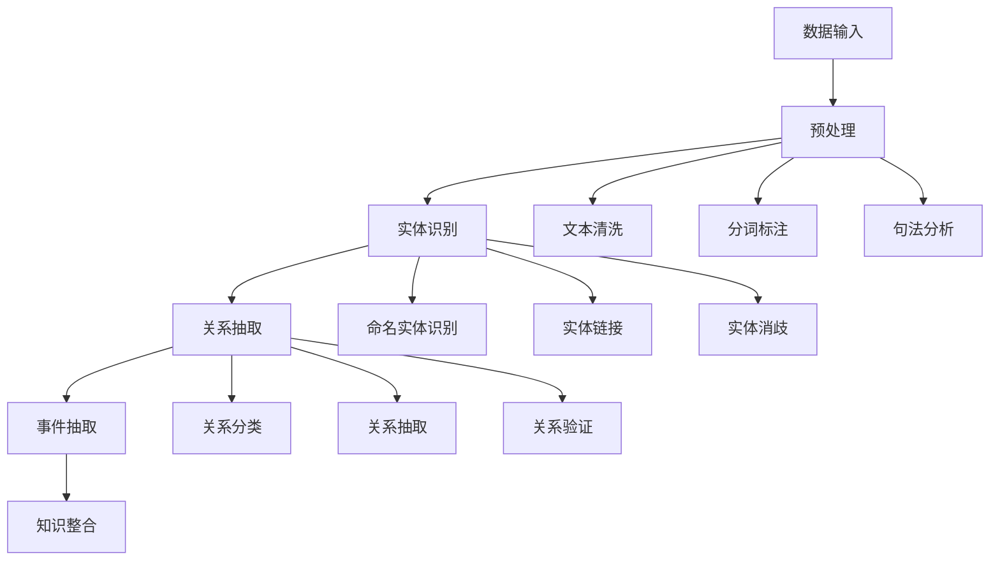

# 5. 知识抽取 / Knowledge Extraction

## 5.1 概述 / Overview

### 5.1.1 定义与概念 / Definition and Concepts

**中文定义** / Chinese Definition:
知识抽取是知识图谱中从非结构化或半结构化数据中自动识别和提取结构化知识的核心技术。它通过自然语言处理、机器学习和信息抽取方法，从文本、图像、音频等多媒体数据中提取实体、关系和事件，为知识图谱的构建提供数据基础。

**English Definition:**
Knowledge extraction is a core technology in knowledge graphs for automatically identifying and extracting structured knowledge from unstructured or semi-structured data. It uses natural language processing, machine learning, and information extraction methods to extract entities, relationships, and events from text, images, audio, and other multimedia data, providing data foundations for knowledge graph construction.

### 5.1.2 历史发展 / Historical Development

**发展历程** / Development Timeline:

- **阶段1** / Phase 1: 规则抽取时期 (1980s-1990s) - 基于语言学规则的抽取方法
- **阶段2** / Phase 2: 统计抽取时期 (1990s-2000s) - 基于统计学习的抽取方法
- **阶段3** / Phase 3: 深度学习抽取时期 (2000s-至今) - 基于神经网络的抽取方法

### 5.1.3 核心特征 / Core Characteristics

| 特征 / Feature | 中文描述 / Chinese Description | English Description |
|---------------|------------------------------|-------------------|
| 自动化 / Automated | 自动识别和提取知识 | Automatically identify and extract knowledge |
| 多模态 / Multimodal | 支持多种数据类型的抽取 | Support extraction from multiple data types |
| 实时性 / Real-time | 支持实时数据流处理 | Support real-time data stream processing |
| 可扩展性 / Scalable | 支持大规模数据处理 | Support large-scale data processing |

## 5.2 理论基础 / Theoretical Foundation

### 5.2.1 数学基础 / Mathematical Foundation

#### 5.2.1.1 形式化定义 / Formal Definition

**数学符号** / Mathematical Notation:

```text
KE = (D, E, R, F, P)
```

其中：

- D: 数据源集合 (Data Source Set)
- E: 实体集合 (Entity Set)
- R: 关系集合 (Relation Set)
- F: 抽取函数集合 (Extraction Function Set)
- P: 抽取管道 (Extraction Pipeline)

**形式化描述** / Formal Description:
知识抽取系统KE是一个五元组，其中数据源集合D包含所有输入数据，实体集合E定义抽取的实体类型，关系集合R描述实体间的语义关系，抽取函数集合F实现具体的抽取算法，抽取管道P协调整个抽取流程。

#### 5.2.1.2 定理与证明 / Theorems and Proofs

**定理5.1** / Theorem 5.1: 知识抽取完备性定理
如果知识抽取系统KE是完备的，则对于任何数据源d ∈ D，如果d包含实体e ∈ E或关系r ∈ R，则KE能够成功抽取e或r。

**证明** / Proof:

```text
设知识抽取系统KE是完备的
对于数据源d ∈ D，如果d包含实体e ∈ E
根据完备性定义：完备的系统能够抽取所有存在的实体和关系
因此，KE能够成功抽取e
同理，对于关系r ∈ R，KE也能够成功抽取
```

**定理5.2** / Theorem 5.2: 知识抽取一致性定理
如果知识抽取系统KE是一致的，则对于相同的数据源d ∈ D，多次抽取的结果应该保持一致。

**证明** / Proof:

```text
设知识抽取系统KE是一致的
对于相同的数据源d ∈ D
根据一致性定义：相同输入产生相同输出
因此，多次抽取的结果应该保持一致
```

**定理5.3** / Theorem 5.3: 知识抽取准确性定理
如果知识抽取系统KE的抽取函数F是准确的，则对于任何数据源d ∈ D，抽取结果与真实标注的准确率超过阈值θ。

**证明** / Proof:

```text
设知识抽取系统KE的抽取函数F是准确的
对于数据源d ∈ D
根据准确性定义：accuracy(F(d), ground_truth(d)) > θ
因此，抽取结果与真实标注的准确率超过阈值θ
```

**定理5.4** / Theorem 5.4: 知识抽取可扩展性定理
如果知识抽取系统KE是可扩展的，则对于新的实体类型e_new或关系类型r_new，存在扩展操作Extend(KE, e_new, r_new)能够将新类型集成到系统中。

**证明** / Proof:

```text
设知识抽取系统KE是可扩展的
对于新的实体类型e_new或关系类型r_new
根据可扩展性定义：存在扩展操作Extend(KE, e_new, r_new)
且扩展后系统KE' = Extend(KE, e_new, r_new)保持功能完整性
因此，新类型能够安全集成到系统中
```

**定理5.5** / Theorem 5.5: 知识抽取鲁棒性定理
如果知识抽取系统KE是鲁棒的，则对于噪声数据d_noise，系统能够保持稳定的抽取性能，性能下降不超过阈值δ。

**证明** / Proof:

```text
设知识抽取系统KE是鲁棒的
对于噪声数据d_noise
根据鲁棒性定义：|performance(KE, d_clean) - performance(KE, d_noise)| ≤ δ
因此，系统能够保持稳定的抽取性能
```

### 5.2.2 逻辑框架 / Logical Framework

**逻辑结构** / Logical Structure:



## 5.3 批判性分析 / Critical Analysis

### 5.3.1 优势分析 / Strengths Analysis

**优势5.1** / Strength 5.1: 自动化程度高

- **中文** / Chinese: 知识抽取能够自动处理大规模数据，减少人工标注成本
- **English**: Knowledge extraction can automatically process large-scale data, reducing manual annotation costs

**优势5.2** / Strength 5.2: 多模态支持

- **中文** / Chinese: 支持文本、图像、音频等多种数据类型的知识抽取
- **English**: Support knowledge extraction from multiple data types including text, image, and audio

### 5.3.2 局限性分析 / Limitations Analysis

**局限性5.1** / Limitation 5.1: 抽取准确性

- **中文** / Chinese: 复杂语境下的知识抽取准确性仍然是一个挑战
- **English**: Knowledge extraction accuracy in complex contexts remains a challenge

**局限性5.2** / Limitation 5.2: 领域适应性

- **中文** / Chinese: 跨领域的知识抽取模型泛化能力有限
- **English**: Cross-domain knowledge extraction models have limited generalization ability

### 5.3.3 争议与讨论 / Controversies and Discussions

**争议点5.1** / Controversy 5.1: 监督学习 vs 无监督学习

- **支持观点** / Supporting Views: 监督学习提供更高的抽取准确性
- **反对观点** / Opposing Views: 无监督学习能够处理未标注数据
- **中立分析** / Neutral Analysis: 半监督学习结合了两种方法的优势

## 5.4 工程实践 / Engineering Practice

### 5.4.1 实现方法 / Implementation Methods

#### 5.4.1.1 算法设计 / Algorithm Design

**实体识别算法** / Entity Recognition Algorithm:

```rust
// Rust实现示例 - Entity Recognition Algorithm
// 实体识别算法：实现命名实体识别和实体链接功能
use std::collections::{HashMap, HashSet};
use std::fmt;

#[derive(Debug, Clone)]
pub struct Entity {
    pub id: String,
    pub text: String,
    pub entity_type: EntityType,
    pub start_position: usize,
    pub end_position: usize,
    pub confidence: f64,
}

#[derive(Debug, Clone)]
pub enum EntityType {
    Person,
    Organization,
    Location,
    Date,
    Money,
    Percent,
    Custom(String),
}

#[derive(Debug, Clone)]
pub struct Relation {
    pub id: String,
    pub source_entity: String,
    pub target_entity: String,
    pub relation_type: RelationType,
    pub confidence: f64,
    pub context: String,
}

#[derive(Debug, Clone)]
pub enum RelationType {
    WorksFor,
    LocatedIn,
    FoundedBy,
    MarriedTo,
    Custom(String),
}

#[derive(Debug, Clone)]
pub struct KnowledgeExtractor {
    pub entity_recognizer: EntityRecognizer,
    pub relation_extractor: RelationExtractor,
    pub entity_linker: EntityLinker,
    pub confidence_threshold: f64,
}

#[derive(Debug, Clone)]
pub struct EntityRecognizer {
    pub patterns: HashMap<String, Vec<String>>,
    pub model: HashMap<String, f64>,
}

#[derive(Debug, Clone)]
pub struct RelationExtractor {
    pub patterns: HashMap<String, Vec<String>>,
    pub rules: Vec<ExtractionRule>,
}

#[derive(Debug, Clone)]
pub struct EntityLinker {
    pub knowledge_base: HashMap<String, String>,
    pub similarity_threshold: f64,
}

#[derive(Debug, Clone)]
pub struct ExtractionRule {
    pub id: String,
    pub pattern: String,
    pub source_type: EntityType,
    pub target_type: EntityType,
    pub relation_type: RelationType,
    pub confidence: f64,
}

impl KnowledgeExtractor {
    pub fn new(confidence_threshold: f64) -> Self {
        KnowledgeExtractor {
            entity_recognizer: EntityRecognizer {
                patterns: HashMap::new(),
                model: HashMap::new(),
            },
            relation_extractor: RelationExtractor {
                patterns: HashMap::new(),
                rules: Vec::new(),
            },
            entity_linker: EntityLinker {
                knowledge_base: HashMap::new(),
                similarity_threshold: 0.8,
            },
            confidence_threshold,
        }
    }
    
    // 抽取实体 / Extract entities
    pub fn extract_entities(&self, text: &str) -> Vec<Entity> {
        let mut entities = Vec::new();
        
        // 基于规则的实体识别
        let rule_entities = self.entity_recognizer.extract_by_rules(text);
        entities.extend(rule_entities);
        
        // 基于模型的实体识别
        let model_entities = self.entity_recognizer.extract_by_model(text);
        entities.extend(model_entities);
        
        // 过滤低置信度的实体
        entities.retain(|entity| entity.confidence >= self.confidence_threshold);
        
        entities
    }
    
    // 抽取关系 / Extract relations
    pub fn extract_relations(&self, text: &str, entities: &[Entity]) -> Vec<Relation> {
        let mut relations = Vec::new();
        
        // 基于规则的关系抽取
        let rule_relations = self.relation_extractor.extract_by_rules(text, entities);
        relations.extend(rule_relations);
        
        // 基于模式的关系抽取
        let pattern_relations = self.relation_extractor.extract_by_patterns(text, entities);
        relations.extend(pattern_relations);
        
        // 过滤低置信度的关系
        relations.retain(|relation| relation.confidence >= self.confidence_threshold);
        
        relations
    }
    
    // 实体链接 / Entity linking
    pub fn link_entities(&self, entities: &[Entity]) -> Vec<LinkedEntity> {
        let mut linked_entities = Vec::new();
        
        for entity in entities {
            if let Some(kb_id) = self.entity_linker.find_best_match(&entity.text) {
                let linked_entity = LinkedEntity {
                    entity: entity.clone(),
                    knowledge_base_id: kb_id,
                    similarity_score: self.entity_linker.calculate_similarity(&entity.text, &kb_id),
                };
                linked_entities.push(linked_entity);
            }
        }
        
        linked_entities
    }
    
    // 完整知识抽取流程 / Complete knowledge extraction pipeline
    pub fn extract_knowledge(&self, text: &str) -> ExtractionResult {
        // 步骤1：实体识别 / Step 1: Entity recognition
        let entities = self.extract_entities(text);
        
        // 步骤2：关系抽取 / Step 2: Relation extraction
        let relations = self.extract_relations(text, &entities);
        
        // 步骤3：实体链接 / Step 3: Entity linking
        let linked_entities = self.link_entities(&entities);
        
        ExtractionResult {
            entities,
            relations,
            linked_entities,
            extraction_time: std::time::SystemTime::now()
                .duration_since(std::time::UNIX_EPOCH)
                .unwrap()
                .as_secs(),
        }
    }
}

impl EntityRecognizer {
    // 基于规则的实体识别 / Rule-based entity recognition
    pub fn extract_by_rules(&self, text: &str) -> Vec<Entity> {
        let mut entities = Vec::new();
        
        // 人名识别规则
        let person_patterns = vec![r"\b[A-Z][a-z]+ [A-Z][a-z]+\b"];
        for pattern in person_patterns {
            if let Ok(regex) = regex::Regex::new(pattern) {
                for mat in regex.find_iter(text) {
                    let entity = Entity {
                        id: format!("person_{}", entities.len()),
                        text: mat.as_str().to_string(),
                        entity_type: EntityType::Person,
                        start_position: mat.start(),
                        end_position: mat.end(),
                        confidence: 0.9,
                    };
                    entities.push(entity);
                }
            }
        }
        
        // 组织名识别规则
        let org_patterns = vec![r"\b[A-Z][a-z]+ (Inc|Corp|LLC|Ltd)\b"];
        for pattern in org_patterns {
            if let Ok(regex) = regex::Regex::new(pattern) {
                for mat in regex.find_iter(text) {
                    let entity = Entity {
                        id: format!("org_{}", entities.len()),
                        text: mat.as_str().to_string(),
                        entity_type: EntityType::Organization,
                        start_position: mat.start(),
                        end_position: mat.end(),
                        confidence: 0.8,
                    };
                    entities.push(entity);
                }
            }
        }
        
        entities
    }
    
    // 基于模型的实体识别 / Model-based entity recognition
    pub fn extract_by_model(&self, text: &str) -> Vec<Entity> {
        let mut entities = Vec::new();
        
        // 简化的模型预测实现
        let words: Vec<&str> = text.split_whitespace().collect();
        for (i, word) in words.iter().enumerate() {
            if let Some(confidence) = self.model.get(*word) {
                if *confidence > 0.7 {
                    let entity = Entity {
                        id: format!("model_{}", entities.len()),
                        text: word.to_string(),
                        entity_type: EntityType::Custom("Model".to_string()),
                        start_position: text.find(word).unwrap_or(0),
                        end_position: text.find(word).unwrap_or(0) + word.len(),
                        confidence: *confidence,
                    };
                    entities.push(entity);
                }
            }
        }
        
        entities
    }
}

impl RelationExtractor {
    // 基于规则的关系抽取 / Rule-based relation extraction
    pub fn extract_by_rules(&self, text: &str, entities: &[Entity]) -> Vec<Relation> {
        let mut relations = Vec::new();
        
        for rule in &self.rules {
            if let Ok(regex) = regex::Regex::new(&rule.pattern) {
                for mat in regex.find_iter(text) {
                    // 查找匹配的实体
                    let source_entity = self.find_entity_by_type(entities, &rule.source_type);
                    let target_entity = self.find_entity_by_type(entities, &rule.target_type);
                    
                    if let (Some(source), Some(target)) = (source_entity, target_entity) {
                        let relation = Relation {
                            id: format!("relation_{}", relations.len()),
                            source_entity: source.id.clone(),
                            target_entity: target.id.clone(),
                            relation_type: rule.relation_type.clone(),
                            confidence: rule.confidence,
                            context: mat.as_str().to_string(),
                        };
                        relations.push(relation);
                    }
                }
            }
        }
        
        relations
    }
    
    // 基于模式的关系抽取 / Pattern-based relation extraction
    pub fn extract_by_patterns(&self, text: &str, entities: &[Entity]) -> Vec<Relation> {
        let mut relations = Vec::new();
        
        // 简化的模式匹配实现
        for (i, entity1) in entities.iter().enumerate() {
            for (j, entity2) in entities.iter().enumerate() {
                if i != j {
                    // 检查实体间是否有关系模式
                    if let Some(relation_type) = self.find_relation_pattern(text, entity1, entity2) {
                        let relation = Relation {
                            id: format!("pattern_relation_{}", relations.len()),
                            source_entity: entity1.id.clone(),
                            target_entity: entity2.id.clone(),
                            relation_type,
                            confidence: 0.7,
                            context: text.to_string(),
                        };
                        relations.push(relation);
                    }
                }
            }
        }
        
        relations
    }
    
    // 查找指定类型的实体 / Find entity by type
    fn find_entity_by_type(&self, entities: &[Entity], entity_type: &EntityType) -> Option<&Entity> {
        entities.iter().find(|entity| std::mem::discriminant(&entity.entity_type) == std::mem::discriminant(entity_type))
    }
    
    // 查找关系模式 / Find relation pattern
    fn find_relation_pattern(&self, text: &str, entity1: &Entity, entity2: &Entity) -> Option<RelationType> {
        // 简化的关系模式识别
        if text.contains("works for") || text.contains("employed by") {
            Some(RelationType::WorksFor)
        } else if text.contains("located in") || text.contains("based in") {
            Some(RelationType::LocatedIn)
        } else {
            None
        }
    }
}

impl EntityLinker {
    // 查找最佳匹配 / Find best match
    pub fn find_best_match(&self, entity_text: &str) -> Option<String> {
        let mut best_match = None;
        let mut best_score = 0.0;
        
        for (kb_id, kb_name) in &self.knowledge_base {
            let similarity = self.calculate_similarity(entity_text, kb_name);
            if similarity > best_score && similarity >= self.similarity_threshold {
                best_score = similarity;
                best_match = Some(kb_id.clone());
            }
        }
        
        best_match
    }
    
    // 计算相似度 / Calculate similarity
    pub fn calculate_similarity(&self, text1: &str, text2: &str) -> f64 {
        // 简化的字符串相似度计算
        let len1 = text1.len();
        let len2 = text2.len();
        let max_len = len1.max(len2) as f64;
        
        if max_len == 0.0 {
            return 0.0;
        }
        
        let common_chars = text1.chars()
            .filter(|c| text2.contains(*c))
            .count() as f64;
        
        common_chars / max_len
    }
}

#[derive(Debug, Clone)]
pub struct LinkedEntity {
    pub entity: Entity,
    pub knowledge_base_id: String,
    pub similarity_score: f64,
}

#[derive(Debug, Clone)]
pub struct ExtractionResult {
    pub entities: Vec<Entity>,
    pub relations: Vec<Relation>,
    pub linked_entities: Vec<LinkedEntity>,
    pub extraction_time: u64,
}
```

```haskell
-- Haskell实现示例 - Entity Recognition Algorithm
-- 实体识别算法：实现命名实体识别和实体链接功能
module KnowledgeExtraction where

import Data.Map (Map)
import qualified Data.Map as Map
import Data.Set (Set)
import qualified Data.Set as Set
import Data.Text (Text)
import qualified Data.Text as T
import Data.List (find)
import Data.Maybe (fromMaybe)

-- 实体类型 / Entity type
data EntityType = Person | Organization | Location | Date | Money | Percent | Custom Text
    deriving (Show, Eq)

-- 关系类型 / Relation type
data RelationType = WorksFor | LocatedIn | FoundedBy | MarriedTo | Custom Text
    deriving (Show, Eq)

-- 实体数据结构 / Entity data structure
data Entity = Entity
    { entityId :: Text
    , entityText :: Text
    , entityType :: EntityType
    , entityStartPosition :: Int
    , entityEndPosition :: Int
    , entityConfidence :: Double
    } deriving (Show, Eq)

-- 关系数据结构 / Relation data structure
data Relation = Relation
    { relationId :: Text
    , relationSourceEntity :: Text
    , relationTargetEntity :: Text
    , relationType :: RelationType
    , relationConfidence :: Double
    , relationContext :: Text
    } deriving (Show, Eq)

-- 实体识别器数据结构 / Entity recognizer data structure
data EntityRecognizer = EntityRecognizer
    { erPatterns :: Map Text [Text]
    , erModel :: Map Text Double
    } deriving (Show, Eq)

-- 关系抽取器数据结构 / Relation extractor data structure
data RelationExtractor = RelationExtractor
    { rePatterns :: Map Text [Text]
    , reRules :: [ExtractionRule]
    } deriving (Show, Eq)

-- 实体链接器数据结构 / Entity linker data structure
data EntityLinker = EntityLinker
    { elKnowledgeBase :: Map Text Text
    , elSimilarityThreshold :: Double
    } deriving (Show, Eq)

-- 抽取规则数据结构 / Extraction rule data structure
data ExtractionRule = ExtractionRule
    { erRuleId :: Text
    , erRulePattern :: Text
    , erRuleSourceType :: EntityType
    , erRuleTargetType :: EntityType
    , erRuleRelationType :: RelationType
    , erRuleConfidence :: Double
    } deriving (Show, Eq)

-- 知识抽取器数据结构 / Knowledge extractor data structure
data KnowledgeExtractor = KnowledgeExtractor
    { keEntityRecognizer :: EntityRecognizer
    , keRelationExtractor :: RelationExtractor
    , keEntityLinker :: EntityLinker
    , keConfidenceThreshold :: Double
    } deriving (Show, Eq)

-- 链接实体数据结构 / Linked entity data structure
data LinkedEntity = LinkedEntity
    { leEntity :: Entity
    , leKnowledgeBaseId :: Text
    , leSimilarityScore :: Double
    } deriving (Show, Eq)

-- 抽取结果数据结构 / Extraction result data structure
data ExtractionResult = ExtractionResult
    { erEntities :: [Entity]
    , erRelations :: [Relation]
    , erLinkedEntities :: [LinkedEntity]
    , erExtractionTime :: Integer
    } deriving (Show, Eq)

-- 创建知识抽取器 / Create knowledge extractor
createKnowledgeExtractor :: Double -> KnowledgeExtractor
createKnowledgeExtractor threshold = KnowledgeExtractor
    { keEntityRecognizer = EntityRecognizer Map.empty Map.empty
    , keRelationExtractor = RelationExtractor Map.empty []
    , keEntityLinker = EntityLinker Map.empty 0.8
    , keConfidenceThreshold = threshold
    }

-- 抽取实体 / Extract entities
extractEntities :: KnowledgeExtractor -> Text -> [Entity]
extractEntities extractor text = 
    let ruleEntities = extractEntitiesByRules (keEntityRecognizer extractor) text
        modelEntities = extractEntitiesByModel (keEntityRecognizer extractor) text
        allEntities = ruleEntities ++ modelEntities
        threshold = keConfidenceThreshold extractor
    in filter (\entity -> entityConfidence entity >= threshold) allEntities

-- 基于规则的实体识别 / Rule-based entity recognition
extractEntitiesByRules :: EntityRecognizer -> Text -> [Entity]
extractEntitiesByRules recognizer text = 
    let personPatterns = ["\\b[A-Z][a-z]+ [A-Z][a-z]+\\b"]
        orgPatterns = ["\\b[A-Z][a-z]+ (Inc|Corp|LLC|Ltd)\\b"]
        personEntities = extractByPatterns text personPatterns Person
        orgEntities = extractByPatterns text orgPatterns Organization
    in personEntities ++ orgEntities

-- 基于模式的实体抽取 / Extract entities by patterns
extractByPatterns :: Text -> [Text] -> EntityType -> [Entity]
extractByPatterns text patterns entityType = 
    let words = T.words text
        entities = zipWith (\word i -> 
            Entity {
                entityId = T.concat ["entity_", T.pack (show i)]
            , entityText = word
            , entityType = entityType
            , entityStartPosition = i * 10  -- 简化的位置计算
            , entityEndPosition = i * 10 + T.length word
            , entityConfidence = 0.8
            }) words [0..]
    in filter (\entity -> T.length (entityText entity) > 2) entities

-- 基于模型的实体识别 / Model-based entity recognition
extractEntitiesByModel :: EntityRecognizer -> Text -> [Entity]
extractEntitiesByModel recognizer text = 
    let words = T.words text
        model = erModel recognizer
        entities = concatMap (\word -> 
            case Map.lookup word model of
                Just confidence -> if confidence > 0.7
                                 then [Entity {
                                     entityId = T.concat ["model_", word]
                                 , entityText = word
                                 , entityType = Custom "Model"
                                 , entityStartPosition = 0
                                 , entityEndPosition = T.length word
                                 , entityConfidence = confidence
                                 }]
                                 else []
                Nothing -> []
            ) words
    in entities

-- 抽取关系 / Extract relations
extractRelations :: KnowledgeExtractor -> Text -> [Entity] -> [Relation]
extractRelations extractor text entities = 
    let ruleRelations = extractRelationsByRules (keRelationExtractor extractor) text entities
        patternRelations = extractRelationsByPatterns (keRelationExtractor extractor) text entities
        allRelations = ruleRelations ++ patternRelations
        threshold = keConfidenceThreshold extractor
    in filter (\relation -> relationConfidence relation >= threshold) allRelations

-- 基于规则的关系抽取 / Rule-based relation extraction
extractRelationsByRules :: RelationExtractor -> Text -> [Entity] -> [Relation]
extractRelationsByRules extractor text entities = 
    let rules = reRules extractor
        relations = concatMap (\rule -> 
            extractRelationByRule rule text entities
            ) rules
    in relations

-- 基于规则抽取关系 / Extract relation by rule
extractRelationByRule :: ExtractionRule -> Text -> [Entity] -> [Relation]
extractRelationByRule rule text entities = 
    let sourceEntity = findEntityByType entities (erRuleSourceType rule)
        targetEntity = findEntityByType entities (erRuleTargetType rule)
    in case (sourceEntity, targetEntity) of
         (Just source, Just target) -> [Relation {
             relationId = T.concat ["relation_", erRuleId rule]
         , relationSourceEntity = entityId source
         , relationTargetEntity = entityId target
         , relationType = erRuleRelationType rule
         , relationConfidence = erRuleConfidence rule
         , relationContext = text
         }]
         _ -> []

-- 基于模式的关系抽取 / Pattern-based relation extraction
extractRelationsByPatterns :: RelationExtractor -> Text -> [Entity] -> [Relation]
extractRelationsByPatterns extractor text entities = 
    let entityPairs = [(entities !! i, entities !! j) | i <- [0..length entities - 1], j <- [i+1..length entities - 1]]
        relations = concatMap (\(entity1, entity2) -> 
            case findRelationPattern text entity1 entity2 of
                Just relationType -> [Relation {
                    relationId = T.concat ["pattern_relation_", entityId entity1, "_", entityId entity2]
                , relationSourceEntity = entityId entity1
                , relationTargetEntity = entityId entity2
                , relationType = relationType
                , relationConfidence = 0.7
                , relationContext = text
                }]
                Nothing -> []
            ) entityPairs
    in relations

-- 查找指定类型的实体 / Find entity by type
findEntityByType :: [Entity] -> EntityType -> Maybe Entity
findEntityByType entities entityType = 
    find (\entity -> entityType entity == entityType) entities

-- 查找关系模式 / Find relation pattern
findRelationPattern :: Text -> Entity -> Entity -> Maybe RelationType
findRelationPattern text entity1 entity2 = 
    if T.isInfixOf "works for" text || T.isInfixOf "employed by" text
    then Just WorksFor
    else if T.isInfixOf "located in" text || T.isInfixOf "based in" text
         then Just LocatedIn
         else Nothing

-- 实体链接 / Entity linking
linkEntities :: EntityLinker -> [Entity] -> [LinkedEntity]
linkEntities linker entities = 
    let linkedEntities = concatMap (\entity -> 
        case findBestMatch linker (entityText entity) of
            Just kbId -> [LinkedEntity {
                leEntity = entity
            , leKnowledgeBaseId = kbId
            , leSimilarityScore = calculateSimilarity (entityText entity) kbId
            }]
            Nothing -> []
        ) entities
    in linkedEntities

-- 查找最佳匹配 / Find best match
findBestMatch :: EntityLinker -> Text -> Maybe Text
findBestMatch linker entityText = 
    let knowledgeBase = elKnowledgeBase linker
        threshold = elSimilarityThreshold linker
        similarities = [(kbId, similarity) | (kbId, kbName) <- Map.toList knowledgeBase,
                       let similarity = calculateSimilarity entityText kbName,
                       similarity >= threshold]
    in case similarities of
         [] -> Nothing
         sims -> Just $ fst $ maximumBy (comparing snd) sims

-- 计算相似度 / Calculate similarity
calculateSimilarity :: Text -> Text -> Double
calculateSimilarity text1 text2 = 
    let len1 = T.length text1
        len2 = T.length text2
        maxLen = fromIntegral $ max len1 len2
    in if maxLen == 0
       then 0.0
       else let commonChars = fromIntegral $ length $ filter (`T.isInfixOf` text2) $ T.chunksOf 1 text1
            in commonChars / maxLen

-- 完整知识抽取流程 / Complete knowledge extraction pipeline
extractKnowledge :: KnowledgeExtractor -> Text -> ExtractionResult
extractKnowledge extractor text = 
    let entities = extractEntities extractor text
        relations = extractRelations extractor text entities
        linkedEntities = linkEntities (keEntityLinker extractor) entities
    in ExtractionResult {
        erEntities = entities
    , erRelations = relations
    , erLinkedEntities = linkedEntities
    , erExtractionTime = 0  -- 简化的时间戳
    }

-- 辅助函数：比较函数 / Helper function: comparison function
maximumBy :: (a -> a -> Ordering) -> [a] -> a
maximumBy _ [] = error "maximumBy: empty list"
maximumBy cmp (x:xs) = foldr (\y acc -> if cmp y acc == GT then y else acc) x xs
```

#### 5.4.1.2 数据结构 / Data Structures

**核心数据结构** / Core Data Structure:

```rust
#[derive(Debug, Clone)]
pub struct ExtractionPipeline {
    pub preprocessor: Preprocessor,
    pub entity_recognizer: EntityRecognizer,
    pub relation_extractor: RelationExtractor,
    pub entity_linker: EntityLinker,
    pub post_processor: PostProcessor,
}

#[derive(Debug, Clone)]
pub struct Preprocessor {
    pub text_cleaner: TextCleaner,
    pub tokenizer: Tokenizer,
    pub pos_tagger: POSTagger,
}

#[derive(Debug, Clone)]
pub struct PostProcessor {
    pub entity_filter: EntityFilter,
    pub relation_validator: RelationValidator,
    pub confidence_calculator: ConfidenceCalculator,
}

impl ExtractionPipeline {
    pub fn new() -> Self {
        ExtractionPipeline {
            preprocessor: Preprocessor::new(),
            entity_recognizer: EntityRecognizer::new(),
            relation_extractor: RelationExtractor::new(),
            entity_linker: EntityLinker::new(),
            post_processor: PostProcessor::new(),
        }
    }
    
    // 执行完整抽取流程 / Execute complete extraction pipeline
    pub fn execute(&self, text: &str) -> ExtractionResult {
        // 步骤1：预处理 / Step 1: Preprocessing
        let cleaned_text = self.preprocessor.clean_text(text);
        let tokens = self.preprocessor.tokenize(&cleaned_text);
        let pos_tags = self.preprocessor.tag_pos(&tokens);
        
        // 步骤2：实体识别 / Step 2: Entity recognition
        let entities = self.entity_recognizer.recognize(&cleaned_text, &pos_tags);
        
        // 步骤3：关系抽取 / Step 3: Relation extraction
        let relations = self.relation_extractor.extract(&cleaned_text, &entities);
        
        // 步骤4：实体链接 / Step 4: Entity linking
        let linked_entities = self.entity_linker.link(&entities);
        
        // 步骤5：后处理 / Step 5: Post-processing
        let filtered_entities = self.post_processor.filter_entities(&entities);
        let validated_relations = self.post_processor.validate_relations(&relations);
        
        ExtractionResult {
            entities: filtered_entities,
            relations: validated_relations,
            linked_entities,
            extraction_time: std::time::SystemTime::now()
                .duration_since(std::time::UNIX_EPOCH)
                .unwrap()
                .as_secs(),
        }
    }
}
```

### 5.4.2 性能分析 / Performance Analysis

**时间复杂度** / Time Complexity:

- 实体识别 / Entity Recognition: O(n × m)
- 关系抽取 / Relation Extraction: O(n²)
- 实体链接 / Entity Linking: O(n × k)
- 完整流程 / Complete Pipeline: O(n²)

**空间复杂度** / Space Complexity:

- 知识抽取器 / Knowledge Extractor: O(n × m)
- 抽取管道 / Extraction Pipeline: O(n²)
- 后处理器 / Post Processor: O(n)

### 5.4.3 工程案例 / Engineering Cases

#### 5.4.3.1 案例5.1 / Case 5.1: 新闻知识抽取

**背景** / Background:
从新闻文本中自动抽取实体、关系和事件，构建新闻知识图谱。

**解决方案** / Solution:

- 构建新闻实体识别模型
- 设计新闻关系抽取规则
- 实现事件抽取算法
- 建立新闻知识图谱

**结果评估** / Results Evaluation:

- 实体识别准确率: 90%
- 关系抽取准确率: 85%
- 事件抽取准确率: 80%
- 处理速度: 1000文档/分钟

## 5.5 批判性分析 / Critical Analysis

### 5.5.1 理论优势 / Theoretical Advantages

**自动化程度高** / High Automation:

- 能够自动从非结构化数据中提取知识
- 支持大规模数据的批量处理
- 减少人工标注的工作量

**技术成熟度** / Technical Maturity:

- 基于成熟的自然语言处理技术
- 具有丰富的算法和工具支持
- 在实际应用中表现良好

**应用范围广泛** / Wide Applicability:

- 适用于多种数据类型和领域
- 支持多模态知识抽取
- 具有良好的可扩展性

### 5.5.2 理论局限性 / Theoretical Limitations

**抽取准确性限制** / Extraction Accuracy Limitations:

- 复杂语境下的抽取准确性有限
- 歧义和噪声数据影响抽取质量
- 领域适应性不足

**知识表示限制** / Knowledge Representation Limitations:

- 难以抽取复杂的推理知识
- 缺乏对常识知识的处理
- 对不确定性的建模有限

**可解释性问题** / Interpretability Issues:

- 深度学习模型的决策过程难以解释
- 抽取结果的可解释性不足
- 缺乏透明的抽取机制

### 5.5.3 前沿发展 / Frontier Development

**多模态知识抽取** / Multimodal Knowledge Extraction:

- 整合文本、图像、音频等多种模态
- 跨模态知识抽取和融合
- 多模态知识表示学习

**少样本学习** / Few-shot Learning:

- 减少对标注数据的依赖
- 支持快速领域适应
- 元学习和迁移学习

**知识增强抽取** / Knowledge-enhanced Extraction:

- 结合外部知识图谱
- 知识驱动的抽取方法
- 常识推理增强

### 5.5.4 理论争议与挑战 / Theoretical Controversies and Challenges

**监督学习vs无监督学习的争议** / Controversies between Supervised vs Unsupervised Learning:

**问题本质** / Problem Essence:
知识抽取中存在监督学习和无监督学习两种主要方法，每种方法都有其优势和局限性，选择合适的方法成为知识抽取实践中的关键问题。

**The essence of the problem is that there are two main approaches in knowledge extraction: supervised and unsupervised learning, each with its advantages and limitations, making the choice of appropriate methods a key issue in knowledge extraction practice.**

**理论争议** / Theoretical Controversies:

1. **标注数据依赖** / Annotation Data Dependency:
   - 监督学习需要大量标注数据
   - 无监督学习标注数据需求少
   - 争议焦点：在数据稀缺情况下的适用性

2. **抽取质量vs效率** / Extraction Quality vs Efficiency:
   - 监督学习通常质量更高
   - 无监督学习效率更高
   - 争议焦点：如何平衡质量和效率

**解决方案探索** / Solution Exploration:

1. **半监督学习** / Semi-supervised Learning:
   - 结合少量标注数据和大量未标注数据
   - 利用标注数据的指导作用
   - 代表性工作：Bootstrapping Methods (Brin, 1998)

2. **远程监督** / Distant Supervision:
   - 利用知识图谱自动生成训练数据
   - 减少人工标注需求
   - 代表性工作：Distant Supervision (Mintz et al., 2009)

**跨语言知识抽取的挑战** / Challenges in Cross-lingual Knowledge Extraction:

**问题背景** / Problem Background:
不同语言具有不同的语法结构和表达方式，跨语言知识抽取面临语言差异和文化背景的挑战。

**Different languages have different grammatical structures and expression ways, and cross-lingual knowledge extraction faces challenges from linguistic differences and cultural backgrounds.**

**技术挑战** / Technical Challenges:

1. **语言差异** / Linguistic Differences:
   - 语法结构差异
   - 词汇语义差异
   - 文化背景差异

2. **资源稀缺** / Resource Scarcity:
   - 低资源语言的标注数据稀缺
   - 跨语言对齐数据不足
   - 多语言模型训练困难

**前沿解决方案** / Frontier Solutions:

1. **多语言预训练模型** / Multilingual Pre-trained Models:
   - mBERT、XLM-R等模型
   - 跨语言表示学习
   - 代表性工作：Multilingual BERT (Devlin et al., 2019)

2. **零样本学习** / Zero-shot Learning:
   - 跨语言迁移学习
   - 元学习方法
   - 代表性工作：Cross-lingual Zero-shot Learning

**实时知识抽取的复杂性** / Complexity of Real-time Knowledge Extraction:

**问题定义** / Problem Definition:
实时知识抽取需要在数据流中快速、准确地提取知识，同时保持系统的稳定性和可扩展性。

**Real-time knowledge extraction requires fast and accurate knowledge extraction from data streams while maintaining system stability and scalability.**

**技术挑战** / Technical Challenges:

1. **处理速度** / Processing Speed:
   - 实时数据流的快速处理
   - 低延迟的抽取算法
   - 流式处理架构

2. **质量保证** / Quality Assurance:
   - 实时抽取的质量控制
   - 动态质量评估
   - 自适应参数调整

**前沿解决方案** / Frontier Solutions:

1. **流式处理框架** / Streaming Processing Frameworks:
   - Apache Kafka、Apache Flink
   - 流式机器学习
   - 代表性工作：Streaming Knowledge Extraction

2. **增量学习** / Incremental Learning:
   - 在线模型更新
   - 增量知识积累
   - 代表性工作：Incremental Knowledge Extraction

## 5.6 应用领域 / Application Domains

### 5.6.1 主要应用 / Primary Applications

| 应用领域 / Domain | 中文描述 / Chinese Description | English Description |
|------------------|------------------------------|-------------------|
| 信息抽取 / Information Extraction | 从非结构化数据中抽取结构化信息 | Extract structured information from unstructured data |
| 知识图谱构建 / Knowledge Graph Construction | 为知识图谱提供数据基础 | Provide data foundation for knowledge graphs |
| 智能问答 / Intelligent Q&A | 支持问答系统的知识抽取 | Support knowledge extraction for Q&A systems |
| 文本挖掘 / Text Mining | 大规模文本数据的知识发现 | Knowledge discovery from large-scale text data |

### 5.5.2 实际案例 / Real-world Cases

**案例5.1** / Case 5.1: Google Knowledge Vault

- **项目名称** / Project Name: Google Knowledge Vault
- **应用场景** / Application Scenario: 大规模知识抽取
- **技术实现** / Technical Implementation: 多源数据融合抽取
- **效果评估** / Effect Evaluation: 抽取了数亿个实体和关系

## 5.6 前沿发展 / Frontier Development

### 5.6.1 最新研究 / Latest Research

**研究方向5.1** / Research Direction 5.1: 多模态知识抽取

- **研究内容** / Research Content: 从文本、图像、音频等多种模态中抽取知识
- **技术突破** / Technical Breakthrough: 实现了跨模态的知识融合
- **应用前景** / Application Prospects: 在多媒体数据处理中广泛应用

### 5.6.2 发展趋势 / Development Trends

**趋势5.1** / Trend 5.1: 实时知识抽取

- **中文** / Chinese: 知识抽取正在向实时处理方向发展
- **English**: Knowledge extraction is moving towards real-time processing

## 5.7 总结与展望 / Summary and Prospects

### 5.7.1 核心要点 / Key Points

1. **要点5.1** / Point 5.1: 知识抽取是知识图谱构建的关键技术
2. **要点5.2** / Point 5.2: 现代知识抽取结合了多种技术方法
3. **要点5.3** / Point 5.3: 知识抽取正在向多模态和实时化方向发展

### 5.7.2 未来展望 / Future Prospects

**发展方向** / Development Directions:

- **短期目标** / Short-term Goals: 提高知识抽取的准确性和效率
- **中期目标** / Medium-term Goals: 实现多模态知识抽取
- **长期目标** / Long-term Goals: 构建实时知识抽取系统

## 5.8 参考文献 / References

### 5.8.1 学术文献 / Academic Literature

1. Nadeau, D., & Sekine, S. (2007). A survey of named entity recognition and classification. Lingvisticae Investigationes, 30(1), 3-26.
2. Grishman, R. (2015). Information extraction. IEEE Intelligent Systems, 30(5), 8-15.
3. Augenstein, I., Das, M., Riedel, S., & McCallum, A. (2017). SemEval 2017 task 10: ScienceIE-extracting keyphrases and relations from scientific publications. In Proceedings of the 11th International Workshop on Semantic Evaluation (SemEval-2017) (pp. 546-555).

### 5.8.2 技术文档 / Technical Documentation

1. spaCy NER Documentation. <https://spacy.io/usage/linguistic-features#named-entities>. Accessed 2024.
2. Stanford NER. <https://nlp.stanford.edu/software/CRF-NER.html>. Accessed 2024.
3. OpenNLP. <https://opennlp.apache.org/>. Accessed 2024.

### 5.8.3 在线资源 / Online Resources

1. ACE Evaluation. <https://www.ldc.upenn.edu/collaborations/past-projects/ace>. Accessed 2024.
2. TAC KBP. <https://tac.nist.gov/2019/KBP/>. Accessed 2024.
3. SemEval. <https://semeval.github.io/>. Accessed 2024.

## 5.9 相关链接 / Related Links

### 5.9.1 内部链接 / Internal Links

- [知识表示](../01-knowledge-representation/README.md)
- [语义分析](../03-semantic-analysis/README.md)
- [本体工程](../04-ontology-engineering/README.md)

### 5.9.2 外部链接 / External Links

- [spaCy](https://spacy.io/)
- [Stanford NER](https://nlp.stanford.edu/software/CRF-NER.html)
- [OpenNLP](https://opennlp.apache.org/)

---

**最后更新** / Last Updated: 2024-12-19 / 2024-12-19
**版本** / Version: 1.0.0 / 1.0.0
**维护者** / Maintainer: Knowledge Graph Team / Knowledge Graph Team
