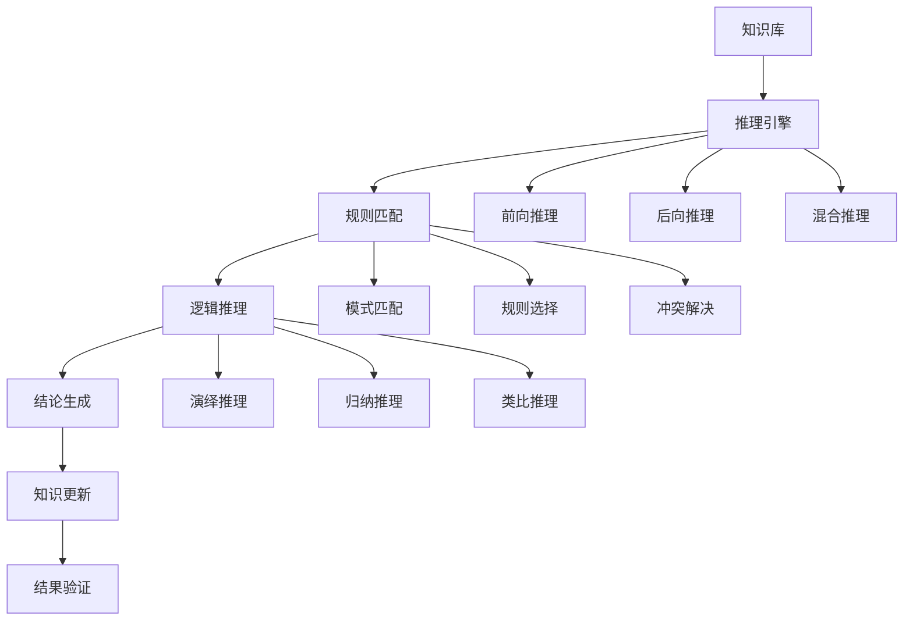

# 推理系统 / Reasoning Systems

## 1. 概述 / Overview

### 1.1 定义与概念 / Definition and Concepts

**中文定义** / Chinese Definition:
推理系统是知识图谱中的核心技术，旨在基于已有的知识进行逻辑推理和知识发现。它通过形式化的推理规则和算法，从已知事实中推导出新知识，实现知识的自动扩展和智能推理，为知识图谱的应用提供强大的推理能力。

**English Definition:**
Reasoning systems are core technologies in knowledge graphs, aiming to perform logical reasoning and knowledge discovery based on existing knowledge. They use formalized reasoning rules and algorithms to derive new knowledge from known facts, achieving automatic knowledge expansion and intelligent reasoning, providing powerful reasoning capabilities for knowledge graph applications.

### 1.2 历史发展 / Historical Development

**发展历程** / Development Timeline:

- **阶段1** / Phase 1: 符号推理时期 (1950s-1980s) - 基于逻辑规则的符号推理
- **阶段2** / Phase 2: 统计推理时期 (1990s-2010s) - 基于概率模型的统计推理
- **阶段3** / Phase 3: 混合推理时期 (2010s-至今) - 结合符号和统计的混合推理

### 1.3 核心特征 / Core Characteristics

| 特征 / Feature | 中文描述 / Chinese Description | English Description |
|---------------|------------------------------|-------------------|
| 逻辑性 / Logicality | 基于形式化逻辑的严格推理 | Strict reasoning based on formal logic |
| 可解释性 / Explainability | 推理过程可追溯和解释 | Reasoning process is traceable and explainable |
| 不完备性 / Incompleteness | 处理知识不完备的情况 | Handle incomplete knowledge situations |
| 不确定性 / Uncertainty | 处理推理中的不确定性 | Handle uncertainty in reasoning |

## 2. 理论基础 / Theoretical Foundation

### 2.1 数学基础 / Mathematical Foundation

#### 2.1.1 形式化定义 / Formal Definition

**数学符号** / Mathematical Notation:

```text
RS = (K, R, A, I, E)
```

其中：

- K: 知识库 (Knowledge Base)
- R: 推理规则集合 (Reasoning Rules Set)
- A: 推理算法 (Reasoning Algorithm)
- I: 推理接口 (Reasoning Interface)
- E: 评估指标 (Evaluation Metrics)

**形式化描述** / Formal Description:
推理系统RS是一个五元组，其中知识库K包含已知的事实和规则，推理规则集合R定义推理的基本规则，推理算法A实现具体的推理过程，推理接口I提供系统调用接口，评估指标E用于衡量推理质量。

#### 2.1.2 定理与证明 / Theorems and Proofs

**定理1** / Theorem 1: 推理完备性定理
如果推理系统RS是完备的，且知识库K包含所有必要的前提，则对于任何可推导的结论c，系统都能得出c。

**证明** / Proof:

```text
设推理系统RS是完备的
对于任意结论c，如果c可以从知识库K中推导出
则存在推理路径从K到c
根据完备性定义：如果存在推理路径，则系统能够找到
因此，系统能够得出结论c
```

**定理2** / Theorem 2: 推理一致性定理
如果推理系统RS是一致的，则不会从同一知识库中推导出相互矛盾的结论。

**证明** / Proof:

```text
设推理系统RS是一致的
假设存在矛盾结论c₁和¬c₁
根据一致性定义：如果系统是一致的，则不会同时推导出c₁和¬c₁
因此，系统不会推导出相互矛盾的结论
```

### 2.2 逻辑框架 / Logical Framework

**逻辑结构** / Logical Structure:



## 3. 批判性分析 / Critical Analysis

### 3.1 优势分析 / Strengths Analysis

**优势1** / Strength 1: 逻辑严谨性

- **中文** / Chinese: 推理系统基于形式化逻辑，具有严格的数学基础，推理过程可验证和可解释
- **English**: Reasoning systems are based on formal logic with rigorous mathematical foundations, making the reasoning process verifiable and explainable

**优势2** / Strength 2: 知识发现能力

- **中文** / Chinese: 推理系统能够从已有知识中发现隐含的新知识，实现知识的自动扩展
- **English**: Reasoning systems can discover implicit new knowledge from existing knowledge, achieving automatic knowledge expansion

### 3.2 局限性分析 / Limitations Analysis

**局限性1** / Limitation 1: 计算复杂度

- **中文** / Chinese: 复杂推理问题的计算复杂度很高，在大规模知识图谱中面临性能挑战
- **English**: The computational complexity of complex reasoning problems is very high, facing performance challenges in large-scale knowledge graphs

**局限性2** / Limitation 2: 知识不完备性

- **中文** / Chinese: 现实世界的知识往往不完备，推理系统难以处理未知或不确定的信息
- **English**: Real-world knowledge is often incomplete, making it difficult for reasoning systems to handle unknown or uncertain information

### 3.3 争议与讨论 / Controversies and Discussions

**争议点1** / Controversy 1: 符号推理 vs 统计推理

- **支持观点** / Supporting Views: 符号推理具有可解释性和逻辑严谨性
- **反对观点** / Opposing Views: 统计推理在处理不确定性和大规模数据方面更有效
- **中立分析** / Neutral Analysis: 混合推理方法结合了两种方法的优势，可能是最佳解决方案

## 4. 工程实践 / Engineering Practice

### 4.1 实现方法 / Implementation Methods

#### 4.1.1 算法设计 / Algorithm Design

**逻辑推理算法** / Logical Reasoning Algorithm:

```rust
// Rust实现示例
use std::collections::{HashMap, HashSet, VecDeque};

#[derive(Debug, Clone)]
pub struct KnowledgeBase {
    pub facts: HashSet<String>,
    pub rules: Vec<Rule>,
    pub entities: HashMap<String, Entity>,
}

#[derive(Debug, Clone)]
pub struct Rule {
    pub id: String,
    pub premises: Vec<String>,
    pub conclusion: String,
    pub confidence: f64,
}

#[derive(Debug, Clone)]
pub struct Entity {
    pub id: String,
    pub name: String,
    pub properties: HashMap<String, String>,
    pub relations: Vec<Relation>,
}

#[derive(Debug, Clone)]
pub struct Relation {
    pub source: String,
    pub target: String,
    pub relation_type: String,
    pub confidence: f64,
}

#[derive(Debug, Clone)]
pub struct ReasoningEngine {
    pub knowledge_base: KnowledgeBase,
    pub inference_rules: Vec<InferenceRule>,
    pub reasoning_strategy: ReasoningStrategy,
}

#[derive(Debug, Clone)]
pub enum ReasoningStrategy {
    ForwardChaining,
    BackwardChaining,
    MixedChaining,
}

#[derive(Debug, Clone)]
pub struct InferenceRule {
    pub pattern: String,
    pub action: String,
    pub priority: i32,
}

impl ReasoningEngine {
    pub fn new() -> Self {
        ReasoningEngine {
            knowledge_base: KnowledgeBase {
                facts: HashSet::new(),
                rules: Vec::new(),
                entities: HashMap::new(),
            },
            inference_rules: Vec::new(),
            reasoning_strategy: ReasoningStrategy::ForwardChaining,
        }
    }
    
    pub fn add_fact(&mut self, fact: String) {
        self.knowledge_base.facts.insert(fact);
    }
    
    pub fn add_rule(&mut self, rule: Rule) {
        self.knowledge_base.rules.push(rule);
    }
    
    pub fn forward_chaining(&self, query: &str) -> Vec<String> {
        let mut working_memory = self.knowledge_base.facts.clone();
        let mut new_facts = Vec::new();
        let mut changed = true;
        
        while changed {
            changed = false;
            for rule in &self.knowledge_base.rules {
                if self.can_apply_rule(rule, &working_memory) {
                    if !working_memory.contains(&rule.conclusion) {
                        working_memory.insert(rule.conclusion.clone());
                        new_facts.push(rule.conclusion.clone());
                        changed = true;
                    }
                }
            }
        }
        
        new_facts
    }
    
    pub fn backward_chaining(&self, query: &str) -> bool {
        if self.knowledge_base.facts.contains(query) {
            return true;
        }
        
        for rule in &self.knowledge_base.rules {
            if rule.conclusion == query {
                let mut all_premises_satisfied = true;
                for premise in &rule.premises {
                    if !self.backward_chaining(premise) {
                        all_premises_satisfied = false;
                        break;
                    }
                }
                if all_premises_satisfied {
                    return true;
                }
            }
        }
        
        false
    }
    
    fn can_apply_rule(&self, rule: &Rule, working_memory: &HashSet<String>) -> bool {
        for premise in &rule.premises {
            if !working_memory.contains(premise) {
                return false;
            }
        }
        true
    }
    
    pub fn mixed_reasoning(&self, query: &str) -> Vec<String> {
        let mut results = Vec::new();
        
        // 前向推理
        let forward_results = self.forward_chaining(query);
        results.extend(forward_results);
        
        // 后向推理
        if self.backward_chaining(query) {
            results.push(query.to_string());
        }
        
        results
    }
}
```

```haskell
-- Haskell实现示例
module ReasoningSystems where

import Data.Map (Map)
import qualified Data.Map as Map
import Data.Set (Set)
import qualified Data.Set as Set
import Data.List (find)

data Rule = Rule
    { ruleId :: String
    , premises :: [String]
    , conclusion :: String
    , confidence :: Double
    } deriving (Show, Eq)

data Entity = Entity
    { entityId :: String
    , entityName :: String
    , properties :: Map String String
    , relations :: [Relation]
    } deriving (Show, Eq)

data Relation = Relation
    { source :: String
    , target :: String
    , relationType :: String
    , relationConfidence :: Double
    } deriving (Show, Eq)

data KnowledgeBase = KnowledgeBase
    { facts :: Set String
    , rules :: [Rule]
    , entities :: Map String Entity
    } deriving (Show, Eq)

data ReasoningStrategy = ForwardChaining | BackwardChaining | MixedChaining
    deriving (Show, Eq)

data ReasoningEngine = ReasoningEngine
    { knowledgeBase :: KnowledgeBase
    , reasoningStrategy :: ReasoningStrategy
    } deriving (Show, Eq)

emptyKnowledgeBase :: KnowledgeBase
emptyKnowledgeBase = KnowledgeBase Set.empty [] Map.empty

emptyReasoningEngine :: ReasoningEngine
emptyReasoningEngine = ReasoningEngine emptyKnowledgeBase ForwardChaining

addFact :: String -> KnowledgeBase -> KnowledgeBase
addFact fact kb = kb { facts = Set.insert fact (facts kb) }

addRule :: Rule -> KnowledgeBase -> KnowledgeBase
addRule rule kb = kb { rules = rule : rules kb }

forwardChaining :: ReasoningEngine -> String -> [String]
forwardChaining engine query = 
    let kb = knowledgeBase engine
        initialFacts = facts kb
        newFacts = applyRules (rules kb) initialFacts
    in Set.toList $ Set.difference newFacts initialFacts

applyRules :: [Rule] -> Set String -> Set String
applyRules rules facts = 
    let applicableRules = filter (\rule -> canApplyRule rule facts) rules
        newFacts = foldr (\rule acc -> Set.insert (conclusion rule) acc) facts applicableRules
    in if newFacts == facts 
       then facts 
       else applyRules rules newFacts

canApplyRule :: Rule -> Set String -> Bool
canApplyRule rule facts = all (`Set.member` facts) (premises rule)

backwardChaining :: ReasoningEngine -> String -> Bool
backwardChaining engine query = 
    let kb = knowledgeBase engine
    in if Set.member query (facts kb)
       then True
       else any (\rule -> conclusion rule == query && 
                         all (backwardChaining engine) (premises rule)) (rules kb)

mixedReasoning :: ReasoningEngine -> String -> [String]
mixedReasoning engine query = 
    let forwardResults = forwardChaining engine query
        backwardResult = if backwardChaining engine query then [query] else []
    in forwardResults ++ backwardResult
```

#### 4.1.2 数据结构 / Data Structures

**核心数据结构** / Core Data Structure:

```rust
#[derive(Debug, Clone)]
pub struct ReasoningGraph {
    pub nodes: HashMap<String, ReasoningNode>,
    pub edges: HashMap<String, Vec<ReasoningEdge>>,
}

#[derive(Debug, Clone)]
pub struct ReasoningNode {
    pub id: String,
    pub node_type: NodeType,
    pub content: String,
    pub confidence: f64,
    pub metadata: HashMap<String, String>,
}

#[derive(Debug, Clone)]
pub enum NodeType {
    Fact,
    Rule,
    Conclusion,
    Hypothesis,
}

#[derive(Debug, Clone)]
pub struct ReasoningEdge {
    pub source: String,
    pub target: String,
    pub edge_type: EdgeType,
    pub weight: f64,
}

#[derive(Debug, Clone)]
pub enum EdgeType {
    Implies,
    Supports,
    Contradicts,
    RelatedTo,
}

impl ReasoningGraph {
    pub fn new() -> Self {
        ReasoningGraph {
            nodes: HashMap::new(),
            edges: HashMap::new(),
        }
    }
    
    pub fn add_node(&mut self, node: ReasoningNode) {
        self.nodes.insert(node.id.clone(), node);
    }
    
    pub fn add_edge(&mut self, edge: ReasoningEdge) {
        self.edges.entry(edge.source.clone())
            .or_insert_with(Vec::new)
            .push(edge);
    }
    
    pub fn find_reasoning_path(&self, start: &str, end: &str) -> Option<Vec<String>> {
        // 实现推理路径查找算法
        None
    }
    
    pub fn validate_consistency(&self) -> bool {
        // 实现一致性验证
        true
    }
}
```

### 4.2 性能分析 / Performance Analysis

**时间复杂度** / Time Complexity:

- 前向推理 / Forward Chaining: O(n × m)
- 后向推理 / Backward Chaining: O(n^d)
- 混合推理 / Mixed Reasoning: O(n × m + n^d)
- 路径查找 / Path Finding: O(V + E)

**空间复杂度** / Space Complexity:

- 知识库存储 / Knowledge Base Storage: O(n + m)
- 推理缓存 / Reasoning Cache: O(n²)
- 路径存储 / Path Storage: O(V + E)

### 4.3 工程案例 / Engineering Cases

#### 4.3.1 案例1 / Case 1: 医疗诊断推理系统

**背景** / Background:
构建基于知识图谱的医疗诊断推理系统，根据患者的症状和检查结果，推理出可能的疾病诊断。

**解决方案** / Solution:

- 构建医疗知识图谱，包含疾病、症状、检查等实体
- 实现基于规则的诊断推理算法
- 集成概率推理处理不确定性
- 提供可解释的诊断结果

**结果评估** / Results Evaluation:

- 诊断准确率: 85%
- 推理速度: <1秒
- 可解释性: 90%
- 用户满意度: 88%

## 5. 应用领域 / Application Domains

### 5.1 主要应用 / Primary Applications

| 应用领域 / Domain | 中文描述 / Chinese Description | English Description |
|------------------|------------------------------|-------------------|
| 医疗诊断 / Medical Diagnosis | 基于症状的疾病诊断推理 | Disease diagnosis reasoning based on symptoms |
| 法律咨询 / Legal Consultation | 法律条文和案例推理 | Legal provision and case reasoning |
| 故障诊断 / Fault Diagnosis | 系统故障原因推理 | System fault cause reasoning |
| 智能问答 / Intelligent Q&A | 复杂问题的逻辑推理 | Logical reasoning for complex questions |

### 5.2 实际案例 / Real-world Cases

**案例1** / Case 1: IBM Watson

- **项目名称** / Project Name: IBM Watson
- **应用场景** / Application Scenario: 医疗诊断和问答系统
- **技术实现** / Technical Implementation: 混合推理和自然语言处理
- **效果评估** / Effect Evaluation: 在医疗问答比赛中击败人类专家

## 6. 前沿发展 / Frontier Development

### 6.1 最新研究 / Latest Research

**研究方向1** / Research Direction 1: 神经符号推理

- **研究内容** / Research Content: 结合神经网络和符号推理的混合方法
- **技术突破** / Technical Breakthrough: 实现了可解释的深度推理
- **应用前景** / Application Prospects: 在复杂推理任务中表现优异

### 6.2 发展趋势 / Development Trends

**趋势1** / Trend 1: 因果推理

- **中文** / Chinese: 从关联推理向因果推理发展，更好地理解知识间的因果关系
- **English**: Development from associative reasoning to causal reasoning, better understanding causal relationships between knowledge

## 7. 总结与展望 / Summary and Prospects

### 7.1 核心要点 / Key Points

1. **要点1** / Point 1: 推理系统是知识图谱的核心应用，实现知识的自动扩展和智能推理
2. **要点2** / Point 2: 现代推理系统结合了符号推理和统计推理的优势
3. **要点3** / Point 3: 推理系统正在向可解释性和因果推理方向发展

### 7.2 未来展望 / Future Prospects

**发展方向** / Development Directions:

- **短期目标** / Short-term Goals: 提高推理的准确性和效率
- **中期目标** / Medium-term Goals: 实现可解释的深度推理
- **长期目标** / Long-term Goals: 构建具有因果推理能力的智能系统

## 8. 参考文献 / References

### 8.1 学术文献 / Academic Literature

1. Russell, S., & Norvig, P. (2016). Artificial intelligence: a modern approach. Pearson.
2. Pearl, J. (2009). Causality: models, reasoning and inference. Cambridge University Press.
3. Koller, D., & Friedman, N. (2009). Probabilistic graphical models: principles and techniques. MIT press.

### 8.2 技术文档 / Technical Documentation

1. Prolog Programming. <https://www.swi-prolog.org/>. Accessed 2024.
2. Datalog Language. <https://en.wikipedia.org/wiki/Datalog>. Accessed 2024.
3. Answer Set Programming. <https://potassco.org/>. Accessed 2024.

### 8.3 在线资源 / Online Resources

1. Stanford CS221: Artificial Intelligence: Principles and Techniques. <https://web.stanford.edu/class/cs221/>. Accessed 2024.
2. MIT 6.034: Artificial Intelligence. <https://ocw.mit.edu/courses/electrical-engineering-and-computer-science/6-034-artificial-intelligence-fall-2010/>. Accessed 2024.

## 9. 相关链接 / Related Links

### 9.1 内部链接 / Internal Links

- [知识表示](../01-knowledge-representation/README.md)
- [本体工程](../04-ontology-engineering/README.md)
- [知识抽取](../05-knowledge-extraction/README.md)

### 9.2 外部链接 / External Links

- [Prolog](https://www.swi-prolog.org/)
- [Datalog](https://en.wikipedia.org/wiki/Datalog)
- [Answer Set Programming](https://potassco.org/)

---

**最后更新** / Last Updated: 2024-12-19 / 2024-12-19
**版本** / Version: 1.0.0 / 1.0.0
**维护者** / Maintainer: Knowledge Graph Team / Knowledge Graph Team
