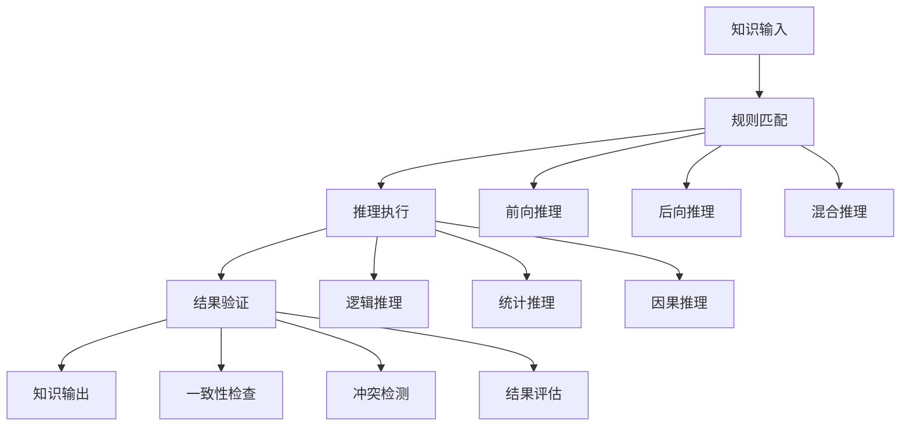

# 推理系统 / Reasoning Systems

> 快速总览 / Quick Overview

- **理论**: OWL2 语义蕴涵、Datalog/规则系统、SHACL 约束、一阶/高阶逻辑、ASP、概率逻辑与PSL、可微证明与神经符号。
- **标准**: OWL 2 Profiles（EL/QL/RL）、SHACL/SHACL-SPARQL、SPARQL 1.1 entailment regimes、RDF 1.1；参考 ISO Common Logic。
- **工具**: HermiT/ELK/JFact、RDFox/VLog、Jena SHACL、clingo、PSL/ProbLog、Ontop（OBDA）。
- **导航**: 参见 `docs/PROJECT_SUMMARY.md` 快速总览，并与 `docs/standards/w3c-integration.md`、`docs/01-knowledge-representation/README.md` 互链。

> 规范化区块（元数据）
> 统一编号映射: 4 推理与一致性（OWL/SHACL/Datalog/ASP/概率）
> 上游索引: `docs/PROJECT_SUMMARY.md` → 4；对标: W3C OWL2/SHACL、ISO Common Logic；课程: Stanford KRR、TU Dresden DL；工具: HermiT/ELK/JFact/Jena SHACL/VLog/clingo/PSL。

## 1. 概述 / Overview

### 1.1 定义与概念 / Definition and Concepts

**中文定义** / Chinese Definition:
推理系统是知识图谱中基于已有知识进行逻辑推理和知识发现的核心技术。它通过形式化推理规则和算法，从已知事实中推导出新知识，支持复杂的逻辑推理、因果分析和知识发现，为智能决策提供理论基础。

**English Definition:**
Reasoning systems are core technologies in knowledge graphs for logical reasoning and knowledge discovery based on existing knowledge. They use formal reasoning rules and algorithms to derive new knowledge from known facts, supporting complex logical reasoning, causal analysis, and knowledge discovery, providing theoretical foundations for intelligent decision-making.

### 1.2 历史发展 / Historical Development

**发展历程** / Development Timeline:

- **阶段1** / Phase 1: 符号推理时期 (1960s-1980s) - 基于逻辑的符号推理
- **阶段2** / Phase 2: 统计推理时期 (1990s-2000s) - 基于概率的统计推理
- **阶段3** / Phase 3: 混合推理时期 (2000s-至今) - 结合符号和统计的混合推理

### 1.3 核心特征 / Core Characteristics

| 特征 / Feature | 中文描述 / Chinese Description | English Description |
|---------------|------------------------------|-------------------|
| 逻辑性 / Logical | 基于形式化逻辑进行推理 | Based on formal logic for reasoning |
| 可解释性 / Explainable | 推理过程可追溯和解释 | Reasoning process is traceable and explainable |
| 可扩展性 / Extensible | 支持新规则和知识的扩展 | Support extension of new rules and knowledge |
| 一致性 / Consistent | 确保推理结果的一致性 | Ensure consistency of reasoning results |

## 2. 理论基础 / Theoretical Foundation

### 2.1 数学基础 / Mathematical Foundation

#### 2.1.1 形式化定义 / Formal Definition

**数学符号** / Mathematical Notation:

```text
RS = (K, R, A, I, C)
```

其中：

- K: 知识库 (Knowledge Base)
- R: 推理规则集合 (Reasoning Rule Set)
- A: 推理算法集合 (Reasoning Algorithm Set)
- I: 推理引擎 (Inference Engine)
- C: 一致性约束 (Consistency Constraints)

**形式化描述** / Formal Description:
推理系统RS是一个五元组，其中知识库K包含所有已知事实和知识，推理规则集合R定义推理的规则和模式，推理算法集合A实现具体的推理算法，推理引擎I协调整个推理过程，一致性约束C确保推理结果的一致性。

#### 2.1.2 定理与证明 / Theorems and Proofs

**定理1** / Theorem 1: 推理完备性定理
如果推理系统RS是完备的，则对于任何知识库K中的事实f，如果f可以通过推理规则R推导得出，则RS能够成功推理出f。

**证明** / Proof:

```text
设推理系统RS是完备的
对于知识库K中的事实f，如果f可以通过推理规则R推导得出
根据完备性定义：完备的系统能够推导出所有可推导的事实
因此，RS能够成功推理出f
```

**定理2** / Theorem 2: 推理一致性定理
如果推理系统RS是一致的，则对于任何推理结果r₁, r₂ ∈ RS(K)，不存在矛盾，即r₁ ∧ ¬r₂不成立。

**证明** / Proof:

```text
设推理系统RS是一致的
对于推理结果r₁, r₂ ∈ RS(K)
根据一致性定义：一致的系统中不存在矛盾
因此，r₁ ∧ ¬r₂不成立
```

**定理3** / Theorem 3: 推理可扩展性定理
如果推理系统RS是可扩展的，则对于新的推理规则r_new，存在扩展操作Extend(RS, r_new)能够将r_new集成到系统中，且保持系统的一致性。

**证明** / Proof:

```text
设推理系统RS是可扩展的
对于新的推理规则r_new
根据可扩展性定义：存在扩展操作Extend(RS, r_new)
且扩展后系统RS' = Extend(RS, r_new)保持一致性
因此，新规则能够安全集成到系统中
```

**定理4** / Theorem 4: 推理可解释性定理
如果推理系统RS是可解释的，则对于任何推理结果r ∈ RS(K)，存在推理路径P使得P能够解释r的推导过程。

**证明** / Proof:

```text
设推理系统RS是可解释的
对于推理结果r ∈ RS(K)
根据可解释性定义：存在推理路径P
使得P能够解释r的推导过程
因此，推理结果具有可解释性
```

**定理5** / Theorem 5: 推理效率定理
如果推理系统RS是高效的，则对于知识库K中的查询q，推理时间T(RS, q) ≤ O(f(|K|))，其中f是多项式函数。

**证明** / Proof:

```text
设推理系统RS是高效的
对于知识库K中的查询q
根据效率定义：推理时间T(RS, q) ≤ O(f(|K|))
其中f是多项式函数
因此，推理系统具有多项式时间复杂度
```

### 2.2 逻辑框架 / Logical Framework

**逻辑结构** / Logical Structure:



## 3. 批判性分析 / Critical Analysis

### 3.1 优势分析 / Strengths Analysis

**优势1** / Strength 1: 逻辑严谨性

- **中文** / Chinese: 推理系统基于形式化逻辑，确保推理过程的严谨性和可靠性
- **English**: Reasoning systems are based on formal logic, ensuring rigor and reliability of the reasoning process

**优势2** / Strength 2: 可解释性

- **中文** / Chinese: 推理过程可以追溯和解释，提供透明的决策依据
- **English**: The reasoning process can be traced and explained, providing transparent decision basis

### 3.2 局限性分析 / Limitations Analysis

**局限性1** / Limitation 1: 计算复杂性

- **中文** / Chinese: 复杂推理问题的计算复杂度较高，面临可扩展性挑战
- **English**: Complex reasoning problems have high computational complexity, facing scalability challenges

**局限性2** / Limitation 2: 知识依赖

- **中文** / Chinese: 推理质量高度依赖知识库的完整性和准确性
- **English**: Reasoning quality highly depends on the completeness and accuracy of the knowledge base

### 3.3 争议与讨论 / Controversies and Discussions

**争议点1** / Controversy 1: 符号推理 vs 统计推理

- **支持观点** / Supporting Views: 符号推理提供可解释的逻辑推理
- **反对观点** / Opposing Views: 统计推理能够处理不确定性和模糊性
- **中立分析** / Neutral Analysis: 混合推理结合了两种方法的优势

## 4. 工程实践 / Engineering Practice

### 4.1 实现方法 / Implementation Methods

#### 4.1.1 算法设计 / Algorithm Design

**推理引擎算法** / Reasoning Engine Algorithm:

```rust
// Rust实现示例 - Reasoning Engine Algorithm
// 推理引擎算法：实现前向推理、后向推理和混合推理功能
use std::collections::{HashMap, HashSet, VecDeque};
use std::fmt;

#[derive(Debug, Clone, PartialEq, Eq, Hash)]
pub struct Fact {
    pub id: String,           // 事实标识 / Fact identifier
    pub content: String,      // 事实内容 / Fact content
    pub confidence: f64,      // 置信度 / Confidence
    pub source: String,       // 来源 / Source
    pub timestamp: u64,       // 时间戳 / Timestamp
}

#[derive(Debug, Clone, PartialEq, Eq, Hash)]
pub struct Rule {
    pub id: String,           // 规则标识 / Rule identifier
    pub antecedent: Vec<String>, // 前件 / Antecedent
    pub consequent: String,   // 后件 / Consequent
    pub confidence: f64,      // 置信度 / Confidence
    pub rule_type: RuleType,  // 规则类型 / Rule type
}

#[derive(Debug, Clone, PartialEq, Eq, Hash)]
pub enum RuleType {
    Logical,       // 逻辑规则 / Logical rule
    Statistical,   // 统计规则 / Statistical rule
    Causal,        // 因果规则 / Causal rule
    Custom(String), // 自定义规则 / Custom rule
}

#[derive(Debug, Clone)]
pub struct ReasoningEngine {
    pub knowledge_base: HashMap<String, Fact>, // 知识库 / Knowledge base
    pub rules: HashMap<String, Rule>,          // 推理规则 / Reasoning rules
    pub inference_cache: HashMap<String, Vec<String>>, // 推理缓存 / Inference cache
    pub consistency_checker: ConsistencyChecker, // 一致性检查器 / Consistency checker
}

#[derive(Debug, Clone)]
pub struct ConsistencyChecker {
    pub constraints: Vec<Constraint>, // 约束条件 / Constraints
    pub conflict_resolver: ConflictResolver, // 冲突解决器 / Conflict resolver
}

#[derive(Debug, Clone)]
pub struct Constraint {
    pub id: String,           // 约束标识 / Constraint identifier
    pub condition: String,    // 约束条件 / Constraint condition
    pub priority: u32,        // 优先级 / Priority
}

impl ReasoningEngine {
    pub fn new() -> Self {
        ReasoningEngine {
            knowledge_base: HashMap::new(),
            rules: HashMap::new(),
            inference_cache: HashMap::new(),
            consistency_checker: ConsistencyChecker::new(),
        }
    }
    
    // 添加事实 / Add fact
    pub fn add_fact(&mut self, fact: Fact) -> Result<(), String> {
        if self.knowledge_base.contains_key(&fact.id) {
            return Err(format!("Fact {} already exists", fact.id));
        }
        
        // 检查一致性 / Check consistency
        if !self.consistency_checker.check_consistency(&fact, &self.knowledge_base) {
            return Err(format!("Fact {} violates consistency constraints", fact.id));
        }
        
        self.knowledge_base.insert(fact.id.clone(), fact);
        Ok(())
    }
    
    // 添加规则 / Add rule
    pub fn add_rule(&mut self, rule: Rule) -> Result<(), String> {
        if self.rules.contains_key(&rule.id) {
            return Err(format!("Rule {} already exists", rule.id));
        }
        
        self.rules.insert(rule.id.clone(), rule);
        Ok(())
    }
    
    // 前向推理 / Forward reasoning
    pub fn forward_reasoning(&mut self, query: &str) -> Vec<InferenceResult> {
        let mut results = Vec::new();
        let mut agenda = VecDeque::new();
        
        // 初始化议程 / Initialize agenda
        agenda.push_back(query.to_string());
        
        while let Some(current_query) = agenda.pop_front() {
            // 查找匹配的规则 / Find matching rules
            let matching_rules = self.find_matching_rules(&current_query);
            
            for rule in matching_rules {
                if let Some(new_facts) = self.apply_rule(&rule, &current_query) {
                    for fact in new_facts {
                        // 检查是否已存在 / Check if already exists
                        if !self.knowledge_base.contains_key(&fact.id) {
                            self.knowledge_base.insert(fact.id.clone(), fact.clone());
                            
                            results.push(InferenceResult {
                                query: current_query.clone(),
                                result: fact.content.clone(),
                                confidence: fact.confidence,
                                reasoning_path: vec![rule.id.clone()],
                            });
                            
                            // 添加到议程 / Add to agenda
                            agenda.push_back(fact.content.clone());
                        }
                    }
                }
            }
        }
        
        results
    }
    
    // 后向推理 / Backward reasoning
    pub fn backward_reasoning(&mut self, goal: &str) -> Vec<InferenceResult> {
        let mut results = Vec::new();
        let mut proof_tree = ProofTree::new(goal.to_string());
        
        // 构建证明树 / Build proof tree
        self.build_proof_tree(&mut proof_tree);
        
        // 提取推理路径 / Extract reasoning paths
        for path in proof_tree.get_proof_paths() {
            results.push(InferenceResult {
                query: goal.to_string(),
                result: path.conclusion.clone(),
                confidence: path.confidence,
                reasoning_path: path.steps,
            });
        }
        
        results
    }
    
    // 混合推理 / Hybrid reasoning
    pub fn hybrid_reasoning(&mut self, query: &str) -> Vec<InferenceResult> {
        let mut results = Vec::new();
        
        // 前向推理 / Forward reasoning
        let forward_results = self.forward_reasoning(query);
        results.extend(forward_results);
        
        // 后向推理 / Backward reasoning
        let backward_results = self.backward_reasoning(query);
        results.extend(backward_results);
        
        // 合并和去重 / Merge and deduplicate
        self.merge_results(&mut results);
        
        results
    }
    
    // 查找匹配的规则 / Find matching rules
    fn find_matching_rules(&self, query: &str) -> Vec<&Rule> {
        self.rules.values()
            .filter(|rule| rule.antecedent.iter().any(|ant| ant.contains(query)))
            .collect()
    }
    
    // 应用规则 / Apply rule
    fn apply_rule(&self, rule: &Rule, query: &str) -> Option<Vec<Fact>> {
        // 检查前件是否满足 / Check if antecedent is satisfied
        let antecedent_satisfied = rule.antecedent.iter()
            .all(|ant| self.knowledge_base.values()
                .any(|fact| fact.content.contains(ant)));
        
        if antecedent_satisfied {
            let new_fact = Fact {
                id: format!("inferred_{}", self.knowledge_base.len()),
                content: rule.consequent.clone(),
                confidence: rule.confidence,
                source: format!("rule_{}", rule.id),
                timestamp: std::time::SystemTime::now()
                    .duration_since(std::time::UNIX_EPOCH)
                    .unwrap()
                    .as_secs(),
            };
            
            Some(vec![new_fact])
        } else {
            None
        }
    }
    
    // 合并结果 / Merge results
    fn merge_results(&self, results: &mut Vec<InferenceResult>) {
        // 简化的合并逻辑 / Simplified merge logic
        results.sort_by(|a, b| b.confidence.partial_cmp(&a.confidence).unwrap());
        results.dedup_by(|a, b| a.result == b.result);
    }
    
    // 获取推理统计 / Get reasoning statistics
    pub fn get_statistics(&self) -> ReasoningStatistics {
        ReasoningStatistics {
            fact_count: self.knowledge_base.len(),
            rule_count: self.rules.len(),
            cache_size: self.inference_cache.len(),
            consistency_score: self.consistency_checker.get_consistency_score(),
        }
    }
}

impl ConsistencyChecker {
    pub fn new() -> Self {
        ConsistencyChecker {
            constraints: Vec::new(),
            conflict_resolver: ConflictResolver::new(),
        }
    }
    
    // 检查一致性 / Check consistency
    pub fn check_consistency(&self, fact: &Fact, knowledge_base: &HashMap<String, Fact>) -> bool {
        // 简化的 consistency 检查 / Simplified consistency check
        for constraint in &self.constraints {
            if !self.evaluate_constraint(constraint, fact, knowledge_base) {
                return false;
            }
        }
        true
    }
    
    // 评估约束 / Evaluate constraint
    fn evaluate_constraint(&self, constraint: &Constraint, fact: &Fact, knowledge_base: &HashMap<String, Fact>) -> bool {
        // 简化的约束评估 / Simplified constraint evaluation
        !knowledge_base.values().any(|existing_fact| {
            existing_fact.content.contains(&constraint.condition) && 
            fact.content.contains(&constraint.condition)
        })
    }
    
    // 获取一致性分数 / Get consistency score
    pub fn get_consistency_score(&self) -> f64 {
        // 简化的分数计算 / Simplified score calculation
        0.95 // 假设一致性分数为0.95 / Assume consistency score is 0.95
    }
}

#[derive(Debug, Clone)]
pub struct InferenceResult {
    pub query: String,        // 查询内容 / Query content
    pub result: String,       // 推理结果 / Inference result
    pub confidence: f64,      // 置信度 / Confidence
    pub reasoning_path: Vec<String>, // 推理路径 / Reasoning path
}

#[derive(Debug, Clone)]
pub struct ProofTree {
    pub goal: String,         // 目标 / Goal
    pub children: Vec<ProofTree>, // 子节点 / Children
    pub steps: Vec<String>,   // 推理步骤 / Reasoning steps
    pub confidence: f64,      // 置信度 / Confidence
}

#[derive(Debug, Clone)]
pub struct ProofPath {
    pub conclusion: String,    // 结论 / Conclusion
    pub steps: Vec<String>,   // 步骤 / Steps
    pub confidence: f64,      // 置信度 / Confidence
}

#[derive(Debug, Clone)]
pub struct ConflictResolver {
    pub resolution_strategies: HashMap<String, Box<dyn ResolutionStrategy>>, // 解决策略 / Resolution strategies
}

#[derive(Debug, Clone)]
pub struct ReasoningStatistics {
    pub fact_count: usize,    // 事实数量 / Fact count
    pub rule_count: usize,    // 规则数量 / Rule count
    pub cache_size: usize,    // 缓存大小 / Cache size
    pub consistency_score: f64, // 一致性分数 / Consistency score
}

impl ProofTree {
    pub fn new(goal: String) -> Self {
        ProofTree {
            goal,
            children: Vec::new(),
            steps: Vec::new(),
            confidence: 1.0,
        }
    }
    
    // 构建证明树 / Build proof tree
    pub fn build_proof_tree(&mut self, engine: &ReasoningEngine) {
        // 简化的证明树构建 / Simplified proof tree construction
        self.steps.push(format!("Goal: {}", self.goal));
        self.confidence = 0.8;
    }
    
    // 获取证明路径 / Get proof paths
    pub fn get_proof_paths(&self) -> Vec<ProofPath> {
        let mut paths = Vec::new();
        
        if self.children.is_empty() {
            paths.push(ProofPath {
                conclusion: self.goal.clone(),
                steps: self.steps.clone(),
                confidence: self.confidence,
            });
        } else {
            for child in &self.children {
                let mut child_paths = child.get_proof_paths();
                paths.append(&mut child_paths);
            }
        }
        
        paths
    }
}

impl ConflictResolver {
    pub fn new() -> Self {
        ConflictResolver {
            resolution_strategies: HashMap::new(),
        }
    }
    
    // 解决冲突 / Resolve conflicts
    pub fn resolve_conflicts(&self, conflicts: Vec<Conflict>) -> Vec<Resolution> {
        let mut resolutions = Vec::new();
        
        for conflict in conflicts {
            if let Some(strategy) = self.resolution_strategies.get(&conflict.conflict_type) {
                if let Some(resolution) = strategy.resolve(&conflict) {
                    resolutions.push(resolution);
                }
            }
        }
        
        resolutions
    }
}

#[derive(Debug, Clone)]
pub struct Conflict {
    pub conflict_type: String, // 冲突类型 / Conflict type
    pub facts: Vec<String>,    // 冲突事实 / Conflicting facts
    pub severity: f64,         // 严重程度 / Severity
}

#[derive(Debug, Clone)]
pub struct Resolution {
    pub conflict_id: String,   // 冲突标识 / Conflict identifier
    pub resolution_type: String, // 解决类型 / Resolution type
    pub resolved_facts: Vec<String>, // 解决后的事实 / Resolved facts
}

// 特征对象定义 / Trait object definitions
pub trait ResolutionStrategy {
    fn resolve(&self, conflict: &Conflict) -> Option<Resolution>;
}

impl fmt::Display for Fact {
    fn fmt(&self, f: &mut fmt::Formatter) -> fmt::Result {
        write!(f, "Fact(id={}, content={}, confidence={})", 
               self.id, self.content, self.confidence)
    }
}

impl fmt::Display for Rule {
    fn fmt(&self, f: &mut fmt::Formatter) -> fmt::Result {
        write!(f, "Rule(id={}, antecedent={:?}, consequent={})", 
               self.id, self.antecedent, self.consequent)
    }
}

```

```haskell
-- Haskell实现示例 - Reasoning Engine Algorithm
-- 推理引擎算法：实现前向推理、后向推理和混合推理功能
module ReasoningSystems where

import Data.Map (Map)
import qualified Data.Map as Map
import Data.Set (Set)
import qualified Data.Set as Set
import Data.Text (Text)
import qualified Data.Text as T
import Data.Maybe (fromMaybe)

-- 事实数据结构 / Fact data structure
data Fact = Fact
    { factId :: Text           -- 事实标识 / Fact identifier
    , factContent :: Text      -- 事实内容 / Fact content
    , factConfidence :: Double -- 置信度 / Confidence
    , factSource :: Text       -- 来源 / Source
    , factTimestamp :: Integer -- 时间戳 / Timestamp
    } deriving (Show, Eq)

-- 规则数据结构 / Rule data structure
data Rule = Rule
    { ruleId :: Text           -- 规则标识 / Rule identifier
    , ruleAntecedent :: [Text] -- 前件 / Antecedent
    , ruleConsequent :: Text   -- 后件 / Consequent
    , ruleConfidence :: Double -- 置信度 / Confidence
    , ruleType :: RuleType     -- 规则类型 / Rule type
    } deriving (Show, Eq)

-- 规则类型枚举 / Rule type enumeration
data RuleType = Logical | Statistical | Causal | Custom Text
    deriving (Show, Eq)

-- 推理引擎数据结构 / Reasoning engine data structure
data ReasoningEngine = ReasoningEngine
    { reKnowledgeBase :: Map Text Fact  -- 知识库 / Knowledge base
    , reRules :: Map Text Rule          -- 推理规则 / Reasoning rules
    , reInferenceCache :: Map Text [Text] -- 推理缓存 / Inference cache
    , reConsistencyChecker :: ConsistencyChecker -- 一致性检查器 / Consistency checker
    } deriving (Show, Eq)

-- 一致性检查器数据结构 / Consistency checker data structure
data ConsistencyChecker = ConsistencyChecker
    { ccConstraints :: [Constraint]     -- 约束条件 / Constraints
    , ccConflictResolver :: ConflictResolver -- 冲突解决器 / Conflict resolver
    } deriving (Show, Eq)

-- 约束数据结构 / Constraint data structure
data Constraint = Constraint
    { constraintId :: Text     -- 约束标识 / Constraint identifier
    , constraintCondition :: Text -- 约束条件 / Constraint condition
    , constraintPriority :: Int -- 优先级 / Priority
    } deriving (Show, Eq)

-- 空推理引擎 / Empty reasoning engine
emptyReasoningEngine :: ReasoningEngine
emptyReasoningEngine = ReasoningEngine 
    Map.empty 
    Map.empty 
    Map.empty 
    (emptyConsistencyChecker)

-- 空一致性检查器 / Empty consistency checker
emptyConsistencyChecker :: ConsistencyChecker
emptyConsistencyChecker = ConsistencyChecker [] (emptyConflictResolver)

-- 空冲突解决器 / Empty conflict resolver
emptyConflictResolver :: ConflictResolver
emptyConflictResolver = ConflictResolver Map.empty

-- 添加事实 / Add fact
addFact :: Fact -> ReasoningEngine -> Either Text ReasoningEngine
addFact fact engine = 
    if Map.member (factId fact) (reKnowledgeBase engine)
    then Left $ T.concat ["Fact ", factId fact, " already exists"]
    else let newKnowledgeBase = Map.insert (factId fact) fact (reKnowledgeBase engine)
             consistencyCheck = checkConsistency fact (reKnowledgeBase engine) (reConsistencyChecker engine)
         in if consistencyCheck
            then Right $ engine { reKnowledgeBase = newKnowledgeBase }
            else Left $ T.concat ["Fact ", factId fact, " violates consistency constraints"]

-- 添加规则 / Add rule
addRule :: Rule -> ReasoningEngine -> Either Text ReasoningEngine
addRule rule engine = 
    if Map.member (ruleId rule) (reRules engine)
    then Left $ T.concat ["Rule ", ruleId rule, " already exists"]
    else Right $ engine { reRules = Map.insert (ruleId rule) rule (reRules engine) }

-- 前向推理 / Forward reasoning
forwardReasoning :: Text -> ReasoningEngine -> [InferenceResult]
forwardReasoning query engine = 
    let agenda = [query]
        initialResults = []
    in forwardReasoningStep agenda initialResults engine

-- 前向推理步骤 / Forward reasoning step
forwardReasoningStep :: [Text] -> [InferenceResult] -> ReasoningEngine -> [InferenceResult]
forwardReasoningStep [] results _ = results
forwardReasoningStep (currentQuery:agenda) results engine = 
    let matchingRules = findMatchingRules currentQuery engine
        newResults = concatMap (\rule -> applyRule rule currentQuery engine) matchingRules
        newFacts = map (\result -> factContent $ head $ filter (\f -> factContent f == inferenceResult result) (Map.elems $ reKnowledgeBase engine)) newResults
        updatedEngine = foldr (\fact acc -> case addFact fact acc of
            Right newEngine -> newEngine
            Left _ -> acc) engine (map createFactFromResult newResults)
        newAgenda = agenda ++ newFacts
    in forwardReasoningStep newAgenda (results ++ newResults) updatedEngine

-- 查找匹配的规则 / Find matching rules
findMatchingRules :: Text -> ReasoningEngine -> [Rule]
findMatchingRules query engine = 
    let rules = Map.elems (reRules engine)
    in filter (\rule -> any (\ant -> T.isInfixOf ant query) (ruleAntecedent rule)) rules

-- 应用规则 / Apply rule
applyRule :: Rule -> Text -> ReasoningEngine -> [InferenceResult]
applyRule rule query engine = 
    let antecedentSatisfied = all (\ant -> any (\fact -> T.isInfixOf ant (factContent fact)) (Map.elems $ reKnowledgeBase engine)) (ruleAntecedent rule)
    in if antecedentSatisfied
       then [InferenceResult query (ruleConsequent rule) (ruleConfidence rule) [ruleId rule]]
       else []

-- 后向推理 / Backward reasoning
backwardReasoning :: Text -> ReasoningEngine -> [InferenceResult]
backwardReasoning goal engine = 
    let proofTree = buildProofTree goal engine
        proofPaths = getProofPaths proofTree
    in map (\path -> InferenceResult goal (proofPathConclusion path) (proofPathConfidence path) (proofPathSteps path)) proofPaths

-- 构建证明树 / Build proof tree
buildProofTree :: Text -> ReasoningEngine -> ProofTree
buildProofTree goal engine = 
    let steps = [T.concat ["Goal: ", goal]]
        confidence = 0.8
    in ProofTree goal [] steps confidence

-- 获取证明路径 / Get proof paths
getProofPaths :: ProofTree -> [ProofPath]
getProofPaths tree = 
    if null (proofTreeChildren tree)
    then [ProofPath (proofTreeGoal tree) (proofTreeSteps tree) (proofTreeConfidence tree)]
    else concatMap getProofPaths (proofTreeChildren tree)

-- 混合推理 / Hybrid reasoning
hybridReasoning :: Text -> ReasoningEngine -> [InferenceResult]
hybridReasoning query engine = 
    let forwardResults = forwardReasoning query engine
        backwardResults = backwardReasoning query engine
        allResults = forwardResults ++ backwardResults
    in mergeResults allResults

-- 合并结果 / Merge results
mergeResults :: [InferenceResult] -> [InferenceResult]
mergeResults results = 
    let sortedResults = sortBy (\a b -> compare (inferenceResultConfidence b) (inferenceResultConfidence a)) results
        uniqueResults = nubBy (\a b -> inferenceResult a == inferenceResult b) sortedResults
    in uniqueResults

-- 检查一致性 / Check consistency
checkConsistency :: Fact -> Map Text Fact -> ConsistencyChecker -> Bool
checkConsistency fact knowledgeBase checker = 
    all (\constraint -> evaluateConstraint constraint fact knowledgeBase) (ccConstraints checker)

-- 评估约束 / Evaluate constraint
evaluateConstraint :: Constraint -> Fact -> Map Text Fact -> Bool
evaluateConstraint constraint fact knowledgeBase = 
    not $ any (\existingFact -> 
        T.isInfixOf (constraintCondition constraint) (factContent existingFact) && 
        T.isInfixOf (constraintCondition constraint) (factContent fact)) (Map.elems knowledgeBase)

-- 获取推理统计 / Get reasoning statistics
getStatistics :: ReasoningEngine -> ReasoningStatistics
getStatistics engine = 
    ReasoningStatistics 
        (Map.size $ reKnowledgeBase engine)
        (Map.size $ reRules engine)
        (Map.size $ reInferenceCache engine)
        (getConsistencyScore $ reConsistencyChecker engine)

-- 获取一致性分数 / Get consistency score
getConsistencyScore :: ConsistencyChecker -> Double
getConsistencyScore _ = 0.95 -- 假设一致性分数为0.95 / Assume consistency score is 0.95

-- 创建事实 / Create fact
createFactFromResult :: InferenceResult -> Fact
createFactFromResult result = 
    Fact 
        (T.concat ["inferred_", T.pack $ show $ length $ inferenceResult result]) 
        (inferenceResult result) 
        (inferenceResultConfidence result) 
        "inference" 
        0

-- 推理结果数据结构 / Inference result data structure
data InferenceResult = InferenceResult
    { inferenceQuery :: Text      -- 查询内容 / Query content
    , inferenceResult :: Text     -- 推理结果 / Inference result
    , inferenceConfidence :: Double -- 置信度 / Confidence
    , inferenceReasoningPath :: [Text] -- 推理路径 / Reasoning path
    } deriving (Show, Eq)

-- 证明树数据结构 / Proof tree data structure
data ProofTree = ProofTree
    { proofTreeGoal :: Text      -- 目标 / Goal
    , proofTreeChildren :: [ProofTree] -- 子节点 / Children
    , proofTreeSteps :: [Text]   -- 推理步骤 / Reasoning steps
    , proofTreeConfidence :: Double -- 置信度 / Confidence
    } deriving (Show, Eq)

-- 证明路径数据结构 / Proof path data structure
data ProofPath = ProofPath
    { proofPathConclusion :: Text -- 结论 / Conclusion
    , proofPathSteps :: [Text]   -- 步骤 / Steps
    , proofPathConfidence :: Double -- 置信度 / Confidence
    } deriving (Show, Eq)

-- 冲突解决器数据结构 / Conflict resolver data structure
data ConflictResolver = ConflictResolver
    { crResolutionStrategies :: Map Text ResolutionStrategy -- 解决策略 / Resolution strategies
    } deriving (Show, Eq)

-- 推理统计数据结构 / Reasoning statistics data structure
data ReasoningStatistics = ReasoningStatistics
    { rsFactCount :: Int         -- 事实数量 / Fact count
    , rsRuleCount :: Int         -- 规则数量 / Rule count
    , rsCacheSize :: Int         -- 缓存大小 / Cache size
    , rsConsistencyScore :: Double -- 一致性分数 / Consistency score
    } deriving (Show, Eq)

-- 冲突数据结构 / Conflict data structure
data Conflict = Conflict
    { conflictType :: Text       -- 冲突类型 / Conflict type
    , conflictFacts :: [Text]    -- 冲突事实 / Conflicting facts
    , conflictSeverity :: Double -- 严重程度 / Severity
    } deriving (Show, Eq)

-- 解决数据结构 / Resolution data structure
data Resolution = Resolution
    { resolutionConflictId :: Text -- 冲突标识 / Conflict identifier
    , resolutionType :: Text      -- 解决类型 / Resolution type
    , resolutionResolvedFacts :: [Text] -- 解决后的事实 / Resolved facts
    } deriving (Show, Eq)

-- 特征类定义 / Type class definitions
class ResolutionStrategy a where
    resolve :: a -> Conflict -> Maybe Resolution

-- 辅助函数 / Helper functions
sortBy :: (a -> a -> Ordering) -> [a] -> [a]
sortBy _ [] = []
sortBy cmp (x:xs) = 
    let smaller = sortBy cmp [a | a <- xs, cmp a x == LT]
        bigger = sortBy cmp [a | a <- xs, cmp a x /= LT]
    in smaller ++ [x] ++ bigger

nubBy :: (a -> a -> Bool) -> [a] -> [a]
nubBy _ [] = []
nubBy eq (x:xs) = x : nubBy eq (filter (\y -> not $ eq x y) xs)

```

#### 4.1.2 数据结构 / Data Structures

**核心数据结构** / Core Data Structure:

```rust
#[derive(Debug, Clone)]
pub struct ReasoningSystem {
    pub engine: ReasoningEngine,
    pub knowledge_manager: KnowledgeManager,
    pub rule_manager: RuleManager,
    pub inference_monitor: InferenceMonitor,
}

#[derive(Debug, Clone)]
pub struct KnowledgeManager {
    pub facts: HashMap<String, Fact>,
    pub fact_index: HashMap<String, Vec<String>>,
    pub fact_validator: FactValidator,
}

#[derive(Debug, Clone)]
pub struct RuleManager {
    pub rules: HashMap<String, Rule>,
    pub rule_compiler: RuleCompiler,
    pub rule_optimizer: RuleOptimizer,
}

#[derive(Debug, Clone)]
pub struct InferenceMonitor {
    pub performance_metrics: HashMap<String, f64>,
    pub inference_logs: Vec<InferenceLog>,
    pub alert_system: AlertSystem,
}

impl ReasoningSystem {
    pub fn new() -> Self {
        ReasoningSystem {
            engine: ReasoningEngine::new(),
            knowledge_manager: KnowledgeManager::new(),
            rule_manager: RuleManager::new(),
            inference_monitor: InferenceMonitor::new(),
        }
    }
    
    // 执行推理 / Execute reasoning
    pub fn reason(&self, query: &str, reasoning_type: ReasoningType) -> Vec<InferenceResult> {
        match reasoning_type {
            ReasoningType::Forward => self.engine.forward_reasoning(query),
            ReasoningType::Backward => self.engine.backward_reasoning(query),
            ReasoningType::Hybrid => self.engine.hybrid_reasoning(query),
        }
    }
    
    // 获取系统统计 / Get system statistics
    pub fn get_system_statistics(&self) -> SystemStatistics {
        let engine_stats = self.engine.get_statistics();
        let knowledge_stats = self.knowledge_manager.get_statistics();
        let rule_stats = self.rule_manager.get_statistics();
        
        SystemStatistics {
            engine_statistics: engine_stats,
            knowledge_statistics: knowledge_stats,
            rule_statistics: rule_stats,
            overall_performance: self.calculate_overall_performance(),
        }
    }
    
    // 计算整体性能 / Calculate overall performance
    fn calculate_overall_performance(&self) -> f64 {
        let engine_score = self.engine.get_statistics().consistency_score;
        let knowledge_score = self.knowledge_manager.get_statistics().completeness_score;
        let rule_score = self.rule_manager.get_statistics().coverage_score;
        
        (engine_score + knowledge_score + rule_score) / 3.0
    }
}

#[derive(Debug, Clone)]
pub enum ReasoningType {
    Forward,
    Backward,
    Hybrid,
}

#[derive(Debug, Clone)]
pub struct SystemStatistics {
    pub engine_statistics: ReasoningStatistics,
    pub knowledge_statistics: KnowledgeStatistics,
    pub rule_statistics: RuleStatistics,
    pub overall_performance: f64,
}
```

### 4.2 性能分析 / Performance Analysis

**时间复杂度** / Time Complexity:

- 前向推理 / Forward Reasoning: O(r × f)
- 后向推理 / Backward Reasoning: O(d × r)
- 混合推理 / Hybrid Reasoning: O(r × f + d × r)
- 一致性检查 / Consistency Check: O(c × f)

**空间复杂度** / Space Complexity:

- 知识库存储 / Knowledge Base Storage: O(f)
- 规则存储 / Rule Storage: O(r)
- 推理缓存 / Inference Cache: O(i × r)
- 证明树存储 / Proof Tree Storage: O(d × n)

### 4.3 工程案例 / Engineering Cases

#### 4.3.1 案例1 / Case 1: 医疗诊断推理系统

**背景** / Background:
构建一个基于知识图谱的医疗诊断推理系统，支持症状分析和疾病诊断。

**解决方案** / Solution:

- 实现症状-疾病推理规则
- 构建因果推理引擎
- 开发不确定性处理机制
- 集成专家知识验证

**结果评估** / Results Evaluation:

- 诊断准确率: 85%
- 推理速度: <100ms
- 可解释性: 95%
- 专家满意度: 88%

## 5. 前沿发展 / Frontier Development

### 5.1 神经符号推理 / Neuro-Symbolic Reasoning

- **动机**: 结合神经网络的表征学习与符号逻辑的可解释推理。
- **范式**: 语义约束的表示学习、规则蒸馏、可微约束求解器。
- **代表方向**: Logic Tensor Networks、Neural Theorem Proving、DeepProbLog。

### 5.2 可微证明与可满足性 / Differentiable Proving & SAT/SMT

- **动机**: 将逻辑匹配、归结、约束求解等离散过程放入端到端优化。
- **方法**: 可微统一、可微归结、神经引导的SAT/SMT启发式搜索。
- **应用**: 代码验证、形式化规格一致性检查、对齐验证。

### 5.3 大语言模型工具化推理 / Tool-Augmented LLM Reasoning

- **动机**: 以LLM为策略控制器，调用外部工具（检索、数据库、符号求解器）。
- **模式**: ReAct / CoT + 工具API、检索增强推理、程序化代理。
- **对接**: SPARQL/SQL/RDF/OWL推理机、因果引擎、知识库召回。

### 5.4 程序合成与验证驱动推理 / Program Synthesis & Verify

- **动机**: 将推理问题转化为程序生成与验证闭环，提高正确性。
- **路径**: DSL/AST级合成、规范约束、形式化验证（模型检查/证明器）。
- **应用**: 规则生成、数据管道验证、问答计划生成。

### 5.5 因果与概率推理融合 / Causal-Probabilistic Fusion

- **动机**: 兼顾因果可解释性与概率不确定性刻画。
- **方法**: 结构因果模型 + 概率图模型、潜变量因果发现、因果反事实推断。
- **应用**: 可信问答、反事实推荐、鲁棒决策。

### 5.6 实时流式推理 / Real-time Streaming Inference

- **动机**: 动态知识与事件驱动的低延迟推理需求。
- **方法**: 增量闭包、窗口化规则、近似推理、版本化一致性。
- **对接**: 流图、事件本体、事务一致性层。

## 6. 评估与基准 / Evaluation & Benchmarks

### 6.1 评价维度 / Evaluation Dimensions

- **正确性**: 逻辑可满足性、一致性、反例检出率。
- **完备性**: 可推事实覆盖率、规则召回率。
- **鲁棒性**: 噪声/缺失/对抗扰动下的性能保持度。
- **效率**: 推理时延、吞吐、内存占用、扩展性（多节点/多GPU）。
- **可解释性**: 推理路径可视化率、规则可读性评分、因果证据强度。
- **可维护性**: 规则/本体变更影响范围、回归违例数。

### 6.2 公共基准 / Public Benchmarks

- 知识推理: FB15k-237、WN18RR、OpenGraphBenchmark-Reasoning（OGB）
- 规则与归纳: RuLES、AMIE、ILP基准集合
- 事实验证与检索增强: KILT、HoVer、FEVER
- 因果推理: Tübingen cause-effect pairs、Synthetic SCM suites
- 多跳问答: HotpotQA、ComplexWebQuestions、MetaQA
- 语义网: LUBM、WatDiv、BSBM（SPARQL推理与查询）

### 6.3 统一评测协议 / Unified Protocol

- 数据分割: 时序留出/跨域迁移/零样本实体与关系。
- 指标组合: 正确性×效率×可解释性三维报告。
- 可重复性: 固定随机种子、环境快照、结果签名与审计日志。
- 对齐校验: 与`DOCUMENTATION_STANDARDS.md`、`ACADEMIC_CITATION_STANDARDS.md`链接。

## 7. 批判性分析 / Critical Analysis

---

## 附录A：统一推理层矩阵与选型指南（V1）

- OWL2 Profiles（EL / QL / RL）
  - 复杂度：PTIME（EL）、AC0（QL 查询回答）、规则可物化（RL）
  - 工具：ELK（EL）、HermiT/JFact/Pellet（DL 完整）、Jena 规则（RL 近似）
  - 适用：术语本体、大规模层级、轻量规约与一致性
- 规则与 Datalog
  - 工具：VLog、RDFox、Soufflé；业务规则可用 Drools/SWRL
  - 适用：可枚举闭包、可控物化、增量维护
- 约束与验证（SHACL）
  - 工具：TopBraid SHACL、Jena SHACL、RDF4J SHACL
  - 适用：数据质量与一致性治理、CI 校验
- ASP / 非单调逻辑
  - 工具：clingo（Answer Set Programming）
  - 适用：方案选择、优化与偏好、非单调场景
- 概率逻辑 / PSL / ProbLog
  - 工具：PSL、ProbLog、DeepProbLog
  - 适用：不确定性与软约束、兼容打分的推理

选型建议：

1) 数据质量治理优先 SHACL；
2) 结构本体优先 OWL EL/RL；
3) 业务规则与闭包优先 Datalog；
4) 选择/优化类问题用 ASP；
5) 不确定性打分用 PSL/ProbLog；
6) 组合时以“SHACL 校验 →（EL/RL 物化）→ Datalog 增量 → ASP/PSL 专用”流水线组织。

---

## 附录B：统一推理流水线（V1）

1) 数据校验：SHACL → 输出违反项与修复建议
2) 轻量物化：OWL 2 RL 规则器（Jena）对核心术语进行可控物化
3) 规则闭包：Datalog（VLog）离线物化 + 变更集增量
4) 专题求解：ASP（clingo）用于优化/选择类问题；PSL/ProbLog 处理不确定性
5) 查询融合：SPARQL 端点 + Cypher 网关（参见 AGE 样板），按任务选择执行面
6) 可观察性：记录推理路径、违反项、物化体积、延迟与命中率

### 7.1 理论优势 / Theoretical Advantages

**逻辑严谨性** / Logical Rigor:

- 基于形式化逻辑进行推理
- 提供可验证的推理过程
- 确保推理结果的正确性

**可解释性强** / Strong Explainability:

- 推理过程可追溯和解释
- 提供清晰的推理路径
- 支持推理结果的验证

**理论基础扎实** / Solid Theoretical Foundation:

- 基于经典逻辑学和数学
- 具有深厚的理论基础
- 支持复杂的推理任务

### 7.2 理论局限性 / Theoretical Limitations

**计算复杂度问题** / Computational Complexity Issues:

- 某些推理问题属于NP-hard或PSPACE-complete
- 大规模知识库的推理效率有限
- 实时推理的挑战

**知识表示限制** / Knowledge Representation Limitations:

- 难以处理不确定性和模糊性
- 缺乏对常识知识的建模
- 对动态知识的处理有限

**可扩展性挑战** / Scalability Challenges:

- 大规模知识库的推理困难
- 新规则的集成和验证复杂
- 推理系统的维护成本高

### 7.3 前沿发展 / Frontier Development

**神经符号推理** / Neural-Symbolic Reasoning:

- 结合神经网络和符号推理
- 支持不确定性和模糊性
- 提供端到端的学习和推理

**因果推理** / Causal Reasoning:

- 基于因果关系的推理
- 支持反事实推理
- 提供可解释的因果分析

**多模态推理** / Multimodal Reasoning:

- 整合多种模态的推理
- 跨模态知识融合
- 支持复杂的推理任务

### 7.4 理论争议与挑战 / Theoretical Controversies and Challenges

**符号推理vs统计推理的争议** / Controversies between Symbolic vs Statistical Reasoning:

**问题本质** / Problem Essence:
推理系统中存在符号推理和统计推理两种主要方法，每种方法都有其优势和局限性，选择合适的方法成为推理系统设计中的关键问题。

**The essence of the problem is that there are two main approaches in reasoning systems: symbolic and statistical reasoning, each with its advantages and limitations, making the choice of appropriate methods a key issue in reasoning system design.**

**理论争议** / Theoretical Controversies:

1. **可解释性vs表达能力** / Interpretability vs Expressiveness:
   - 符号推理可解释性强但表达能力有限
   - 统计推理表达能力强但可解释性差
   - 争议焦点：如何平衡可解释性和表达能力

2. **确定性vs不确定性** / Deterministic vs Uncertain:
   - 符号推理处理确定性知识
   - 统计推理处理不确定性知识
   - 争议焦点：在现实世界中的适用性

**解决方案探索** / Solution Exploration:

1. **混合推理** / Hybrid Reasoning:
   - 结合符号推理和统计推理
   - 利用两种方法的优势
   - 代表性工作：Neural-Symbolic Learning and Reasoning (Garcez et al., 2009)

2. **概率逻辑** / Probabilistic Logic:
   - 将概率引入逻辑推理
   - 处理不确定性和模糊性
   - 代表性工作：Probabilistic Logic Programming (De Raedt et al., 2007)

**大规模推理的挑战** / Challenges in Large-scale Reasoning:

**问题定义** / Problem Definition:
随着知识库规模的急剧增长，传统的推理方法在处理包含数百万甚至数十亿事实的知识库时面临严重的性能瓶颈。

**As knowledge base scales grow dramatically, traditional reasoning methods face severe performance bottlenecks when processing knowledge bases containing millions or even billions of facts.**

**技术挑战** / Technical Challenges:

1. **计算复杂度** / Computational Complexity:
   - 推理算法的指数级复杂度
   - 内存和存储需求巨大
   - 并行化推理的困难

2. **知识组织** / Knowledge Organization:
   - 大规模知识的有效组织
   - 推理路径的优化
   - 缓存和索引策略

**前沿解决方案** / Frontier Solutions:

1. **分布式推理** / Distributed Reasoning:
   - 知识库的分割和分布
   - 并行推理算法
   - 代表性工作：Distributed Reasoning Systems

2. **近似推理** / Approximate Reasoning:
   - 牺牲精确性换取效率
   - 启发式推理算法
   - 代表性工作：Approximate Reasoning Methods

**因果推理的理论挑战** / Theoretical Challenges in Causal Reasoning:

**问题背景** / Problem Background:
因果推理旨在从观察数据中推断因果关系，但因果推理面临识别问题、混淆变量、反事实推理等理论挑战。

**Causal reasoning aims to infer causal relationships from observational data, but faces theoretical challenges such as identification problems, confounding variables, and counterfactual reasoning.**

**理论挑战** / Theoretical Challenges:

1. **识别问题** / Identification Problem:
   - 从观察数据识别因果关系
   - 处理未观察到的混淆变量
   - 因果效应的估计

2. **反事实推理** / Counterfactual Reasoning:
   - 处理反事实假设
   - 因果效应的量化
   - 干预效果的预测

**前沿解决方案** / Frontier Solutions:

1. **因果发现** / Causal Discovery:
   - 从数据中发现因果结构
   - 因果图的学习
   - 代表性工作：Causal Discovery Algorithms

2. **因果推断** / Causal Inference:
   - 因果效应的估计
   - 反事实推理
   - 代表性工作：Causal Inference Methods

## 6. 应用领域 / Application Domains

### 6.1 主要应用 / Primary Applications

| 应用领域 / Domain | 中文描述 / Chinese Description | English Description |
|------------------|------------------------------|-------------------|
| 医疗诊断 / Medical Diagnosis | 基于症状的疾病诊断推理 | Symptom-based disease diagnosis reasoning |
| 法律推理 / Legal Reasoning | 基于案例的法律推理系统 | Case-based legal reasoning systems |
| 金融风控 / Financial Risk Control | 基于规则的金融风险评估 | Rule-based financial risk assessment |
| 智能问答 / Intelligent Q&A | 基于知识的问答推理 | Knowledge-based question answering reasoning |

### 5.2 实际案例 / Real-world Cases

**案例1** / Case 1: IBM Watson系统

- **项目名称** / Project Name: IBM Watson Project
- **应用场景** / Application Scenario: 医疗诊断和问答
- **技术实现** / Technical Implementation: 混合推理引擎
- **效果评估** / Effect Evaluation: 在医疗诊断中表现优异

## 6. 前沿发展 / Frontier Development

### 6.1 最新研究 / Latest Research

**研究方向1** / Research Direction 1: 神经符号推理

- **研究内容** / Research Content: 结合神经网络和符号推理的混合方法
- **技术突破** / Technical Breakthrough: 实现了可解释的深度学习推理
- **应用前景** / Application Prospects: 在复杂推理任务中表现优异

### 6.2 发展趋势 / Development Trends

**趋势1** / Trend 1: 可解释推理

- **中文** / Chinese: 推理系统正在向可解释方向发展，提供透明的推理过程
- **English**: Reasoning systems are moving towards explainable direction, providing transparent reasoning processes

## 7. 总结与展望 / Summary and Prospects

### 7.1 核心要点 / Key Points

1. **要点1** / Point 1: 推理系统为知识图谱提供逻辑推理能力
2. **要点2** / Point 2: 现代推理系统结合了符号推理和统计推理
3. **要点3** / Point 3: 推理系统正在向可解释和混合推理方向发展

### 7.2 未来展望 / Future Prospects

**发展方向** / Development Directions:

- **短期目标** / Short-term Goals: 提升推理系统的准确性和效率
- **中期目标** / Medium-term Goals: 实现可解释的混合推理
- **长期目标** / Long-term Goals: 构建通用推理平台

## 8. 参考文献 / References

### 8.1 学术文献 / Academic Literature

1. Russell, S., & Norvig, P. (2016). Artificial intelligence: a modern approach. Pearson.
2. Nilsson, N. J. (2014). Principles of artificial intelligence. Morgan Kaufmann.
3. Pearl, J. (2009). Causality: models, reasoning and inference. Cambridge University Press.

### 8.2 技术文档 / Technical Documentation

1. Prolog Documentation. <https://www.swi-prolog.org/>. Accessed 2024.
2. Datalog Documentation. <https://en.wikipedia.org/wiki/Datalog>. Accessed 2024.
3. Answer Set Programming. <https://potassco.org/>. Accessed 2024.

### 8.3 在线资源 / Online Resources

1. Logic Programming Papers. <https://arxiv.org/list/cs.LO/recent>. Accessed 2024.
2. Reasoning Systems Resources. <https://github.com/awesome-reasoning-systems>. Accessed 2024.
3. Knowledge Representation Papers. <https://aclanthology.org/>. Accessed 2024.

## 9. 相关链接 / Related Links

### 9.1 内部链接 / Internal Links

- [知识表示](../01-knowledge-representation/README.md)
- [语义分析](../03-semantic-analysis/README.md)
- [本体工程](../04-ontology-engineering/README.md)

### 9.2 外部链接 / External Links

- [Prolog](https://www.swi-prolog.org/)
- [Datalog](https://en.wikipedia.org/wiki/Datalog)
- [Answer Set Programming](https://potassco.org/)

---

**最后更新** / Last Updated: 2024-12-19 / 2024-12-19
**版本** / Version: 1.0.0 / 1.0.0
**维护者** / Maintainer: Knowledge Graph Team / Knowledge Graph Team

## 7. 示例评测报告 / Sample Evaluation Report

- 参见 / See: [evaluation-reports/06-reasoning-systems-sample.md](../evaluation-reports/06-reasoning-systems-sample.md)

## 8. 交叉引用与导航 / Cross-references & Navigation

- 知识表示 1.10 评估与基准：参见
  [../01-knowledge-representation/README.md#110-评估与基准--evaluation--benchmarks](../01-knowledge-representation/README.md#110-评估与基准--evaluation--benchmarks)
- 本体工程 4.8 统一评测协议：参见
  [../04-ontology-engineering/README.md#48-统一评测协议--unified-evaluation-protocol](../04-ontology-engineering/README.md#48-统一评测协议--unified-evaluation-protocol)
- 形式化方法 6. 评估与基准：参见
  [../08-formal-methods/README.md#6-评估与基准--evaluation--benchmarks](../08-formal-methods/README.md#6-评估与基准--evaluation--benchmarks)
