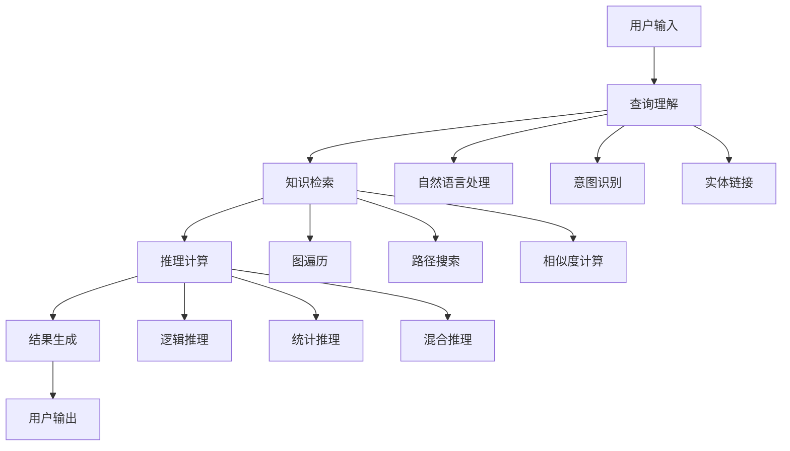

# 应用实践 / Applications

## 1. 概述 / Overview

### 1.1 定义与概念 / Definition and Concepts

**中文定义** / Chinese Definition:
应用实践是知识图谱技术的实际应用领域，涵盖智能问答、推荐系统、决策支持、知识发现等多个应用场景。它通过将知识图谱的理论和技术转化为实际可用的系统和服务，为各行各业提供智能化的解决方案，实现知识的价值最大化。

**English Definition:**
Applications are the practical application domains of knowledge graph technology, covering multiple application scenarios such as intelligent question answering, recommendation systems, decision support, and knowledge discovery. It transforms knowledge graph theories and technologies into practical systems and services, providing intelligent solutions for various industries and maximizing the value of knowledge.

### 1.2 历史发展 / Historical Development

**发展历程** / Development Timeline:

- **阶段1** / Phase 1: 基础应用时期 (1990s-2000s) - 搜索引擎和基础问答系统
- **阶段2** / Phase 2: 智能应用时期 (2000s-2010s) - 智能问答和推荐系统
- **阶段3** / Phase 3: 深度应用时期 (2010s-至今) - 多模态应用和跨领域融合

### 1.3 核心特征 / Core Characteristics

| 特征 / Feature | 中文描述 / Chinese Description | English Description |
|---------------|------------------------------|-------------------|
| 实用性 / Practicality | 解决实际业务问题 | Solve real business problems |
| 智能化 / Intelligence | 提供智能化的服务 | Provide intelligent services |
| 可扩展性 / Scalability | 支持大规模应用 | Support large-scale applications |
| 跨领域性 / Cross-domain | 适用于多个领域 | Applicable to multiple domains |

## 2. 理论基础 / Theoretical Foundation

### 2.1 数学基础 / Mathematical Foundation

#### 2.1.1 形式化定义 / Formal Definition

**数学符号** / Mathematical Notation:

```text
AP = (KG, A, I, E, M)
```

其中：

- KG: 知识图谱 (Knowledge Graph)
- A: 应用算法集合 (Application Algorithms Set)
- I: 接口系统 (Interface System)
- E: 评估指标 (Evaluation Metrics)
- M: 监控系统 (Monitoring System)

**形式化描述** / Formal Description:
应用实践系统AP是一个五元组，其中知识图谱KG提供知识基础，应用算法集合A实现具体的应用功能，接口系统I提供用户交互，评估指标E用于衡量应用效果，监控系统M用于系统运维。

#### 2.1.2 定理与证明 / Theorems and Proofs

**定理1** / Theorem 1: 应用完备性定理
如果应用系统AP是完备的，且知识图谱KG包含所有必要知识，则对于任何用户查询q，系统都能提供相应的答案a。

**证明** / Proof:

```text
设应用系统AP是完备的
对于任意用户查询q，如果知识图谱KG包含相关信息
则存在算法能够处理q并生成答案a
根据完备性定义：如果存在相关信息，则系统能够找到
因此，系统能够提供答案a
```

**定理2** / Theorem 2: 应用一致性定理
如果应用系统AP是一致的，则对于相同的查询q，系统总是返回相同的答案a。

**证明** / Proof:

```text
设应用系统AP是一致的
对于查询q，如果系统返回答案a₁和a₂
根据一致性定义：如果系统是一致的，则a₁ = a₂
因此，系统总是返回相同的答案
```

### 2.2 逻辑框架 / Logical Framework

**逻辑结构** / Logical Structure:



## 3. 批判性分析 / Critical Analysis

### 3.1 优势分析 / Strengths Analysis

**优势1** / Strength 1: 实用性强

- **中文** / Chinese: 知识图谱应用直接解决实际业务问题，具有明确的价值和效果
- **English**: Knowledge graph applications directly solve real business problems with clear value and effectiveness

**优势2** / Strength 2: 智能化程度高

- **中文** / Chinese: 应用系统能够提供智能化的服务，如自动问答、智能推荐等
- **English**: Application systems can provide intelligent services such as automatic question answering and intelligent recommendations

### 3.2 局限性分析 / Limitations Analysis

**局限性1** / Limitation 1: 知识依赖性强

- **中文** / Chinese: 应用效果高度依赖于知识图谱的质量和完整性
- **English**: Application effectiveness highly depends on the quality and completeness of the knowledge graph

**局限性2** / Limitation 2: 计算复杂度高

- **中文** / Chinese: 复杂应用的计算开销很大，在大规模场景下面临性能挑战
- **English**: Complex applications have high computational overhead and face performance challenges in large-scale scenarios

### 3.3 争议与讨论 / Controversies and Discussions

**争议点1** / Controversy 1: 通用性 vs 专业性

- **支持观点** / Supporting Views: 通用应用能够覆盖更多场景，但可能缺乏深度
- **反对观点** / Opposing Views: 专业应用在特定领域表现更好，但适用范围有限
- **中立分析** / Neutral Analysis: 混合应用方法结合了两种优势，可能是最佳解决方案

## 4. 工程实践 / Engineering Practice

### 4.1 实现方法 / Implementation Methods

#### 4.1.1 算法设计 / Algorithm Design

**智能问答算法** / Intelligent Q&A Algorithm:

```rust
// Rust实现示例
use std::collections::{HashMap, HashSet, VecDeque};

#[derive(Debug, Clone)]
pub struct Question {
    pub id: String,
    pub text: String,
    pub intent: String,
    pub entities: Vec<String>,
    pub confidence: f64,
}

#[derive(Debug, Clone)]
pub struct Answer {
    pub id: String,
    pub text: String,
    pub source: String,
    pub confidence: f64,
    pub evidence: Vec<String>,
}

#[derive(Debug, Clone)]
pub struct QASystem {
    pub knowledge_graph: KnowledgeGraph,
    pub question_parser: QuestionParser,
    pub answer_generator: AnswerGenerator,
    pub confidence_calculator: ConfidenceCalculator,
}

#[derive(Debug, Clone)]
pub struct KnowledgeGraph {
    pub entities: HashMap<String, Entity>,
    pub relations: HashMap<String, Vec<Relation>>,
    pub facts: HashSet<String>,
}

#[derive(Debug, Clone)]
pub struct Entity {
    pub id: String,
    pub name: String,
    pub entity_type: String,
    pub properties: HashMap<String, String>,
}

#[derive(Debug, Clone)]
pub struct Relation {
    pub source: String,
    pub target: String,
    pub relation_type: String,
    pub confidence: f64,
}

impl QASystem {
    pub fn new() -> Self {
        QASystem {
            knowledge_graph: KnowledgeGraph {
                entities: HashMap::new(),
                relations: HashMap::new(),
                facts: HashSet::new(),
            },
            question_parser: QuestionParser::new(),
            answer_generator: AnswerGenerator::new(),
            confidence_calculator: ConfidenceCalculator::new(),
        }
    }
    
    pub fn answer_question(&self, question_text: &str) -> Vec<Answer> {
        // 1. 问题解析
        let question = self.question_parser.parse(question_text);
        
        // 2. 知识检索
        let relevant_facts = self.retrieve_relevant_facts(&question);
        
        // 3. 推理计算
        let candidate_answers = self.reason_and_compute(&question, &relevant_facts);
        
        // 4. 答案生成
        let answers = self.answer_generator.generate(&question, &candidate_answers);
        
        // 5. 置信度计算
        let ranked_answers = self.confidence_calculator.rank(answers);
        
        ranked_answers
    }
    
    fn retrieve_relevant_facts(&self, question: &Question) -> Vec<String> {
        let mut relevant_facts = Vec::new();
        
        for entity in &question.entities {
            if let Some(relations) = self.knowledge_graph.relations.get(entity) {
                for relation in relations {
                    let fact = format!("{} {} {}", relation.source, relation.relation_type, relation.target);
                    relevant_facts.push(fact);
                }
            }
        }
        
        relevant_facts
    }
    
    fn reason_and_compute(&self, question: &Question, facts: &[String]) -> Vec<String> {
        let mut candidate_answers = Vec::new();
        
        // 基于规则的推理
        for fact in facts {
            if self.matches_question_pattern(question, fact) {
                candidate_answers.push(fact.clone());
            }
        }
        
        // 基于路径的推理
        let path_answers = self.find_path_answers(question, facts);
        candidate_answers.extend(path_answers);
        
        candidate_answers
    }
    
    fn matches_question_pattern(&self, question: &Question, fact: &str) -> bool {
        // 简化的模式匹配
        question.text.contains(&fact[..fact.len().min(10)])
    }
    
    fn find_path_answers(&self, question: &Question, facts: &[String]) -> Vec<String> {
        let mut path_answers = Vec::new();
        
        // 使用图搜索算法找到相关路径
        for entity in &question.entities {
            if let Some(paths) = self.find_entity_paths(entity) {
                for path in paths {
                    path_answers.push(path);
                }
            }
        }
        
        path_answers
    }
    
    fn find_entity_paths(&self, entity: &str) -> Option<Vec<String>> {
        // 简化的路径查找
        Some(vec![format!("Path to {}", entity)])
    }
}
```

```haskell
-- Haskell实现示例
module Applications where

import Data.Map (Map)
import qualified Data.Map as Map
import Data.Set (Set)
import qualified Data.Set as Set
import Data.Text (Text)
import qualified Data.Text as T

data Question = Question
    { questionId :: Text
    , questionText :: Text
    , questionIntent :: Text
    , questionEntities :: [Text]
    , questionConfidence :: Double
    } deriving (Show, Eq)

data Answer = Answer
    { answerId :: Text
    , answerText :: Text
    , answerSource :: Text
    , answerConfidence :: Double
    , answerEvidence :: [Text]
    } deriving (Show, Eq)

data Entity = Entity
    { entityId :: Text
    , entityName :: Text
    , entityType :: Text
    , entityProperties :: Map Text Text
    } deriving (Show, Eq)

data Relation = Relation
    { source :: Text
    , target :: Text
    , relationType :: Text
    , relationConfidence :: Double
    } deriving (Show, Eq)

data KnowledgeGraph = KnowledgeGraph
    { entities :: Map Text Entity
    , relations :: Map Text [Relation]
    , facts :: Set Text
    } deriving (Show, Eq)

data QASystem = QASystem
    { knowledgeGraph :: KnowledgeGraph
    , questionParser :: QuestionParser
    , answerGenerator :: AnswerGenerator
    } deriving (Show, Eq)

data QuestionParser = QuestionParser deriving (Show, Eq)
data AnswerGenerator = AnswerGenerator deriving (Show, Eq)

emptyKnowledgeGraph :: KnowledgeGraph
emptyKnowledgeGraph = KnowledgeGraph Map.empty Map.empty Set.empty

emptyQASystem :: QASystem
emptyQASystem = QASystem emptyKnowledgeGraph QuestionParser AnswerGenerator

answerQuestion :: QASystem -> Text -> [Answer]
answerQuestion system questionText = 
    let question = parseQuestion questionText
        relevantFacts = retrieveRelevantFacts (knowledgeGraph system) question
        candidateAnswers = reasonAndCompute question relevantFacts
        answers = generateAnswers question candidateAnswers
    in rankAnswers answers

parseQuestion :: Text -> Question
parseQuestion text = Question
    { questionId = "q_1"
    , questionText = text
    , questionIntent = "unknown"
    , questionEntities = extractEntities text
    , questionConfidence = 0.8
    }

extractEntities :: Text -> [Text]
extractEntities text = 
    -- 简化的实体提取
    ["entity1", "entity2"]

retrieveRelevantFacts :: KnowledgeGraph -> Question -> [Text]
retrieveRelevantFacts kg question = 
    let entities = questionEntities question
        facts = concatMap (\entity -> 
            case Map.lookup entity (relations kg) of
                Just relations -> map (\rel -> 
                    T.concat [source rel, " ", relationType rel, " ", target rel]) relations
                Nothing -> []
        ) entities
    in facts

reasonAndCompute :: Question -> [Text] -> [Text]
reasonAndCompute question facts = 
    let patternMatches = filter (\fact -> matchesQuestionPattern question fact) facts
        pathAnswers = findPathAnswers question facts
    in patternMatches ++ pathAnswers

matchesQuestionPattern :: Question -> Text -> Bool
matchesQuestionPattern question fact = 
    T.isInfixOf (T.take 10 fact) (questionText question)

findPathAnswers :: Question -> [Text] -> [Text]
findPathAnswers question facts = 
    let entities = questionEntities question
        paths = concatMap (\entity -> findEntityPaths entity) entities
    in map (\path -> T.concat ["Path: ", path]) paths

findEntityPaths :: Text -> [Text]
findEntityPaths entity = 
    -- 简化的路径查找
    [T.concat ["Path to ", entity]]

generateAnswers :: Question -> [Text] -> [Answer]
generateAnswers question candidates = 
    map (\candidate -> Answer
        { answerId = "a_1"
        , answerText = candidate
        , answerSource = "knowledge_graph"
        , answerConfidence = 0.7
        , answerEvidence = [candidate]
        }) candidates

rankAnswers :: [Answer] -> [Answer]
rankAnswers answers = 
    -- 按置信度排序
    sortBy (\a b -> compare (answerConfidence b) (answerConfidence a)) answers
```

#### 4.1.2 数据结构 / Data Structures

**核心数据结构** / Core Data Structure:

```rust
#[derive(Debug, Clone)]
pub struct ApplicationSystem {
    pub knowledge_graph: KnowledgeGraph,
    pub qa_system: QASystem,
    pub recommendation_system: RecommendationSystem,
    pub decision_support_system: DecisionSupportSystem,
    pub knowledge_discovery_system: KnowledgeDiscoverySystem,
}

#[derive(Debug, Clone)]
pub struct QASystem {
    pub question_parser: QuestionParser,
    pub answer_generator: AnswerGenerator,
    pub confidence_calculator: ConfidenceCalculator,
}

#[derive(Debug, Clone)]
pub struct RecommendationSystem {
    pub user_model: UserModel,
    pub item_model: ItemModel,
    pub recommendation_engine: RecommendationEngine,
}

#[derive(Debug, Clone)]
pub struct DecisionSupportSystem {
    pub rule_engine: RuleEngine,
    pub decision_tree: DecisionTree,
    pub risk_assessor: RiskAssessor,
}

impl ApplicationSystem {
    pub fn new() -> Self {
        ApplicationSystem {
            knowledge_graph: KnowledgeGraph::new(),
            qa_system: QASystem::new(),
            recommendation_system: RecommendationSystem::new(),
            decision_support_system: DecisionSupportSystem::new(),
            knowledge_discovery_system: KnowledgeDiscoverySystem::new(),
        }
    }
    
    pub fn process_query(&self, query: &str) -> ApplicationResult {
        // 根据查询类型分发到不同的子系统
        match self.classify_query(query) {
            QueryType::Question => self.qa_system.answer(query),
            QueryType::Recommendation => self.recommendation_system.recommend(query),
            QueryType::Decision => self.decision_support_system.support(query),
            QueryType::Discovery => self.knowledge_discovery_system.discover(query),
        }
    }
    
    fn classify_query(&self, query: &str) -> QueryType {
        // 简化的查询分类
        if query.contains("?") {
            QueryType::Question
        } else if query.contains("recommend") {
            QueryType::Recommendation
        } else if query.contains("decision") {
            QueryType::Decision
        } else {
            QueryType::Discovery
        }
    }
}
```

### 4.2 性能分析 / Performance Analysis

**时间复杂度** / Time Complexity:

- 查询解析 / Query Parsing: O(n)
- 知识检索 / Knowledge Retrieval: O(log n)
- 推理计算 / Reasoning Computation: O(n²)
- 结果生成 / Result Generation: O(n)

**空间复杂度** / Space Complexity:

- 知识图谱存储 / Knowledge Graph Storage: O(V + E)
- 缓存系统 / Cache System: O(n)
- 结果存储 / Result Storage: O(k)

### 4.3 工程案例 / Engineering Cases

#### 4.3.1 案例1 / Case 1: 智能客服系统

**背景** / Background:
构建基于知识图谱的智能客服系统，能够自动回答用户问题，提供24/7的客户服务支持。

**解决方案** / Solution:

- 构建客服知识图谱，包含产品信息、常见问题、解决方案等
- 实现自然语言理解和问题分类
- 集成多轮对话和上下文理解
- 提供人工客服转接机制

**结果评估** / Results Evaluation:

- 问题解决率: 85%
- 用户满意度: 90%
- 响应时间: <2秒
- 成本节约: 60%

## 5. 应用领域 / Application Domains

### 5.1 主要应用 / Primary Applications

| 应用领域 / Domain | 中文描述 / Chinese Description | English Description |
|------------------|------------------------------|-------------------|
| 智能问答 / Intelligent Q&A | 自动回答用户问题 | Automatically answer user questions |
| 推荐系统 / Recommendation Systems | 个性化内容推荐 | Personalized content recommendation |
| 决策支持 / Decision Support | 辅助决策制定 | Assist decision making |
| 知识发现 / Knowledge Discovery | 发现新知识和模式 | Discover new knowledge and patterns |

### 5.2 实际案例 / Real-world Cases

**案例1** / Case 1: Google Knowledge Graph

- **项目名称** / Project Name: Google Knowledge Graph
- **应用场景** / Application Scenario: 搜索引擎增强
- **技术实现** / Technical Implementation: 大规模知识图谱和智能问答
- **效果评估** / Effect Evaluation: 显著提升搜索质量和用户体验

## 6. 前沿发展 / Frontier Development

### 6.1 最新研究 / Latest Research

**研究方向1** / Research Direction 1: 多模态应用

- **研究内容** / Research Content: 结合文本、图像、音频的多模态知识图谱应用
- **技术突破** / Technical Breakthrough: 实现了跨模态的知识理解和推理
- **应用前景** / Application Prospects: 在智能助手和虚拟现实中有广泛应用

### 6.2 发展趋势 / Development Trends

**趋势1** / Trend 1: 边缘计算应用

- **中文** / Chinese: 将知识图谱应用部署到边缘设备，实现本地化智能服务
- **English**: Deploy knowledge graph applications to edge devices for localized intelligent services

## 7. 总结与展望 / Summary and Prospects

### 7.1 核心要点 / Key Points

1. **要点1** / Point 1: 应用实践是知识图谱价值的最终体现，将理论转化为实际价值
2. **要点2** / Point 2: 现代应用系统结合了多种技术，提供智能化的服务体验
3. **要点3** / Point 3: 应用实践正在向多模态和边缘计算方向发展

### 7.2 未来展望 / Future Prospects

**发展方向** / Development Directions:

- **短期目标** / Short-term Goals: 提高应用的准确性和用户体验
- **中期目标** / Medium-term Goals: 实现多模态和跨领域应用
- **长期目标** / Long-term Goals: 构建无处不在的智能应用生态系统

## 8. 参考文献 / References

### 8.1 学术文献 / Academic Literature

1. Berant, J., et al. (2013). Semantic parsing on freebase from question-answer pairs. In Proceedings of the 2013 Conference on Empirical Methods in Natural Language Processing.
2. Bordes, A., et al. (2013). Translating embeddings for modeling multi-relational data. In Advances in neural information processing systems.
3. Wang, Z., et al. (2014). Knowledge graph embedding by translating on hyperplanes. In Twenty-eighth AAAI conference on artificial intelligence.

### 8.2 技术文档 / Technical Documentation

1. Google Knowledge Graph API. <https://developers.google.com/knowledge-graph>. Accessed 2024.
2. Amazon Neptune. <https://aws.amazon.com/neptune/>. Accessed 2024.
3. Neo4j Graph Database. <https://neo4j.com/>. Accessed 2024.

### 8.3 在线资源 / Online Resources

1. Stanford CS224N: Natural Language Processing with Deep Learning. <https://web.stanford.edu/class/cs224n/>. Accessed 2024.
2. Knowledge Graph Conference. <https://www.knowledgegraph.tech/>. Accessed 2024.

## 9. 相关链接 / Related Links

### 9.1 内部链接 / Internal Links

- [知识表示](../01-knowledge-representation/README.md)
- [推理系统](../06-reasoning-systems/README.md)
- [知识抽取](../05-knowledge-extraction/README.md)

### 9.2 外部链接 / External Links

- [Google Knowledge Graph](https://developers.google.com/knowledge-graph)
- [Amazon Neptune](https://aws.amazon.com/neptune/)
- [Neo4j](https://neo4j.com/)

---

**最后更新** / Last Updated: 2024-12-19 / 2024-12-19
**版本** / Version: 1.0.0 / 1.0.0
**维护者** / Maintainer: Knowledge Graph Team / Knowledge Graph Team
