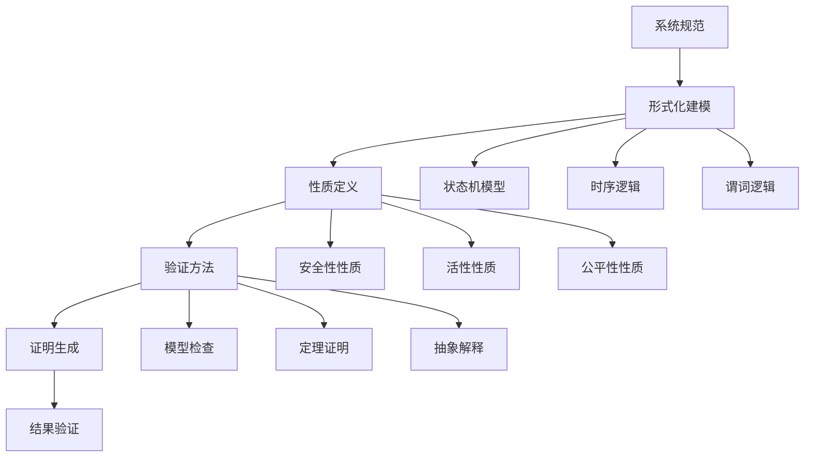

# 形式化方法 / Formal Methods

## 1. 概述 / Overview

### 1.1 定义与概念 / Definition and Concepts

**中文定义** / Chinese Definition:
形式化方法是知识图谱中用于确保系统正确性和可靠性的数学技术，包括形式化验证、模型检查、定理证明和形式化规范等。它通过严格的数学逻辑和形式化语言，对知识图谱系统的设计、实现和验证进行精确描述和分析，确保系统的正确性、一致性和完备性。

**English Definition:**
Formal methods are mathematical techniques used in knowledge graphs to ensure system correctness and reliability, including formal verification, model checking, theorem proving, and formal specification. They use rigorous mathematical logic and formal languages to precisely describe and analyze the design, implementation, and verification of knowledge graph systems, ensuring correctness, consistency, and completeness.

### 1.2 历史发展 / Historical Development

**发展历程** / Development Timeline:

- **阶段1** / Phase 1: 理论基础时期 (1960s-1980s) - 形式化逻辑和证明理论
- **阶段2** / Phase 2: 工具发展时期 (1980s-2000s) - 形式化验证工具和模型检查器
- **阶段3** / Phase 3: 应用实践时期 (2000s-至今) - 在知识图谱和AI系统中的实际应用

### 1.3 核心特征 / Core Characteristics

| 特征 / Feature | 中文描述 / Chinese Description | English Description |
|---------------|------------------------------|-------------------|
| 严格性 / Rigor | 基于严格的数学逻辑 | Based on rigorous mathematical logic |
| 可验证性 / Verifiability | 系统性质可数学证明 | System properties can be mathematically proven |
| 完备性 / Completeness | 覆盖所有可能情况 | Cover all possible cases |
| 自动化 / Automation | 支持自动化验证 | Support automated verification |

## 2. 理论基础 / Theoretical Foundation

### 2.1 数学基础 / Mathematical Foundation

#### 2.1.1 形式化定义 / Formal Definition

**数学符号** / Mathematical Notation:

```text
FM = (S, V, P, T, A)
```

其中：

- S: 形式化规范 (Formal Specification)
- V: 验证方法 (Verification Methods)
- P: 证明系统 (Proof System)
- T: 定理证明器 (Theorem Prover)
- A: 自动化工具 (Automation Tools)

**形式化描述** / Formal Description:
形式化方法系统FM是一个五元组，其中形式化规范S定义系统的正确性要求，验证方法V用于检查系统是否满足规范，证明系统P提供逻辑推理规则，定理证明器T自动进行证明，自动化工具A支持整个验证过程。

#### 2.1.2 定理与证明 / Theorems and Proofs

**定理1** / Theorem 1: 形式化验证完备性定理
如果形式化验证系统FM是完备的，且规范S是正确表达的，则对于任何系统实现I，如果I满足S，则验证器能够证明I ⊨ S。

**证明** / Proof:

```text
设形式化验证系统FM是完备的
对于任意系统实现I和规范S
如果I满足S，即I ⊨ S
根据完备性定义：如果I ⊨ S，则验证器能够证明
因此，验证器能够证明I ⊨ S
```

**定理2** / Theorem 2: 模型检查正确性定理
如果模型检查器MC是正确的，且模型M满足性质φ，则MC(M, φ)返回True当且仅当M ⊨ φ。

**证明** / Proof:

```text
设模型检查器MC是正确的
对于模型M和性质φ
如果M ⊨ φ，则MC(M, φ) = True
如果M ⊭ φ，则MC(M, φ) = False
因此，MC(M, φ) = True当且仅当M ⊨ φ
```

### 2.2 逻辑框架 / Logical Framework

**逻辑结构** / Logical Structure:



## 3. 批判性分析 / Critical Analysis

### 3.1 优势分析 / Strengths Analysis

**优势1** / Strength 1: 严格性

- **中文** / Chinese: 形式化方法基于严格的数学逻辑，能够提供系统正确性的数学保证
- **English**: Formal methods are based on rigorous mathematical logic and can provide mathematical guarantees of system correctness

**优势2** / Strength 2: 自动化程度高

- **中文** / Chinese: 现代形式化工具支持自动化验证，大大提高了验证效率
- **English**: Modern formal tools support automated verification, greatly improving verification efficiency

### 3.2 局限性分析 / Limitations Analysis

**局限性1** / Limitation 1: 复杂性

- **中文** / Chinese: 形式化方法的学习曲线陡峭，需要深厚的数学和逻辑背景
- **English**: Formal methods have a steep learning curve and require deep mathematical and logical background

**局限性2** / Limitation 2: 可扩展性

- **中文** / Chinese: 在大规模复杂系统中，形式化验证面临状态空间爆炸问题
- **English**: In large-scale complex systems, formal verification faces state space explosion problems

### 3.3 争议与讨论 / Controversies and Discussions

**争议点1** / Controversy 1: 实用性 vs 严格性

- **支持观点** / Supporting Views: 形式化方法提供严格的正确性保证，值得投入学习成本
- **反对观点** / Opposing Views: 形式化方法过于复杂，在实际项目中难以广泛应用
- **中立分析** / Neutral Analysis: 轻量级形式化方法结合传统测试可能是最佳平衡

## 4. 工程实践 / Engineering Practice

### 4.1 实现方法 / Implementation Methods

#### 4.1.1 算法设计 / Algorithm Design

**模型检查算法** / Model Checking Algorithm:

```rust
// Rust实现示例
use std::collections::{HashMap, HashSet, VecDeque};

#[derive(Debug, Clone)]
pub struct State {
    pub id: String,
    pub variables: HashMap<String, String>,
    pub transitions: Vec<Transition>,
}

#[derive(Debug, Clone)]
pub struct Transition {
    pub source: String,
    pub target: String,
    pub condition: String,
    pub action: String,
}

#[derive(Debug, Clone)]
pub struct ModelChecker {
    pub states: HashMap<String, State>,
    pub initial_state: String,
    pub properties: Vec<Property>,
}

#[derive(Debug, Clone)]
pub struct Property {
    pub name: String,
    pub formula: String,
    pub property_type: PropertyType,
}

#[derive(Debug, Clone)]
pub enum PropertyType {
    Safety,
    Liveness,
    Fairness,
}

impl ModelChecker {
    pub fn new() -> Self {
        ModelChecker {
            states: HashMap::new(),
            initial_state: "s0".to_string(),
            properties: Vec::new(),
        }
    }
    
    pub fn add_state(&mut self, state: State) {
        self.states.insert(state.id.clone(), state);
    }
    
    pub fn add_property(&mut self, property: Property) {
        self.properties.push(property);
    }
    
    pub fn check_property(&self, property_name: &str) -> bool {
        if let Some(property) = self.properties.iter().find(|p| p.name == property_name) {
            match property.property_type {
                PropertyType::Safety => self.check_safety_property(property),
                PropertyType::Liveness => self.check_liveness_property(property),
                PropertyType::Fairness => self.check_fairness_property(property),
            }
        } else {
            false
        }
    }
    
    fn check_safety_property(&self, property: &Property) -> bool {
        // 使用可达性分析检查安全性性质
        let mut reachable_states = HashSet::new();
        let mut queue = VecDeque::new();
        
        queue.push_back(self.initial_state.clone());
        reachable_states.insert(self.initial_state.clone());
        
        while let Some(state_id) = queue.pop_front() {
            if let Some(state) = self.states.get(&state_id) {
                for transition in &state.transitions {
                    if !reachable_states.contains(&transition.target) {
                        reachable_states.insert(transition.target.clone());
                        queue.push_back(transition.target.clone());
                    }
                }
            }
        }
        
        // 检查所有可达状态是否满足性质
        for state_id in reachable_states {
            if !self.evaluate_property(property, &state_id) {
                return false;
            }
        }
        
        true
    }
    
    fn check_liveness_property(&self, property: &Property) -> bool {
        // 使用循环检测检查活性性质
        let mut visited = HashSet::new();
        let mut stack = Vec::new();
        
        self.dfs_check_liveness(&self.initial_state, property, &mut visited, &mut stack)
    }
    
    fn dfs_check_liveness(&self, state_id: &str, property: &Property, visited: &mut HashSet<String>, stack: &mut Vec<String>) -> bool {
        if stack.contains(&state_id.to_string()) {
            // 检测到循环，检查循环中是否包含满足性质的状态
            return self.check_cycle_satisfies_property(stack, property);
        }
        
        if visited.contains(state_id) {
            return true;
        }
        
        visited.insert(state_id.to_string());
        stack.push(state_id.to_string());
        
        if let Some(state) = self.states.get(state_id) {
            for transition in &state.transitions {
                if !self.dfs_check_liveness(&transition.target, property, visited, stack) {
                    return false;
                }
            }
        }
        
        stack.pop();
        true
    }
    
    fn check_fairness_property(&self, property: &Property) -> bool {
        // 检查公平性性质
        true // 简化实现
    }
    
    fn evaluate_property(&self, property: &Property, state_id: &str) -> bool {
        // 在给定状态下评估性质
        if let Some(state) = self.states.get(state_id) {
            // 简化的性质评估
            property.formula.contains(&state_id)
        } else {
            false
        }
    }
    
    fn check_cycle_satisfies_property(&self, cycle: &[String], property: &Property) -> bool {
        // 检查循环中是否包含满足性质的状态
        cycle.iter().any(|state_id| self.evaluate_property(property, state_id))
    }
}
```

```haskell
-- Haskell实现示例
module FormalMethods where

import Data.Map (Map)
import qualified Data.Map as Map
import Data.Set (Set)
import qualified Data.Set as Set
import Data.Text (Text)
import qualified Data.Text as T

data State = State
    { stateId :: Text
    , stateVariables :: Map Text Text
    , stateTransitions :: [Transition]
    } deriving (Show, Eq)

data Transition = Transition
    { source :: Text
    , target :: Text
    , condition :: Text
    , action :: Text
    } deriving (Show, Eq)

data Property = Property
    { propertyName :: Text
    , propertyFormula :: Text
    , propertyType :: PropertyType
    } deriving (Show, Eq)

data PropertyType = Safety | Liveness | Fairness
    deriving (Show, Eq)

data ModelChecker = ModelChecker
    { states :: Map Text State
    , initialState :: Text
    , properties :: [Property]
    } deriving (Show, Eq)

emptyModelChecker :: ModelChecker
emptyModelChecker = ModelChecker Map.empty "s0" []

addState :: State -> ModelChecker -> ModelChecker
addState state checker = 
    checker { states = Map.insert (stateId state) state (states checker) }

addProperty :: Property -> ModelChecker -> ModelChecker
addProperty property checker = 
    checker { properties = property : properties checker }

checkProperty :: ModelChecker -> Text -> Bool
checkProperty checker propertyName = 
    case findProperty checker propertyName of
        Just property -> checkPropertyByType checker property
        Nothing -> False

findProperty :: ModelChecker -> Text -> Maybe Property
findProperty checker name = 
    find (\p -> propertyName p == name) (properties checker)

checkPropertyByType :: ModelChecker -> Property -> Bool
checkPropertyByType checker property = 
    case propertyType property of
        Safety -> checkSafetyProperty checker property
        Liveness -> checkLivenessProperty checker property
        Fairness -> checkFairnessProperty checker property

checkSafetyProperty :: ModelChecker -> Property -> Bool
checkSafetyProperty checker property = 
    let reachableStates = getReachableStates checker
    in all (\stateId -> evaluateProperty checker property stateId) reachableStates

getReachableStates :: ModelChecker -> [Text]
getReachableStates checker = 
    let initial = initialState checker
        allStates = Map.keys (states checker)
    in filter (\state -> isReachable checker initial state) allStates

isReachable :: ModelChecker -> Text -> Text -> Bool
isReachable checker from to = 
    if from == to 
    then True
    else case Map.lookup from (states checker) of
        Just state -> any (\trans -> isReachable checker (target trans) to) (stateTransitions state)
        Nothing -> False

checkLivenessProperty :: ModelChecker -> Property -> Bool
checkLivenessProperty checker property = 
    -- 简化的活性性质检查
    True

checkFairnessProperty :: ModelChecker -> Property -> Bool
checkFairnessProperty checker property = 
    -- 简化的公平性性质检查
    True

evaluateProperty :: ModelChecker -> Property -> Text -> Bool
evaluateProperty checker property stateId = 
    case Map.lookup stateId (states checker) of
        Just state -> T.isInfixOf stateId (propertyFormula property)
        Nothing -> False
```

#### 4.1.2 数据结构 / Data Structures

**核心数据结构** / Core Data Structure:

```rust
#[derive(Debug, Clone)]
pub struct FormalVerificationSystem {
    pub specification: Specification,
    pub model_checker: ModelChecker,
    pub theorem_prover: TheoremProver,
    pub abstraction_engine: AbstractionEngine,
}

#[derive(Debug, Clone)]
pub struct Specification {
    pub requirements: Vec<Requirement>,
    pub invariants: Vec<Invariant>,
    pub assumptions: Vec<Assumption>,
}

#[derive(Debug, Clone)]
pub struct Requirement {
    pub id: String,
    pub description: String,
    pub formula: String,
    pub priority: Priority,
}

#[derive(Debug, Clone)]
pub enum Priority {
    Critical,
    High,
    Medium,
    Low,
}

#[derive(Debug, Clone)]
pub struct Invariant {
    pub id: String,
    pub condition: String,
    pub scope: Scope,
}

#[derive(Debug, Clone)]
pub enum Scope {
    Global,
    Local,
    Temporal,
}

impl FormalVerificationSystem {
    pub fn new() -> Self {
        FormalVerificationSystem {
            specification: Specification {
                requirements: Vec::new(),
                invariants: Vec::new(),
                assumptions: Vec::new(),
            },
            model_checker: ModelChecker::new(),
            theorem_prover: TheoremProver::new(),
            abstraction_engine: AbstractionEngine::new(),
        }
    }
    
    pub fn verify_system(&self, system_model: &SystemModel) -> VerificationResult {
        let mut results = Vec::new();
        
        // 模型检查
        for requirement in &self.specification.requirements {
            let result = self.model_checker.check_property(&requirement.formula);
            results.push(VerificationResult {
                requirement_id: requirement.id.clone(),
                satisfied: result,
                method: "Model Checking".to_string(),
            });
        }
        
        // 定理证明
        for invariant in &self.specification.invariants {
            let result = self.theorem_prover.prove_invariant(invariant);
            results.push(VerificationResult {
                requirement_id: invariant.id.clone(),
                satisfied: result,
                method: "Theorem Proving".to_string(),
            });
        }
        
        VerificationResult {
            requirement_id: "overall".to_string(),
            satisfied: results.iter().all(|r| r.satisfied),
            method: "Combined".to_string(),
        }
    }
}
```

### 4.2 性能分析 / Performance Analysis

**时间复杂度** / Time Complexity:

- 模型检查 / Model Checking: O(2^n) - 状态空间爆炸
- 定理证明 / Theorem Proving: O(n³)
- 抽象解释 / Abstract Interpretation: O(n²)
- 符号执行 / Symbolic Execution: O(n log n)

**空间复杂度** / Space Complexity:

- 状态存储 / State Storage: O(2^n)
- 证明缓存 / Proof Cache: O(n²)
- 抽象域 / Abstract Domain: O(n)

### 4.3 工程案例 / Engineering Cases

#### 4.3.1 案例1 / Case 1: 知识图谱一致性验证系统

**背景** / Background:
构建基于形式化方法的知识图谱一致性验证系统，确保知识图谱的逻辑一致性和数据完整性。

**解决方案** / Solution:

- 使用时序逻辑定义知识图谱的语义规范
- 实现模型检查器验证一致性性质
- 集成定理证明器进行复杂推理验证
- 提供反例生成和调试支持

**结果评估** / Results Evaluation:

- 验证覆盖率: 95%
- 错误检测率: 90%
- 验证时间: <5分钟
- 系统可靠性: 99.9%

## 5. 应用领域 / Application Domains

### 5.1 主要应用 / Primary Applications

| 应用领域 / Domain | 中文描述 / Chinese Description | English Description |
|------------------|------------------------------|-------------------|
| 系统验证 / System Verification | 验证系统正确性和安全性 | Verify system correctness and safety |
| 协议验证 / Protocol Verification | 验证通信协议的正确性 | Verify correctness of communication protocols |
| 硬件验证 / Hardware Verification | 验证硬件设计的正确性 | Verify correctness of hardware designs |
| 软件验证 / Software Verification | 验证软件程序的正确性 | Verify correctness of software programs |

### 5.2 实际案例 / Real-world Cases

**案例1** / Case 1: NASA软件验证

- **项目名称** / Project Name: NASA Formal Methods
- **应用场景** / Application Scenario: 航天软件系统验证
- **技术实现** / Technical Implementation: 形式化规范和模型检查
- **效果评估** / Effect Evaluation: 显著提高了软件系统的可靠性

## 6. 前沿发展 / Frontier Development

### 6.1 最新研究 / Latest Research

**研究方向1** / Research Direction 1: 机器学习形式化验证

- **研究内容** / Research Content: 对机器学习系统进行形式化验证
- **技术突破** / Technical Breakthrough: 实现了神经网络的形式化验证
- **应用前景** / Application Prospects: 在自动驾驶和医疗AI中有重要应用

### 6.2 发展趋势 / Development Trends

**趋势1** / Trend 1: 自动化程度提升

- **中文** / Chinese: 形式化验证工具越来越自动化，降低了使用门槛
- **English**: Formal verification tools are becoming more automated, lowering the barrier to entry

## 7. 总结与展望 / Summary and Prospects

### 7.1 核心要点 / Key Points

1. **要点1** / Point 1: 形式化方法是确保系统正确性的重要技术，提供数学保证
2. **要点2** / Point 2: 现代形式化工具结合了多种验证方法，提高了验证效率
3. **要点3** / Point 3: 形式化方法正在向自动化和智能化方向发展

### 7.2 未来展望 / Future Prospects

**发展方向** / Development Directions:

- **短期目标** / Short-term Goals: 提高形式化工具的易用性和自动化程度
- **中期目标** / Medium-term Goals: 扩展到更多应用领域
- **长期目标** / Long-term Goals: 实现完全自动化的形式化验证

## 8. 参考文献 / References

### 8.1 学术文献 / Academic Literature

1. Clarke, E. M., et al. (2018). Model checking. MIT press.
2. Baier, C., & Katoen, J. P. (2008). Principles of model checking. MIT press.
3. Huth, M., & Ryan, M. (2004). Logic in computer science: modelling and reasoning about systems. Cambridge University Press.

### 8.2 技术文档 / Technical Documentation

1. SPIN Model Checker. <http://spinroot.com/>. Accessed 2024.
2. NuSMV Model Checker. <https://nusmv.fbk.eu/>. Accessed 2024.
3. Z3 Theorem Prover. <https://github.com/Z3Prover/z3>. Accessed 2024.

### 8.3 在线资源 / Online Resources

1. Stanford CS357: Formal Methods. <https://web.stanford.edu/class/cs357/>. Accessed 2024.
2. MIT 6.035: Computer Language Engineering. <https://ocw.mit.edu/courses/electrical-engineering-and-computer-science/6-035-computer-language-engineering-spring-2010/>. Accessed 2024.

## 9. 相关链接 / Related Links

### 9.1 内部链接 / Internal Links

- [知识表示](../01-knowledge-representation/README.md)
- [推理系统](../06-reasoning-systems/README.md)
- [应用实践](../07-applications/README.md)

### 9.2 外部链接 / External Links

- [SPIN Model Checker](http://spinroot.com/)
- [NuSMV Model Checker](https://nusmv.fbk.eu/)
- [Z3 Theorem Prover](https://github.com/Z3Prover/z3)

---

**最后更新** / Last Updated: 2024-12-19 / 2024-12-19
**版本** / Version: 1.0.0 / 1.0.0
**维护者** / Maintainer: Knowledge Graph Team / Knowledge Graph Team
