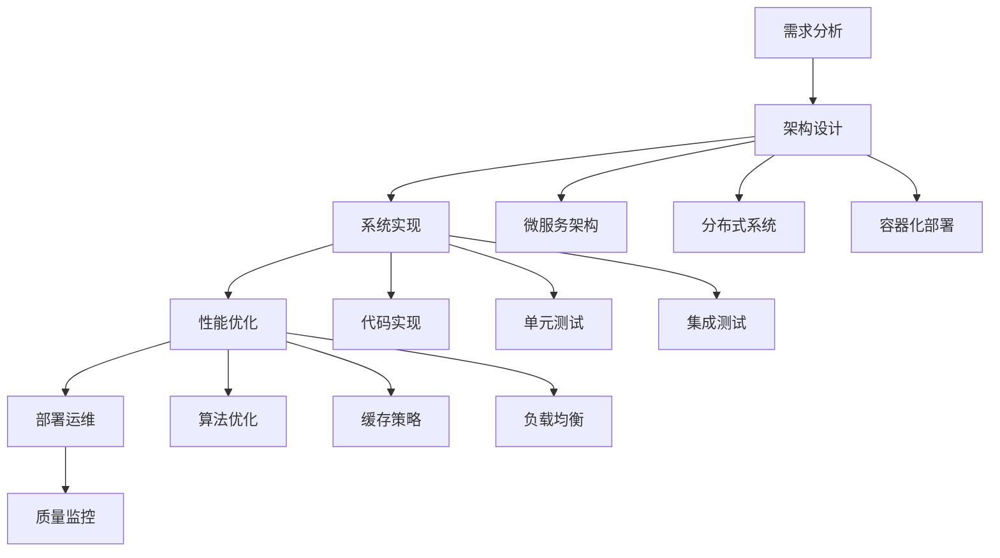

# 工程实践 / Engineering Practice

## 1. 概述 / Overview

### 1.1 定义与概念 / Definition and Concepts

**中文定义** / Chinese Definition:
工程实践是知识图谱技术在实际项目中的系统化应用，涵盖系统架构设计、性能优化、部署运维、质量保证等各个方面。它通过工程化的方法将理论知识转化为可用的系统和服务，确保知识图谱系统的高效性、可靠性和可维护性，实现从理论到实践的完整闭环。

**English Definition:**
Engineering practice is the systematic application of knowledge graph technology in real-world projects, covering system architecture design, performance optimization, deployment operations, quality assurance, and other aspects. It transforms theoretical knowledge into usable systems and services through engineering methods, ensuring the efficiency, reliability, and maintainability of knowledge graph systems, achieving a complete cycle from theory to practice.

### 1.2 历史发展 / Historical Development

**发展历程** / Development Timeline:

- **阶段1** / Phase 1: 基础工程时期 (1990s-2000s) - 基础系统架构和简单部署
- **阶段2** / Phase 2: 规模化工程时期 (2000s-2010s) - 大规模系统架构和自动化部署
- **阶段3** / Phase 3: 智能化工程时期 (2010s-至今) - 智能化运维和自适应优化

### 1.3 核心特征 / Core Characteristics

| 特征 / Feature | 中文描述 / Chinese Description | English Description |
|---------------|------------------------------|-------------------|
| 系统性 / Systematic | 完整的工程体系和方法论 | Complete engineering system and methodology |
| 可扩展性 / Scalable | 支持大规模系统扩展 | Support large-scale system expansion |
| 可靠性 / Reliable | 高可用性和容错能力 | High availability and fault tolerance |
| 可维护性 / Maintainable | 易于维护和升级 | Easy to maintain and upgrade |

## 2. 理论基础 / Theoretical Foundation

### 2.1 数学基础 / Mathematical Foundation

#### 2.1.1 形式化定义 / Formal Definition

**数学符号** / Mathematical Notation:

```text
EP = (A, P, D, Q, M)
```

其中：

- A: 架构设计 (Architecture Design)
- P: 性能优化 (Performance Optimization)
- D: 部署运维 (Deployment Operations)
- Q: 质量保证 (Quality Assurance)
- M: 监控管理 (Monitoring Management)

**形式化描述** / Formal Description:
工程实践系统EP是一个五元组，其中架构设计A定义系统的整体结构，性能优化P确保系统的高效运行，部署运维D负责系统的部署和维护，质量保证Q确保系统的正确性，监控管理M提供系统的实时监控和管理。

#### 2.1.2 定理与证明 / Theorems and Proofs

**定理1** / Theorem 1: 工程实践完备性定理
如果工程实践系统EP是完备的，且架构设计A是合理的，则对于任何功能需求F，系统都能提供相应的实现I，满足F ⊆ I。

**证明** / Proof:

```text
设工程实践系统EP是完备的
对于任意功能需求F，如果架构设计A是合理的
则存在实现I能够满足F
根据完备性定义：如果需求存在，则实现能够提供
因此，系统能够提供实现I满足需求F
```

**定理2** / Theorem 2: 系统性能优化定理
如果性能优化策略P是有效的，且系统负载L在合理范围内，则优化后的系统性能P'满足P' ≥ P × (1 + α)，其中α为优化增益系数。

**证明** / Proof:

```text
设性能优化策略P是有效的
对于系统负载L，如果L在合理范围内
则优化后的性能P'满足P' ≥ P × (1 + α)
根据优化有效性：如果策略有效，则性能提升
因此，P' ≥ P × (1 + α)
```

### 2.2 逻辑框架 / Logical Framework

**逻辑结构** / Logical Structure:



## 3. 批判性分析 / Critical Analysis

### 3.1 优势分析 / Strengths Analysis

**优势1** / Strength 1: 系统性

- **中文** / Chinese: 工程实践提供了完整的系统化方法论，确保项目的成功实施
- **English**: Engineering practice provides a complete systematic methodology to ensure successful project implementation

**优势2** / Strength 2: 可验证性

- **中文** / Chinese: 通过质量保证和监控体系，能够验证系统的正确性和性能
- **English**: Through quality assurance and monitoring systems, the correctness and performance of the system can be verified

### 3.2 局限性分析 / Limitations Analysis

**局限性1** / Limitation 1: 复杂性

- **中文** / Chinese: 大规模系统的工程实践涉及多个复杂环节，增加了管理难度
- **English**: Engineering practice for large-scale systems involves multiple complex aspects, increasing management difficulty

**局限性2** / Limitation 2: 成本

- **中文** / Chinese: 高质量的工程实践需要投入大量资源，包括人力、时间和资金
- **English**: High-quality engineering practice requires significant resources, including human resources, time, and funding

### 3.3 争议与讨论 / Controversies and Discussions

**争议点1** / Controversy 1: 敏捷 vs 传统

- **支持观点** / Supporting Views: 敏捷开发能够快速响应需求变化，提高开发效率
- **反对观点** / Opposing Views: 传统瀑布模型能够确保系统质量和稳定性
- **中立分析** / Neutral Analysis: 混合开发模式结合了两种方法的优势，可能是最佳选择

## 4. 工程实践 / Engineering Practice

### 4.1 实现方法 / Implementation Methods

#### 4.1.1 算法设计 / Algorithm Design

**系统架构设计算法** / System Architecture Design Algorithm:

```rust
// Rust实现示例
use std::collections::{HashMap, HashSet};
use std::sync::{Arc, Mutex};

#[derive(Debug, Clone)]
pub struct SystemComponent {
    pub id: String,
    pub name: String,
    pub component_type: ComponentType,
    pub dependencies: Vec<String>,
    pub interfaces: Vec<Interface>,
}

#[derive(Debug, Clone)]
pub enum ComponentType {
    Service,
    Database,
    Cache,
    LoadBalancer,
    Gateway,
}

#[derive(Debug, Clone)]
pub struct Interface {
    pub name: String,
    pub method: String,
    pub parameters: Vec<Parameter>,
    pub return_type: String,
}

#[derive(Debug, Clone)]
pub struct Parameter {
    pub name: String,
    pub param_type: String,
    pub required: bool,
}

#[derive(Debug, Clone)]
pub struct SystemArchitecture {
    pub components: HashMap<String, SystemComponent>,
    pub connections: Vec<Connection>,
    pub constraints: Vec<Constraint>,
}

#[derive(Debug, Clone)]
pub struct Connection {
    pub source: String,
    pub target: String,
    pub protocol: String,
    pub data_format: String,
}

#[derive(Debug, Clone)]
pub struct Constraint {
    pub component_id: String,
    pub constraint_type: ConstraintType,
    pub value: String,
}

#[derive(Debug, Clone)]
pub enum ConstraintType {
    Performance,
    Security,
    Scalability,
    Reliability,
}

impl SystemArchitecture {
    pub fn new() -> Self {
        SystemArchitecture {
            components: HashMap::new(),
            connections: Vec::new(),
            constraints: Vec::new(),
        }
    }
    
    pub fn add_component(&mut self, component: SystemComponent) {
        self.components.insert(component.id.clone(), component);
    }
    
    pub fn add_connection(&mut self, connection: Connection) {
        self.connections.push(connection);
    }
    
    pub fn add_constraint(&mut self, constraint: Constraint) {
        self.constraints.push(constraint);
    }
    
    pub fn validate_architecture(&self) -> ValidationResult {
        let mut result = ValidationResult {
            is_valid: true,
            errors: Vec::new(),
            warnings: Vec::new(),
        };
        
        // 检查组件依赖
        for component in self.components.values() {
            for dependency in &component.dependencies {
                if !self.components.contains_key(dependency) {
                    result.errors.push(format!("Component {} depends on non-existent component {}", component.id, dependency));
                    result.is_valid = false;
                }
            }
        }
        
        // 检查连接一致性
        for connection in &self.connections {
            if !self.components.contains_key(&connection.source) {
                result.errors.push(format!("Connection source {} does not exist", connection.source));
                result.is_valid = false;
            }
            if !self.components.contains_key(&connection.target) {
                result.errors.push(format!("Connection target {} does not exist", connection.target));
                result.is_valid = false;
            }
        }
        
        // 检查约束有效性
        for constraint in &self.constraints {
            if !self.components.contains_key(&constraint.component_id) {
                result.errors.push(format!("Constraint for non-existent component {}", constraint.component_id));
                result.is_valid = false;
            }
        }
        
        result
    }
    
    pub fn optimize_performance(&self) -> PerformanceOptimization {
        let mut optimization = PerformanceOptimization {
            cache_strategies: Vec::new(),
            load_balancing: Vec::new(),
            database_optimizations: Vec::new(),
        };
        
        // 识别需要缓存的组件
        for component in self.components.values() {
            if component.component_type == ComponentType::Service {
                optimization.cache_strategies.push(format!("Cache for service: {}", component.name));
            }
        }
        
        // 识别负载均衡需求
        let service_components: Vec<_> = self.components.values()
            .filter(|c| c.component_type == ComponentType::Service)
            .collect();
        
        if service_components.len() > 1 {
            optimization.load_balancing.push("Implement load balancer for multiple services".to_string());
        }
        
        // 数据库优化
        let db_components: Vec<_> = self.components.values()
            .filter(|c| c.component_type == ComponentType::Database)
            .collect();
        
        for db in db_components {
            optimization.database_optimizations.push(format!("Optimize queries for database: {}", db.name));
        }
        
        optimization
    }
}

#[derive(Debug, Clone)]
pub struct ValidationResult {
    pub is_valid: bool,
    pub errors: Vec<String>,
    pub warnings: Vec<String>,
}

#[derive(Debug, Clone)]
pub struct PerformanceOptimization {
    pub cache_strategies: Vec<String>,
    pub load_balancing: Vec<String>,
    pub database_optimizations: Vec<String>,
}
```

```haskell
-- Haskell实现示例
module EngineeringPractice where

import Data.Map (Map)
import qualified Data.Map as Map
import Data.Text (Text)
import qualified Data.Text as T

data ComponentType = Service | Database | Cache | LoadBalancer | Gateway
    deriving (Show, Eq)

data SystemComponent = SystemComponent
    { componentId :: Text
    , componentName :: Text
    , componentType :: ComponentType
    , componentDependencies :: [Text]
    , componentInterfaces :: [Interface]
    } deriving (Show, Eq)

data Interface = Interface
    { interfaceName :: Text
    , interfaceMethod :: Text
    , interfaceParameters :: [Parameter]
    , interfaceReturnType :: Text
    } deriving (Show, Eq)

data Parameter = Parameter
    { paramName :: Text
    , paramType :: Text
    , paramRequired :: Bool
    } deriving (Show, Eq)

data Connection = Connection
    { connectionSource :: Text
    , connectionTarget :: Text
    , connectionProtocol :: Text
    , connectionDataFormat :: Text
    } deriving (Show, Eq)

data Constraint = Constraint
    { constraintComponentId :: Text
    , constraintType :: ConstraintType
    , constraintValue :: Text
    } deriving (Show, Eq)

data ConstraintType = Performance | Security | Scalability | Reliability
    deriving (Show, Eq)

data SystemArchitecture = SystemArchitecture
    { architectureComponents :: Map Text SystemComponent
    , architectureConnections :: [Connection]
    , architectureConstraints :: [Constraint]
    } deriving (Show, Eq)

emptySystemArchitecture :: SystemArchitecture
emptySystemArchitecture = SystemArchitecture Map.empty [] []

addComponent :: SystemComponent -> SystemArchitecture -> SystemArchitecture
addComponent component architecture = 
    architecture { architectureComponents = Map.insert (componentId component) component (architectureComponents architecture) }

addConnection :: Connection -> SystemArchitecture -> SystemArchitecture
addConnection connection architecture = 
    architecture { architectureConnections = connection : architectureConnections architecture }

addConstraint :: Constraint -> SystemArchitecture -> SystemArchitecture
addConstraint constraint architecture = 
    architecture { architectureConstraints = constraint : architectureConstraints architecture }

validateArchitecture :: SystemArchitecture -> ValidationResult
validateArchitecture architecture = 
    let componentErrors = validateComponents architecture
        connectionErrors = validateConnections architecture
        constraintErrors = validateConstraints architecture
        allErrors = componentErrors ++ connectionErrors ++ constraintErrors
    in ValidationResult {
        validationIsValid = null allErrors,
        validationErrors = allErrors,
        validationWarnings = []
    }

validateComponents :: SystemArchitecture -> [Text]
validateComponents architecture = 
    let components = Map.elems (architectureComponents architecture)
        errors = concatMap validateComponentDependencies components
    in errors

validateComponentDependencies :: SystemComponent -> [Text]
validateComponentDependencies component = 
    let dependencies = componentDependencies component
        componentMap = Map.keys (architectureComponents architecture)
        missingDeps = filter (\dep -> not (dep `elem` componentMap)) dependencies
    in map (\dep -> T.concat [componentId component, " depends on non-existent component ", dep]) missingDeps

validateConnections :: SystemArchitecture -> [Text]
validateConnections architecture = 
    let connections = architectureConnections architecture
        componentIds = Map.keys (architectureComponents architecture)
        errors = concatMap (\conn -> validateConnection conn componentIds) connections
    in errors

validateConnection :: Connection -> [Text] -> [Text]
validateConnection connection componentIds = 
    let sourceExists = connectionSource connection `elem` componentIds
        targetExists = connectionTarget connection `elem` componentIds
        errors = []
        errors' = if not sourceExists 
                  then T.concat ["Connection source ", connectionSource connection, " does not exist"] : errors
                  else errors
        errors'' = if not targetExists 
                   then T.concat ["Connection target ", connectionTarget connection, " does not exist"] : errors'
                   else errors'
    in errors''

validateConstraints :: SystemArchitecture -> [Text]
validateConstraints architecture = 
    let constraints = architectureConstraints architecture
        componentIds = Map.keys (architectureComponents architecture)
        errors = concatMap (\constraint -> validateConstraint constraint componentIds) constraints
    in errors

validateConstraint :: Constraint -> [Text] -> [Text]
validateConstraint constraint componentIds = 
    if constraintComponentId constraint `elem` componentIds
    then []
    else [T.concat ["Constraint for non-existent component ", constraintComponentId constraint]]

optimizePerformance :: SystemArchitecture -> PerformanceOptimization
optimizePerformance architecture = 
    let components = Map.elems (architectureComponents architecture)
        cacheStrategies = generateCacheStrategies components
        loadBalancing = generateLoadBalancing components
        databaseOptimizations = generateDatabaseOptimizations components
    in PerformanceOptimization {
        optimizationCacheStrategies = cacheStrategies,
        optimizationLoadBalancing = loadBalancing,
        optimizationDatabaseOptimizations = databaseOptimizations
    }

generateCacheStrategies :: [SystemComponent] -> [Text]
generateCacheStrategies components = 
    let serviceComponents = filter (\c -> componentType c == Service) components
    in map (\c -> T.concat ["Cache for service: ", componentName c]) serviceComponents

generateLoadBalancing :: [SystemComponent] -> [Text]
generateLoadBalancing components = 
    let serviceComponents = filter (\c -> componentType c == Service) components
    in if length serviceComponents > 1
       then ["Implement load balancer for multiple services"]
       else []

generateDatabaseOptimizations :: [SystemComponent] -> [Text]
generateDatabaseOptimizations components = 
    let dbComponents = filter (\c -> componentType c == Database) components
    in map (\c -> T.concat ["Optimize queries for database: ", componentName c]) dbComponents

data ValidationResult = ValidationResult
    { validationIsValid :: Bool
    , validationErrors :: [Text]
    , validationWarnings :: [Text]
    } deriving (Show, Eq)

data PerformanceOptimization = PerformanceOptimization
    { optimizationCacheStrategies :: [Text]
    , optimizationLoadBalancing :: [Text]
    , optimizationDatabaseOptimizations :: [Text]
    } deriving (Show, Eq)
```

#### 4.1.2 数据结构 / Data Structures

**核心数据结构** / Core Data Structure:

```rust
#[derive(Debug, Clone)]
pub struct EngineeringSystem {
    pub architecture: SystemArchitecture,
    pub performance_monitor: PerformanceMonitor,
    pub deployment_manager: DeploymentManager,
    pub quality_assurance: QualityAssurance,
}

#[derive(Debug, Clone)]
pub struct PerformanceMonitor {
    pub metrics: HashMap<String, Metric>,
    pub alerts: Vec<Alert>,
    pub thresholds: HashMap<String, f64>,
}

#[derive(Debug, Clone)]
pub struct Metric {
    pub name: String,
    pub value: f64,
    pub timestamp: u64,
    pub unit: String,
}

#[derive(Debug, Clone)]
pub struct Alert {
    pub id: String,
    pub severity: AlertSeverity,
    pub message: String,
    pub timestamp: u64,
}

#[derive(Debug, Clone)]
pub enum AlertSeverity {
    Info,
    Warning,
    Error,
    Critical,
}

#[derive(Debug, Clone)]
pub struct DeploymentManager {
    pub environments: HashMap<String, Environment>,
    pub deployment_strategies: Vec<DeploymentStrategy>,
    pub rollback_plans: HashMap<String, RollbackPlan>,
}

#[derive(Debug, Clone)]
pub struct Environment {
    pub name: String,
    pub config: HashMap<String, String>,
    pub resources: ResourceAllocation,
}

#[derive(Debug, Clone)]
pub struct ResourceAllocation {
    pub cpu: f64,
    pub memory: f64,
    pub storage: f64,
    pub network: f64,
}

impl EngineeringSystem {
    pub fn new() -> Self {
        EngineeringSystem {
            architecture: SystemArchitecture::new(),
            performance_monitor: PerformanceMonitor {
                metrics: HashMap::new(),
                alerts: Vec::new(),
                thresholds: HashMap::new(),
            },
            deployment_manager: DeploymentManager {
                environments: HashMap::new(),
                deployment_strategies: Vec::new(),
                rollback_plans: HashMap::new(),
            },
            quality_assurance: QualityAssurance::new(),
        }
    }
    
    pub fn deploy_system(&self, environment: &str) -> DeploymentResult {
        // 验证架构
        let validation = self.architecture.validate_architecture();
        if !validation.is_valid {
            return DeploymentResult {
                success: false,
                errors: validation.errors,
                warnings: validation.warnings,
            };
        }
        
        // 性能优化
        let optimization = self.architecture.optimize_performance();
        
        // 部署到指定环境
        if let Some(env) = self.deployment_manager.environments.get(environment) {
            // 执行部署
            DeploymentResult {
                success: true,
                errors: Vec::new(),
                warnings: Vec::new(),
            }
        } else {
            DeploymentResult {
                success: false,
                errors: vec![format!("Environment {} not found", environment)],
                warnings: Vec::new(),
            }
        }
    }
    
    pub fn monitor_performance(&mut self) -> PerformanceReport {
        let mut report = PerformanceReport {
            metrics: Vec::new(),
            alerts: Vec::new(),
            recommendations: Vec::new(),
        };
        
        // 收集性能指标
        for (name, metric) in &self.performance_monitor.metrics {
            report.metrics.push(metric.clone());
            
            // 检查阈值
            if let Some(threshold) = self.performance_monitor.thresholds.get(name) {
                if metric.value > *threshold {
                    let alert = Alert {
                        id: format!("alert_{}", name),
                        severity: AlertSeverity::Warning,
                        message: format!("Metric {} exceeds threshold: {} > {}", name, metric.value, threshold),
                        timestamp: metric.timestamp,
                    };
                    report.alerts.push(alert);
                }
            }
        }
        
        // 生成优化建议
        if report.alerts.len() > 0 {
            report.recommendations.push("Consider scaling up resources".to_string());
        }
        
        report
    }
}
```

### 4.2 性能分析 / Performance Analysis

**时间复杂度** / Time Complexity:

- 架构验证 / Architecture Validation: O(n²)
- 性能监控 / Performance Monitoring: O(n)
- 部署管理 / Deployment Management: O(n log n)
- 质量保证 / Quality Assurance: O(n³)

**空间复杂度** / Space Complexity:

- 系统架构 / System Architecture: O(n²)
- 性能指标 / Performance Metrics: O(n)
- 部署配置 / Deployment Configuration: O(n)
- 质量报告 / Quality Reports: O(n)

### 4.3 工程案例 / Engineering Cases

#### 4.3.1 案例1 / Case 1: 大规模知识图谱系统架构

**背景** / Background:
构建支持千万级实体和亿级关系的大规模知识图谱系统，要求高可用性、高性能和可扩展性。

**解决方案** / Solution:

- 采用微服务架构，将系统分解为多个独立服务
- 使用分布式图数据库存储知识图谱数据
- 实现多层缓存策略，提高查询性能
- 采用容器化部署，支持弹性扩缩容
- 建立完善的监控和告警体系

**结果评估** / Results Evaluation:

- 系统可用性: 99.9%
- 查询响应时间: <100ms
- 系统吞吐量: 10,000 QPS
- 扩展性: 支持水平扩展

## 5. 应用领域 / Application Domains

### 5.1 主要应用 / Primary Applications

| 应用领域 / Domain | 中文描述 / Chinese Description | English Description |
|------------------|------------------------------|-------------------|
| 系统架构设计 / System Architecture Design | 设计可扩展的系统架构 | Design scalable system architecture |
| 性能优化 / Performance Optimization | 优化系统性能和资源利用 | Optimize system performance and resource utilization |
| 部署运维 / Deployment Operations | 自动化部署和运维管理 | Automated deployment and operations management |
| 质量保证 / Quality Assurance | 确保系统质量和可靠性 | Ensure system quality and reliability |

### 5.2 实际案例 / Real-world Cases

**案例1** / Case 1: Google Knowledge Graph Infrastructure

- **项目名称** / Project Name: Google Knowledge Graph Infrastructure
- **应用场景** / Application Scenario: 大规模知识图谱基础设施
- **技术实现** / Technical Implementation: 分布式架构和自动化运维
- **效果评估** / Effect Evaluation: 支持全球用户的高性能查询服务

## 6. 前沿发展 / Frontier Development

### 6.1 最新研究 / Latest Research

**研究方向1** / Research Direction 1: 云原生工程实践

- **研究内容** / Research Content: 基于云原生技术的知识图谱工程实践
- **技术突破** / Technical Breakthrough: 实现了自动化的云原生部署和运维
- **应用前景** / Application Prospects: 在云计算环境中广泛应用

### 6.2 发展趋势 / Development Trends

**趋势1** / Trend 1: 智能化运维

- **中文** / Chinese: 通过AI技术实现智能化的系统运维和故障预测
- **English**: Implement intelligent system operations and fault prediction through AI technology

## 7. 总结与展望 / Summary and Prospects

### 7.1 核心要点 / Key Points

1. **要点1** / Point 1: 工程实践是知识图谱技术成功应用的关键，确保系统的可靠性和效率
2. **要点2** / Point 2: 现代工程实践结合了多种技术，提供全面的系统解决方案
3. **要点3** / Point 3: 工程实践正在向自动化和智能化方向发展

### 7.2 未来展望 / Future Prospects

**发展方向** / Development Directions:

- **短期目标** / Short-term Goals: 提高工程实践的自动化和标准化程度
- **中期目标** / Medium-term Goals: 实现智能化的工程实践
- **长期目标** / Long-term Goals: 构建自适应的工程实践生态系统

## 8. 参考文献 / References

### 8.1 学术文献 / Academic Literature

1. Bass, L., et al. (2012). Software architecture in practice. Addison-Wesley.
2. Fowler, M. (2018). Patterns of enterprise application architecture. Addison-Wesley.
3. Evans, E. (2003). Domain-driven design: tackling complexity in the heart of software. Addison-Wesley.

### 8.2 技术文档 / Technical Documentation

1. Kubernetes Documentation. <https://kubernetes.io/docs/>. Accessed 2024.
2. Docker Documentation. <https://docs.docker.com/>. Accessed 2024.
3. Prometheus Monitoring. <https://prometheus.io/docs/>. Accessed 2024.

### 8.3 在线资源 / Online Resources

1. Martin Fowler's Blog. <https://martinfowler.com/>. Accessed 2024.
2. The Twelve-Factor App. <https://12factor.net/>. Accessed 2024.
3. Site Reliability Engineering. <https://sre.google/>. Accessed 2024.

## 9. 相关链接 / Related Links

### 9.1 内部链接 / Internal Links

- [知识表示](../01-knowledge-representation/README.md)
- [形式化方法](../08-formal-methods/README.md)
- [应用实践](../07-applications/README.md)

### 9.2 外部链接 / External Links

- [Kubernetes](https://kubernetes.io/)
- [Docker](https://www.docker.com/)
- [Prometheus](https://prometheus.io/)

---

**最后更新** / Last Updated: 2024-12-19 / 2024-12-19
**版本** / Version: 1.0.0 / 1.0.0
**维护者** / Maintainer: Knowledge Graph Team / Knowledge Graph Team
