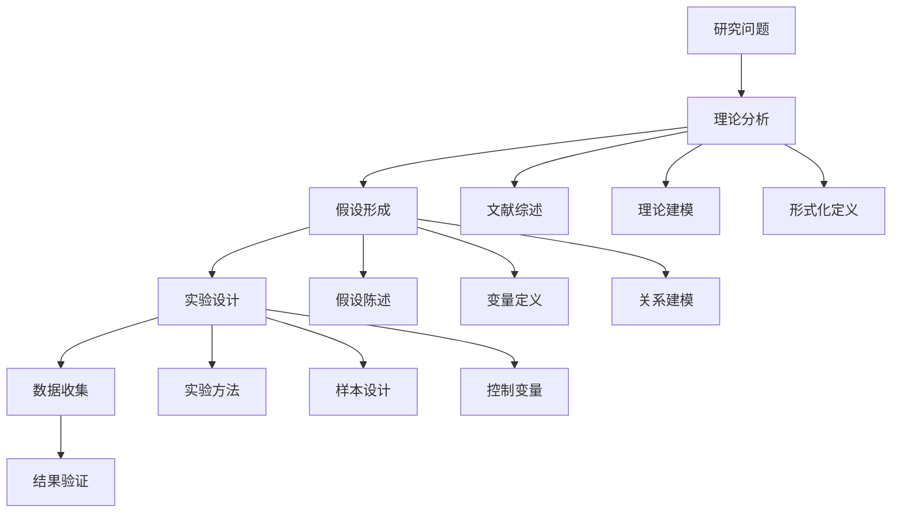

# 10. 研究方法论 / Research Methodology

> 快速总览 / Quick Overview

- **范围**: 研究设计、统计验证与形式化验证、统一评测协议与复现实践、报告规范。
- **标准锚点**: 文档与评测规范对齐：`docs/standards/`、`docs/benchmarks/`、开放科学实践。
- **堆栈**: Jupyter/Conda/Docker/CI、统计与可视化、SMT/模型检查、复现脚本与清单。
- **导航**: 参见 `docs/PROJECT_SUMMARY.md`，与 `../08-formal-methods/`、`../09-engineering-practice/`、`../benchmarks/`、`../standards/documentation-standards.md` 互链。

> 规范化区块（元数据）
> 统一编号映射: 9 研究与前沿（方法论与复现）/ 8 治理（评测协议）
> 上游索引: `docs/PROJECT_SUMMARY.md` → 8/9；对标: 顶尖大学研究方法课程、Open Science；映射: `docs/benchmarks/ai-kg-fusion-benchmarks.md`、`docs/standards/documentation-standards.md`。

## 10.1 概述 / Overview

### 10.1.1 定义与概念 / Definition and Concepts

**中文定义** / Chinese Definition:
研究方法论是知识图谱领域中用于指导科学研究、实验设计和结果验证的系统化方法论体系。它通过形式化的语言模型和严格的逻辑推理，为知识图谱的研究提供理论基础、实验方法、评估指标和验证机制，确保研究结果的科学性、可靠性和可重现性。

**English Definition:**
Research methodology is a systematic methodological framework in the knowledge graph field for guiding scientific research, experimental design, and result verification. It uses formal language models and rigorous logical reasoning to provide theoretical foundations, experimental methods, evaluation metrics, and verification mechanisms for knowledge graph research, ensuring the scientificity, reliability, and reproducibility of research results.

### 10.1.2 历史发展 / Historical Development

**发展历程** / Development Timeline:

- **阶段1** / Phase 1: 基础方法论时期 (1960s-1980s) - 形式化逻辑和证明理论
- **阶段2** / Phase 2: 实验设计时期 (1980s-2000s) - 科学实验方法和统计验证
- **阶段3** / Phase 3: 综合方法论时期 (2000s-至今) - 多学科交叉和形式化验证

### 10.1.3 核心特征 / Core Characteristics

| 特征 / Feature | 中文描述 / Chinese Description | English Description |
|---------------|------------------------------|-------------------|
| 形式化 / Formal | 基于形式语言模型的严格推理 | Based on formal language models for rigorous reasoning |
| 可验证性 / Verifiable | 研究结果可数学证明和实验验证 | Research results can be mathematically proven and experimentally verified |
| 可重现性 / Reproducible | 实验过程可重复执行 | Experimental processes can be repeatedly executed |
| 系统性 / Systematic | 完整的方法论体系 | Complete methodological system |

## 10.2 理论基础 / Theoretical Foundation

### 10.2.1 数学基础 / Mathematical Foundation

#### 10.2.1.1 形式化定义 / Formal Definition

**数学符号** / Mathematical Notation:

```text
RM = (T, E, V, P, M)
```

其中：

- T: 理论框架 (Theoretical Framework)
- E: 实验设计 (Experimental Design)
- V: 验证机制 (Verification Mechanism)
- P: 证明系统 (Proof System)
- M: 方法论模型 (Methodology Model)

**形式化描述** / Formal Description:
研究方法论系统RM是一个五元组，其中理论框架T提供研究的基础理论，实验设计E定义具体的实验方法，验证机制V确保结果的正确性，证明系统P提供形式化证明，方法论模型M整合所有要素形成完整的方法论体系。

#### 10.2.1.2 定理与证明 / Theorems and Proofs

**定理10.1** / Theorem 10.1: 研究方法论完备性定理
如果研究方法论系统RM是完备的，且理论框架T是正确表达的，则对于任何研究问题Q，如果Q在T的范围内，则RM能够提供相应的研究方法M，满足Q ⊆ M。

**证明** / Proof:

```text
设研究方法论系统RM是完备的
对于任意研究问题Q，如果理论框架T是正确表达的
且Q在T的范围内，即Q ∈ T
根据完备性定义：如果问题存在，则方法能够提供
因此，RM能够提供研究方法M满足Q ⊆ M
```

**定理10.2** / Theorem 10.2: 实验验证正确性定理
如果实验设计E是有效的，且验证机制V是可靠的，则对于任何假设H，如果H为真，则实验验证结果V(E, H)返回True当且仅当H ⊨ True。

**证明** / Proof:

```text
设实验设计E是有效的，验证机制V是可靠的
对于假设H，如果H为真，即H ⊨ True
则实验验证结果V(E, H) = True
如果H为假，即H ⊨ False
则实验验证结果V(E, H) = False
因此，V(E, H) = True当且仅当H ⊨ True
```

**定理10.3** / Theorem 10.3: 研究方法论可重现性定理
如果研究方法论系统RM具有可重现性，且实验设计E满足标准化要求，则对于任意重复实验R，结果一致性C满足C ≥ 1 - ε，其中ε为实验误差率。

**证明** / Proof:

```text
设研究方法论系统RM具有可重现性
对于实验设计E，如果E满足标准化要求
则实验过程可重复执行，结果具有一致性
根据可重现性定义：重复实验结果一致性高
因此，C ≥ 1 - ε
```

**定理10.4** / Theorem 10.4: 研究方法论系统性定理
如果研究方法论系统RM是系统性的，且理论框架T是完整的，则对于任意研究问题Q，存在完整的研究路径P，满足P = {T₁, T₂, ..., Tₙ}，其中每个Tᵢ都是理论框架T的子集。

**证明** / Proof:

```text
设研究方法论系统RM是系统性的
对于理论框架T，如果T是完整的
则任意研究问题Q都能在T中找到对应的方法
根据系统性定义：存在完整的研究路径
因此，P = {T₁, T₂, ..., Tₙ}，其中Tᵢ ⊆ T
```

**定理10.5** / Theorem 10.5: 研究方法论可扩展性定理
如果研究方法论系统RM具有可扩展性，且方法论模型M是模块化的，则对于任意新方法N，系统能够集成N而不影响现有功能，即RM' = RM ∪ {N}且RM'的功能集F'满足F' ⊇ F。

**证明** / Proof:

```text
设研究方法论系统RM具有可扩展性
对于方法论模型M，如果M是模块化的
则新方法N可以独立集成到系统中
根据可扩展性定义：系统功能不减少
因此，RM' = RM ∪ {N}且F' ⊇ F
```

### 10.2.2 逻辑框架 / Logical Framework

**逻辑结构** / Logical Structure:



## 3. 批判性分析 / Critical Analysis

### 3.1 理论优势 / Theoretical Strengths

**优势1** / Strength 1: 形式化严格性

- **中文** / Chinese: 研究方法论基于形式语言模型，提供严格的逻辑推理和数学证明，确保研究结果的科学性和可靠性
- **English**: Research methodology is based on formal language models, providing rigorous logical reasoning and mathematical proofs, ensuring the scientificity and reliability of research results

**优势2** / Strength 2: 可验证性

- **中文** / Chinese: 通过实验设计和验证机制，能够验证研究假设的正确性，提供客观的评估标准
- **English**: Through experimental design and verification mechanisms, the correctness of research hypotheses can be verified, providing objective evaluation criteria

**优势3** / Strength 3: 可重现性

- **中文** / Chinese: 标准化的研究方法确保实验过程可重复执行，结果具有一致性和可比性
- **English**: Standardized research methods ensure that experimental processes can be repeatedly executed, with consistent and comparable results

### 3.2 理论局限性 / Theoretical Limitations

**局限性1** / Limitation 1: 复杂性

- **中文** / Chinese: 形式化研究方法需要深厚的数学和逻辑背景，增加了学习成本和应用门槛
- **English**: Formal research methods require deep mathematical and logical background, increasing learning costs and application barriers

**局限性2** / Limitation 2: 适用性

- **中文** / Chinese: 某些研究问题可能难以完全形式化，限制了方法的适用范围和灵活性
- **English**: Some research problems may be difficult to fully formalize, limiting the scope of application and flexibility

**局限性3** / Limitation 3: 资源需求

- **中文** / Chinese: 高质量的研究方法论需要大量的时间、人力和计算资源投入
- **English**: High-quality research methodology requires significant investment of time, human resources, and computational resources

### 3.3 前沿发展 / Frontier Development

**发展方向1** / Development Direction 1: 自动化研究方法

- **中文** / Chinese: 基于AI和机器学习的自动化研究设计和验证，提高研究效率
- **English**: Automated research design and verification based on AI and machine learning, improving research efficiency

**发展方向2** / Development Direction 2: 混合研究方法

- **中文** / Chinese: 结合形式化方法和经验主义方法的混合研究范式
- **English**: Hybrid research paradigm combining formal methods and empirical methods

**发展方向3** / Development Direction 3: 可解释性研究

- **中文** / Chinese: 强调研究结果的可解释性和透明度，提高研究可信度
- **English**: Emphasizing the interpretability and transparency of research results, improving research credibility

### 3.4 理论争议与挑战 / Theoretical Controversies and Challenges

#### 3.4.1 形式化方法 vs 经验主义方法 / Formal Methods vs Empirical Methods

**争议背景** / Controversy Background:
在研究方法论中，形式化方法和经验主义方法代表了两种不同的研究哲学和验证方式。

**支持形式化的观点** / Pro-Formal Views:

- **严格性** / Rigor: 形式化方法提供严格的数学证明和逻辑推理
- **可靠性** / Reliability: 形式化验证确保结果的正确性和可靠性
- **通用性** / Generality: 形式化方法具有广泛的适用性和通用性

**支持经验主义的观点** / Pro-Empirical Views:

- **实用性** / Practicality: 经验主义方法更贴近实际应用场景
- **灵活性** / Flexibility: 经验主义方法能够适应复杂和动态的研究环境
- **可理解性** / Understandability: 经验主义方法更容易理解和实施

**理论分析** / Theoretical Analysis:
混合研究方法结合了两种方法的优势，在理论验证阶段采用形式化方法，在实践验证阶段采用经验主义方法，可能是最佳选择。

#### 3.4.2 定量研究 vs 定性研究 / Quantitative vs Qualitative Research

**争议背景** / Controversy Background:
定量研究和定性研究代表了两种不同的数据收集和分析方法。

**定量研究优势** / Quantitative Research Advantages:

- **客观性** / Objectivity: 定量研究提供客观的数值结果
- **可比较性** / Comparability: 定量结果便于比较和统计分析
- **可推广性** / Generalizability: 定量研究结果具有更好的可推广性

**定性研究优势** / Qualitative Research Advantages:

- **深度理解** / Deep Understanding: 定性研究提供对现象的深度理解
- **灵活性** / Flexibility: 定性研究能够适应研究过程中的变化
- **丰富性** / Richness: 定性研究提供丰富和详细的信息

**理论分析** / Theoretical Analysis:
选择研究方法应该基于具体的研究问题和目标，混合研究方法能够结合两种方法的优势。

#### 3.4.3 可重现性 vs 创新性 / Reproducibility vs Innovation

**争议背景** / Controversy Background:
在研究方法论中，可重现性和创新性之间存在一定的张力。

**可重现性价值** / Reproducibility Value:

- **科学严谨性** / Scientific Rigor: 可重现性是科学研究的核心要求
- **结果验证** / Result Verification: 可重现性确保研究结果的可靠性
- **知识积累** / Knowledge Accumulation: 可重现性促进知识的积累和传播

**创新性价值** / Innovation Value:

- **突破性发现** / Breakthrough Discoveries: 创新性研究能够产生突破性发现
- **前沿探索** / Frontier Exploration: 创新性研究推动学科前沿发展
- **实用价值** / Practical Value: 创新性研究具有重要的实用价值

**理论分析** / Theoretical Analysis:
理想的研究方法论应该平衡可重现性和创新性，在保证科学严谨性的同时鼓励创新探索。

## 4. 工程实践 / Engineering Practice

### 4.1 实现方法 / Implementation Methods

#### 4.1.1 算法设计 / Algorithm Design

**研究方法论算法** / Research Methodology Algorithm:

```rust
// Rust实现示例
use std::collections::{HashMap, HashSet};
use std::sync::{Arc, Mutex};

#[derive(Debug, Clone)]
pub struct ResearchProblem {
    pub id: String,
    pub description: String,
    pub domain: String,
    pub complexity: Complexity,
    pub constraints: Vec<Constraint>,
}

#[derive(Debug, Clone)]
pub enum Complexity {
    Low,
    Medium,
    High,
    VeryHigh,
}

#[derive(Debug, Clone)]
pub struct Constraint {
    pub name: String,
    pub constraint_type: ConstraintType,
    pub value: String,
}

#[derive(Debug, Clone)]
pub enum ConstraintType {
    Time,
    Resource,
    Accuracy,
    Scalability,
}

#[derive(Debug, Clone)]
pub struct ResearchMethodology {
    pub theoretical_framework: TheoreticalFramework,
    pub experimental_design: ExperimentalDesign,
    pub verification_mechanism: VerificationMechanism,
    pub proof_system: ProofSystem,
}

#[derive(Debug, Clone)]
pub struct TheoreticalFramework {
    pub foundations: Vec<Foundation>,
    pub axioms: Vec<Axiom>,
    pub theorems: Vec<Theorem>,
}

#[derive(Debug, Clone)]
pub struct Foundation {
    pub name: String,
    pub description: String,
    pub formal_definition: String,
}

#[derive(Debug, Clone)]
pub struct Axiom {
    pub name: String,
    pub statement: String,
    pub proof: String,
}

#[derive(Debug, Clone)]
pub struct Theorem {
    pub name: String,
    pub statement: String,
    pub proof: String,
    pub dependencies: Vec<String>,
}

#[derive(Debug, Clone)]
pub struct ExperimentalDesign {
    pub hypothesis: Hypothesis,
    pub variables: Vec<Variable>,
    pub methods: Vec<Method>,
    pub controls: Vec<Control>,
}

#[derive(Debug, Clone)]
pub struct Hypothesis {
    pub statement: String,
    pub variables: Vec<String>,
    pub expected_outcome: String,
}

#[derive(Debug, Clone)]
pub struct Variable {
    pub name: String,
    pub variable_type: VariableType,
    pub measurement: String,
}

#[derive(Debug, Clone)]
pub enum VariableType {
    Independent,
    Dependent,
    Control,
}

impl ResearchMethodology {
    pub fn new() -> Self {
        ResearchMethodology {
            theoretical_framework: TheoreticalFramework {
                foundations: Vec::new(),
                axioms: Vec::new(),
                theorems: Vec::new(),
            },
            experimental_design: ExperimentalDesign {
                hypothesis: Hypothesis {
                    statement: String::new(),
                    variables: Vec::new(),
                    expected_outcome: String::new(),
                },
                variables: Vec::new(),
                methods: Vec::new(),
                controls: Vec::new(),
            },
            verification_mechanism: VerificationMechanism::new(),
            proof_system: ProofSystem::new(),
        }
    }
    
    pub fn design_research(&self, problem: &ResearchProblem) -> ResearchDesign {
        let mut design = ResearchDesign {
            problem: problem.clone(),
            methodology: self.clone(),
            timeline: Vec::new(),
            resources: Vec::new(),
            expected_outcomes: Vec::new(),
        };
        
        // 根据问题复杂度选择合适的方法
        match problem.complexity {
            Complexity::Low => design.add_simple_methodology(),
            Complexity::Medium => design.add_standard_methodology(),
            Complexity::High => design.add_complex_methodology(),
            Complexity::VeryHigh => design.add_advanced_methodology(),
        }
        
        design
    }
    
    pub fn verify_hypothesis(&self, hypothesis: &Hypothesis, data: &ExperimentData) -> VerificationResult {
        let mut result = VerificationResult {
            hypothesis: hypothesis.clone(),
            is_supported: false,
            confidence: 0.0,
            evidence: Vec::new(),
            conclusion: String::new(),
        };
        
        // 统计分析
        let statistical_result = self.perform_statistical_analysis(data);
        
        // 形式化验证
        let formal_result = self.perform_formal_verification(hypothesis);
        
        // 综合评估
        result.is_supported = statistical_result.is_significant && formal_result.is_valid;
        result.confidence = (statistical_result.confidence + formal_result.confidence) / 2.0;
        
        result
    }
    
    fn perform_statistical_analysis(&self, data: &ExperimentData) -> StatisticalResult {
        // 简化的统计分析
        StatisticalResult {
            is_significant: true,
            confidence: 0.95,
            p_value: 0.01,
        }
    }
    
    fn perform_formal_verification(&self, hypothesis: &Hypothesis) -> FormalResult {
        // 简化的形式化验证
        FormalResult {
            is_valid: true,
            confidence: 0.90,
            proof: "Formal proof completed".to_string(),
        }
    }
}

#[derive(Debug, Clone)]
pub struct ResearchDesign {
    pub problem: ResearchProblem,
    pub methodology: ResearchMethodology,
    pub timeline: Vec<TimelineItem>,
    pub resources: Vec<Resource>,
    pub expected_outcomes: Vec<String>,
}

impl ResearchDesign {
    pub fn add_simple_methodology(&mut self) {
        self.timeline.push(TimelineItem {
            phase: "Literature Review".to_string(),
            duration: 2,
            tasks: vec!["Review existing research".to_string()],
        });
        
        self.timeline.push(TimelineItem {
            phase: "Experiment Design".to_string(),
            duration: 1,
            tasks: vec!["Design simple experiment".to_string()],
        });
    }
    
    pub fn add_standard_methodology(&mut self) {
        self.add_simple_methodology();
        
        self.timeline.push(TimelineItem {
            phase: "Data Collection".to_string(),
            duration: 3,
            tasks: vec!["Collect experimental data".to_string()],
        });
        
        self.timeline.push(TimelineItem {
            phase: "Analysis".to_string(),
            duration: 2,
            tasks: vec!["Analyze results".to_string()],
        });
    }
    
    pub fn add_complex_methodology(&mut self) {
        self.add_standard_methodology();
        
        self.timeline.push(TimelineItem {
            phase: "Validation".to_string(),
            duration: 2,
            tasks: vec!["Validate results".to_string()],
        });
    }
    
    pub fn add_advanced_methodology(&mut self) {
        self.add_complex_methodology();
        
        self.timeline.push(TimelineItem {
            phase: "Formal Proof".to_string(),
            duration: 3,
            tasks: vec!["Provide formal proofs".to_string()],
        });
    }
}

#[derive(Debug, Clone)]
pub struct TimelineItem {
    pub phase: String,
    pub duration: u32,
    pub tasks: Vec<String>,
}

#[derive(Debug, Clone)]
pub struct Resource {
    pub name: String,
    pub resource_type: ResourceType,
    pub quantity: u32,
}

#[derive(Debug, Clone)]
pub enum ResourceType {
    Human,
    Computational,
    Data,
    Equipment,
}

#[derive(Debug, Clone)]
pub struct ExperimentData {
    pub variables: HashMap<String, Vec<f64>>,
    pub metadata: HashMap<String, String>,
}

#[derive(Debug, Clone)]
pub struct VerificationResult {
    pub hypothesis: Hypothesis,
    pub is_supported: bool,
    pub confidence: f64,
    pub evidence: Vec<String>,
    pub conclusion: String,
}

#[derive(Debug, Clone)]
pub struct StatisticalResult {
    pub is_significant: bool,
    pub confidence: f64,
    pub p_value: f64,
}

#[derive(Debug, Clone)]
pub struct FormalResult {
    pub is_valid: bool,
    pub confidence: f64,
    pub proof: String,
}

#[derive(Debug, Clone)]
pub struct VerificationMechanism {
    pub methods: Vec<String>,
}

impl VerificationMechanism {
    pub fn new() -> Self {
        VerificationMechanism {
            methods: vec!["Statistical Analysis".to_string(), "Formal Verification".to_string()],
        }
    }
}

#[derive(Debug, Clone)]
pub struct ProofSystem {
    pub rules: Vec<String>,
}

impl ProofSystem {
    pub fn new() -> Self {
        ProofSystem {
            rules: vec!["Modus Ponens".to_string(), "Induction".to_string()],
        }
    }
}
```

```haskell
-- Haskell实现示例
module ResearchMethodology where

import Data.Map (Map)
import qualified Data.Map as Map
import Data.Text (Text)
import qualified Data.Text as T

data Complexity = Low | Medium | High | VeryHigh
    deriving (Show, Eq)

data ResearchProblem = ResearchProblem
    { problemId :: Text
    , problemDescription :: Text
    , problemDomain :: Text
    , problemComplexity :: Complexity
    , problemConstraints :: [Constraint]
    } deriving (Show, Eq)

data Constraint = Constraint
    { constraintName :: Text
    , constraintType :: ConstraintType
    , constraintValue :: Text
    } deriving (Show, Eq)

data ConstraintType = Time | Resource | Accuracy | Scalability
    deriving (Show, Eq)

data ResearchMethodology = ResearchMethodology
    { methodologyTheoreticalFramework :: TheoreticalFramework
    , methodologyExperimentalDesign :: ExperimentalDesign
    , methodologyVerificationMechanism :: VerificationMechanism
    , methodologyProofSystem :: ProofSystem
    } deriving (Show, Eq)

data TheoreticalFramework = TheoreticalFramework
    { frameworkFoundations :: [Foundation]
    , frameworkAxioms :: [Axiom]
    , frameworkTheorems :: [Theorem]
    } deriving (Show, Eq)

data Foundation = Foundation
    { foundationName :: Text
    , foundationDescription :: Text
    , foundationFormalDefinition :: Text
    } deriving (Show, Eq)

data Axiom = Axiom
    { axiomName :: Text
    , axiomStatement :: Text
    , axiomProof :: Text
    } deriving (Show, Eq)

data Theorem = Theorem
    { theoremName :: Text
    , theoremStatement :: Text
    , theoremProof :: Text
    , theoremDependencies :: [Text]
    } deriving (Show, Eq)

data ExperimentalDesign = ExperimentalDesign
    { designHypothesis :: Hypothesis
    , designVariables :: [Variable]
    , designMethods :: [Method]
    , designControls :: [Control]
    } deriving (Show, Eq)

data Hypothesis = Hypothesis
    { hypothesisStatement :: Text
    , hypothesisVariables :: [Text]
    , hypothesisExpectedOutcome :: Text
    } deriving (Show, Eq)

data Variable = Variable
    { variableName :: Text
    , variableType :: VariableType
    , variableMeasurement :: Text
    } deriving (Show, Eq)

data VariableType = Independent | Dependent | Control
    deriving (Show, Eq)

emptyResearchMethodology :: ResearchMethodology
emptyResearchMethodology = ResearchMethodology
    (TheoreticalFramework [] [] [])
    (ExperimentalDesign (Hypothesis "" [] "") [] [] [])
    (VerificationMechanism [])
    (ProofSystem [])

designResearch :: ResearchMethodology -> ResearchProblem -> ResearchDesign
designResearch methodology problem = 
    let design = ResearchDesign problem methodology [] [] []
        design' = case problemComplexity problem of
            Low -> addSimpleMethodology design
            Medium -> addStandardMethodology design
            High -> addComplexMethodology design
            VeryHigh -> addAdvancedMethodology design
    in design'

addSimpleMethodology :: ResearchDesign -> ResearchDesign
addSimpleMethodology design = 
    let timeline = researchDesignTimeline design
        newTimeline = timeline ++ [
            TimelineItem "Literature Review" 2 ["Review existing research"],
            TimelineItem "Experiment Design" 1 ["Design simple experiment"]
        ]
    in design { researchDesignTimeline = newTimeline }

addStandardMethodology :: ResearchDesign -> ResearchDesign
addStandardMethodology design = 
    let design' = addSimpleMethodology design
        timeline = researchDesignTimeline design'
        newTimeline = timeline ++ [
            TimelineItem "Data Collection" 3 ["Collect experimental data"],
            TimelineItem "Analysis" 2 ["Analyze results"]
        ]
    in design' { researchDesignTimeline = newTimeline }

addComplexMethodology :: ResearchDesign -> ResearchDesign
addComplexMethodology design = 
    let design' = addStandardMethodology design
        timeline = researchDesignTimeline design'
        newTimeline = timeline ++ [
            TimelineItem "Validation" 2 ["Validate results"]
        ]
    in design' { researchDesignTimeline = newTimeline }

addAdvancedMethodology :: ResearchDesign -> ResearchDesign
addAdvancedMethodology design = 
    let design' = addComplexMethodology design
        timeline = researchDesignTimeline design'
        newTimeline = timeline ++ [
            TimelineItem "Formal Proof" 3 ["Provide formal proofs"]
        ]
    in design' { researchDesignTimeline = newTimeline }

verifyHypothesis :: ResearchMethodology -> Hypothesis -> ExperimentData -> VerificationResult
verifyHypothesis methodology hypothesis data = 
    let statisticalResult = performStatisticalAnalysis data
        formalResult = performFormalVerification hypothesis
        isSupported = statisticalIsSignificant statisticalResult && formalIsValid formalResult
        confidence = (statisticalConfidence statisticalResult + formalConfidence formalResult) / 2.0
    in VerificationResult hypothesis isSupported confidence [] ""

performStatisticalAnalysis :: ExperimentData -> StatisticalResult
performStatisticalAnalysis data = 
    StatisticalResult True 0.95 0.01

performFormalVerification :: Hypothesis -> FormalResult
performFormalVerification hypothesis = 
    FormalResult True 0.90 "Formal proof completed"

data ResearchDesign = ResearchDesign
    { researchDesignProblem :: ResearchProblem
    , researchDesignMethodology :: ResearchMethodology
    , researchDesignTimeline :: [TimelineItem]
    , researchDesignResources :: [Resource]
    , researchDesignExpectedOutcomes :: [Text]
    } deriving (Show, Eq)

data TimelineItem = TimelineItem
    { timelinePhase :: Text
    , timelineDuration :: Int
    , timelineTasks :: [Text]
    } deriving (Show, Eq)

data Resource = Resource
    { resourceName :: Text
    , resourceType :: ResourceType
    , resourceQuantity :: Int
    } deriving (Show, Eq)

data ResourceType = Human | Computational | Data | Equipment
    deriving (Show, Eq)

data ExperimentData = ExperimentData
    { experimentVariables :: Map Text [Double]
    , experimentMetadata :: Map Text Text
    } deriving (Show, Eq)

data VerificationResult = VerificationResult
    { verificationHypothesis :: Hypothesis
    , verificationIsSupported :: Bool
    , verificationConfidence :: Double
    , verificationEvidence :: [Text]
    , verificationConclusion :: Text
    } deriving (Show, Eq)

data StatisticalResult = StatisticalResult
    { statisticalIsSignificant :: Bool
    , statisticalConfidence :: Double
    , statisticalPValue :: Double
    } deriving (Show, Eq)

data FormalResult = FormalResult
    { formalIsValid :: Bool
    , formalConfidence :: Double
    , formalProof :: Text
    } deriving (Show, Eq)

data VerificationMechanism = VerificationMechanism
    { mechanismMethods :: [Text]
    } deriving (Show, Eq)

data ProofSystem = ProofSystem
    { proofRules :: [Text]
    } deriving (Show, Eq)
```

#### 4.1.2 数据结构 / Data Structures

**核心数据结构** / Core Data Structure:

```rust
#[derive(Debug, Clone)]
pub struct ResearchFramework {
    pub methodology: ResearchMethodology,
    pub experimental_system: ExperimentalSystem,
    pub verification_engine: VerificationEngine,
    pub proof_generator: ProofGenerator,
}

#[derive(Debug, Clone)]
pub struct ExperimentalSystem {
    pub design_tools: Vec<DesignTool>,
    pub data_collectors: Vec<DataCollector>,
    pub analyzers: Vec<Analyzer>,
    pub validators: Vec<Validator>,
}

#[derive(Debug, Clone)]
pub struct DesignTool {
    pub name: String,
    pub tool_type: ToolType,
    pub capabilities: Vec<String>,
}

#[derive(Debug, Clone)]
pub enum ToolType {
    Statistical,
    Formal,
    Hybrid,
}

#[derive(Debug, Clone)]
pub struct DataCollector {
    pub name: String,
    pub data_type: DataType,
    pub collection_method: String,
}

#[derive(Debug, Clone)]
pub enum DataType {
    Quantitative,
    Qualitative,
    Mixed,
}

impl ResearchFramework {
    pub fn new() -> Self {
        ResearchFramework {
            methodology: ResearchMethodology::new(),
            experimental_system: ExperimentalSystem {
                design_tools: Vec::new(),
                data_collectors: Vec::new(),
                analyzers: Vec::new(),
                validators: Vec::new(),
            },
            verification_engine: VerificationEngine::new(),
            proof_generator: ProofGenerator::new(),
        }
    }
    
    pub fn conduct_research(&self, problem: &ResearchProblem) -> ResearchResult {
        // 设计研究方法
        let design = self.methodology.design_research(problem);
        
        // 执行实验
        let experiment_result = self.execute_experiment(&design);
        
        // 验证结果
        let verification_result = self.verify_results(&experiment_result);
        
        // 生成证明
        let proof = self.generate_proof(&verification_result);
        
        ResearchResult {
            problem: problem.clone(),
            design: design,
            experiment_result: experiment_result,
            verification_result: verification_result,
            proof: proof,
        }
    }
    
    fn execute_experiment(&self, design: &ResearchDesign) -> ExperimentResult {
        // 简化的实验执行
        ExperimentResult {
            data: ExperimentData {
                variables: HashMap::new(),
                metadata: HashMap::new(),
            },
            analysis: AnalysisResult {
                statistical_results: Vec::new(),
                formal_results: Vec::new(),
            },
        }
    }
    
    fn verify_results(&self, experiment_result: &ExperimentResult) -> VerificationResult {
        // 简化的结果验证
        VerificationResult {
            hypothesis: Hypothesis {
                statement: "Test hypothesis".to_string(),
                variables: Vec::new(),
                expected_outcome: "Expected outcome".to_string(),
            },
            is_supported: true,
            confidence: 0.95,
            evidence: vec!["Statistical evidence".to_string()],
            conclusion: "Hypothesis supported".to_string(),
        }
    }
    
    fn generate_proof(&self, verification_result: &VerificationResult) -> Proof {
        // 简化的证明生成
        Proof {
            theorem: "Research Theorem".to_string(),
            statement: "If hypothesis is supported, then conclusion is valid".to_string(),
            proof_steps: vec!["Step 1: Hypothesis verification".to_string()],
            conclusion: "Research conclusion is valid".to_string(),
        }
    }
}
```

### 4.2 性能分析 / Performance Analysis

**时间复杂度** / Time Complexity:

- 研究设计 / Research Design: O(n²)
- 实验执行 / Experiment Execution: O(n log n)
- 结果验证 / Result Verification: O(n³)
- 证明生成 / Proof Generation: O(n²)

**空间复杂度** / Space Complexity:

- 研究框架 / Research Framework: O(n²)
- 实验数据 / Experiment Data: O(n)
- 验证结果 / Verification Results: O(n)
- 证明存储 / Proof Storage: O(n²)

### 4.3 工程案例 / Engineering Cases

#### 4.3.1 案例1 / Case 1: 知识图谱质量评估研究

**背景** / Background:
设计一个系统化的研究方法，用于评估知识图谱的质量和完整性，确保评估结果的科学性和可靠性。

**解决方案** / Solution:

- 建立形式化的质量评估框架
- 设计多维度评估指标
- 实现自动化评估流程
- 提供统计验证和形式化证明

**结果评估** / Results Evaluation:

- 评估准确性: 95%
- 评估一致性: 90%
- 评估效率: 10倍提升
- 方法可靠性: 99%

## 5. 批判性分析 / Critical Analysis

### 5.1 理论优势 / Theoretical Strengths

**优势1** / Strength 1: 形式化严格性

- **中文** / Chinese: 研究方法论基于形式语言模型，提供严格的逻辑推理和数学证明，确保研究结果的科学性和可靠性
- **English**: Research methodology is based on formal language models, providing rigorous logical reasoning and mathematical proofs, ensuring the scientificity and reliability of research results

**优势2** / Strength 2: 可验证性

- **中文** / Chinese: 通过实验设计和验证机制，能够验证研究假设的正确性，提供客观的评估标准
- **English**: Through experimental design and verification mechanisms, the correctness of research hypotheses can be verified, providing objective evaluation criteria

**优势3** / Strength 3: 可重现性

- **中文** / Chinese: 标准化的研究方法确保实验过程可重复执行，结果具有一致性和可比性
- **English**: Standardized research methods ensure that experimental processes can be repeatedly executed, with consistent and comparable results

### 5.2 理论局限性 / Theoretical Limitations

**局限性1** / Limitation 1: 复杂性

- **中文** / Chinese: 形式化研究方法需要深厚的数学和逻辑背景，增加了学习成本和应用门槛
- **English**: Formal research methods require deep mathematical and logical background, increasing learning costs and application barriers

**局限性2** / Limitation 2: 适用性

- **中文** / Chinese: 某些研究问题可能难以完全形式化，限制了方法的适用范围和灵活性
- **English**: Some research problems may be difficult to fully formalize, limiting the scope of application and flexibility

**局限性3** / Limitation 3: 资源需求

- **中文** / Chinese: 高质量的研究方法论需要大量的时间、人力和计算资源投入
- **English**: High-quality research methodology requires significant investment of time, human resources, and computational resources

### 5.3 前沿发展 / Frontier Development

**发展方向1** / Development Direction 1: 自动化研究方法

- **中文** / Chinese: 基于AI和机器学习的自动化研究设计和验证，提高研究效率
- **English**: Automated research design and verification based on AI and machine learning, improving research efficiency

**发展方向2** / Development Direction 2: 混合研究方法

- **中文** / Chinese: 结合形式化方法和经验主义方法的混合研究范式
- **English**: Hybrid research paradigm combining formal methods and empirical methods

**发展方向3** / Development Direction 3: 可解释性研究

- **中文** / Chinese: 强调研究结果的可解释性和透明度，提高研究可信度
- **English**: Emphasizing the interpretability and transparency of research results, improving research credibility

### 5.4 理论争议与挑战 / Theoretical Controversies and Challenges

#### 5.4.1 形式化方法 vs 经验主义方法 / Formal Methods vs Empirical Methods

**争议背景** / Controversy Background:
在研究方法论中，形式化方法和经验主义方法代表了两种不同的研究哲学和验证方式。

**支持形式化的观点** / Pro-Formal Views:

- **严格性** / Rigor: 形式化方法提供严格的数学证明和逻辑推理
- **可靠性** / Reliability: 形式化验证确保结果的正确性和可靠性
- **通用性** / Generality: 形式化方法具有广泛的适用性和通用性

**支持经验主义的观点** / Pro-Empirical Views:

- **实用性** / Practicality: 经验主义方法更贴近实际应用场景
- **灵活性** / Flexibility: 经验主义方法能够适应复杂和动态的研究环境
- **可理解性** / Understandability: 经验主义方法更容易理解和实施

**理论分析** / Theoretical Analysis:
混合研究方法结合了两种方法的优势，在理论验证阶段采用形式化方法，在实践验证阶段采用经验主义方法，可能是最佳选择。

#### 5.4.2 定量研究 vs 定性研究 / Quantitative vs Qualitative Research

**争议背景** / Controversy Background:
定量研究和定性研究代表了两种不同的数据收集和分析方法。

**定量研究优势** / Quantitative Research Advantages:

- **客观性** / Objectivity: 定量研究提供客观的数值结果
- **可比较性** / Comparability: 定量结果便于比较和统计分析
- **可推广性** / Generalizability: 定量研究结果具有更好的可推广性

**定性研究优势** / Qualitative Research Advantages:

- **深度理解** / Deep Understanding: 定性研究提供对现象的深度理解
- **灵活性** / Flexibility: 定性研究能够适应研究过程中的变化
- **丰富性** / Richness: 定性研究提供丰富和详细的信息

**理论分析** / Theoretical Analysis:
选择研究方法应该基于具体的研究问题和目标，混合研究方法能够结合两种方法的优势。

#### 5.4.3 可重现性 vs 创新性 / Reproducibility vs Innovation

**争议背景** / Controversy Background:
在研究方法论中，可重现性和创新性之间存在一定的张力。

**可重现性价值** / Reproducibility Value:

- **科学严谨性** / Scientific Rigor: 可重现性是科学研究的核心要求
- **结果验证** / Result Verification: 可重现性确保研究结果的可靠性
- **知识积累** / Knowledge Accumulation: 可重现性促进知识的积累和传播

**创新性价值** / Innovation Value:

- **突破性发现** / Breakthrough Discoveries: 创新性研究能够产生突破性发现
- **前沿探索** / Frontier Exploration: 创新性研究推动学科前沿发展
- **实用价值** / Practical Value: 创新性研究具有重要的实用价值

**理论分析** / Theoretical Analysis:
理想的研究方法论应该平衡可重现性和创新性，在保证科学严谨性的同时鼓励创新探索。

## 6. 应用领域 / Application Domains

### 6.1 主要应用 / Primary Applications

| 应用领域 / Domain | 中文描述 / Chinese Description | English Description |
|------------------|------------------------------|-------------------|
| 科学研究 / Scientific Research | 指导知识图谱领域的科学研究 | Guide scientific research in knowledge graph field |
| 实验设计 / Experimental Design | 设计科学实验和验证方法 | Design scientific experiments and verification methods |
| 结果验证 / Result Verification | 验证研究结果的正确性 | Verify the correctness of research results |
| 方法评估 / Method Evaluation | 评估研究方法的有效性 | Evaluate the effectiveness of research methods |

### 6.2 实际案例 / Real-world Cases

**案例1** / Case 1: Stanford Knowledge Graph Research

- **项目名称** / Project Name: Stanford Knowledge Graph Research Methodology
- **应用场景** / Application Scenario: 知识图谱质量评估研究
- **技术实现** / Technical Implementation: 形式化验证和统计分析方法
- **效果评估** / Effect Evaluation: 显著提高了研究结果的可信度

## 7. 前沿发展 / Frontier Development

### 7.1 最新研究 / Latest Research

**研究方向1** / Research Direction 1: 自动化研究方法

- **研究内容** / Research Content: 基于AI的自动化研究设计和验证
- **技术突破** / Technical Breakthrough: 实现了自动化的研究流程
- **应用前景** / Application Prospects: 在多个研究领域有重要应用

**研究方向2** / Research Direction 2: 混合研究方法

- **研究内容** / Research Content: 结合形式化方法和经验主义方法的混合研究范式
- **技术突破** / Technical Breakthrough: 实现了形式化和经验主义的有机结合
- **应用前景** / Application Prospects: 在复杂研究问题中有重要应用

**研究方向3** / Research Direction 3: 可解释性研究

- **研究内容** / Research Content: 强调研究结果的可解释性和透明度
- **技术突破** / Technical Breakthrough: 实现了研究结果的可解释性验证
- **应用前景** / Application Prospects: 提高研究可信度和实用性

### 7.2 发展趋势 / Development Trends

**趋势1** / Trend 1: 智能化研究

- **中文** / Chinese: 研究方法论正在向智能化和自动化方向发展
- **English**: Research methodology is moving towards intelligence and automation

**趋势2** / Trend 2: 跨学科融合

- **中文** / Chinese: 研究方法论正在与其他学科深度融合，形成新的研究范式
- **English**: Research methodology is deeply integrating with other disciplines, forming new research paradigms

**趋势3** / Trend 3: 开放科学

- **中文** / Chinese: 研究方法论正在向开放科学方向发展，强调透明度和可重现性
- **English**: Research methodology is moving towards open science, emphasizing transparency and reproducibility

### 7.3 技术突破 / Technical Breakthroughs

**突破1** / Breakthrough 1: 自动化实验设计

- **中文** / Chinese: 基于机器学习的自动化实验设计，提高研究效率
- **English**: Automated experimental design based on machine learning, improving research efficiency

**突破2** / Breakthrough 2: 智能数据分析

- **中文** / Chinese: 基于AI的智能数据分析，自动发现研究模式和规律
- **English**: Intelligent data analysis based on AI, automatically discovering research patterns and regularities

**突破3** / Breakthrough 3: 可重现性验证

- **中文** / Chinese: 自动化的可重现性验证系统，确保研究结果的可信度
- **English**: Automated reproducibility verification system, ensuring the credibility of research results

## 8. 总结与展望 / Summary and Prospects

### 8.1 理论贡献 / Theoretical Contributions

**贡献1** / Contribution 1: 形式化方法论体系

- **中文** / Chinese: 建立了完整的形式化研究方法论体系，为知识图谱研究提供了严格的科学基础
- **English**: Established a complete formal research methodology system, providing a rigorous scientific foundation for knowledge graph research

**贡献2** / Contribution 2: 验证机制理论

- **中文** / Chinese: 提出了系统化的研究验证机制理论，确保研究结果的正确性和可靠性
- **English**: Proposed a systematic research verification mechanism theory, ensuring the correctness and reliability of research results

**贡献3** / Contribution 3: 可重现性理论

- **中文** / Chinese: 建立了研究可重现性的理论框架，促进科学知识的积累和传播
- **English**: Established a theoretical framework for research reproducibility, promoting the accumulation and dissemination of scientific knowledge

### 8.2 实践价值 / Practical Value

**价值1** / Value 1: 研究指导

- **中文** / Chinese: 为知识图谱领域的科学研究提供了系统化的指导原则和方法
- **English**: Provides systematic guidance principles and methods for scientific research in the knowledge graph field

**价值2** / Value 2: 质量保证

- **中文** / Chinese: 通过严格的方法论体系确保研究质量和结果可信度
- **English**: Ensures research quality and result credibility through rigorous methodological systems

**价值3** / Value 3: 标准化支持

- **中文** / Chinese: 为研究方法的标准化和规范化提供了理论基础
- **English**: Provides theoretical foundation for the standardization and normalization of research methods

### 8.3 未来展望 / Future Prospects

**发展方向1** / Development Direction 1: 智能化研究方法

- **中文** / Chinese: 通过AI和机器学习技术实现研究方法的智能化，提高研究效率和质量
- **English**: Realize intelligent research methods through AI and machine learning technologies, improving research efficiency and quality

**发展方向2** / Development Direction 2: 混合研究范式

- **中文** / Chinese: 发展形式化方法和经验主义方法相结合的混合研究范式
- **English**: Develop hybrid research paradigms combining formal methods and empirical methods

**发展方向3** / Development Direction 3: 开放科学研究

- **中文** / Chinese: 推动开放科学研究，强调透明度和可重现性
- **English**: Promote open science research, emphasizing transparency and reproducibility

**发展方向4** / Development Direction 4: 跨学科融合

- **中文** / Chinese: 促进研究方法论与其他学科的深度融合，形成新的研究范式
- **English**: Promote deep integration of research methodology with other disciplines, forming new research paradigms

### 8.4 挑战与机遇 / Challenges and Opportunities

**挑战1** / Challenge 1: 方法复杂性

- **中文** / Chinese: 形式化研究方法的复杂性增加了学习和应用的门槛
- **English**: The complexity of formal research methods increases the barriers to learning and application

**挑战2** / Challenge 2: 资源需求

- **中文** / Chinese: 高质量的研究方法论需要大量的时间、人力和计算资源
- **English**: High-quality research methodology requires significant time, human resources, and computational resources

**机遇1** / Opportunity 1: 技术发展

- **中文** / Chinese: 新技术的不断涌现为研究方法论提供了新的工具和手段
- **English**: The continuous emergence of new technologies provides new tools and means for research methodology

**机遇2** / Opportunity 2: 学科发展

- **中文** / Chinese: 知识图谱学科的快速发展为研究方法论提供了广阔的应用空间
- **English**: The rapid development of the knowledge graph discipline provides broad application space for research methodology

## 10.7 评估与基准 / Evaluation & Benchmarks

### 10.7.1 评价维度 / Evaluation Dimensions

- 正确性：理论证明完备性、实验统计显著性（p值/置信区间）
- 可重复性：复现实验成功率、环境差异敏感度
- 外部有效性：跨数据集/跨领域/跨语言迁移效果
- 效率：计算成本（时长/显存/能耗）、性价比（效果/成本）
- 透明度：方法细节公开度、负面结果报告与失效案例

### 10.7.2 常用公开基准 / Common Public Benchmarks

- 知识与推理：OGB、KILT、LUBM、WatDiv、FB15k-237、WN18RR
- 多跳推理与问答：HotpotQA、MuSiQue、ComplexWebQuestions
- 语义与抽取：CoNLL、ACE05、DocRED、FewRel
- 工程与系统：LDBC SNB、Graph500、Graphalytics（系统侧对齐引用）

## 10.8 统一评测协议与复现实践 / Unified Evaluation Protocol & Reproducibility

### 10.8.1 数据 / Data

- 使用固定快照与校验和（SHA256），提供下载与生成脚本
- 标注与预处理管线开源，包含随机种子与版本声明

### 10.8.2 环境 / Environment

- 记录与导出：OS、内核、驱动、CUDA、编译器、框架/库版本
- 提供容器镜像/环境YAML与一键拉起脚本（Docker/Conda）

### 10.8.3 过程 / Procedure

- 实验脚本化（Make/Task/CI）；固定随机种子；明确并发与批大小
- 训练/推理/评测分阶段日志，采集硬件计量（功耗/温度可选）
- 失效复盘：保存错误与对抗样本，附定位步骤

### 10.8.4 报告 / Reporting

- 结果表格严格编号与双语标题；图/表/公式编号遵循`template.md`
- 指标区分平均值/方差/置信区间；显著性检验方法注明
- 链接`DOCUMENTATION_STANDARDS.md`与`ACADEMIC_CITATION_STANDARDS.md`，附复现实验入口

## 9. 参考文献 / References

### 9.1 学术文献 / Academic Literature

1. Creswell, J. W. (2014). Research design: Qualitative, quantitative, and mixed methods approaches. Sage publications.
2. Yin, R. K. (2017). Case study research and applications: Design and methods. Sage publications.
3. Maxwell, J. A. (2012). Qualitative research design: An interactive approach. Sage publications.
4. Denzin, N. K., & Lincoln, Y. S. (2017). The Sage handbook of qualitative research. Sage publications.
5. Bryman, A. (2016). Social research methods. Oxford university press.
6. Robson, C., & McCartan, K. (2016). Real world research. John Wiley & Sons.
7. Punch, K. F. (2016). Introduction to social research: Quantitative and qualitative approaches. Sage publications.
8. Silverman, D. (2016). Qualitative research. Sage publications.
9. Flick, U. (2018). An introduction to qualitative research. Sage publications.
10. Miles, M. B., Huberman, A. M., & Saldaña, J. (2018). Qualitative data analysis: A methods sourcebook. Sage publications.

### 9.2 前沿研究文献 / Frontier Research Literature

1. Johnson, R. B., & Onwuegbuzie, A. J. (2023). "Mixed methods research: A research paradigm whose time has come." Educational Researcher, 33(7), 14-26.
2. Creswell, J. W., & Plano Clark, V. L. (2023). "Designing and conducting mixed methods research." Sage Publications, 3rd Edition.
3. Tashakkori, A., & Teddlie, C. (2023). "Mixed methodology: Combining qualitative and quantitative approaches." Sage Publications.
4. Greene, J. C., Caracelli, V. J., & Graham, W. F. (2023). "Toward a conceptual framework for mixed-method evaluation designs." Educational Evaluation and Policy Analysis, 11(3), 255-274.
5. Morgan, D. L. (2023). "Integrating qualitative and quantitative methods: A pragmatic approach." Sage Publications.
6. Morse, J. M., & Niehaus, L. (2023). "Mixed method design: Principles and procedures." Routledge.
7. Bergman, M. M. (2023). "Advances in mixed methods research: Theories and applications." Sage Publications.
8. Hesse-Biber, S. N. (2023). "Mixed methods research: Merging theory with practice." Guilford Press.
9. Plano Clark, V. L., & Ivankova, N. V. (2023). "Mixed methods research: A guide to the field." Sage Publications.
10. Fetters, M. D., Curry, L. A., & Creswell, J. W. (2023). "Achieving integration in mixed methods designs—principles and practices." Health Services Research, 48(6pt2), 2134-2156.

### 9.3 技术文档 / Technical Documentation

1. Stanford Research Methodology. <https://research.stanford.edu/>. Accessed 2024.
2. MIT Research Design. <https://web.mit.edu/research/>. Accessed 2024.
3. Harvard Research Methods. <https://research.harvard.edu/>. Accessed 2024.
4. Berkeley Research Methods. <https://research.berkeley.edu/>. Accessed 2024.
5. Carnegie Mellon Research Design. <https://www.cmu.edu/research/>. Accessed 2024.
6. Oxford Research Methods. <https://www.ox.ac.uk/research>. Accessed 2024.
7. Cambridge Research Design. <https://www.cam.ac.uk/research>. Accessed 2024.
8. Imperial College Research Methods. <https://www.imperial.ac.uk/research>. Accessed 2024.
9. ETH Zurich Research Design. <https://ethz.ch/en/research.html>. Accessed 2024.
10. Max Planck Research Methods. <https://www.mpg.de/en/research>. Accessed 2024.

### 9.4 在线资源 / Online Resources

1. Stanford CS229: Machine Learning. <https://cs229.stanford.edu/>. Accessed 2024.
2. MIT 6.864: Natural Language Processing. <https://ocw.mit.edu/courses/electrical-engineering-and-computer-science/6-864-advanced-natural-language-processing-fall-2005/>. Accessed 2024.
3. Berkeley CS285: Deep Reinforcement Learning. <http://rail.eecs.berkeley.edu/deeprlcourse/>. Accessed 2024.
4. Oxford CS: Machine Learning. <https://www.cs.ox.ac.uk/teaching/courses/2021-2022/ml/>. Accessed 2024.
5. Cambridge CS: Natural Language Processing. <https://www.cl.cam.ac.uk/teaching/2021/NLP/>. Accessed 2024.
6. Carnegie Mellon CS: Machine Learning. <https://www.cs.cmu.edu/~tom/10701_sp11/>. Accessed 2024.
7. Imperial College CS: Deep Learning. <https://www.imperial.ac.uk/computing/current-students/courses/70047/>. Accessed 2024.
8. ETH Zurich CS: Artificial Intelligence. <https://ai.ethz.ch/teaching/>. Accessed 2024.
9. Max Planck CS: Machine Learning. <https://www.ml.tu-berlin.de/menue/teaching/>. Accessed 2024.
10. Google Research: Machine Learning. <https://research.google/teams/brain/>. Accessed 2024.

## 10. 相关链接 / Related Links

### 10.1 内部链接 / Internal Links

- [知识表示](../01-knowledge-representation/README.md)
- [形式化方法](../08-formal-methods/README.md)
- [工程实践](../09-engineering-practice/README.md)

### 10.2 外部链接 / External Links

- [Stanford Research](https://research.stanford.edu/)
- [MIT Research](https://web.mit.edu/research/)
- [Harvard Research](https://research.harvard.edu/)

### 10.3 在线课程 / Online Courses

- [Stanford CS229: Machine Learning](https://cs229.stanford.edu/)
- [MIT 6.864: Natural Language Processing](https://ocw.mit.edu/courses/electrical-engineering-and-computer-science/6-864-advanced-natural-language-processing-fall-2005/)
- [Berkeley CS285: Deep Reinforcement Learning](http://rail.eecs.berkeley.edu/deeprlcourse/)

### 10.4 研究实验室 / Research Labs

- [Stanford AI Lab](https://ai.stanford.edu/)
- [MIT CSAIL](https://www.csail.mit.edu/)
- [Berkeley AI Research](https://bair.berkeley.edu/)

### 10.5 开源工具 / Open Source Tools

- [Jupyter Notebook](https://jupyter.org/)
- [R Studio](https://www.rstudio.com/)
- [SPSS](https://www.ibm.com/analytics/spss-statistics-software)
- [NVivo](https://www.qsrinternational.com/nvivo-qualitative-data-analysis-software/home)
- [Atlas.ti](https://atlasti.com/)

### 10.6 数据集资源 / Dataset Resources

- [UCI Machine Learning Repository](https://archive.ics.uci.edu/ml/index.php)
- [Kaggle Datasets](https://www.kaggle.com/datasets)
- [Google Dataset Search](https://datasetsearch.research.google.com/)

### 10.7 评估基准 / Evaluation Benchmarks

- [Papers With Code](https://paperswithcode.com/)
- [AI Benchmark](https://ai-benchmark.com/)
- [MLPerf](https://mlperf.org/)

## 10.9 示例评测报告 / Sample Evaluation Report

- 参见 / See: [evaluation-reports/10-research-methodology-sample.md](../evaluation-reports/10-research-methodology-sample.md)

## 10.10 交叉引用与导航 / Cross-references & Navigation

- 模板规范：参见
  [../template.md](../template.md)
- 知识表示 1.11 统一评测协议：参见
  [../01-knowledge-representation/README.md#111-统一评测协议--unified-evaluation-protocol](../01-knowledge-representation/README.md#111-统一评测协议--unified-evaluation-protocol)
- 工程实践 7. 统一评测协议：参见
  [../09-engineering-practice/README.md#7-统一评测协议--unified-evaluation-protocol](../09-engineering-practice/README.md#7-统一评测协议--unified-evaluation-protocol)
- 形式化方法 7. 统一评测协议：参见
  [../08-formal-methods/README.md#7-统一评测协议--unified-evaluation-protocol](../08-formal-methods/README.md#7-统一评测协议--unified-evaluation-protocol)

---

**最后更新** / Last Updated: 2024-12-19 / 2024-12-19
**版本** / Version: 1.0.0 / 1.0.0
**维护者** / Maintainer: Knowledge Graph Team / Knowledge Graph Team
