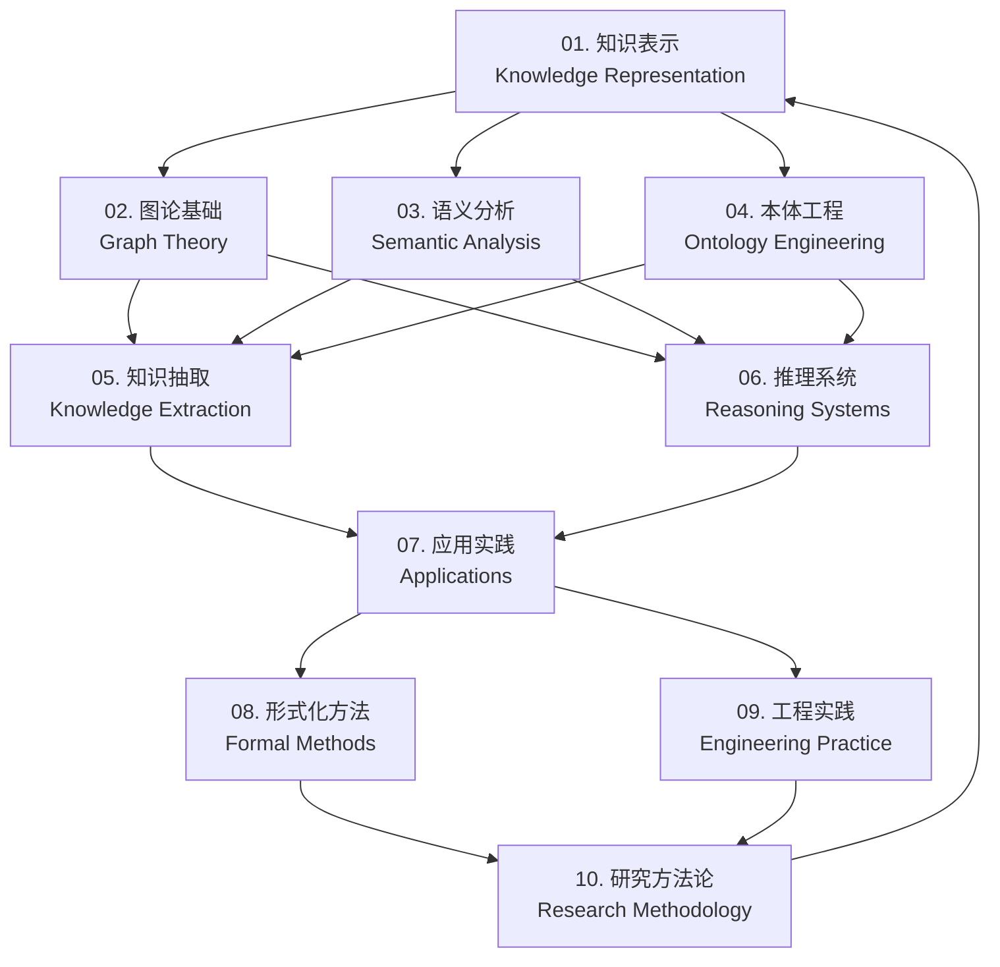

# 知识图谱索引系统 / Knowledge Graph Index System

## 1. 模块关联网络 / Module Relationship Network

### 1.1 核心概念关联 / Core Concept Relationships

### 1.2 知识层次结构 / Knowledge Hierarchy Structure

| 层次 / Level | 模块 / Modules | 核心功能 / Core Functions | 依赖关系 / Dependencies |
|-------------|---------------|------------------------|----------------------|
| **基础层** / Foundation | 01, 02, 03, 04 | 理论基础和概念定义 | 无 / None |
| **方法层** / Methodology | 05, 06 | 核心算法和方法 | 依赖基础层 / Depends on Foundation |
| **应用层** / Application | 07 | 实际应用和案例 | 依赖方法层 / Depends on Methodology |
| **工程层** / Engineering | 08, 09 | 工程实现和优化 | 依赖应用层 / Depends on Application |
| **方法论层** / Research | 10 | 研究方法和验证 | 依赖所有层 / Depends on All Levels |

## 2. 概念索引 / Concept Index

### 2.1 核心概念映射 / Core Concept Mapping

| 概念 / Concept | 中文定义 / Chinese Definition | 英文定义 / English Definition | 相关模块 / Related Modules |
|---------------|------------------------------|-----------------------------|---------------------------|
| **知识表示** / Knowledge Representation | 将人类知识转化为计算机可处理的形式化结构 | Transformation of human knowledge into formal structures | 01, 04, 08 |
| **图论** / Graph Theory | 研究图结构的数学分支 | Mathematical branch studying graph structures | 02, 05, 06 |
| **语义分析** / Semantic Analysis | 分析文本和数据的语义含义 | Analysis of semantic meaning in text and data | 03, 05, 07 |
| **本体工程** / Ontology Engineering | 构建和管理领域本体 | Construction and management of domain ontologies | 04, 01, 06 |
| **知识抽取** / Knowledge Extraction | 从非结构化数据中提取结构化知识 | Extraction of structured knowledge from unstructured data | 05, 03, 07 |
| **推理系统** / Reasoning Systems | 基于知识进行逻辑推理的系统 | Systems for logical reasoning based on knowledge | 06, 02, 08 |
| **应用实践** / Applications | 知识图谱在实际场景中的应用 | Applications of knowledge graphs in real scenarios | 07, 05, 06 |
| **形式化方法** / Formal Methods | 使用数学方法进行系统验证 | Using mathematical methods for system verification | 08, 06, 10 |
| **工程实践** / Engineering Practice | 知识图谱系统的工程实现 | Engineering implementation of knowledge graph systems | 09, 07, 08 |
| **研究方法论** / Research Methodology | 知识图谱研究的方法论体系 | Methodological framework for knowledge graph research | 10, 08, 09 |

### 2.2 技术术语索引 / Technical Term Index

| 术语 / Term | 定义 / Definition | 首次出现 / First Appearance | 相关章节 / Related Sections |
|------------|------------------|---------------------------|---------------------------|
| **RDF** | 资源描述框架 | 01.2.1 | 01.2.1, 04.2.1, 08.2.1 |
| **OWL** | Web本体语言 | 04.2.1 | 04.2.1, 08.2.1, 09.2.1 |
| **SPARQL** | SPARQL协议和RDF查询语言 | 06.2.1 | 06.2.1, 07.2.1, 09.2.1 |
| **实体链接** / Entity Linking | 将文本中的实体链接到知识库 | 05.2.1 | 05.2.1, 03.2.1, 07.2.1 |
| **关系抽取** / Relation Extraction | 从文本中抽取实体间关系 | 05.2.1 | 05.2.1, 03.2.1, 06.2.1 |
| **图嵌入** / Graph Embedding | 将图结构映射到向量空间 | 02.2.1 | 02.2.1, 06.2.1, 07.2.1 |
| **知识融合** / Knowledge Fusion | 合并来自不同源的知识 | 04.2.1 | 04.2.1, 05.2.1, 09.2.1 |
| **推理引擎** / Reasoning Engine | 执行逻辑推理的软件组件 | 06.2.1 | 06.2.1, 08.2.1, 09.2.1 |

## 3. 算法索引 / Algorithm Index

### 3.1 核心算法分类 / Core Algorithm Classification

| 算法类别 / Algorithm Category | 算法名称 / Algorithm Name | 实现语言 / Implementation Language | 相关模块 / Related Modules |
|------------------------------|-------------------------|----------------------------------|---------------------------|
| **图算法** / Graph Algorithms | 最短路径算法 / Shortest Path | Rust, Haskell | 02, 06, 07 |
| **图算法** / Graph Algorithms | 连通性检测 / Connectivity Detection | Rust | 02, 06, 09 |
| **图算法** / Graph Algorithms | 社区发现 / Community Detection | Rust, Haskell | 02, 06, 07 |
| **机器学习** / Machine Learning | 图神经网络 / Graph Neural Networks | Rust, Python | 02, 06, 07 |
| **自然语言处理** / NLP | 命名实体识别 / Named Entity Recognition | Rust, Haskell | 03, 05, 07 |
| **自然语言处理** / NLP | 关系抽取 / Relation Extraction | Rust, Python | 03, 05, 07 |
| **知识推理** / Knowledge Reasoning | 规则推理 / Rule-based Reasoning | Haskell, Lean | 06, 08, 10 |
| **知识推理** / Knowledge Reasoning | 统计推理 / Statistical Reasoning | Rust, Python | 06, 07, 10 |

### 3.2 算法复杂度分析 / Algorithm Complexity Analysis

| 算法 / Algorithm | 时间复杂度 / Time Complexity | 空间复杂度 / Space Complexity | 适用场景 / Use Cases |
|-----------------|----------------------------|----------------------------|-------------------|
| **Dijkstra算法** / Dijkstra's Algorithm | O(V² + E) | O(V) | 最短路径计算 |
| **Floyd-Warshall算法** / Floyd-Warshall | O(V³) | O(V²) | 全源最短路径 |
| **PageRank算法** / PageRank | O(V + E) | O(V) | 重要性排序 |
| **Louvain算法** / Louvain | O(V log V) | O(V + E) | 社区发现 |
| **BERT模型** / BERT | O(L²) | O(L) | 文本表示学习 |
| **TransE模型** / TransE | O(E) | O(V + R) | 知识图谱嵌入 |

## 4. 应用场景索引 / Application Scenario Index

### 4.1 应用领域分类 / Application Domain Classification

| 应用领域 / Application Domain | 典型应用 / Typical Applications | 核心技术 / Core Technologies | 相关模块 / Related Modules |
|------------------------------|-------------------------------|----------------------------|---------------------------|
| **搜索引擎** / Search Engines | 语义搜索、实体搜索 | 知识表示、语义分析 | 01, 03, 07 |
| **推荐系统** / Recommendation Systems | 内容推荐、协同过滤 | 图算法、知识推理 | 02, 06, 07 |
| **问答系统** / Question Answering | 智能问答、对话系统 | 知识抽取、推理系统 | 05, 06, 07 |
| **信息抽取** / Information Extraction | 实体识别、关系抽取 | 自然语言处理、知识抽取 | 03, 05, 07 |
| **知识管理** / Knowledge Management | 知识库构建、知识图谱 | 本体工程、知识表示 | 01, 04, 09 |
| **数据集成** / Data Integration | 数据融合、数据清洗 | 知识融合、本体对齐 | 04, 05, 09 |
| **智能分析** / Intelligent Analytics | 网络分析、模式发现 | 图算法、机器学习 | 02, 06, 07 |
| **决策支持** / Decision Support | 智能决策、风险评估 | 推理系统、知识推理 | 06, 08, 10 |

### 4.2 实际案例索引 / Real-world Case Index

| 案例名称 / Case Name | 应用领域 / Domain | 技术特点 / Technical Features | 相关章节 / Related Sections |
|---------------------|------------------|----------------------------|---------------------------|
| **Google Knowledge Graph** | 搜索引擎 | 大规模实体-关系模型 | 01.5.2, 07.5.2, 09.5.2 |
| **Facebook Social Graph** | 社交网络 | 社交关系建模 | 02.5.2, 06.5.2, 07.5.2 |
| **Amazon Product Graph** | 电商推荐 | 产品关系图谱 | 06.5.2, 07.5.2, 09.5.2 |
| **Microsoft Academic Graph** | 学术研究 | 学术实体关系 | 04.5.2, 05.5.2, 07.5.2 |
| **LinkedIn Economic Graph** | 职业社交 | 职业关系网络 | 02.5.2, 06.5.2, 07.5.2 |
| **Uber Movement** | 交通分析 | 时空数据分析 | 02.5.2, 07.5.2, 09.5.2 |

## 5. 研究热点索引 / Research Hotspot Index

### 5.1 前沿研究方向 / Frontier Research Directions

| 研究方向 / Research Direction | 研究内容 / Research Content | 技术挑战 / Technical Challenges | 相关模块 / Related Modules |
|------------------------------|---------------------------|-------------------------------|---------------------------|
| **神经符号学习** / Neural-Symbolic Learning | 结合神经网络和符号推理 | 可解释性、效率平衡 | 01.6.1, 06.6.1, 08.6.1 |
| **多模态知识图谱** / Multimodal Knowledge Graphs | 融合文本、图像、音频 | 跨模态对齐、表示学习 | 01.6.1, 03.6.1, 07.6.1 |
| **动态知识图谱** / Dynamic Knowledge Graphs | 实时知识更新和演化 | 一致性维护、增量学习 | 04.6.1, 05.6.1, 09.6.1 |
| **联邦知识图谱** / Federated Knowledge Graphs | 分布式知识管理 | 隐私保护、知识融合 | 04.6.1, 09.6.1, 10.6.1 |
| **因果推理** / Causal Reasoning | 基于因果关系的推理 | 因果发现、反事实推理 | 06.6.1, 08.6.1, 10.6.1 |
| **知识图谱嵌入** / Knowledge Graph Embedding | 低维向量表示 | 表达能力、推理性能 | 01.6.1, 02.6.1, 06.6.1 |

### 5.2 技术发展趋势 / Technology Development Trends

| 趋势 / Trend | 发展方向 / Development Direction | 预期影响 / Expected Impact | 时间框架 / Timeline |
|-------------|--------------------------------|---------------------------|-------------------|
| **大规模化** / Large-scale | 支持十亿级实体和关系 | 提升系统处理能力 | 短期 / Short-term |
| **实时化** / Real-time | 毫秒级查询响应 | 改善用户体验 | 短期 / Short-term |
| **智能化** / Intelligent | 自动知识发现和推理 | 减少人工干预 | 中期 / Medium-term |
| **多模态化** / Multimodal | 融合多种数据类型 | 丰富知识表示 | 中期 / Medium-term |
| **可解释化** / Explainable | 提供推理过程解释 | 增强系统可信度 | 长期 / Long-term |
| **自主化** / Autonomous | 自我学习和优化 | 实现持续改进 | 长期 / Long-term |

## 6. 学习路径指南 / Learning Path Guide

### 6.1 初学者路径 / Beginner Path

**推荐学习顺序** / Recommended Learning Order:

1. **01. 知识表示** - 理解基本概念
2. **02. 图论基础** - 掌握数学基础
3. **03. 语义分析** - 学习文本处理
4. **04. 本体工程** - 了解知识建模
5. **07. 应用实践** - 查看实际应用

### 6.2 进阶者路径 / Advanced Path

**推荐学习顺序** / Recommended Learning Order:

1. **05. 知识抽取** - 学习数据获取
2. **06. 推理系统** - 掌握推理方法
3. **08. 形式化方法** - 深入理论验证
4. **09. 工程实践** - 学习系统实现
5. **10. 研究方法论** - 掌握研究方法

### 6.3 专家路径 / Expert Path

**推荐学习顺序** / Recommended Learning Order:

1. **前沿发展章节** - 了解最新进展
2. **批判性分析** - 深入理论分析
3. **工程案例** - 学习实践经验
4. **研究方法论** - 掌握研究方法
5. **跨模块整合** - 构建完整体系

## 7. 快速导航 / Quick Navigation

### 7.1 按主题导航 / Navigation by Topic

- **[基础理论](../01-knowledge-representation/README.md)** - 知识表示和图论基础
- **[分析方法](../03-semantic-analysis/README.md)** - 语义分析和本体工程
- **[核心技术](../05-knowledge-extraction/README.md)** - 知识抽取和推理系统
- **[应用实践](../07-applications/README.md)** - 实际应用和工程实现
- **[研究方法](../10-research-methodology/README.md)** - 形式化方法和研究规范

### 7.2 按需求导航 / Navigation by Need

- **理论学习** / Theoretical Learning: 01, 02, 08
- **技术实现** / Technical Implementation: 05, 06, 09
- **应用开发** / Application Development: 07, 09
- **研究探索** / Research Exploration: 10, 08
- **系统集成** / System Integration: 09, 10

---

**最后更新** / Last Updated: 2024-12-19
**版本** / Version: 1.0.0
**维护者** / Maintainer: Knowledge Graph Team
