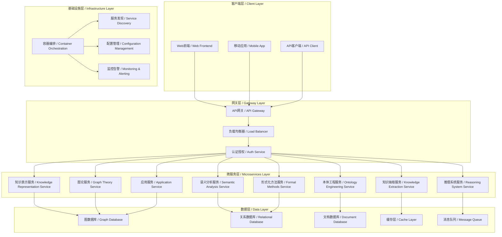

# 微服务架构设计 / Microservices Architecture Design

## 概述 / Overview

本文档定义了知识图谱项目的微服务架构设计，采用现代化的微服务架构模式，支持高可用、高并发、可扩展的知识图谱系统。

## 1. 架构概览 / Architecture Overview

### 1.1 整体架构图 / Overall Architecture Diagram



### 1.2 服务划分原则 / Service Division Principles

| 原则 | 描述 | 实现方式 |
|------|------|----------|
| **单一职责** | 每个服务只负责一个业务功能 | 按知识图谱技术模块划分服务 |
| **高内聚** | 服务内部组件紧密相关 | 相关功能聚合在同一服务内 |
| **低耦合** | 服务间依赖最小化 | 通过API和消息队列解耦 |
| **可独立部署** | 服务可独立开发、测试、部署 | 独立的代码库和部署流程 |
| **数据自治** | 每个服务拥有自己的数据存储 | 服务专用数据库 |

## 2. 核心微服务设计 / Core Microservices Design

### 2.1 知识表示服务 / Knowledge Representation Service

#### 2.1.1 服务职责 / Service Responsibilities

```python
class KnowledgeRepresentationService:
    """知识表示服务"""
    
    def __init__(self):
        self.embedding_models = {}
        self.knowledge_encoders = {}
        self.representation_cache = RedisCache()
    
    def create_embedding(self, entity, relation=None):
        """创建实体嵌入"""
        cache_key = f"embedding:{entity}:{relation}"
        
        # 检查缓存
        if cached_embedding := self.representation_cache.get(cache_key):
            return cached_embedding
        
        # 生成嵌入
        embedding = self.generate_embedding(entity, relation)
        
        # 缓存结果
        self.representation_cache.set(cache_key, embedding, ttl=3600)
        
        return embedding
    
    def update_representation(self, entity, new_data):
        """更新知识表示"""
        # 更新嵌入
        new_embedding = self.create_embedding(entity)
        
        # 通知其他服务
        self.notify_services('representation_updated', {
            'entity': entity,
            'embedding': new_embedding
        })
        
        return new_embedding
```

#### 2.1.2 API设计 / API Design

```yaml
# 知识表示服务API
openapi: 3.0.0
info:
  title: Knowledge Representation Service API
  version: 1.0.0

paths:
  /api/v1/representations/entities/{entity_id}:
    get:
      summary: 获取实体表示
      parameters:
        - name: entity_id
          in: path
          required: true
          schema:
            type: string
        - name: format
          in: query
          schema:
            type: string
            enum: [vector, graph, symbolic]
      responses:
        '200':
          description: 成功返回实体表示
          content:
            application/json:
              schema:
                type: object
                properties:
                  entity_id:
                    type: string
                  representation:
                    type: object
                  format:
                    type: string
    
    post:
      summary: 创建实体表示
      requestBody:
        required: true
        content:
          application/json:
            schema:
              type: object
              properties:
                entity_id:
                  type: string
                entity_data:
                  type: object
                representation_type:
                  type: string
                  enum: [vector, graph, symbolic]
      responses:
        '201':
          description: 成功创建实体表示
```

### 2.2 图论服务 / Graph Theory Service

#### 2.2.1 服务职责 / Service Responsibilities

```python
class GraphTheoryService:
    """图论服务"""
    
    def __init__(self):
        self.graph_algorithms = {
            'shortest_path': self.dijkstra_algorithm,
            'page_rank': self.page_rank_algorithm,
            'community_detection': self.community_detection_algorithm,
            'centrality': self.centrality_algorithm
        }
        self.graph_cache = GraphCache()
    
    def find_shortest_path(self, source, target, graph_id):
        """查找最短路径"""
        cache_key = f"shortest_path:{source}:{target}:{graph_id}"
        
        # 检查缓存
        if cached_path := self.graph_cache.get(cache_key):
            return cached_path
        
        # 执行算法
        path = self.graph_algorithms['shortest_path'](source, target, graph_id)
        
        # 缓存结果
        self.graph_cache.set(cache_key, path, ttl=1800)
        
        return path
    
    def compute_page_rank(self, graph_id, damping_factor=0.85):
        """计算PageRank"""
        cache_key = f"pagerank:{graph_id}:{damping_factor}"
        
        # 检查缓存
        if cached_ranks := self.graph_cache.get(cache_key):
            return cached_ranks
        
        # 计算PageRank
        ranks = self.graph_algorithms['page_rank'](graph_id, damping_factor)
        
        # 缓存结果
        self.graph_cache.set(cache_key, ranks, ttl=3600)
        
        return ranks
```

#### 2.2.2 图算法实现 / Graph Algorithm Implementation

```python
class GraphAlgorithms:
    """图算法实现"""
    
    def dijkstra_algorithm(self, source, target, graph):
        """Dijkstra最短路径算法"""
        import heapq
        
        # 初始化距离
        distances = {node: float('inf') for node in graph.nodes()}
        distances[source] = 0
        
        # 优先队列
        pq = [(0, source)]
        visited = set()
        previous = {}
        
        while pq:
            current_distance, current_node = heapq.heappop(pq)
            
            if current_node in visited:
                continue
            
            visited.add(current_node)
            
            if current_node == target:
                break
            
            # 遍历邻居
            for neighbor, weight in graph.neighbors(current_node):
                if neighbor in visited:
                    continue
                
                new_distance = current_distance + weight
                
                if new_distance < distances[neighbor]:
                    distances[neighbor] = new_distance
                    previous[neighbor] = current_node
                    heapq.heappush(pq, (new_distance, neighbor))
        
        # 重构路径
        path = []
        current = target
        while current is not None:
            path.append(current)
            current = previous.get(current)
        
        return path[::-1] if path else []
```

### 2.3 语义分析服务 / Semantic Analysis Service

#### 2.3.1 服务职责 / Service Responsibilities

```python
class SemanticAnalysisService:
    """语义分析服务"""
    
    def __init__(self):
        self.nlp_models = {
            'bert': self.load_bert_model(),
            'gpt': self.load_gpt_model(),
            'spacy': self.load_spacy_model()
        }
        self.semantic_cache = SemanticCache()
    
    def analyze_semantics(self, text, analysis_type='comprehensive'):
        """语义分析"""
        cache_key = f"semantic:{hash(text)}:{analysis_type}"
        
        # 检查缓存
        if cached_result := self.semantic_cache.get(cache_key):
            return cached_result
        
        # 执行语义分析
        result = self.perform_semantic_analysis(text, analysis_type)
        
        # 缓存结果
        self.semantic_cache.set(cache_key, result, ttl=7200)
        
        return result
    
    def extract_entities(self, text):
        """实体抽取"""
        entities = []
        
        # 使用BERT模型进行实体识别
        bert_result = self.nlp_models['bert'].extract_entities(text)
        entities.extend(bert_result)
        
        # 使用spaCy进行补充抽取
        spacy_result = self.nlp_models['spacy'].extract_entities(text)
        entities.extend(spacy_result)
        
        # 去重和合并
        unique_entities = self.merge_entities(entities)
        
        return unique_entities
```

### 2.4 推理系统服务 / Reasoning System Service

#### 2.4.1 服务职责 / Service Responsibilities

```python
class ReasoningSystemService:
    """推理系统服务"""
    
    def __init__(self):
        self.reasoning_engines = {
            'symbolic': SymbolicReasoningEngine(),
            'neural': NeuralReasoningEngine(),
            'hybrid': HybridReasoningEngine()
        }
        self.reasoning_cache = ReasoningCache()
    
    def perform_reasoning(self, premises, conclusion, reasoning_type='hybrid'):
        """执行推理"""
        cache_key = f"reasoning:{hash(str(premises))}:{conclusion}:{reasoning_type}"
        
        # 检查缓存
        if cached_result := self.reasoning_cache.get(cache_key):
            return cached_result
        
        # 选择推理引擎
        engine = self.reasoning_engines[reasoning_type]
        
        # 执行推理
        result = engine.reason(premises, conclusion)
        
        # 缓存结果
        self.reasoning_cache.set(cache_key, result, ttl=1800)
        
        return result
    
    def batch_reasoning(self, reasoning_tasks):
        """批量推理"""
        results = []
        
        for task in reasoning_tasks:
            result = self.perform_reasoning(
                task['premises'],
                task['conclusion'],
                task.get('reasoning_type', 'hybrid')
            )
            results.append(result)
        
        return results
```

## 3. 服务间通信 / Inter-Service Communication

### 3.1 同步通信 / Synchronous Communication

#### 3.1.1 RESTful API / RESTful API

```python
class ServiceClient:
    """服务客户端"""
    
    def __init__(self, service_name, base_url):
        self.service_name = service_name
        self.base_url = base_url
        self.session = requests.Session()
        self.circuit_breaker = CircuitBreaker()
    
    def call_service(self, endpoint, method='GET', data=None, timeout=30):
        """调用服务"""
        url = f"{self.base_url}{endpoint}"
        
        try:
            with self.circuit_breaker:
                response = self.session.request(
                    method=method,
                    url=url,
                    json=data,
                    timeout=timeout
                )
                response.raise_for_status()
                return response.json()
        
        except requests.exceptions.RequestException as e:
            logger.error(f"Service call failed: {e}")
            raise ServiceCallException(f"Failed to call {self.service_name}")
```

#### 3.1.2 gRPC通信 / gRPC Communication

```protobuf
// 知识表示服务gRPC定义
syntax = "proto3";

package knowledgerepresentation;

service KnowledgeRepresentationService {
    rpc CreateEmbedding(CreateEmbeddingRequest) returns (CreateEmbeddingResponse);
    rpc UpdateRepresentation(UpdateRepresentationRequest) returns (UpdateRepresentationResponse);
    rpc GetRepresentation(GetRepresentationRequest) returns (GetRepresentationResponse);
}

message CreateEmbeddingRequest {
    string entity_id = 1;
    string entity_data = 2;
    string representation_type = 3;
}

message CreateEmbeddingResponse {
    string entity_id = 1;
    repeated float embedding = 2;
    string status = 3;
}
```

### 3.2 异步通信 / Asynchronous Communication

#### 3.2.1 消息队列 / Message Queue

```python
class MessageQueueClient:
    """消息队列客户端"""
    
    def __init__(self, broker_url):
        self.broker_url = broker_url
        self.producer = self.create_producer()
        self.consumer = self.create_consumer()
    
    def publish_message(self, topic, message):
        """发布消息"""
        try:
            self.producer.send(topic, value=message)
            logger.info(f"Message published to topic {topic}")
        except Exception as e:
            logger.error(f"Failed to publish message: {e}")
            raise MessagePublishException(f"Failed to publish to {topic}")
    
    def subscribe_to_topic(self, topic, callback):
        """订阅主题"""
        def message_handler(message):
            try:
                callback(message.value)
            except Exception as e:
                logger.error(f"Message processing failed: {e}")
        
        self.consumer.subscribe([topic])
        
        for message in self.consumer:
            message_handler(message)
```

#### 3.2.2 事件驱动架构 / Event-Driven Architecture

```python
class EventBus:
    """事件总线"""
    
    def __init__(self):
        self.subscribers = {}
        self.event_store = EventStore()
    
    def publish_event(self, event):
        """发布事件"""
        # 存储事件
        self.event_store.store_event(event)
        
        # 通知订阅者
        event_type = event.type
        if event_type in self.subscribers:
            for subscriber in self.subscribers[event_type]:
                try:
                    subscriber.handle_event(event)
                except Exception as e:
                    logger.error(f"Event handling failed: {e}")
    
    def subscribe_to_event(self, event_type, handler):
        """订阅事件"""
        if event_type not in self.subscribers:
            self.subscribers[event_type] = []
        
        self.subscribers[event_type].append(handler)
```

## 4. 数据管理 / Data Management

### 4.1 数据存储策略 / Data Storage Strategy

#### 4.1.1 数据库选择 / Database Selection

| 服务 | 数据库类型 | 选择理由 |
|------|------------|----------|
| 知识表示服务 | 向量数据库 (Pinecone/Weaviate) | 支持高维向量存储和检索 |
| 图论服务 | 图数据库 (Neo4j/ArangoDB) | 原生支持图操作和算法 |
| 语义分析服务 | 文档数据库 (MongoDB) | 存储非结构化文本数据 |
| 本体工程服务 | 关系数据库 (PostgreSQL) | 支持复杂查询和事务 |
| 推理系统服务 | 内存数据库 (Redis) | 高速缓存推理结果 |

#### 4.1.2 数据一致性 / Data Consistency

```python
class DataConsistencyManager:
    """数据一致性管理器"""
    
    def __init__(self):
        self.consistency_strategies = {
            'strong': self.strong_consistency,
            'eventual': self.eventual_consistency,
            'weak': self.weak_consistency
        }
    
    def ensure_consistency(self, operation, strategy='eventual'):
        """确保数据一致性"""
        strategy_func = self.consistency_strategies[strategy]
        return strategy_func(operation)
    
    def strong_consistency(self, operation):
        """强一致性"""
        # 使用分布式事务
        with self.distributed_transaction():
            result = operation.execute()
            self.validate_consistency(result)
            return result
    
    def eventual_consistency(self, operation):
        """最终一致性"""
        # 异步同步
        result = operation.execute()
        self.async_sync(result)
        return result
```

### 4.2 缓存策略 / Caching Strategy

#### 4.2.1 多级缓存 / Multi-level Caching

```python
class MultiLevelCache:
    """多级缓存"""
    
    def __init__(self):
        self.l1_cache = LRUCache(maxsize=1000)  # 内存缓存
        self.l2_cache = RedisCache()  # Redis缓存
        self.l3_cache = DatabaseCache()  # 数据库缓存
    
    def get(self, key):
        """获取缓存"""
        # L1缓存
        if value := self.l1_cache.get(key):
            return value
        
        # L2缓存
        if value := self.l2_cache.get(key):
            self.l1_cache.set(key, value)
            return value
        
        # L3缓存
        if value := self.l3_cache.get(key):
            self.l2_cache.set(key, value)
            self.l1_cache.set(key, value)
            return value
        
        return None
    
    def set(self, key, value, ttl=None):
        """设置缓存"""
        self.l1_cache.set(key, value)
        self.l2_cache.set(key, value, ttl)
        self.l3_cache.set(key, value, ttl)
```

## 5. 服务治理 / Service Governance

### 5.1 服务发现 / Service Discovery

#### 5.1.1 服务注册 / Service Registration

```python
class ServiceRegistry:
    """服务注册中心"""
    
    def __init__(self):
        self.services = {}
        self.health_checker = HealthChecker()
    
    def register_service(self, service_info):
        """注册服务"""
        service_id = service_info['id']
        self.services[service_id] = service_info
        
        # 启动健康检查
        self.health_checker.start_health_check(service_id, service_info['health_check_url'])
        
        logger.info(f"Service {service_id} registered successfully")
    
    def discover_service(self, service_name):
        """发现服务"""
        available_services = []
        
        for service_id, service_info in self.services.items():
            if service_info['name'] == service_name and service_info['status'] == 'healthy':
                available_services.append(service_info)
        
        return available_services
```

### 5.2 负载均衡 / Load Balancing

#### 5.2.1 负载均衡策略 / Load Balancing Strategies

```python
class LoadBalancer:
    """负载均衡器"""
    
    def __init__(self, strategy='round_robin'):
        self.strategies = {
            'round_robin': self.round_robin,
            'least_connections': self.least_connections,
            'weighted_round_robin': self.weighted_round_robin,
            'ip_hash': self.ip_hash
        }
        self.strategy = self.strategies[strategy]
        self.service_instances = {}
    
    def select_instance(self, service_name, request_info=None):
        """选择服务实例"""
        instances = self.service_instances.get(service_name, [])
        if not instances:
            raise NoAvailableInstanceException(f"No instances available for {service_name}")
        
        return self.strategy(instances, request_info)
    
    def round_robin(self, instances, request_info=None):
        """轮询策略"""
        current_index = getattr(self, f'_current_index_{hash(str(instances))}', 0)
        selected_instance = instances[current_index]
        setattr(self, f'_current_index_{hash(str(instances))}', (current_index + 1) % len(instances))
        return selected_instance
```

### 5.3 熔断器 / Circuit Breaker

#### 5.3.1 熔断器实现 / Circuit Breaker Implementation

```python
class CircuitBreaker:
    """熔断器"""
    
    def __init__(self, failure_threshold=5, recovery_timeout=60):
        self.failure_threshold = failure_threshold
        self.recovery_timeout = recovery_timeout
        self.failure_count = 0
        self.last_failure_time = None
        self.state = 'CLOSED'  # CLOSED, OPEN, HALF_OPEN
    
    def __enter__(self):
        if self.state == 'OPEN':
            if time.time() - self.last_failure_time > self.recovery_timeout:
                self.state = 'HALF_OPEN'
            else:
                raise CircuitBreakerOpenException("Circuit breaker is OPEN")
        
        return self
    
    def __exit__(self, exc_type, exc_val, exc_tb):
        if exc_type is None:
            # 成功调用
            self.failure_count = 0
            if self.state == 'HALF_OPEN':
                self.state = 'CLOSED'
        else:
            # 失败调用
            self.failure_count += 1
            self.last_failure_time = time.time()
            
            if self.failure_count >= self.failure_threshold:
                self.state = 'OPEN'
```

## 6. 监控与观测 / Monitoring and Observability

### 6.1 指标监控 / Metrics Monitoring

#### 6.1.1 业务指标 / Business Metrics

```python
class BusinessMetricsCollector:
    """业务指标收集器"""
    
    def __init__(self):
        self.metrics = {
            'request_count': Counter('requests_total'),
            'request_duration': Histogram('request_duration_seconds'),
            'error_count': Counter('errors_total'),
            'active_connections': Gauge('active_connections')
        }
    
    def record_request(self, service_name, method, duration, status_code):
        """记录请求指标"""
        self.metrics['request_count'].labels(
            service=service_name,
            method=method,
            status_code=status_code
        ).inc()
        
        self.metrics['request_duration'].labels(
            service=service_name,
            method=method
        ).observe(duration)
        
        if status_code >= 400:
            self.metrics['error_count'].labels(
                service=service_name,
                status_code=status_code
            ).inc()
```

### 6.2 链路追踪 / Distributed Tracing

#### 6.2.1 链路追踪实现 / Distributed Tracing Implementation

```python
class DistributedTracer:
    """分布式链路追踪器"""
    
    def __init__(self):
        self.tracer = opentelemetry.trace.get_tracer(__name__)
    
    def trace_service_call(self, service_name, operation_name):
        """追踪服务调用"""
        def decorator(func):
            def wrapper(*args, **kwargs):
                with self.tracer.start_as_current_span(
                    f"{service_name}.{operation_name}"
                ) as span:
                    span.set_attribute("service.name", service_name)
                    span.set_attribute("operation.name", operation_name)
                    
                    try:
                        result = func(*args, **kwargs)
                        span.set_status(StatusCode.OK)
                        return result
                    except Exception as e:
                        span.set_status(StatusCode.ERROR, str(e))
                        raise
            
            return wrapper
        return decorator
```

## 7. 安全设计 / Security Design

### 7.1 认证授权 / Authentication and Authorization

#### 7.1.1 JWT认证 / JWT Authentication

```python
class JWTAuthentication:
    """JWT认证"""
    
    def __init__(self, secret_key):
        self.secret_key = secret_key
        self.algorithm = 'HS256'
    
    def generate_token(self, user_id, roles, expires_in=3600):
        """生成JWT令牌"""
        payload = {
            'user_id': user_id,
            'roles': roles,
            'exp': time.time() + expires_in,
            'iat': time.time()
        }
        
        token = jwt.encode(payload, self.secret_key, algorithm=self.algorithm)
        return token
    
    def verify_token(self, token):
        """验证JWT令牌"""
        try:
            payload = jwt.decode(token, self.secret_key, algorithms=[self.algorithm])
            return payload
        except jwt.ExpiredSignatureError:
            raise TokenExpiredException("Token has expired")
        except jwt.InvalidTokenError:
            raise InvalidTokenException("Invalid token")
```

### 7.2 API安全 / API Security

#### 7.2.1 限流 / Rate Limiting

```python
class RateLimiter:
    """限流器"""
    
    def __init__(self, max_requests=100, window_size=60):
        self.max_requests = max_requests
        self.window_size = window_size
        self.requests = {}
    
    def is_allowed(self, client_id):
        """检查是否允许请求"""
        current_time = time.time()
        
        # 清理过期记录
        self.cleanup_expired_requests(current_time)
        
        # 检查请求数量
        client_requests = self.requests.get(client_id, [])
        if len(client_requests) >= self.max_requests:
            return False
        
        # 记录请求
        if client_id not in self.requests:
            self.requests[client_id] = []
        self.requests[client_id].append(current_time)
        
        return True
    
    def cleanup_expired_requests(self, current_time):
        """清理过期请求记录"""
        for client_id in list(self.requests.keys()):
            self.requests[client_id] = [
                req_time for req_time in self.requests[client_id]
                if current_time - req_time < self.window_size
            ]
            
            if not self.requests[client_id]:
                del self.requests[client_id]
```

## 8. 部署与运维 / Deployment and Operations

### 8.1 容器化部署 / Containerized Deployment

#### 8.1.1 Docker配置 / Docker Configuration

```dockerfile
# 知识表示服务Dockerfile
FROM python:3.9-slim

WORKDIR /app

# 安装依赖
COPY requirements.txt .
RUN pip install --no-cache-dir -r requirements.txt

# 复制应用代码
COPY . .

# 设置环境变量
ENV PYTHONPATH=/app
ENV SERVICE_NAME=knowledge-representation-service

# 健康检查
HEALTHCHECK --interval=30s --timeout=10s --start-period=5s --retries=3 \
    CMD curl -f http://localhost:8000/health || exit 1

# 暴露端口
EXPOSE 8000

# 启动命令
CMD ["python", "-m", "uvicorn", "main:app", "--host", "0.0.0.0", "--port", "8000"]
```

#### 8.1.2 Kubernetes部署 / Kubernetes Deployment

```yaml
# 知识表示服务Kubernetes部署配置
apiVersion: apps/v1
kind: Deployment
metadata:
  name: knowledge-representation-service
  labels:
    app: knowledge-representation-service
spec:
  replicas: 3
  selector:
    matchLabels:
      app: knowledge-representation-service
  template:
    metadata:
      labels:
        app: knowledge-representation-service
    spec:
      containers:
      - name: knowledge-representation-service
        image: knowledge-graph/knowledge-representation-service:latest
        ports:
        - containerPort: 8000
        env:
        - name: DATABASE_URL
          valueFrom:
            secretKeyRef:
              name: database-secret
              key: url
        - name: REDIS_URL
          valueFrom:
            secretKeyRef:
              name: redis-secret
              key: url
        resources:
          requests:
            memory: "256Mi"
            cpu: "250m"
          limits:
            memory: "512Mi"
            cpu: "500m"
        livenessProbe:
          httpGet:
            path: /health
            port: 8000
          initialDelaySeconds: 30
          periodSeconds: 10
        readinessProbe:
          httpGet:
            path: /ready
            port: 8000
          initialDelaySeconds: 5
          periodSeconds: 5
---
apiVersion: v1
kind: Service
metadata:
  name: knowledge-representation-service
spec:
  selector:
    app: knowledge-representation-service
  ports:
  - protocol: TCP
    port: 80
    targetPort: 8000
  type: ClusterIP
```

### 8.2 CI/CD流水线 / CI/CD Pipeline

#### 8.2.1 GitHub Actions配置 / GitHub Actions Configuration

```yaml
# CI/CD流水线配置
name: Knowledge Graph Microservices CI/CD

on:
  push:
    branches: [ main, develop ]
  pull_request:
    branches: [ main ]

env:
  REGISTRY: ghcr.io
  IMAGE_NAME: knowledge-graph

jobs:
  test:
    runs-on: ubuntu-latest
    strategy:
      matrix:
        service: [knowledge-representation, graph-theory, semantic-analysis]
    
    steps:
    - uses: actions/checkout@v3
    
    - name: Set up Python
      uses: actions/setup-python@v4
      with:
        python-version: '3.9'
    
    - name: Install dependencies
      run: |
        cd services/${{ matrix.service }}
        pip install -r requirements.txt
    
    - name: Run tests
      run: |
        cd services/${{ matrix.service }}
        pytest tests/ --cov=. --cov-report=xml
    
    - name: Upload coverage
      uses: codecov/codecov-action@v3
      with:
        file: ./services/${{ matrix.service }}/coverage.xml

  build:
    needs: test
    runs-on: ubuntu-latest
    strategy:
      matrix:
        service: [knowledge-representation, graph-theory, semantic-analysis]
    
    steps:
    - uses: actions/checkout@v3
    
    - name: Log in to Container Registry
      uses: docker/login-action@v2
      with:
        registry: ${{ env.REGISTRY }}
        username: ${{ github.actor }}
        password: ${{ secrets.GITHUB_TOKEN }}
    
    - name: Extract metadata
      id: meta
      uses: docker/metadata-action@v4
      with:
        images: ${{ env.REGISTRY }}/${{ env.IMAGE_NAME }}/${{ matrix.service }}
        tags: |
          type=ref,event=branch
          type=ref,event=pr
          type=sha,prefix={{branch}}-
    
    - name: Build and push Docker image
      uses: docker/build-push-action@v4
      with:
        context: ./services/${{ matrix.service }}
        push: true
        tags: ${{ steps.meta.outputs.tags }}
        labels: ${{ steps.meta.outputs.labels }}

  deploy:
    needs: build
    runs-on: ubuntu-latest
    if: github.ref == 'refs/heads/main'
    
    steps:
    - uses: actions/checkout@v3
    
    - name: Deploy to Kubernetes
      run: |
        echo "Deploying to production..."
        # 部署到生产环境的脚本
```

## 9. 总结与展望 / Summary and Outlook

### 9.1 架构优势 / Architecture Advantages

- ✅ **高可用性**: 微服务架构提供故障隔离和自动恢复
- ✅ **可扩展性**: 支持水平扩展和独立扩展
- ✅ **技术多样性**: 每个服务可选择最适合的技术栈
- ✅ **团队自治**: 支持独立开发和部署

### 9.2 未来发展方向 / Future Development Directions

- 🔄 **服务网格**: 集成Istio等服务网格技术
- 🔄 **无服务器**: 探索Serverless架构模式
- 🔄 **边缘计算**: 支持边缘节点部署
- 🔄 **AI驱动**: 集成AI进行智能运维

---

**最后更新** / Last Updated: 2025-01-01
**版本** / Version: v1.0.0
**维护者** / Maintainer: KnowledgeGraph Team
