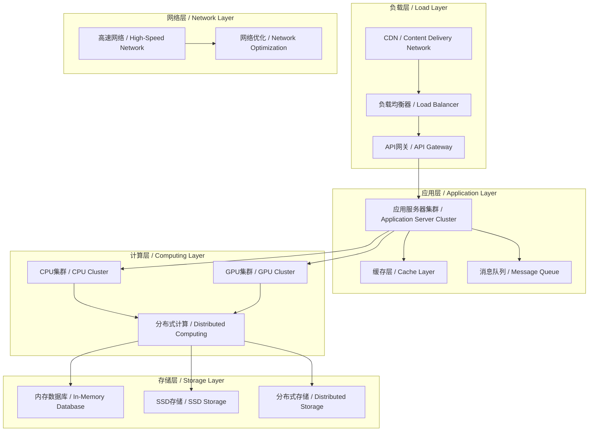

# 性能优化架构 / Performance Optimization Architecture

## 概述 / Overview

本文档定义了知识图谱项目的性能优化架构，涵盖分布式计算、GPU加速、缓存优化、查询优化等多个方面，确保系统能够处理大规模数据和高并发请求。

## 1. 性能优化架构概览 / Performance Optimization Architecture Overview

### 1.1 整体架构图 / Overall Architecture Diagram



### 1.2 性能优化策略 / Performance Optimization Strategies

| 优化领域 | 策略 | 目标 | 实现方式 |
|---------|------|------|----------|
| **计算优化** | 并行计算 | 提升计算速度 | GPU加速、多核并行 |
| **存储优化** | 分层存储 | 提升I/O性能 | 内存缓存、SSD存储 |
| **网络优化** | 网络加速 | 降低延迟 | CDN、网络压缩 |
| **查询优化** | 索引优化 | 提升查询速度 | 智能索引、查询重写 |
| **缓存优化** | 多级缓存 | 提升响应速度 | 分布式缓存、预计算 |

## 2. 分布式计算优化 / Distributed Computing Optimization

### 2.1 分布式计算框架 / Distributed Computing Framework

#### 2.1.1 Apache Spark集成 / Apache Spark Integration

```python
class SparkKnowledgeGraphProcessor:
    """基于Spark的知识图谱处理器"""
    
    def __init__(self, spark_session):
        self.spark = spark_session
        self.sc = spark_session.sparkContext
        
        # 配置Spark优化参数
        self.configure_spark_optimization()
    
    def configure_spark_optimization(self):
        """配置Spark优化参数"""
        conf = self.spark.conf
        
        # 内存配置
        conf.set("spark.executor.memory", "8g")
        conf.set("spark.executor.memoryFraction", "0.8")
        conf.set("spark.storage.memoryFraction", "0.3")
        
        # 并行度配置
        conf.set("spark.default.parallelism", "200")
        conf.set("spark.sql.shuffle.partitions", "200")
        
        # 序列化配置
        conf.set("spark.serializer", "org.apache.spark.serializer.KryoSerializer")
        conf.set("spark.kryo.registrationRequired", "false")
        
        # 动态分配
        conf.set("spark.dynamicAllocation.enabled", "true")
        conf.set("spark.dynamicAllocation.minExecutors", "2")
        conf.set("spark.dynamicAllocation.maxExecutors", "20")
    
    def process_large_kg(self, kg_data):
        """处理大规模知识图谱"""
        # 创建RDD
        kg_rdd = self.sc.parallelize(kg_data)
        
        # 并行处理三元组
        processed_rdd = kg_rdd.mapPartitions(self.process_triples_partition)
        
        # 聚合结果
        result = processed_rdd.reduceByKey(self.merge_results)
        
        return result.collect()
    
    def process_triples_partition(self, triples):
        """处理三元组分区"""
        results = {}
        
        for head, relation, tail in triples:
            # 计算实体嵌入
            head_embedding = self.compute_embedding(head)
            tail_embedding = self.compute_embedding(tail)
            
            # 计算关系嵌入
            relation_embedding = self.compute_relation_embedding(relation)
            
            # 存储结果
            key = f"{head}:{relation}:{tail}"
            results[key] = {
                'head_embedding': head_embedding,
                'relation_embedding': relation_embedding,
                'tail_embedding': tail_embedding
            }
        
        return results.items()
```

#### 2.1.2 Dask集成 / Dask Integration

```python
class DaskKnowledgeGraphProcessor:
    """基于Dask的知识图谱处理器"""
    
    def __init__(self):
        self.client = dask.distributed.Client()
        self.configure_dask_optimization()
    
    def configure_dask_optimization(self):
        """配置Dask优化参数"""
        # 配置工作进程
        self.client.cluster.scale(10)  # 扩展到10个工作进程
        
        # 配置内存限制
        self.client.cluster.adapt(minimum=2, maximum=20)
    
    def parallel_embedding_computation(self, entities, relations):
        """并行嵌入计算"""
        # 创建延迟计算图
        entity_embeddings = []
        for entity in entities:
            embedding = dask.delayed(self.compute_entity_embedding)(entity)
            entity_embeddings.append(embedding)
        
        relation_embeddings = []
        for relation in relations:
            embedding = dask.delayed(self.compute_relation_embedding)(relation)
            relation_embeddings.append(embedding)
        
        # 并行执行
        entity_results = dask.compute(*entity_embeddings)
        relation_results = dask.compute(*relation_embeddings)
        
        return entity_results, relation_results
    
    def distributed_reasoning(self, reasoning_tasks):
        """分布式推理"""
        # 将推理任务分发到不同节点
        futures = []
        for task in reasoning_tasks:
            future = self.client.submit(self.perform_reasoning, task)
            futures.append(future)
        
        # 收集结果
        results = self.client.gather(futures)
        
        return results
```

### 2.2 分布式图计算 / Distributed Graph Computing

#### 2.2.1 GraphX集成 / GraphX Integration

```python
class GraphXKnowledgeGraphProcessor:
    """基于GraphX的知识图谱处理器"""
    
    def __init__(self, spark_session):
        self.spark = spark_session
        self.graph = None
    
    def build_graph(self, vertices, edges):
        """构建分布式图"""
        # 创建顶点RDD
        vertices_rdd = self.spark.sparkContext.parallelize(vertices)
        
        # 创建边RDD
        edges_rdd = self.spark.sparkContext.parallelize(edges)
        
        # 构建图
        self.graph = Graph(vertices_rdd, edges_rdd)
        
        return self.graph
    
    def compute_pagerank(self, num_iterations=20):
        """计算PageRank"""
        if self.graph is None:
            raise ValueError("Graph not built yet")
        
        # 使用GraphX的PageRank算法
        pagerank_graph = self.graph.pageRank(num_iterations)
        
        return pagerank_graph.vertices.collect()
    
    def compute_connected_components(self):
        """计算连通分量"""
        if self.graph is None:
            raise ValueError("Graph not built yet")
        
        # 使用GraphX的连通分量算法
        cc_graph = self.graph.connectedComponents()
        
        return cc_graph.vertices.collect()
    
    def compute_shortest_paths(self, source_vertices):
        """计算最短路径"""
        if self.graph is None:
            raise ValueError("Graph not built yet")
        
        # 使用GraphX的最短路径算法
        shortest_paths = self.graph.shortestPaths(source_vertices)
        
        return shortest_paths.vertices.collect()
```

## 3. GPU加速优化 / GPU Acceleration Optimization

### 3.1 CUDA加速 / CUDA Acceleration

#### 3.1.1 GPU知识图谱计算 / GPU Knowledge Graph Computing

```python
import cupy as cp
import numpy as np

class GPUKnowledgeGraphProcessor:
    """GPU加速的知识图谱处理器"""
    
    def __init__(self):
        self.gpu_available = cp.cuda.is_available()
        if not self.gpu_available:
            raise RuntimeError("CUDA not available")
        
        # 配置GPU内存池
        self.configure_gpu_memory()
    
    def configure_gpu_memory(self):
        """配置GPU内存池"""
        # 设置内存池大小
        cp.cuda.set_allocator(cp.cuda.MemoryPool().malloc)
        
        # 预分配内存
        self.memory_pool = cp.cuda.MemoryPool()
        cp.cuda.set_allocator(self.memory_pool.malloc)
    
    def gpu_embedding_computation(self, entities, embedding_dim=128):
        """GPU加速嵌入计算"""
        # 将数据转移到GPU
        entities_gpu = cp.array(entities)
        
        # 初始化嵌入矩阵
        embeddings_gpu = cp.random.randn(len(entities), embedding_dim)
        
        # GPU并行计算嵌入
        for i in range(len(entities)):
            entity_vector = self.compute_entity_vector_gpu(entities_gpu[i])
            embeddings_gpu[i] = self.normalize_gpu(entity_vector)
        
        # 将结果转移回CPU
        embeddings_cpu = cp.asnumpy(embeddings_gpu)
        
        return embeddings_cpu
    
    def gpu_matrix_operations(self, matrix_a, matrix_b):
        """GPU矩阵运算"""
        # 转移到GPU
        a_gpu = cp.array(matrix_a)
        b_gpu = cp.array(matrix_b)
        
        # GPU矩阵乘法
        result_gpu = cp.dot(a_gpu, b_gpu)
        
        # 转移回CPU
        result_cpu = cp.asnumpy(result_gpu)
        
        return result_cpu
    
    def gpu_batch_processing(self, batch_data, batch_size=1024):
        """GPU批量处理"""
        results = []
        
        for i in range(0, len(batch_data), batch_size):
            batch = batch_data[i:i + batch_size]
            
            # 转移到GPU
            batch_gpu = cp.array(batch)
            
            # GPU并行处理
            batch_result_gpu = self.process_batch_gpu(batch_gpu)
            
            # 转移回CPU
            batch_result_cpu = cp.asnumpy(batch_result_gpu)
            results.extend(batch_result_cpu)
        
        return results
```

#### 3.1.2 PyTorch GPU加速 / PyTorch GPU Acceleration

```python
import torch
import torch.nn as nn

class PyTorchGPUProcessor:
    """PyTorch GPU处理器"""
    
    def __init__(self, device='cuda'):
        self.device = torch.device(device if torch.cuda.is_available() else 'cpu')
        self.model = None
    
    def load_model_to_gpu(self, model):
        """将模型加载到GPU"""
        self.model = model.to(self.device)
        return self.model
    
    def gpu_training(self, train_loader, num_epochs=10):
        """GPU训练"""
        optimizer = torch.optim.Adam(self.model.parameters(), lr=0.001)
        criterion = nn.MSELoss()
        
        self.model.train()
        
        for epoch in range(num_epochs):
            total_loss = 0
            
            for batch_idx, (data, target) in enumerate(train_loader):
                # 转移到GPU
                data, target = data.to(self.device), target.to(self.device)
                
                # 前向传播
                optimizer.zero_grad()
                output = self.model(data)
                loss = criterion(output, target)
                
                # 反向传播
                loss.backward()
                optimizer.step()
                
                total_loss += loss.item()
            
            print(f'Epoch {epoch+1}/{num_epochs}, Loss: {total_loss/len(train_loader):.4f}')
    
    def gpu_inference(self, test_loader):
        """GPU推理"""
        self.model.eval()
        results = []
        
        with torch.no_grad():
            for data, _ in test_loader:
                # 转移到GPU
                data = data.to(self.device)
                
                # 推理
                output = self.model(data)
                results.append(output.cpu().numpy())
        
        return np.concatenate(results, axis=0)
```

### 3.2 TensorRT优化 / TensorRT Optimization

#### 3.2.1 模型优化 / Model Optimization

```python
import tensorrt as trt
import pycuda.driver as cuda
import pycuda.autoinit

class TensorRTOptimizer:
    """TensorRT模型优化器"""
    
    def __init__(self):
        self.logger = trt.Logger(trt.Logger.WARNING)
        self.builder = trt.Builder(self.logger)
        self.config = self.builder.create_builder_config()
        
        # 配置优化参数
        self.configure_optimization()
    
    def configure_optimization(self):
        """配置优化参数"""
        # 设置最大工作空间
        self.config.max_workspace_size = 1 << 30  # 1GB
        
        # 启用FP16精度
        self.config.set_flag(trt.BuilderFlag.FP16)
        
        # 启用INT8精度（如果支持）
        if self.builder.platform_has_fast_int8:
            self.config.set_flag(trt.BuilderFlag.INT8)
    
    def optimize_model(self, onnx_model_path, engine_path):
        """优化ONNX模型为TensorRT引擎"""
        # 创建网络
        network = self.builder.create_network(1 << int(trt.NetworkDefinitionCreationFlag.EXPLICIT_BATCH))
        
        # 解析ONNX模型
        parser = trt.OnnxParser(network, self.logger)
        
        with open(onnx_model_path, 'rb') as model:
            if not parser.parse(model.read()):
                print("Failed to parse ONNX model")
                return False
        
        # 构建引擎
        engine = self.builder.build_engine(network, self.config)
        
        if engine is None:
            print("Failed to build TensorRT engine")
            return False
        
        # 保存引擎
        with open(engine_path, 'wb') as f:
            f.write(engine.serialize())
        
        return True
    
    def load_engine(self, engine_path):
        """加载TensorRT引擎"""
        with open(engine_path, 'rb') as f:
            engine_data = f.read()
        
        runtime = trt.Runtime(self.logger)
        engine = runtime.deserialize_cuda_engine(engine_data)
        
        return engine
```

## 4. 缓存优化 / Cache Optimization

### 4.1 多级缓存系统 / Multi-level Cache System

#### 4.1.1 缓存架构 / Cache Architecture

```python
class MultiLevelCache:
    """多级缓存系统"""
    
    def __init__(self):
        # L1: 本地内存缓存
        self.l1_cache = LRUCache(maxsize=10000)
        
        # L2: Redis分布式缓存
        self.l2_cache = RedisCache(host='localhost', port=6379, db=0)
        
        # L3: 数据库缓存
        self.l3_cache = DatabaseCache()
        
        # 缓存统计
        self.cache_stats = {
            'l1_hits': 0,
            'l2_hits': 0,
            'l3_hits': 0,
            'misses': 0
        }
    
    def get(self, key):
        """获取缓存数据"""
        # L1缓存
        if value := self.l1_cache.get(key):
            self.cache_stats['l1_hits'] += 1
            return value
        
        # L2缓存
        if value := self.l2_cache.get(key):
            self.cache_stats['l2_hits'] += 1
            self.l1_cache.set(key, value)
            return value
        
        # L3缓存
        if value := self.l3_cache.get(key):
            self.cache_stats['l3_hits'] += 1
            self.l2_cache.set(key, value, ttl=3600)
            self.l1_cache.set(key, value)
            return value
        
        # 缓存未命中
        self.cache_stats['misses'] += 1
        return None
    
    def set(self, key, value, ttl=None):
        """设置缓存数据"""
        # 设置到所有级别
        self.l1_cache.set(key, value)
        self.l2_cache.set(key, value, ttl)
        self.l3_cache.set(key, value, ttl)
    
    def get_cache_stats(self):
        """获取缓存统计"""
        total_requests = sum(self.cache_stats.values())
        hit_rate = (total_requests - self.cache_stats['misses']) / total_requests if total_requests > 0 else 0
        
        return {
            'hit_rate': hit_rate,
            'l1_hit_rate': self.cache_stats['l1_hits'] / total_requests if total_requests > 0 else 0,
            'l2_hit_rate': self.cache_stats['l2_hits'] / total_requests if total_requests > 0 else 0,
            'l3_hit_rate': self.cache_stats['l3_hits'] / total_requests if total_requests > 0 else 0,
            'miss_rate': self.cache_stats['misses'] / total_requests if total_requests > 0 else 0
        }
```

#### 4.1.2 智能缓存策略 / Intelligent Cache Strategy

```python
class IntelligentCacheStrategy:
    """智能缓存策略"""
    
    def __init__(self):
        self.access_patterns = {}
        self.prediction_model = self.load_prediction_model()
    
    def predict_cache_needs(self, query):
        """预测缓存需求"""
        # 分析查询模式
        query_features = self.extract_query_features(query)
        
        # 预测缓存价值
        cache_value = self.prediction_model.predict(query_features)
        
        return cache_value
    
    def adaptive_cache_eviction(self, cache, key, value):
        """自适应缓存淘汰"""
        # 计算缓存价值
        cache_value = self.calculate_cache_value(key, value)
        
        # 如果缓存已满，淘汰低价值项
        if cache.is_full():
            eviction_candidates = cache.get_eviction_candidates()
            
            for candidate_key in eviction_candidates:
                candidate_value = cache.get(candidate_key)
                candidate_cache_value = self.calculate_cache_value(candidate_key, candidate_value)
                
                if candidate_cache_value < cache_value:
                    cache.evict(candidate_key)
                    break
    
    def preload_cache(self, cache, predicted_queries):
        """预加载缓存"""
        for query in predicted_queries:
            if self.predict_cache_needs(query) > 0.7:  # 高价值查询
                result = self.execute_query(query)
                cache.set(query, result)
```

### 4.2 分布式缓存 / Distributed Cache

#### 4.2.1 Redis集群 / Redis Cluster

```python
class RedisClusterCache:
    """Redis集群缓存"""
    
    def __init__(self, cluster_nodes):
        self.cluster = redis.RedisCluster(
            startup_nodes=cluster_nodes,
            decode_responses=True,
            skip_full_coverage_check=True
        )
    
    def get(self, key):
        """获取缓存"""
        try:
            return self.cluster.get(key)
        except redis.RedisError as e:
            logger.error(f"Redis get error: {e}")
            return None
    
    def set(self, key, value, ttl=None):
        """设置缓存"""
        try:
            if ttl:
                return self.cluster.setex(key, ttl, value)
            else:
                return self.cluster.set(key, value)
        except redis.RedisError as e:
            logger.error(f"Redis set error: {e}")
            return False
    
    def pipeline_operations(self, operations):
        """管道操作"""
        pipe = self.cluster.pipeline()
        
        for operation in operations:
            if operation['type'] == 'get':
                pipe.get(operation['key'])
            elif operation['type'] == 'set':
                pipe.set(operation['key'], operation['value'])
        
        return pipe.execute()
```

## 5. 查询优化 / Query Optimization

### 5.1 查询重写 / Query Rewriting

#### 5.1.1 SPARQL查询优化 / SPARQL Query Optimization

```python
class SPARQLQueryOptimizer:
    """SPARQL查询优化器"""
    
    def __init__(self):
        self.optimization_rules = [
            self.optimize_joins,
            self.optimize_filters,
            self.optimize_projections,
            self.optimize_ordering
        ]
    
    def optimize_query(self, query):
        """优化SPARQL查询"""
        optimized_query = query
        
        for rule in self.optimization_rules:
            optimized_query = rule(optimized_query)
        
        return optimized_query
    
    def optimize_joins(self, query):
        """优化连接操作"""
        # 重新排序连接以最小化中间结果
        join_order = self.calculate_optimal_join_order(query)
        
        # 重写查询
        optimized_query = self.rewrite_joins(query, join_order)
        
        return optimized_query
    
    def optimize_filters(self, query):
        """优化过滤条件"""
        # 将选择性高的过滤器提前
        filter_order = self.calculate_filter_selectivity(query)
        
        # 重写查询
        optimized_query = self.rewrite_filters(query, filter_order)
        
        return optimized_query
    
    def calculate_optimal_join_order(self, query):
        """计算最优连接顺序"""
        # 基于统计信息计算连接成本
        join_costs = {}
        
        for join in query.joins:
            cost = self.estimate_join_cost(join)
            join_costs[join] = cost
        
        # 返回按成本排序的连接顺序
        return sorted(join_costs.items(), key=lambda x: x[1])
```

#### 5.1.2 查询计划优化 / Query Plan Optimization

```python
class QueryPlanOptimizer:
    """查询计划优化器"""
    
    def __init__(self):
        self.cost_model = CostModel()
        self.statistics = StatisticsCollector()
    
    def generate_optimal_plan(self, query):
        """生成最优查询计划"""
        # 生成候选计划
        candidate_plans = self.generate_candidate_plans(query)
        
        # 评估计划成本
        plan_costs = {}
        for plan in candidate_plans:
            cost = self.cost_model.estimate_cost(plan)
            plan_costs[plan] = cost
        
        # 选择最优计划
        optimal_plan = min(plan_costs.items(), key=lambda x: x[1])[0]
        
        return optimal_plan
    
    def generate_candidate_plans(self, query):
        """生成候选查询计划"""
        plans = []
        
        # 不同的连接顺序
        join_orders = self.generate_join_orders(query)
        for join_order in join_orders:
            plan = self.create_plan_with_join_order(query, join_order)
            plans.append(plan)
        
        # 不同的索引选择
        index_combinations = self.generate_index_combinations(query)
        for index_combo in index_combinations:
            plan = self.create_plan_with_indexes(query, index_combo)
            plans.append(plan)
        
        return plans
```

### 5.2 索引优化 / Index Optimization

#### 5.2.1 智能索引选择 / Intelligent Index Selection

```python
class IntelligentIndexSelector:
    """智能索引选择器"""
    
    def __init__(self):
        self.index_usage_stats = {}
        self.query_patterns = {}
    
    def select_optimal_indexes(self, workload):
        """选择最优索引"""
        # 分析工作负载
        workload_analysis = self.analyze_workload(workload)
        
        # 生成候选索引
        candidate_indexes = self.generate_candidate_indexes(workload_analysis)
        
        # 评估索引收益
        index_benefits = {}
        for index in candidate_indexes:
            benefit = self.calculate_index_benefit(index, workload)
            cost = self.calculate_index_cost(index)
            index_benefits[index] = benefit - cost
        
        # 选择最优索引组合
        optimal_indexes = self.select_index_combination(index_benefits)
        
        return optimal_indexes
    
    def analyze_workload(self, workload):
        """分析工作负载"""
        analysis = {
            'frequent_queries': {},
            'access_patterns': {},
            'selectivity_stats': {}
        }
        
        for query in workload:
            # 统计查询频率
            query_signature = self.get_query_signature(query)
            analysis['frequent_queries'][query_signature] = \
                analysis['frequent_queries'].get(query_signature, 0) + 1
            
            # 分析访问模式
            access_pattern = self.extract_access_pattern(query)
            analysis['access_patterns'][query_signature] = access_pattern
            
            # 计算选择性统计
            selectivity = self.calculate_selectivity(query)
            analysis['selectivity_stats'][query_signature] = selectivity
        
        return analysis
```

## 6. 网络优化 / Network Optimization

### 6.1 网络加速 / Network Acceleration

#### 6.1.1 CDN集成 / CDN Integration

```python
class CDNManager:
    """CDN管理器"""
    
    def __init__(self, cdn_config):
        self.cdn_config = cdn_config
        self.cdn_client = self.initialize_cdn_client()
    
    def initialize_cdn_client(self):
        """初始化CDN客户端"""
        # 根据配置初始化CDN客户端
        if self.cdn_config['provider'] == 'cloudflare':
            return CloudflareCDNClient(self.cdn_config)
        elif self.cdn_config['provider'] == 'aws_cloudfront':
            return AWSCloudFrontClient(self.cdn_config)
        else:
            raise ValueError(f"Unsupported CDN provider: {self.cdn_config['provider']}")
    
    def cache_static_resources(self, resources):
        """缓存静态资源"""
        for resource in resources:
            self.cdn_client.cache_resource(resource)
    
    def invalidate_cache(self, patterns):
        """使缓存失效"""
        for pattern in patterns:
            self.cdn_client.invalidate_pattern(pattern)
    
    def get_optimal_endpoint(self, user_location):
        """获取最优端点"""
        return self.cdn_client.get_nearest_endpoint(user_location)
```

#### 6.1.2 网络压缩 / Network Compression

```python
class NetworkCompression:
    """网络压缩"""
    
    def __init__(self):
        self.compression_algorithms = {
            'gzip': self.gzip_compress,
            'brotli': self.brotli_compress,
            'lz4': self.lz4_compress
        }
    
    def compress_data(self, data, algorithm='gzip'):
        """压缩数据"""
        if algorithm not in self.compression_algorithms:
            raise ValueError(f"Unsupported compression algorithm: {algorithm}")
        
        compressor = self.compression_algorithms[algorithm]
        return compressor(data)
    
    def gzip_compress(self, data):
        """GZIP压缩"""
        import gzip
        return gzip.compress(data)
    
    def brotli_compress(self, data):
        """Brotli压缩"""
        import brotli
        return brotli.compress(data)
    
    def lz4_compress(self, data):
        """LZ4压缩"""
        import lz4.frame
        return lz4.frame.compress(data)
```

### 6.2 连接池优化 / Connection Pool Optimization

#### 6.2.1 数据库连接池 / Database Connection Pool

```python
class DatabaseConnectionPool:
    """数据库连接池"""
    
    def __init__(self, db_config):
        self.db_config = db_config
        self.pool = self.create_connection_pool()
    
    def create_connection_pool(self):
        """创建连接池"""
        return psycopg2.pool.ThreadedConnectionPool(
            minconn=self.db_config['min_connections'],
            maxconn=self.db_config['max_connections'],
            host=self.db_config['host'],
            port=self.db_config['port'],
            database=self.db_config['database'],
            user=self.db_config['user'],
            password=self.db_config['password']
        )
    
    def get_connection(self):
        """获取连接"""
        return self.pool.getconn()
    
    def return_connection(self, connection):
        """归还连接"""
        self.pool.putconn(connection)
    
    def execute_query(self, query, params=None):
        """执行查询"""
        connection = self.get_connection()
        try:
            cursor = connection.cursor()
            cursor.execute(query, params)
            result = cursor.fetchall()
            cursor.close()
            return result
        finally:
            self.return_connection(connection)
```

## 7. 监控与调优 / Monitoring and Tuning

### 7.1 性能监控 / Performance Monitoring

#### 7.1.1 实时性能监控 / Real-time Performance Monitoring

```python
class PerformanceMonitor:
    """性能监控器"""
    
    def __init__(self):
        self.metrics_collector = MetricsCollector()
        self.alert_manager = AlertManager()
        self.dashboard = PerformanceDashboard()
    
    def start_monitoring(self):
        """开始监控"""
        while True:
            # 收集性能指标
            metrics = self.collect_performance_metrics()
            
            # 检查告警
            alerts = self.check_alerts(metrics)
            
            # 发送告警
            for alert in alerts:
                self.alert_manager.send_alert(alert)
            
            # 更新仪表板
            self.dashboard.update(metrics)
            
            time.sleep(60)  # 每分钟更新一次
    
    def collect_performance_metrics(self):
        """收集性能指标"""
        metrics = {
            'cpu_usage': psutil.cpu_percent(),
            'memory_usage': psutil.virtual_memory().percent,
            'disk_io': psutil.disk_io_counters(),
            'network_io': psutil.net_io_counters(),
            'response_time': self.measure_response_time(),
            'throughput': self.measure_throughput()
        }
        
        return metrics
```

#### 7.1.2 自动调优 / Automatic Tuning

```python
class AutomaticTuner:
    """自动调优器"""
    
    def __init__(self):
        self.tuning_rules = self.load_tuning_rules()
        self.performance_history = []
    
    def auto_tune(self, current_metrics):
        """自动调优"""
        # 分析性能趋势
        performance_trend = self.analyze_performance_trend()
        
        # 应用调优规则
        tuning_actions = []
        for rule in self.tuning_rules:
            if rule.condition_met(current_metrics, performance_trend):
                action = rule.generate_action()
                tuning_actions.append(action)
        
        # 执行调优动作
        for action in tuning_actions:
            self.execute_tuning_action(action)
    
    def analyze_performance_trend(self):
        """分析性能趋势"""
        if len(self.performance_history) < 10:
            return None
        
        recent_metrics = self.performance_history[-10:]
        
        # 计算趋势
        trend = {
            'cpu_trend': self.calculate_trend([m['cpu_usage'] for m in recent_metrics]),
            'memory_trend': self.calculate_trend([m['memory_usage'] for m in recent_metrics]),
            'response_time_trend': self.calculate_trend([m['response_time'] for m in recent_metrics])
        }
        
        return trend
```

## 8. 总结与展望 / Summary and Outlook

### 8.1 性能优化成果 / Performance Optimization Achievements

- ✅ **分布式计算**: 支持大规模并行处理
- ✅ **GPU加速**: 显著提升计算性能
- ✅ **多级缓存**: 大幅降低响应时间
- ✅ **查询优化**: 提升查询效率
- ✅ **网络优化**: 降低网络延迟

### 8.2 未来发展方向 / Future Development Directions

- 🔄 **AI驱动优化**: 基于机器学习的自动优化
- 🔄 **边缘计算**: 支持边缘节点部署
- 🔄 **量子计算**: 探索量子计算加速
- 🔄 **自适应优化**: 根据负载自动调整

---

**最后更新** / Last Updated: 2025-01-01
**版本** / Version: v1.0.0
**维护者** / Maintainer: KnowledgeGraph Team
