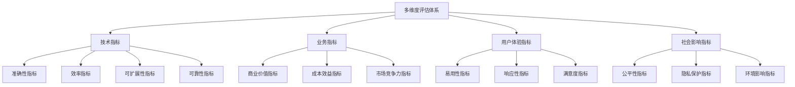

# 多维度评估体系 / Multi-dimensional Evaluation System

## 概述 / Overview

本文档定义了知识图谱项目的多维度评估体系，从技术指标、业务指标、用户体验指标等多个维度全面评估知识图谱系统的性能和质量。

## 1. 评估维度框架 / Evaluation Dimension Framework

### 1.1 评估维度分类 / Evaluation Dimension Classification



### 1.2 评估指标权重 / Evaluation Metrics Weights

| 评估维度 | 权重 | 子维度 | 子权重 | 说明 |
|---------|------|--------|--------|------|
| **技术指标** | 40% | 准确性 | 30% | 系统正确性 |
| | | 效率 | 25% | 性能表现 |
| | | 可扩展性 | 25% | 扩展能力 |
| | | 可靠性 | 20% | 稳定性 |
| **业务指标** | 30% | 商业价值 | 40% | 业务贡献 |
| | | 成本效益 | 35% | 投入产出 |
| | | 市场竞争力 | 25% | 竞争优势 |
| **用户体验** | 20% | 易用性 | 35% | 使用便利性 |
| | | 响应性 | 35% | 响应速度 |
| | | 满意度 | 30% | 用户满意 |
| **社会影响** | 10% | 公平性 | 40% | 公平公正 |
| | | 隐私保护 | 35% | 隐私安全 |
| | | 环境影响 | 25% | 环保影响 |

## 2. 技术指标评估 / Technical Metrics Evaluation

### 2.1 准确性指标 / Accuracy Metrics

#### 2.1.1 知识表示准确性 / Knowledge Representation Accuracy

```python
class KnowledgeRepresentationAccuracy:
    def __init__(self):
        self.metrics = {
            'link_prediction_accuracy': self.link_prediction_accuracy,
            'entity_linking_accuracy': self.entity_linking_accuracy,
            'relation_extraction_accuracy': self.relation_extraction_accuracy,
            'knowledge_completion_accuracy': self.knowledge_completion_accuracy
        }
    
    def evaluate_accuracy(self, model, test_data):
        """评估知识表示准确性"""
        results = {}
        
        for metric_name, metric_func in self.metrics.items():
            results[metric_name] = metric_func(model, test_data)
        
        # 计算综合准确性
        overall_accuracy = np.mean(list(results.values()))
        results['overall_accuracy'] = overall_accuracy
        
        return results
    
    def link_prediction_accuracy(self, model, test_data):
        """链接预测准确性"""
        correct_predictions = 0
        total_predictions = 0
        
        for head, relation, tail in test_data:
            predicted_tail = model.predict_tail(head, relation)
            if predicted_tail == tail:
                correct_predictions += 1
            total_predictions += 1
        
        return correct_predictions / total_predictions
```

#### 2.1.2 推理准确性 / Reasoning Accuracy

```python
class ReasoningAccuracy:
    def __init__(self):
        self.reasoning_types = {
            'deductive': self.deductive_reasoning_accuracy,
            'inductive': self.inductive_reasoning_accuracy,
            'abductive': self.abductive_reasoning_accuracy,
            'causal': self.causal_reasoning_accuracy
        }
    
    def evaluate_reasoning_accuracy(self, model, test_cases):
        """评估推理准确性"""
        results = {}
        
        for reasoning_type, accuracy_func in self.reasoning_types.items():
            results[reasoning_type] = accuracy_func(model, test_cases[reasoning_type])
        
        return results
```

### 2.2 效率指标 / Efficiency Metrics

#### 2.2.1 计算效率 / Computational Efficiency

```python
class ComputationalEfficiency:
    def __init__(self):
        self.efficiency_metrics = {
            'throughput': self.measure_throughput,
            'latency': self.measure_latency,
            'memory_usage': self.measure_memory_usage,
            'cpu_usage': self.measure_cpu_usage,
            'gpu_usage': self.measure_gpu_usage
        }
    
    def evaluate_efficiency(self, system, workload):
        """评估计算效率"""
        results = {}
        
        for metric_name, metric_func in self.efficiency_metrics.items():
            results[metric_name] = metric_func(system, workload)
        
        return results
    
    def measure_throughput(self, system, workload):
        """测量吞吐量 (QPS)"""
        start_time = time.time()
        processed_queries = 0
        
        for query in workload:
            system.process_query(query)
            processed_queries += 1
        
        end_time = time.time()
        duration = end_time - start_time
        
        return processed_queries / duration
```

#### 2.2.2 存储效率 / Storage Efficiency

```python
class StorageEfficiency:
    def __init__(self):
        self.storage_metrics = {
            'compression_ratio': self.calculate_compression_ratio,
            'index_efficiency': self.calculate_index_efficiency,
            'query_io': self.measure_query_io,
            'storage_cost': self.calculate_storage_cost
        }
    
    def evaluate_storage_efficiency(self, storage_system):
        """评估存储效率"""
        results = {}
        
        for metric_name, metric_func in self.storage_metrics.items():
            results[metric_name] = metric_func(storage_system)
        
        return results
```

### 2.3 可扩展性指标 / Scalability Metrics

#### 2.3.1 水平扩展性 / Horizontal Scalability

```python
class HorizontalScalability:
    def __init__(self):
        self.scalability_metrics = {
            'linear_scalability': self.measure_linear_scalability,
            'load_balancing': self.measure_load_balancing,
            'fault_tolerance': self.measure_fault_tolerance,
            'elasticity': self.measure_elasticity
        }
    
    def evaluate_horizontal_scalability(self, system, scale_range):
        """评估水平扩展性"""
        results = {}
        
        for scale in scale_range:
            scaled_system = system.scale_to(scale)
            scale_results = {}
            
            for metric_name, metric_func in self.scalability_metrics.items():
                scale_results[metric_name] = metric_func(scaled_system)
            
            results[f'scale_{scale}'] = scale_results
        
        return results
```

#### 2.3.2 垂直扩展性 / Vertical Scalability

```python
class VerticalScalability:
    def __init__(self):
        self.resource_metrics = {
            'cpu_scalability': self.measure_cpu_scalability,
            'memory_scalability': self.measure_memory_scalability,
            'storage_scalability': self.measure_storage_scalability,
            'network_scalability': self.measure_network_scalability
        }
    
    def evaluate_vertical_scalability(self, system, resource_configs):
        """评估垂直扩展性"""
        results = {}
        
        for config in resource_configs:
            scaled_system = system.configure_resources(config)
            config_results = {}
            
            for metric_name, metric_func in self.resource_metrics.items():
                config_results[metric_name] = metric_func(scaled_system)
            
            results[f'config_{config.id}'] = config_results
        
        return results
```

### 2.4 可靠性指标 / Reliability Metrics

#### 2.4.1 系统可用性 / System Availability

```python
class SystemAvailability:
    def __init__(self):
        self.availability_metrics = {
            'uptime': self.measure_uptime,
            'downtime': self.measure_downtime,
            'mean_time_between_failures': self.measure_mtbf,
            'mean_time_to_recovery': self.measure_mttr
        }
    
    def evaluate_availability(self, system, monitoring_period):
        """评估系统可用性"""
        results = {}
        
        for metric_name, metric_func in self.availability_metrics.items():
            results[metric_name] = metric_func(system, monitoring_period)
        
        # 计算可用性百分比
        uptime = results['uptime']
        total_time = uptime + results['downtime']
        results['availability_percentage'] = (uptime / total_time) * 100
        
        return results
```

#### 2.4.2 数据一致性 / Data Consistency

```python
class DataConsistency:
    def __init__(self):
        self.consistency_metrics = {
            'eventual_consistency': self.measure_eventual_consistency,
            'strong_consistency': self.measure_strong_consistency,
            'consistency_violations': self.measure_consistency_violations,
            'consistency_latency': self.measure_consistency_latency
        }
    
    def evaluate_consistency(self, system, consistency_tests):
        """评估数据一致性"""
        results = {}
        
        for metric_name, metric_func in self.consistency_metrics.items():
            results[metric_name] = metric_func(system, consistency_tests)
        
        return results
```

## 3. 业务指标评估 / Business Metrics Evaluation

### 3.1 商业价值指标 / Business Value Metrics

#### 3.1.1 收入影响 / Revenue Impact

```python
class RevenueImpact:
    def __init__(self):
        self.revenue_metrics = {
            'revenue_growth': self.measure_revenue_growth,
            'conversion_rate': self.measure_conversion_rate,
            'customer_lifetime_value': self.measure_clv,
            'market_share': self.measure_market_share
        }
    
    def evaluate_revenue_impact(self, business_data):
        """评估收入影响"""
        results = {}
        
        for metric_name, metric_func in self.revenue_metrics.items():
            results[metric_name] = metric_func(business_data)
        
        return results
```

#### 3.1.2 成本节约 / Cost Savings

```python
class CostSavings:
    def __init__(self):
        self.cost_metrics = {
            'operational_cost_reduction': self.measure_operational_cost_reduction,
            'maintenance_cost_reduction': self.measure_maintenance_cost_reduction,
            'infrastructure_cost_reduction': self.measure_infrastructure_cost_reduction,
            'labor_cost_reduction': self.measure_labor_cost_reduction
        }
    
    def evaluate_cost_savings(self, cost_data):
        """评估成本节约"""
        results = {}
        
        for metric_name, metric_func in self.cost_metrics.items():
            results[metric_name] = metric_func(cost_data)
        
        return results
```

### 3.2 成本效益指标 / Cost-Benefit Metrics

#### 3.2.1 投资回报率 / Return on Investment

```python
class ReturnOnInvestment:
    def __init__(self):
        self.roi_metrics = {
            'roi': self.calculate_roi,
            'payback_period': self.calculate_payback_period,
            'net_present_value': self.calculate_npv,
            'internal_rate_of_return': self.calculate_irr
        }
    
    def evaluate_roi(self, investment_data):
        """评估投资回报率"""
        results = {}
        
        for metric_name, metric_func in self.roi_metrics.items():
            results[metric_name] = metric_func(investment_data)
        
        return results
```

### 3.3 市场竞争力指标 / Market Competitiveness Metrics

#### 3.3.1 竞争优势 / Competitive Advantage

```python
class CompetitiveAdvantage:
    def __init__(self):
        self.competitive_metrics = {
            'feature_advantage': self.measure_feature_advantage,
            'performance_advantage': self.measure_performance_advantage,
            'cost_advantage': self.measure_cost_advantage,
            'time_to_market': self.measure_time_to_market
        }
    
    def evaluate_competitive_advantage(self, competitive_data):
        """评估竞争优势"""
        results = {}
        
        for metric_name, metric_func in self.competitive_metrics.items():
            results[metric_name] = metric_func(competitive_data)
        
        return results
```

## 4. 用户体验指标评估 / User Experience Metrics Evaluation

### 4.1 易用性指标 / Usability Metrics

#### 4.1.1 学习曲线 / Learning Curve

```python
class LearningCurve:
    def __init__(self):
        self.learning_metrics = {
            'time_to_first_success': self.measure_time_to_first_success,
            'learning_efficiency': self.measure_learning_efficiency,
            'error_rate': self.measure_error_rate,
            'help_usage': self.measure_help_usage
        }
    
    def evaluate_learning_curve(self, user_interaction_data):
        """评估学习曲线"""
        results = {}
        
        for metric_name, metric_func in self.learning_metrics.items():
            results[metric_name] = metric_func(user_interaction_data)
        
        return results
```

#### 4.1.2 任务完成率 / Task Completion Rate

```python
class TaskCompletionRate:
    def __init__(self):
        self.completion_metrics = {
            'task_completion_rate': self.measure_task_completion_rate,
            'task_abandonment_rate': self.measure_task_abandonment_rate,
            'task_success_rate': self.measure_task_success_rate,
            'task_efficiency': self.measure_task_efficiency
        }
    
    def evaluate_task_completion(self, task_data):
        """评估任务完成情况"""
        results = {}
        
        for metric_name, metric_func in self.completion_metrics.items():
            results[metric_name] = metric_func(task_data)
        
        return results
```

### 4.2 响应性指标 / Responsiveness Metrics

#### 4.2.1 响应时间 / Response Time

```python
class ResponseTime:
    def __init__(self):
        self.response_metrics = {
            'average_response_time': self.measure_average_response_time,
            'p95_response_time': self.measure_p95_response_time,
            'p99_response_time': self.measure_p99_response_time,
            'response_time_consistency': self.measure_response_time_consistency
        }
    
    def evaluate_response_time(self, response_data):
        """评估响应时间"""
        results = {}
        
        for metric_name, metric_func in self.response_metrics.items():
            results[metric_name] = metric_func(response_data)
        
        return results
```

### 4.3 满意度指标 / Satisfaction Metrics

#### 4.3.1 用户满意度 / User Satisfaction

```python
class UserSatisfaction:
    def __init__(self):
        self.satisfaction_metrics = {
            'overall_satisfaction': self.measure_overall_satisfaction,
            'feature_satisfaction': self.measure_feature_satisfaction,
            'performance_satisfaction': self.measure_performance_satisfaction,
            'support_satisfaction': self.measure_support_satisfaction
        }
    
    def evaluate_satisfaction(self, satisfaction_data):
        """评估用户满意度"""
        results = {}
        
        for metric_name, metric_func in self.satisfaction_metrics.items():
            results[metric_name] = metric_func(satisfaction_data)
        
        return results
```

## 5. 社会影响指标评估 / Social Impact Metrics Evaluation

### 5.1 公平性指标 / Fairness Metrics

#### 5.1.1 算法公平性 / Algorithmic Fairness

```python
class AlgorithmicFairness:
    def __init__(self):
        self.fairness_metrics = {
            'demographic_parity': self.measure_demographic_parity,
            'equalized_odds': self.measure_equalized_odds,
            'equal_opportunity': self.measure_equal_opportunity,
            'individual_fairness': self.measure_individual_fairness
        }
    
    def evaluate_fairness(self, fairness_data):
        """评估算法公平性"""
        results = {}
        
        for metric_name, metric_func in self.fairness_metrics.items():
            results[metric_name] = metric_func(fairness_data)
        
        return results
```

### 5.2 隐私保护指标 / Privacy Protection Metrics

#### 5.2.1 数据隐私 / Data Privacy

```python
class DataPrivacy:
    def __init__(self):
        self.privacy_metrics = {
            'differential_privacy': self.measure_differential_privacy,
            'k_anonymity': self.measure_k_anonymity,
            'l_diversity': self.measure_l_diversity,
            't_closeness': self.measure_t_closeness
        }
    
    def evaluate_privacy(self, privacy_data):
        """评估数据隐私"""
        results = {}
        
        for metric_name, metric_func in self.privacy_metrics.items():
            results[metric_name] = metric_func(privacy_data)
        
        return results
```

### 5.3 环境影响指标 / Environmental Impact Metrics

#### 5.3.1 碳足迹 / Carbon Footprint

```python
class CarbonFootprint:
    def __init__(self):
        self.environmental_metrics = {
            'energy_consumption': self.measure_energy_consumption,
            'carbon_emissions': self.measure_carbon_emissions,
            'resource_efficiency': self.measure_resource_efficiency,
            'sustainability_score': self.measure_sustainability_score
        }
    
    def evaluate_environmental_impact(self, environmental_data):
        """评估环境影响"""
        results = {}
        
        for metric_name, metric_func in self.environmental_metrics.items():
            results[metric_name] = metric_func(environmental_data)
        
        return results
```

## 6. 综合评估框架 / Comprehensive Evaluation Framework

### 6.1 多维度综合评估 / Multi-dimensional Comprehensive Evaluation

```python
class ComprehensiveEvaluator:
    def __init__(self, weights_config):
        self.weights = weights_config
        self.evaluators = {
            'technical': TechnicalMetricsEvaluator(),
            'business': BusinessMetricsEvaluator(),
            'user_experience': UserExperienceMetricsEvaluator(),
            'social_impact': SocialImpactMetricsEvaluator()
        }
    
    def evaluate_comprehensive(self, system, evaluation_data):
        """综合评估"""
        results = {}
        weighted_scores = {}
        
        # 各维度评估
        for dimension, evaluator in self.evaluators.items():
            dimension_results = evaluator.evaluate(system, evaluation_data[dimension])
            results[dimension] = dimension_results
            
            # 计算加权分数
            dimension_score = self.calculate_dimension_score(dimension_results)
            weighted_scores[dimension] = dimension_score * self.weights[dimension]
        
        # 计算综合分数
        overall_score = sum(weighted_scores.values())
        results['overall_score'] = overall_score
        results['weighted_scores'] = weighted_scores
        
        return results
    
    def calculate_dimension_score(self, dimension_results):
        """计算维度分数"""
        # 根据各维度内部权重计算分数
        total_score = 0
        total_weight = 0
        
        for metric, score in dimension_results.items():
            weight = self.get_metric_weight(metric)
            total_score += score * weight
            total_weight += weight
        
        return total_score / total_weight if total_weight > 0 else 0
```

### 6.2 评估报告生成 / Evaluation Report Generation

```python
class EvaluationReportGenerator:
    def __init__(self):
        self.report_templates = {
            'executive_summary': self.generate_executive_summary,
            'detailed_analysis': self.generate_detailed_analysis,
            'recommendations': self.generate_recommendations,
            'visualizations': self.generate_visualizations
        }
    
    def generate_report(self, evaluation_results, report_type='comprehensive'):
        """生成评估报告"""
        report = {}
        
        for section, generator in self.report_templates.items():
            report[section] = generator(evaluation_results)
        
        return report
    
    def generate_executive_summary(self, results):
        """生成执行摘要"""
        return {
            'overall_score': results['overall_score'],
            'key_strengths': self.identify_strengths(results),
            'key_weaknesses': self.identify_weaknesses(results),
            'recommendations': self.generate_top_recommendations(results)
        }
```

## 7. 持续监控与改进 / Continuous Monitoring and Improvement

### 7.1 实时监控 / Real-time Monitoring

```python
class RealTimeMonitor:
    def __init__(self):
        self.monitoring_metrics = {}
        self.alert_thresholds = {}
        self.alert_handlers = {}
    
    def start_monitoring(self, system):
        """开始实时监控"""
        while True:
            current_metrics = self.collect_metrics(system)
            
            # 检查阈值
            alerts = self.check_thresholds(current_metrics)
            
            # 处理告警
            for alert in alerts:
                self.handle_alert(alert)
            
            # 更新历史数据
            self.update_historical_data(current_metrics)
            
            time.sleep(60)  # 每分钟检查一次
    
    def collect_metrics(self, system):
        """收集指标"""
        metrics = {}
        
        # 收集技术指标
        metrics['technical'] = self.collect_technical_metrics(system)
        
        # 收集业务指标
        metrics['business'] = self.collect_business_metrics(system)
        
        # 收集用户体验指标
        metrics['user_experience'] = self.collect_ux_metrics(system)
        
        return metrics
```

### 7.2 持续改进 / Continuous Improvement

```python
class ContinuousImprovement:
    def __init__(self):
        self.improvement_strategies = {
            'performance_optimization': self.optimize_performance,
            'accuracy_improvement': self.improve_accuracy,
            'user_experience_enhancement': self.enhance_user_experience,
            'cost_reduction': self.reduce_costs
        }
    
    def analyze_improvement_opportunities(self, evaluation_results):
        """分析改进机会"""
        opportunities = []
        
        # 识别低分指标
        low_score_metrics = self.identify_low_score_metrics(evaluation_results)
        
        # 分析改进潜力
        for metric in low_score_metrics:
            improvement_potential = self.assess_improvement_potential(metric)
            if improvement_potential > 0.3:  # 改进潜力大于30%
                opportunities.append({
                    'metric': metric,
                    'potential': improvement_potential,
                    'strategy': self.recommend_strategy(metric)
                })
        
        return opportunities
```

## 8. 总结与展望 / Summary and Outlook

### 8.1 评估体系特点 / Evaluation System Features

- ✅ **多维度覆盖**: 技术、业务、用户体验、社会影响四个维度
- ✅ **权重配置**: 灵活的权重配置机制
- ✅ **实时监控**: 支持实时性能监控
- ✅ **持续改进**: 基于评估结果的持续改进机制

### 8.2 未来发展方向 / Future Development Directions

- 🔄 **智能化评估**: 基于AI的自动评估和优化
- 🔄 **个性化权重**: 根据业务需求个性化调整权重
- 🔄 **预测性分析**: 基于历史数据的预测性评估
- 🔄 **跨平台集成**: 支持多种评估平台集成

---

**最后更新** / Last Updated: 2025-01-01
**版本** / Version: v1.0.0
**维护者** / Maintainer: KnowledgeGraph Team
