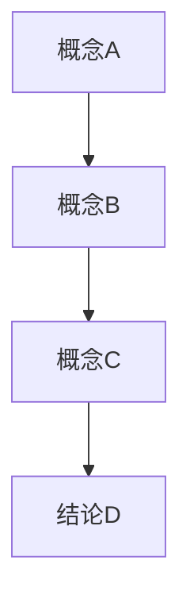

# [模块标题] / [Module Title]

## 1. 概述 / Overview

### 1.1 定义与概念 / Definition and Concepts

**中文定义** / Chinese Definition:
[在此处提供中文定义]

**English Definition:**
[Provide English definition here]

### 1.2 历史发展 / Historical Development

**发展历程** / Development Timeline:

- **阶段1** / Phase 1: [描述]
- **阶段2** / Phase 2: [描述]
- **阶段3** / Phase 3: [描述]

### 1.3 核心特征 / Core Characteristics

| 特征 / Feature | 中文描述 / Chinese Description | English Description |
|---------------|------------------------------|-------------------|
| 特征1 / Feature 1 | [描述] | [Description] |
| 特征2 / Feature 2 | [描述] | [Description] |
| 特征3 / Feature 3 | [描述] | [Description] |

## 2. 理论基础 / Theoretical Foundation

### 2.1 数学基础 / Mathematical Foundation

#### 2.1.1 形式化定义 / Formal Definition

**数学符号** / Mathematical Notation:

```text
[数学公式]
```

**形式化描述** / Formal Description:
[详细的形式化描述]

#### 2.1.2 定理与证明 / Theorems and Proofs

**定理1** / Theorem 1:
[定理陈述]

**证明** / Proof:

```text
[形式化证明过程]
```

### 2.2 逻辑框架 / Logical Framework

**逻辑结构** / Logical Structure:



## 3. 批判性分析 / Critical Analysis

### 3.1 优势分析 / Strengths Analysis

**优势1** / Strength 1:

- **中文** / Chinese: [分析]
- **English**: [Analysis]

**优势2** / Strength 2:

- **中文** / Chinese: [分析]
- **English**: [Analysis]

### 3.2 局限性分析 / Limitations Analysis

**局限性1** / Limitation 1:

- **中文** / Chinese: [分析]
- **English**: [Analysis]

**局限性2** / Limitation 2:

- **中文** / Chinese: [分析]
- **English**: [Analysis]

### 3.3 争议与讨论 / Controversies and Discussions

**争议点1** / Controversy 1:

- **支持观点** / Supporting Views: [描述]
- **反对观点** / Opposing Views: [描述]
- **中立分析** / Neutral Analysis: [分析]

## 4. 工程实践 / Engineering Practice

### 4.1 实现方法 / Implementation Methods

#### 4.1.1 算法设计 / Algorithm Design

**算法1** / Algorithm 1:

```rust
// Rust实现示例
fn algorithm_example() -> Result<(), Error> {
    // 算法实现
    Ok(())
}
```

```haskell
-- Haskell实现示例
algorithmExample :: IO ()
algorithmExample = do
    -- 算法实现
    return ()
```

#### 4.1.2 数据结构 / Data Structures

**核心数据结构** / Core Data Structure:

```rust
#[derive(Debug, Clone)]
pub struct CoreStructure {
    pub field1: String,
    pub field2: i32,
    pub field3: Vec<f64>,
}
```

### 4.2 性能分析 / Performance Analysis

**时间复杂度** / Time Complexity:

- 最好情况 / Best Case: O(n)
- 平均情况 / Average Case: O(n log n)
- 最坏情况 / Worst Case: O(n²)

**空间复杂度** / Space Complexity:

- 辅助空间 / Auxiliary Space: O(n)

### 4.3 工程案例 / Engineering Cases

#### 4.3.1 案例1 / Case 1

**背景** / Background:
[案例背景描述]

**解决方案** / Solution:
[解决方案描述]

**结果评估** / Results Evaluation:
[结果评估]

## 5. 应用领域 / Application Domains

### 5.1 主要应用 / Primary Applications

| 应用领域 / Domain | 中文描述 / Chinese Description | English Description |
|------------------|------------------------------|-------------------|
| 应用1 / Application 1 | [描述] | [Description] |
| 应用2 / Application 2 | [描述] | [Description] |
| 应用3 / Application 3 | [描述] | [Description] |

### 5.2 实际案例 / Real-world Cases

**案例1** / Case 1:

- **项目名称** / Project Name: [名称]
- **应用场景** / Application Scenario: [描述]
- **技术实现** / Technical Implementation: [描述]
- **效果评估** / Effect Evaluation: [评估]

## 6. 前沿发展 / Frontier Development

### 6.1 最新研究 / Latest Research

**研究方向1** / Research Direction 1:

- **研究内容** / Research Content: [描述]
- **技术突破** / Technical Breakthrough: [描述]
- **应用前景** / Application Prospects: [描述]

### 6.2 发展趋势 / Development Trends

**趋势1** / Trend 1:

- **中文** / Chinese: [趋势描述]
- **English**: [Trend description]

## 7. 总结与展望 / Summary and Prospects

### 7.1 核心要点 / Key Points

1. **要点1** / Point 1: [描述]
2. **要点2** / Point 2: [描述]
3. **要点3** / Point 3: [描述]

### 7.2 未来展望 / Future Prospects

**发展方向** / Development Directions:

- **短期目标** / Short-term Goals: [描述]
- **中期目标** / Medium-term Goals: [描述]
- **长期目标** / Long-term Goals: [描述]

## 8. 参考文献 / References

### 8.1 学术文献 / Academic Literature

1. [作者]. [标题]. [期刊/会议], [年份].
2. [作者]. [标题]. [期刊/会议], [年份].
3. [作者]. [标题]. [期刊/会议], [年份].

### 8.2 技术文档 / Technical Documentation

1. [文档名称]. [版本]. [年份].
2. [文档名称]. [版本]. [年份].

### 8.3 在线资源 / Online Resources

1. [资源名称]. [URL]. [访问日期].
2. [资源名称]. [URL]. [访问日期].

## 9. 相关链接 / Related Links

### 9.1 内部链接 / Internal Links

- [相关模块1](../related-module-1/README.md)
- [相关模块2](../related-module-2/README.md)

### 9.2 外部链接 / External Links

- [外部资源1](https://example.com/resource1)
- [外部资源2](https://example.com/resource2)

---

**最后更新** / Last Updated: [日期] / [Date]
**版本** / Version: [版本号] / [Version Number]
**维护者** / Maintainer: [维护者] / [Maintainer]

## 0. 规范与约束 / Standards & Constraints

### 0.1 双语节标题 / Bilingual Section Headings

- 所有一级与二级节标题必须包含“中文 / English”双语形式，例如：`## 2. 理论基础 / Theoretical Foundation`。
- 小节标题建议保持双语，但如过长可在首处给出双语与短别名。

### 0.2 严格编号 / Strict Numbering

- 章节、图、表、公式采用全局连续编号：
  - 章节：`1.2.3`（三级以内），必要时扩展到四级 `1.2.3.4`；
  - 图：`图 2-3 / Fig 2-3`（第2章第3幅图）；
  - 表：`表 3-1 / Table 3-1`；
  - 公式：`(4-2)`（第4章公式2）。
- 标题与编号前后空格统一一个半角空格。

### 0.3 术语与语言 / Terminology & Language

- 专业术语需首次引入时给出中英文与简释，并在`terminology-dictionary.md`登记。
- 保持风格一致：科技写作、可证伪与批判性分析并重。

### 0.4 可复用片段 / Reusable Blocks

- 公共定义、证明、评估协议应抽取为独立块，必要时在各章内以引用方式复用。

## 0A. 交叉引用与学术引用规范 / Cross-refs & Citations

### 0A.1 文内交叉引用 / Intra-Document Cross-References

- 章节引用：使用相对锚点，例如：`参见 2.2.1` 或 `[见 §2.2.1](#221-形式化定义--formal-definition)`。
- 图表公式：`见 图 2-3`、`见 表 3-1`、`由 (4-2) 推得`。

### 0A.2 跨文件链接 / Cross-File Links

- 同仓库跨文件使用相对路径，例如：`[本体工程 4.2](../04-ontology-engineering/README.md#42-理论基础--theoretical-foundation)`。
- 链接文本需包含中英与编号，便于一致导航。

### 0A.3 学术引用 / Academic Citations

- 文末参考文献分为：经典/现代/前沿/应用/数据与基准。
- 文内短引：作者-年份体或数字体均可，但项目内推荐作者-年份体：`(Kipf & Welling, 2017)`。
- 所有外链使用Markdown链接，给出DOI或持久化URL；禁止裸链接。

### 0A.4 图表规范 / Figures & Tables

- 图表标题与注释双语，置于图表上方（表）或下方（图）。
- 若含来源或改编，需在注释中给出：`改编自 (Author, Year)`。
